# 1 Preliminaries

1

Preliminaries

In this chapter we introduce the basic tools needed to implement a compiler. Pro- grams are typically input by a programmer as text, that is, a sequence of characters. The program-as-text representation is called concrete syntax. We use concrete syn- tax to concisely write down and talk about programs. Inside the compiler, we use abstract syntax trees (ASTs) to represent programs in a way that efficiently sup- ports the operations that the compiler needs to perform. The process of translating concrete syntax to abstract syntax is called parsing. This book does not cover the theory and implementation of parsing. We refer the readers interested in parsing to the thorough treatment of parsing by Aho et al. (2006). A parser is provided in the support code for translating from concrete to abstract syntax. ASTs can be represented inside the compiler in many different ways, depending on the programming language used to write the compiler. We use Racket’s struct feature to represent ASTs (section 1.1). We use grammars to define the abstract syntax of programming languages (section 1.2) and pattern matching to inspect individual nodes in an AST (section 1.3). We use recursive functions to construct and deconstruct ASTs (section 1.4). This chapter provides a brief introduction to these components.

## 1.1 Abstract Syntax Trees

Compilers use abstract syntax trees to represent programs because they often need to ask questions such as, for a given part of a program, what kind of language feature is it? What are its subparts? Consider the program on the left and the diagram of its AST on the right (1.1). This program is an addition operation that has two subparts, a read operation and a negation. The negation has another subpart, the integer constant 8. By using a tree to represent the program, we can easily follow the links to go from one part of a program to its subparts.

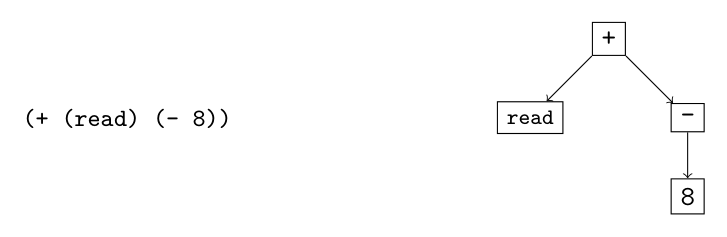
*(1.1)*

We use the standard terminology for trees to describe ASTs: each rectangle above is called a node. The arrows connect a node to its children, which are also nodes. The top-most node is the root. Every node except for the root has a parent (the node of which it is the child). If a node has no children, it is a leaf node; otherwise it is an internal node. We define a Racket struct for each kind of node. For this chapter we require just two kinds of nodes: one for integer constants (aka literals) and one for primitive operations. The following is the struct definition for integer constants.1

(struct Int (value))

An integer node contains just one thing: the integer value. We establish the con- vention that struct names, such as Int, are capitalized. To create an AST node for the integer 8, we write (Int 8).

(define eight (Int 8))

We say that the value created by (Int 8) is an instance of the Int structure. The following is the struct definition for primitive operations.

(struct Prim (op args))

A primitive operation node includes an operator symbol op and a list of child arguments called args. For example, to create an AST that negates the number 8, we write the following.

(define neg-eight (Prim '- (list eight)))

Primitive operations may have zero or more children. The read operator has zero:

(define rd (Prim 'read '()))

The addition operator has two children:

(define ast1_1 (Prim '+ (list rd neg-eight)))

We have made a design choice regarding the Prim structure. Instead of using one structure for many different operations (read, +, and -), we could have instead defined a structure for each operation, as follows:

```
(struct Read ())
(struct Add (left right))
(struct Neg (value))
```

The reason that we choose to use just one structure is that many parts of the compiler can use the same code for the different primitive operators, so we might as well just write that code once by using a single structure. To compile a program such as (1.1), we need to know that the operation associ- ated with the root node is addition and we need to be able to access its two children. Racket provides pattern matching to support these kinds of queries, as we see in section 1.3.

* All the AST structures are defined in the file utilities.rkt in the support code.

We often write down the concrete syntax of a program even when we actually have in mind the AST, because the concrete syntax is more concise. We recommend that you always think of programs as abstract syntax trees.

A programming language can be thought of as a set of programs. The set is infinite (that is, one can always create larger programs), so one cannot simply describe a language by listing all the programs in the language. Instead we write down a set of rules, a context-free grammar, for building programs. Grammars are often used to define the concrete syntax of a language, but they can also be used to describe the abstract syntax. We write our rules in a variant of Backus-Naur form (BNF) (Backus et al. 1960; Knuth 1964). As an example, we describe a small language, named LInt, that consists of integers and arithmetic operations. The first grammar rule for the abstract syntax of LInt says that an instance of the Int structure is an expression:


*(1.2)*

Each rule has a left-hand side and a right-hand side. If you have an AST node that matches the right-hand side, then you can categorize it according to the left- hand side. Symbols in typewriter font, such as Int, are terminal symbols and must literally appear in the program for the rule to be applicable. Our grammars do not mention white space, that is, delimiter characters like spaces, tabs, and new lines. White space may be inserted between symbols for disambiguation and to improve readability. A name such as exp that is defined by the grammar rules is a nonterminal. The name int is also a nonterminal, but instead of defining it with a grammar rule, we define it with the following explanation. An int is a sequence of decimals (0 to 9), possibly starting with −(for negative integers), such that the sequence of decimals represents an integer in the range −262 to 262 −1. This enables the representation of integers using 63 bits, which simplifies several aspects of compilation. Thus, these integers correspond to the Racket fixnum datatype on a 64-bit machine. The second grammar rule is the read operation, which receives an input integer from the user of the program.

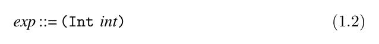
*(1.3)*

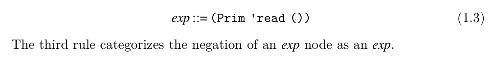
*(1.4)*

We can apply these rules to categorize the ASTs that are in the LInt language. For example, by rule (1.2), (Int 8) is an exp, and then by rule (1.4) the following AST is an exp.

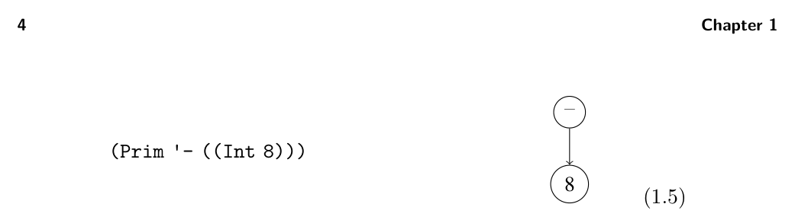
*(1.5)*

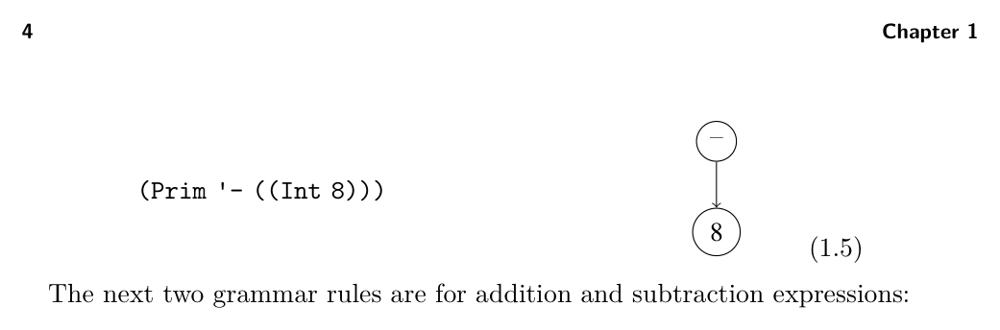
*(1.6)*

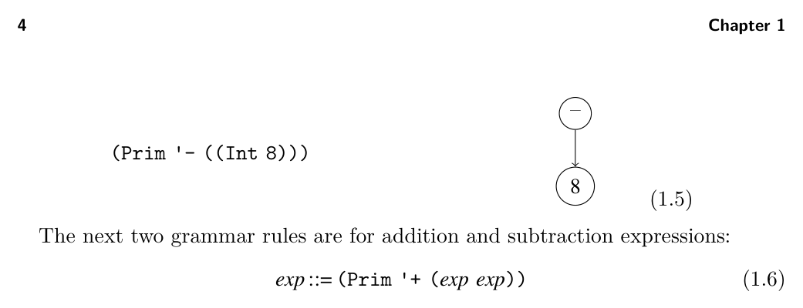
*(1.7)*

We can now justify that the AST (1.1) is an exp in LInt. We know that (Prim 'read ()) is an exp by rule (1.3), and we have already categorized (Prim '- ((Int 8))) as an exp, so we apply rule (1.6) to show that

(Prim '+ ((Prim 'read ()) (Prim '- ((Int 8)))))

is an exp in the LInt language. If you have an AST for which these rules do not apply, then the AST is not in LInt. For example, the program (* (read) 8) is not in LInt because there is no rule for the * operator. Whenever we define a language with a grammar, the language includes only those programs that are justified by the grammar rules. The last grammar rule for LInt states that there is a Program node to mark the top of the whole program:

LInt ::= (Program '() exp)

The Program structure is defined as follows:

(struct Program (info body))

where body is an expression. In further chapters, the info part is used to store auxiliary information, but for now it is just the empty list. It is common to have many grammar rules with the same left-hand side but different right-hand sides, such as the rules for exp in the grammar of LInt. As shorthand, a vertical bar can be used to combine several right-hand sides into a single rule. The concrete syntax for LInt is shown in figure 1.1 and the abstract syntax for LInt is shown in figure 1.2. The read-program function provided in utilities.rkt of the support code reads a program from a file (the sequence of characters in the concrete syntax of Racket) and parses it into an abstract syntax tree. Refer to the description of read-program in appendix A.2 for more details.

## 1.3 Pattern Matching

As mentioned in section 1.1, compilers often need to access the parts of an AST node. Racket provides the match feature to access the parts of a value. Consider the following example:

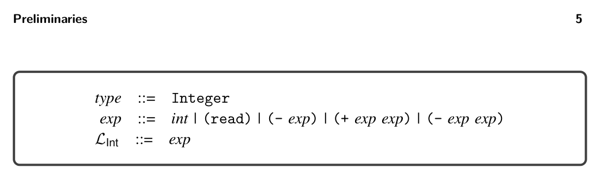
*Figure 1.1*

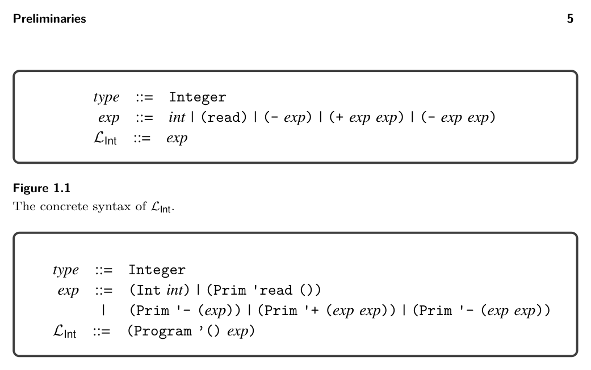
*Figure 1.2*

```
(match ast1_1
[(Prim op (list child1 child2))
(print op)])
```

In this example, the match form checks whether the AST (1.1) is a binary operator and binds its parts to the three pattern variables op, child1, and child2. In general, a match clause consists of a pattern and a body. Patterns are recursively defined to be a pattern variable, a structure name followed by a pattern for each of the structure’s arguments, or an S-expression (a symbol, list, etc.). (See chapter 12 of The Racket Guide2 and chapter 9 of The Racket Reference3 for complete descriptions of match.) The body of a match clause may contain arbitrary Racket code. The pattern variables can be used in the scope of the body, such as op in (print op). A match form may contain several clauses, as in the following function leaf that recognizes when an LInt node is a leaf in the AST. The match proceeds through the clauses in order, checking whether the pattern can match the input AST. The body of the first clause that matches is executed. The output of leaf for several ASTs is shown on the right side of the following:

* See https://docs.racket-lang.org/guide/match.html.
* See https://docs.racket-lang.org/reference/match.html.

```
(define (leaf arith)
(match arith
[(Int n) #t]
[(Prim 'read '()) #t]
[(Prim '- (list e1)) #f]
[(Prim '+ (list e1 e2)) #f]
[(Prim '- (list e1 e2)) #f]))
```

```
#t
#f
#t
```

```
(leaf (Prim 'read '()))
(leaf (Prim '- (list (Int 8))))
(leaf (Int 8))
```

When constructing a match expression, we refer to the grammar definition to identify which nonterminal we are expecting to match against, and then we make sure that (1) we have one clause for each alternative of that nonterminal and (2) the pattern in each clause corresponds to the corresponding right-hand side of a grammar rule. For the match in the leaf function, we refer to the grammar for LInt shown in figure 1.2. The exp nonterminal has five alternatives, so the match has five clauses. The pattern in each clause corresponds to the right-hand side of a grammar rule. For example, the pattern (Prim '+ (list e1 e2)) corresponds to the right-hand side (Prim '+ (exp exp)). When translating from grammars to patterns, replace nonterminals such as exp with pattern variables of your choice (such as e1 and e2).

Programs are inherently recursive. For example, an expression is often made of smaller expressions. Thus, the natural way to process an entire program is to use a recursive function. As a first example of such a recursive function, we define the function is_exp as shown in figure 1.3, to take an arbitrary value and determine whether or not it is an expression in LInt. We say that a function is defined by structural recursion if it is defined using a sequence of match clauses that correspond to a grammar and the body of each clause makes a recursive call on each child node.4

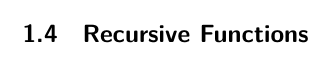
*figure 1.3*

## 1.5 Interpreters

The behavior of a program is defined by the specification of the programming language. For example, the Scheme language is defined in the report by Sperber et al. (2009). The Racket language is defined in its reference manual (Flatt and PLT

* This principle of structuring code according to the data definition is advocated in the book
  How to Design Programs by Felleisen et al. (2001).

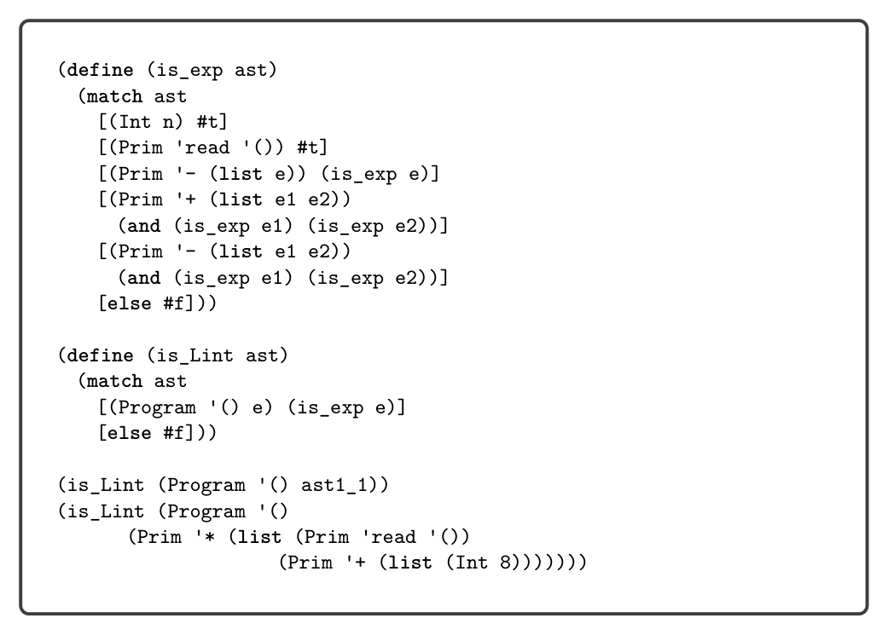
*Figure 1.3*

2014). In this book we use interpreters to specify each language that we consider. An interpreter that is designated as the definition of a language is called a definitional interpreter (Reynolds 1972). We warm up by creating a definitional interpreter for the LInt language. This interpreter serves as a second example of structural recursion. The definition of the interp_Lint function is shown in figure 1.4. The body of the function is a match on the input program followed by a call to the interp_exp auxiliary function, which in turn has one match clause per grammar rule for LInt expressions. Let us consider the result of interpreting a few LInt programs. The following program adds two integers:

(+ 10 32)

The result is 42, the answer to life, the universe, and everything: 42!5 We wrote this program in concrete syntax, whereas the parsed abstract syntax is

(Program '() (Prim '+ (list (Int 10) (Int 32))))

The following program demonstrates that expressions may be nested within each other, in this case nesting several additions and negations.

(+ 10 (- (+ 12 20)))

* The Hitchhiker’s Guide to the Galaxy by Douglas Adams.

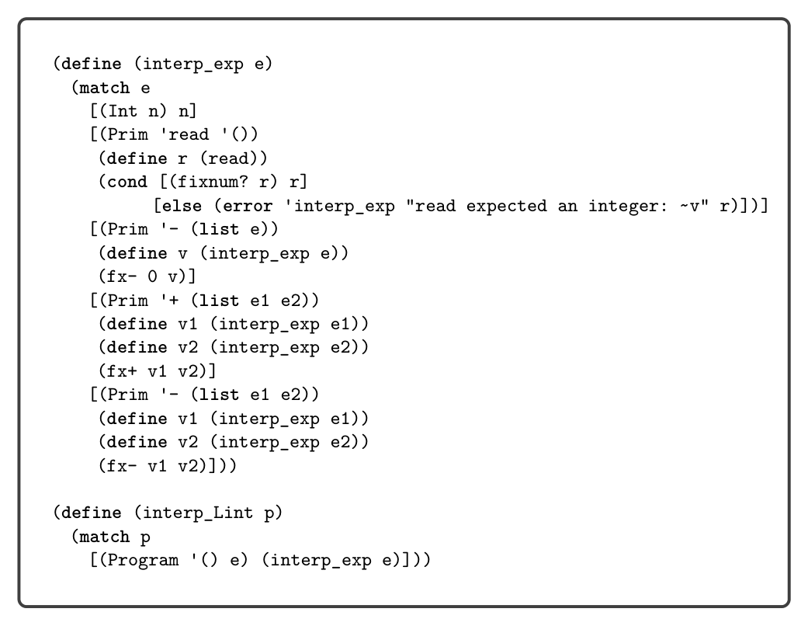
*Figure 1.4*

What is the result of this program? As mentioned previously, the LInt language does not support arbitrarily large integers but only 63-bit integers, so we interpret the arithmetic operations of LInt using fixnum arithmetic in Racket. Suppose that

n = 999999999999999999

which indeed fits in 63 bits. What happens when we run the following program in our interpreter?

(+ (+ (+ n n) (+ n n)) (+ (+ n n) (+ n n)))))

It produces the following error:

fx+: result is not a fixnum

We establish the convention that if running the definitional interpreter on a program produces an error, then the meaning of that program is unspecified unless the error is a trapped-error. A compiler for the language is under no obligation regarding programs with unspecified behavior; it does not have to produce an executable, and if it does, that executable can do anything. On the other hand, if the error is a trapped-error, then the compiler must produce an executable and it is required

to report that an error occurred. To signal an error, exit with a return code of 255. The interpreters in chapters 9 and 10 and in section 6.10 use trapped-error. The last feature of the LInt language, the read operation, prompts the user of the program for an integer. Recall that program (1.1) requests an integer input and then subtracts 8. So, if we run

(interp_Lint (Program '() ast1_1))

and if the input is 50, the result is 42. We include the read operation in LInt so that a clever student cannot implement a compiler for LInt that simply runs the interpreter during compilation to obtain the output and then generates the trivial code to produce the output.6

The job of a compiler is to translate a program in one language into a program in another language so that the output program behaves the same way as the input program. This idea is depicted in the following diagram. Suppose we have two languages, L1 and L2, and a definitional interpreter for each language. Given a compiler that translates from language L1 to L2 and given any program P1 in L1, the compiler must translate it into some program P2 such that interpreting P1 and P2 on their respective interpreters with same input i yields the same output o.

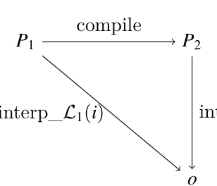
*(1.8)*


*(i)*

In the next section we see our first example of a compiler.

## 1.6 Example Compiler: A Partial Evaluator

In this section we consider a compiler that translates LInt programs into LInt programs that may be more efficient. The compiler eagerly computes the parts of the program that do not depend on any inputs, a process known as partial evaluation (Jones, Gomard, and Sestoft 1993). For example, given the following program

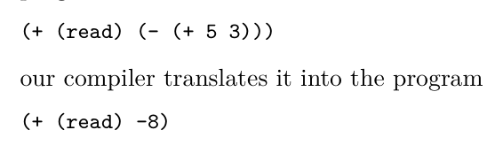
*Figure 1.5*

* Yes, a clever student did this in the first instance of this course!


*Figure 1.5*

evaluating the negation and addition operations is factored into three auxiliary functions: pe_neg, pe_add and pe_sub. The input to these functions is the output of partially evaluating the children. The pe_neg, pe_add and pe_sub functions check whether their arguments are integers and if they are, perform the appropriate arithmetic. Otherwise, they create an AST node for the arithmetic operation. To gain some confidence that the partial evaluator is correct, we can test whether it produces programs that produce the same result as the input programs. That is, we can test whether it satisfies the diagram of (1.8). The following code runs the partial evaluator on several examples and tests the output program. The parse-program and assert functions are defined in appendix A.2.

```
(define (test_pe p)
(assert "testing pe_Lint"
(equal? (interp_Lint p) (interp_Lint (pe_Lint p)))))
```

```
(test_pe (parse-program `(program () (+ 10 (- (+ 5 3))))))
(test_pe (parse-program `(program () (+ 1 (+ 3 1)))))
(test_pe (parse-program `(program () (- (+ 3 (- 5))))))
```

Exercise 1.1 Create three programs in the LInt language and test whether partially evaluating them with pe_Lint and then interpreting them with interp_Lint gives the same result as directly interpreting them with interp_Lint.

