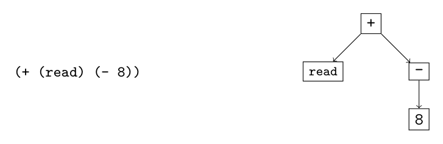

# 1.1 Abstract Syntax Trees

1

Preliminaries

In this chapter we introduce the basic tools needed to implement a compiler. Pro- grams are typically input by a programmer as text, that is, a sequence of characters. The program-as-text representation is called concrete syntax. We use concrete syn- tax to concisely write down and talk about programs. Inside the compiler, we use abstract syntax trees (ASTs) to represent programs in a way that efficiently sup- ports the operations that the compiler needs to perform. The process of translating concrete syntax to abstract syntax is called parsing. This book does not cover the theory and implementation of parsing. We refer the readers interested in parsing to the thorough treatment of parsing by Aho et al. (2006). A parser is provided in the support code for translating from concrete to abstract syntax. ASTs can be represented inside the compiler in many different ways, depending on the programming language used to write the compiler. We use Racket’s struct feature to represent ASTs (section 1.1). We use grammars to define the abstract syntax of programming languages (section 1.2) and pattern matching to inspect individual nodes in an AST (section 1.3). We use recursive functions to construct and deconstruct ASTs (section 1.4). This chapter provides a brief introduction to these components.

1.1 Abstract Syntax Trees

Compilers use abstract syntax trees to represent programs because they often need to ask questions such as, for a given part of a program, what kind of language feature is it? What are its subparts? Consider the program on the left and the diagram of its AST on the right (1.1). This program is an addition operation that has two subparts, a read operation and a negation. The negation has another subpart, the integer constant 8. By using a tree to represent the program, we can easily follow the links to go from one part of a program to its subparts.


*(1.1)*

We use the standard terminology for trees to describe ASTs: each rectangle above is called a node. The arrows connect a node to its children, which are also nodes. The top-most node is the root. Every node except for the root has a parent (the node of which it is the child). If a node has no children, it is a leaf node; otherwise it is an internal node. We define a Racket struct for each kind of node. For this chapter we require just two kinds of nodes: one for integer constants (aka literals) and one for primitive operations. The following is the struct definition for integer constants.1

(struct Int (value))

An integer node contains just one thing: the integer value. We establish the con- vention that struct names, such as Int, are capitalized. To create an AST node for the integer 8, we write (Int 8).

(define eight (Int 8))

We say that the value created by (Int 8) is an instance of the Int structure. The following is the struct definition for primitive operations.

(struct Prim (op args))

A primitive operation node includes an operator symbol op and a list of child arguments called args. For example, to create an AST that negates the number 8, we write the following.

(define neg-eight (Prim '- (list eight)))

Primitive operations may have zero or more children. The read operator has zero:

(define rd (Prim 'read '()))

The addition operator has two children:

(define ast1_1 (Prim '+ (list rd neg-eight)))

We have made a design choice regarding the Prim structure. Instead of using one structure for many different operations (read, +, and -), we could have instead defined a structure for each operation, as follows:

```
(struct Read ())
(struct Add (left right))
(struct Neg (value))
```

The reason that we choose to use just one structure is that many parts of the compiler can use the same code for the different primitive operators, so we might as well just write that code once by using a single structure. To compile a program such as (1.1), we need to know that the operation associ- ated with the root node is addition and we need to be able to access its two children. Racket provides pattern matching to support these kinds of queries, as we see in section 1.3.

* All the AST structures are defined in the file utilities.rkt in the support code.

