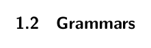
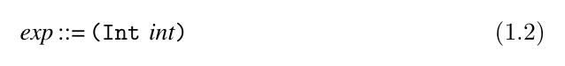
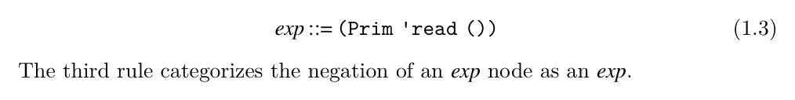

# 1.2 Grammars

We often write down the concrete syntax of a program even when we actually have in mind the AST, because the concrete syntax is more concise. We recommend that you always think of programs as abstract syntax trees.

A programming language can be thought of as a set of programs. The set is infinite (that is, one can always create larger programs), so one cannot simply describe a language by listing all the programs in the language. Instead we write down a set of rules, a context-free grammar, for building programs. Grammars are often used to define the concrete syntax of a language, but they can also be used to describe the abstract syntax. We write our rules in a variant of Backus-Naur form (BNF) (Backus et al. 1960; Knuth 1964). As an example, we describe a small language, named LInt, that consists of integers and arithmetic operations. The first grammar rule for the abstract syntax of LInt says that an instance of the Int structure is an expression:

*(1.2)*

Each rule has a left-hand side and a right-hand side. If you have an AST node that matches the right-hand side, then you can categorize it according to the left- hand side. Symbols in typewriter font, such as Int, are terminal symbols and must literally appear in the program for the rule to be applicable. Our grammars do not mention white space, that is, delimiter characters like spaces, tabs, and new lines. White space may be inserted between symbols for disambiguation and to improve readability. A name such as exp that is defined by the grammar rules is a nonterminal. The name int is also a nonterminal, but instead of defining it with a grammar rule, we define it with the following explanation. An int is a sequence of decimals (0 to 9), possibly starting with −(for negative integers), such that the sequence of decimals represents an integer in the range −262 to 262 −1. This enables the representation of integers using 63 bits, which simplifies several aspects of compilation. Thus, these integers correspond to the Racket fixnum datatype on a 64-bit machine. The second grammar rule is the read operation, which receives an input integer from the user of the program.

*(1.3)*

*(1.4)*

We can apply these rules to categorize the ASTs that are in the LInt language. For example, by rule (1.2), (Int 8) is an exp, and then by rule (1.4) the following AST is an exp.

