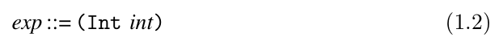
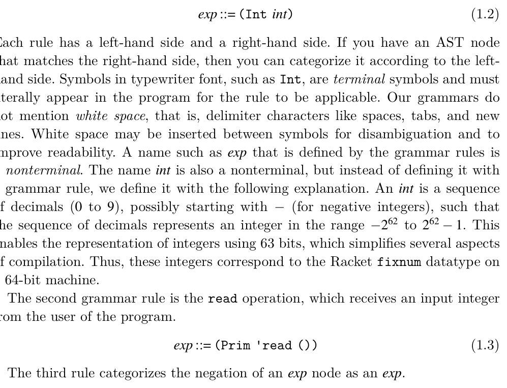

# 1.2 Grammars

A programming language can be thought of as a set of programs. The set is infinite (that is, one can always create larger programs), so one cannot simply describe a language by listing all the programs in the language. Instead we write down a set of rules, a context-free grammar, for building programs. Grammars are often used to define the concrete syntax of a language, but they can also be used to describe the abstract syntax. We write our rules in a variant of Backus-Naur form (BNF) (Backus et al. 1960; Knuth 1964). As an example, we describe a small language, named LInt, that consists of integers and arithmetic operations. The first grammar rule for the abstract syntax of LInt says that an instance of the Int structure is an expression:

*(1.2)*

*(1.3)*

*(1.4)*

We can apply these rules to categorize the ASTs that are in the LInt language. For example, by rule (1.2), (Int 8) is an exp, and then by rule (1.4) the following AST is an exp.

