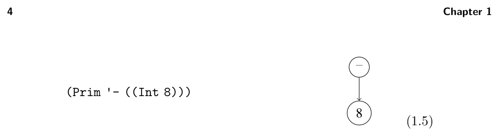
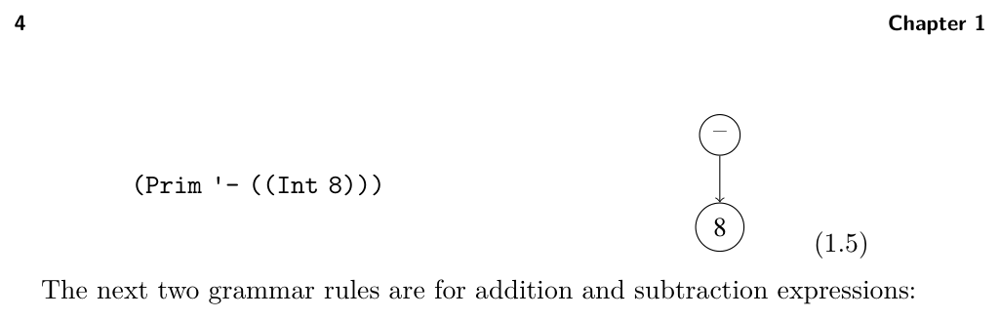
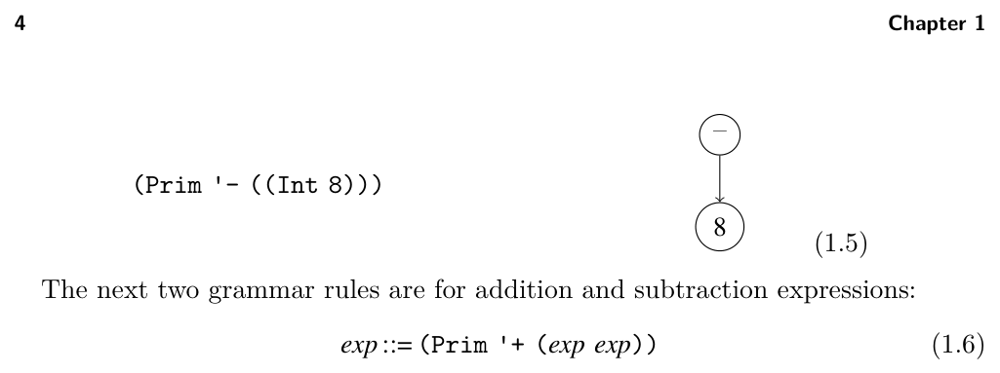
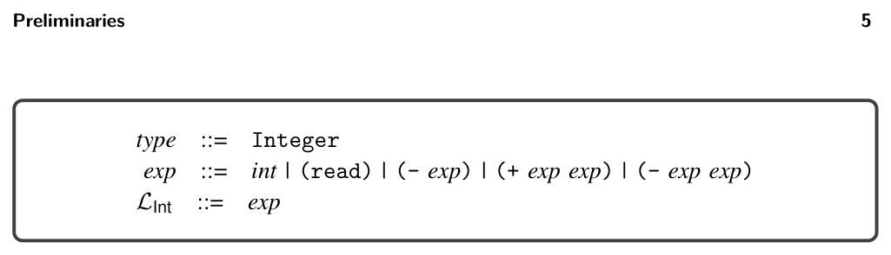
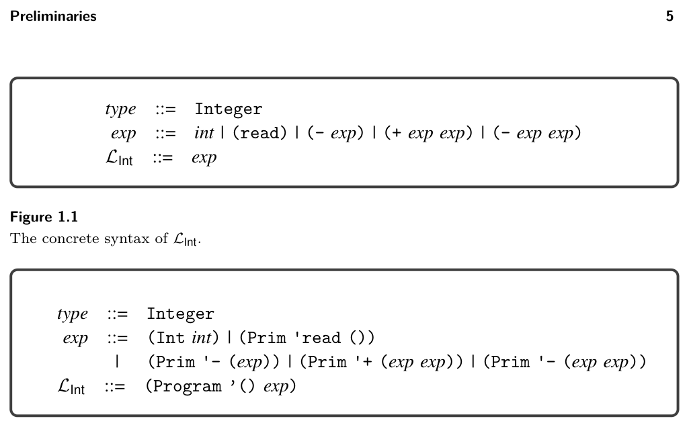

# 1.3 Pattern Matching


*(1.5)*


*(1.6)*


*(1.7)*

We can now justify that the AST (1.1) is an exp in LInt. We know that (Prim 'read ()) is an exp by rule (1.3), and we have already categorized (Prim '- ((Int 8))) as an exp, so we apply rule (1.6) to show that

(Prim '+ ((Prim 'read ()) (Prim '- ((Int 8)))))

is an exp in the LInt language. If you have an AST for which these rules do not apply, then the AST is not in LInt. For example, the program (* (read) 8) is not in LInt because there is no rule for the * operator. Whenever we define a language with a grammar, the language includes only those programs that are justified by the grammar rules. The last grammar rule for LInt states that there is a Program node to mark the top of the whole program:

LInt ::= (Program '() exp)

The Program structure is defined as follows:

(struct Program (info body))

where body is an expression. In further chapters, the info part is used to store auxiliary information, but for now it is just the empty list. It is common to have many grammar rules with the same left-hand side but different right-hand sides, such as the rules for exp in the grammar of LInt. As shorthand, a vertical bar can be used to combine several right-hand sides into a single rule. The concrete syntax for LInt is shown in figure 1.1 and the abstract syntax for LInt is shown in figure 1.2. The read-program function provided in utilities.rkt of the support code reads a program from a file (the sequence of characters in the concrete syntax of Racket) and parses it into an abstract syntax tree. Refer to the description of read-program in appendix A.2 for more details.

1.3 Pattern Matching

As mentioned in section 1.1, compilers often need to access the parts of an AST node. Racket provides the match feature to access the parts of a value. Consider the following example:


*Figure 1.1*


*Figure 1.2*

```
(match ast1_1
[(Prim op (list child1 child2))
(print op)])
```

In this example, the match form checks whether the AST (1.1) is a binary operator and binds its parts to the three pattern variables op, child1, and child2. In general, a match clause consists of a pattern and a body. Patterns are recursively defined to be a pattern variable, a structure name followed by a pattern for each of the structure’s arguments, or an S-expression (a symbol, list, etc.). (See chapter 12 of The Racket Guide2 and chapter 9 of The Racket Reference3 for complete descriptions of match.) The body of a match clause may contain arbitrary Racket code. The pattern variables can be used in the scope of the body, such as op in (print op). A match form may contain several clauses, as in the following function leaf that recognizes when an LInt node is a leaf in the AST. The match proceeds through the clauses in order, checking whether the pattern can match the input AST. The body of the first clause that matches is executed. The output of leaf for several ASTs is shown on the right side of the following:

* See https://docs.racket-lang.org/guide/match.html.
* See https://docs.racket-lang.org/reference/match.html.

