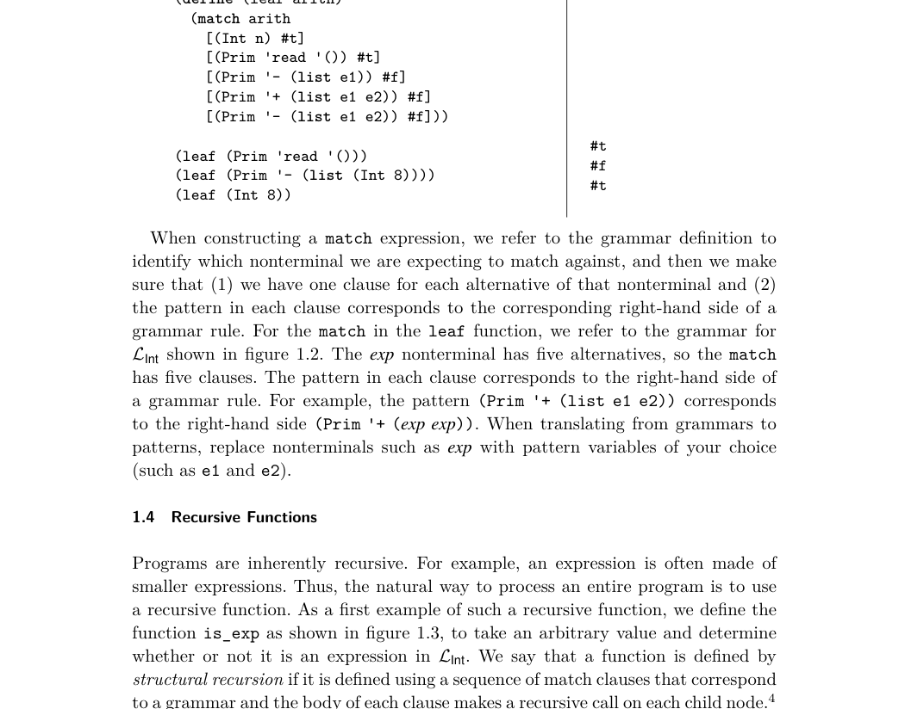
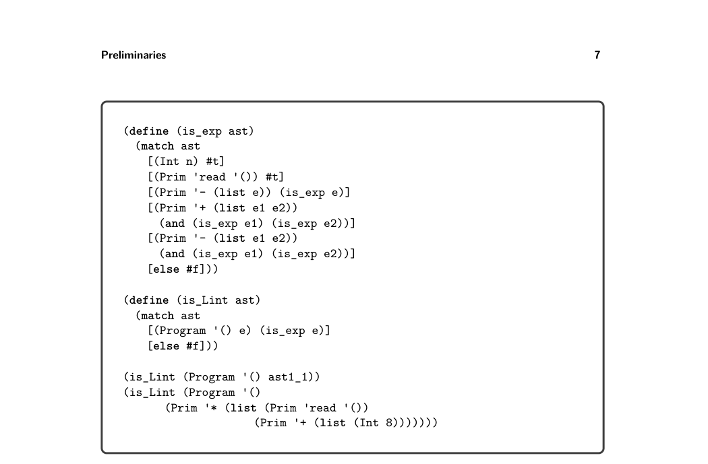

# 1.5 Interpreters

*figure 1.3 also contains the definition of is_Lint, which determines whether an AST is a program in LInt. In general, we can write one recursive function to handle each nonterminal in a grammar. Of the two examples at the bottom of the figure, the first is in LInt and the second is not.*

1.5 Interpreters

The behavior of a program is defined by the specification of the programming language. For example, the Scheme language is defined in the report by Sperber et al. (2009). The Racket language is defined in its reference manual (Flatt and PLT

* This principle of structuring code according to the data definition is advocated in the book
  How to Design Programs by Felleisen et al. (2001).

*Figure 1.3 Example of recursive functions for LInt. These functions recognize whether an AST is in LInt.*

2014). In this book we use interpreters to specify each language that we consider. An interpreter that is designated as the definition of a language is called a definitional interpreter (Reynolds 1972). We warm up by creating a definitional interpreter for the LInt language. This interpreter serves as a second example of structural recursion. The definition of the interp_Lint function is shown in figure 1.4. The body of the function is a match on the input program followed by a call to the interp_exp auxiliary function, which in turn has one match clause per grammar rule for LInt expressions. Let us consider the result of interpreting a few LInt programs. The following program adds two integers:

(+ 10 32)

The result is 42, the answer to life, the universe, and everything: 42!5 We wrote this program in concrete syntax, whereas the parsed abstract syntax is

(Program '() (Prim '+ (list (Int 10) (Int 32))))

The following program demonstrates that expressions may be nested within each other, in this case nesting several additions and negations.

(+ 10 (- (+ 12 20)))

* The Hitchhiker’s Guide to the Galaxy by Douglas Adams.

*Figure 1.4 Interpreter for the LInt language.*

What is the result of this program? As mentioned previously, the LInt language does not support arbitrarily large integers but only 63-bit integers, so we interpret the arithmetic operations of LInt using fixnum arithmetic in Racket. Suppose that

n = 999999999999999999

which indeed fits in 63 bits. What happens when we run the following program in our interpreter?

(+ (+ (+ n n) (+ n n)) (+ (+ n n) (+ n n)))))

It produces the following error:

fx+: result is not a fixnum

We establish the convention that if running the definitional interpreter on a program produces an error, then the meaning of that program is unspecified unless the error is a trapped-error. A compiler for the language is under no obligation regarding programs with unspecified behavior; it does not have to produce an executable, and if it does, that executable can do anything. On the other hand, if the error is a trapped-error, then the compiler must produce an executable and it is required

