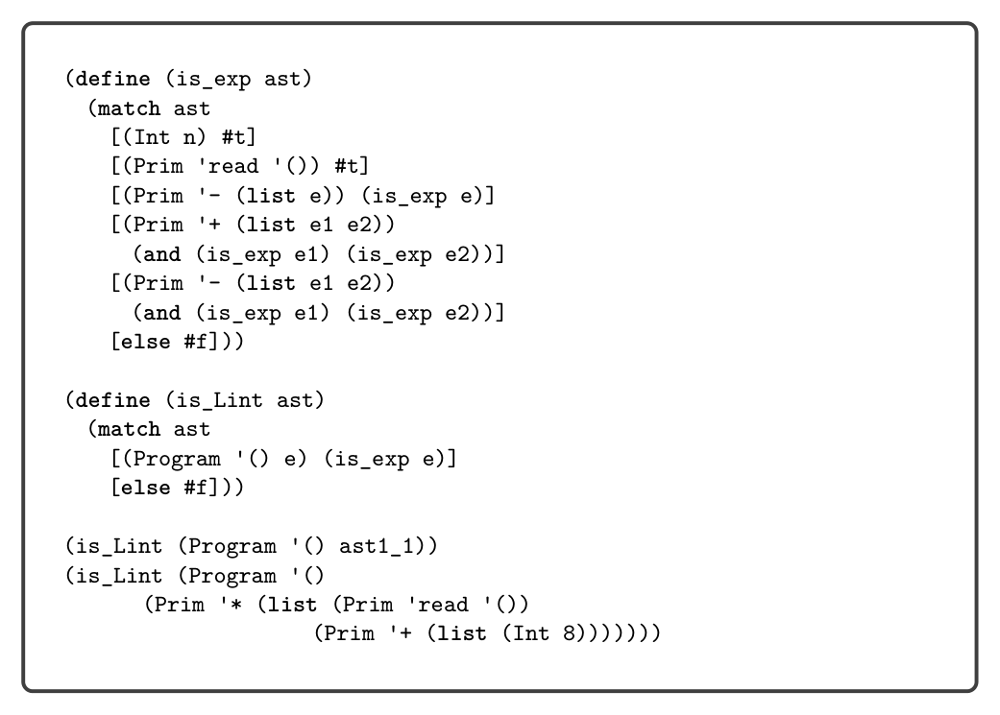
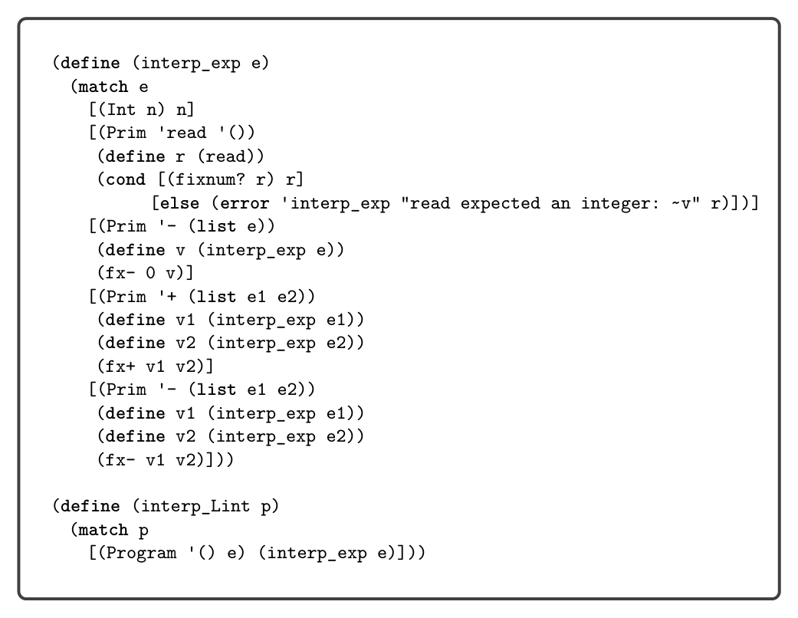

# 1.5 Interpreters

```
(define (leaf arith)
(match arith
[(Int n) #t]
[(Prim 'read '()) #t]
[(Prim '- (list e1)) #f]
[(Prim '+ (list e1 e2)) #f]
[(Prim '- (list e1 e2)) #f]))
```

```
#t
#f
#t
```

```
(leaf (Prim 'read '()))
(leaf (Prim '- (list (Int 8))))
(leaf (Int 8))
```

When constructing a match expression, we refer to the grammar definition to identify which nonterminal we are expecting to match against, and then we make sure that (1) we have one clause for each alternative of that nonterminal and (2) the pattern in each clause corresponds to the corresponding right-hand side of a grammar rule. For the match in the leaf function, we refer to the grammar for LInt shown in figure 1.2. The exp nonterminal has five alternatives, so the match has five clauses. The pattern in each clause corresponds to the right-hand side of a grammar rule. For example, the pattern (Prim '+ (list e1 e2)) corresponds to the right-hand side (Prim '+ (exp exp)). When translating from grammars to patterns, replace nonterminals such as exp with pattern variables of your choice (such as e1 and e2).

Programs are inherently recursive. For example, an expression is often made of smaller expressions. Thus, the natural way to process an entire program is to use a recursive function. As a first example of such a recursive function, we define the function is_exp as shown in figure 1.3, to take an arbitrary value and determine whether or not it is an expression in LInt. We say that a function is defined by structural recursion if it is defined using a sequence of match clauses that correspond to a grammar and the body of each clause makes a recursive call on each child node.4


*figure 1.3*

1.5 Interpreters

The behavior of a program is defined by the specification of the programming language. For example, the Scheme language is defined in the report by Sperber et al. (2009). The Racket language is defined in its reference manual (Flatt and PLT

* This principle of structuring code according to the data definition is advocated in the book
  How to Design Programs by Felleisen et al. (2001).


*Figure 1.3*

2014). In this book we use interpreters to specify each language that we consider. An interpreter that is designated as the definition of a language is called a definitional interpreter (Reynolds 1972). We warm up by creating a definitional interpreter for the LInt language. This interpreter serves as a second example of structural recursion. The definition of the interp_Lint function is shown in figure 1.4. The body of the function is a match on the input program followed by a call to the interp_exp auxiliary function, which in turn has one match clause per grammar rule for LInt expressions. Let us consider the result of interpreting a few LInt programs. The following program adds two integers:

(+ 10 32)

The result is 42, the answer to life, the universe, and everything: 42!5 We wrote this program in concrete syntax, whereas the parsed abstract syntax is

(Program '() (Prim '+ (list (Int 10) (Int 32))))

The following program demonstrates that expressions may be nested within each other, in this case nesting several additions and negations.

(+ 10 (- (+ 12 20)))

* The Hitchhiker’s Guide to the Galaxy by Douglas Adams.


*Figure 1.4*

What is the result of this program? As mentioned previously, the LInt language does not support arbitrarily large integers but only 63-bit integers, so we interpret the arithmetic operations of LInt using fixnum arithmetic in Racket. Suppose that

n = 999999999999999999

which indeed fits in 63 bits. What happens when we run the following program in our interpreter?

(+ (+ (+ n n) (+ n n)) (+ (+ n n) (+ n n)))))

It produces the following error:

fx+: result is not a fixnum

We establish the convention that if running the definitional interpreter on a program produces an error, then the meaning of that program is unspecified unless the error is a trapped-error. A compiler for the language is under no obligation regarding programs with unspecified behavior; it does not have to produce an executable, and if it does, that executable can do anything. On the other hand, if the error is a trapped-error, then the compiler must produce an executable and it is required

