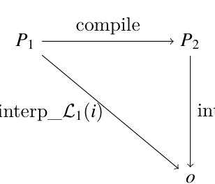
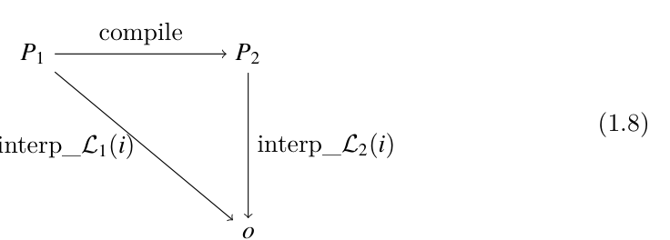
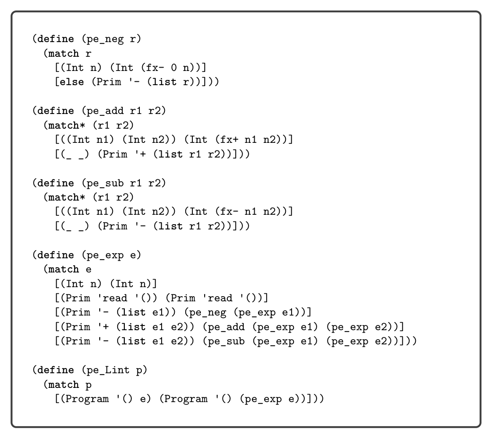

# 1.6 Example Compiler: A Partial Evaluator

to report that an error occurred. To signal an error, exit with a return code of 255. The interpreters in chapters 9 and 10 and in section 6.10 use trapped-error. The last feature of the LInt language, the read operation, prompts the user of the program for an integer. Recall that program (1.1) requests an integer input and then subtracts 8. So, if we run

(interp_Lint (Program '() ast1_1))

and if the input is 50, the result is 42. We include the read operation in LInt so that a clever student cannot implement a compiler for LInt that simply runs the interpreter during compilation to obtain the output and then generates the trivial code to produce the output.6

The job of a compiler is to translate a program in one language into a program in another language so that the output program behaves the same way as the input program. This idea is depicted in the following diagram. Suppose we have two languages, L1 and L2, and a definitional interpreter for each language. Given a compiler that translates from language L1 to L2 and given any program P1 in L1, the compiler must translate it into some program P2 such that interpreting P1 and P2 on their respective interpreters with same input i yields the same output o.


*(1.8)*


*(i)*

In the next section we see our first example of a compiler.

1.6 Example Compiler: A Partial Evaluator

In this section we consider a compiler that translates LInt programs into LInt programs that may be more efficient. The compiler eagerly computes the parts of the program that do not depend on any inputs, a process known as partial evaluation (Jones, Gomard, and Sestoft 1993). For example, given the following program


*Figure 1.5*

* Yes, a clever student did this in the first instance of this course!


*Figure 1.5*

evaluating the negation and addition operations is factored into three auxiliary functions: pe_neg, pe_add and pe_sub. The input to these functions is the output of partially evaluating the children. The pe_neg, pe_add and pe_sub functions check whether their arguments are integers and if they are, perform the appropriate arithmetic. Otherwise, they create an AST node for the arithmetic operation. To gain some confidence that the partial evaluator is correct, we can test whether it produces programs that produce the same result as the input programs. That is, we can test whether it satisfies the diagram of (1.8). The following code runs the partial evaluator on several examples and tests the output program. The parse-program and assert functions are defined in appendix A.2.

```
(define (test_pe p)
(assert "testing pe_Lint"
(equal? (interp_Lint p) (interp_Lint (pe_Lint p)))))
```

```
(test_pe (parse-program `(program () (+ 10 (- (+ 5 3))))))
(test_pe (parse-program `(program () (+ 1 (+ 3 1)))))
(test_pe (parse-program `(program () (- (+ 3 (- 5))))))
```

Exercise 1.1 Create three programs in the LInt language and test whether partially evaluating them with pe_Lint and then interpreting them with interp_Lint gives the same result as directly interpreting them with interp_Lint.

