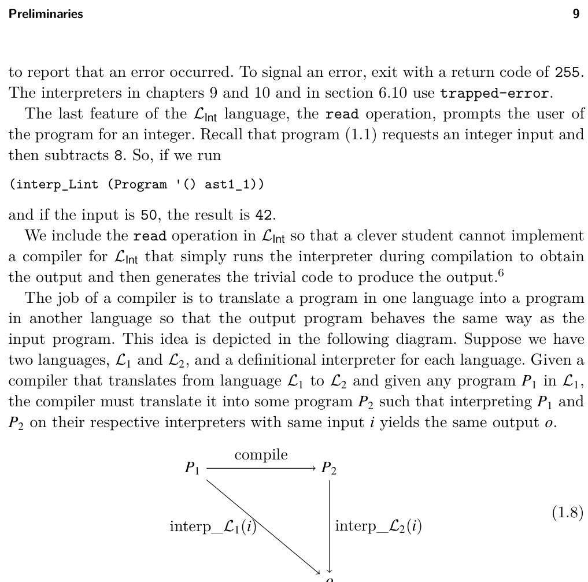
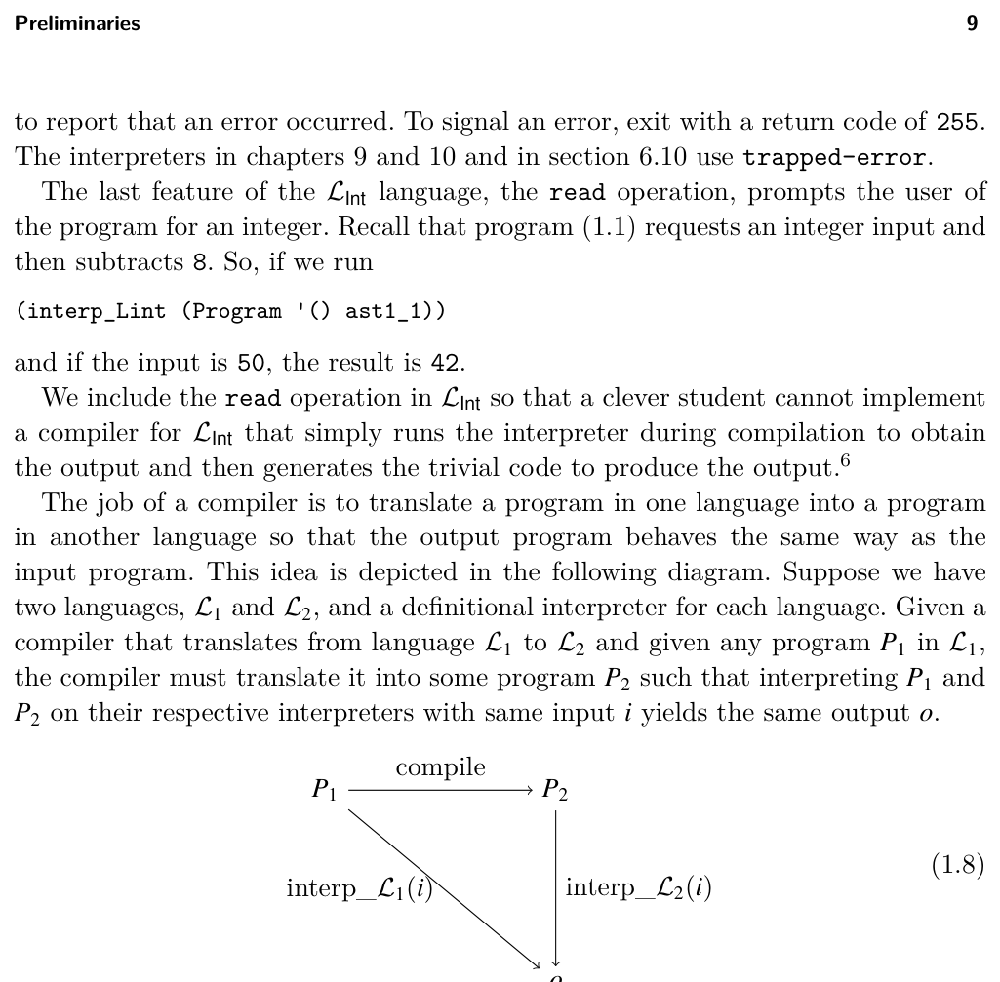

# 1.6 Example Compiler: A Partial Evaluator


*(1.8)*


*(i)*


*Figure 1.5*

* Yes, a clever student did this in the first instance of this course!


*Figure 1.5*

evaluating the negation and addition operations is factored into three auxiliary functions: pe_neg, pe_add and pe_sub. The input to these functions is the output of partially evaluating the children. The pe_neg, pe_add and pe_sub functions check whether their arguments are integers and if they are, perform the appropriate arithmetic. Otherwise, they create an AST node for the arithmetic operation. To gain some confidence that the partial evaluator is correct, we can test whether it produces programs that produce the same result as the input programs. That is, we can test whether it satisfies the diagram of (1.8). The following code runs the partial evaluator on several examples and tests the output program. The parse-program and assert functions are defined in appendix A.2.

```
(define (test_pe p)
(assert "testing pe_Lint"
(equal? (interp_Lint p) (interp_Lint (pe_Lint p)))))
```

```
(test_pe (parse-program `(program () (+ 10 (- (+ 5 3))))))
(test_pe (parse-program `(program () (+ 1 (+ 3 1)))))
(test_pe (parse-program `(program () (- (+ 3 (- 5))))))
```

Exercise 1.1 Create three programs in the LInt language and test whether partially evaluating them with pe_Lint and then interpreting them with interp_Lint gives the same result as directly interpreting them with interp_Lint.

