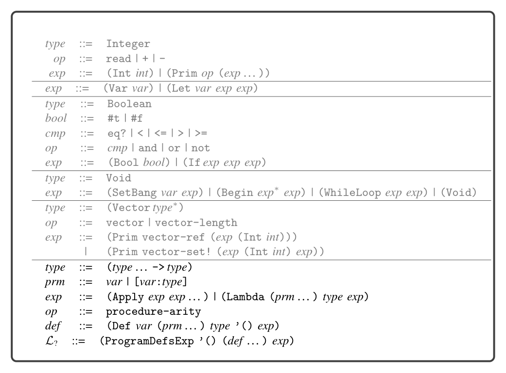
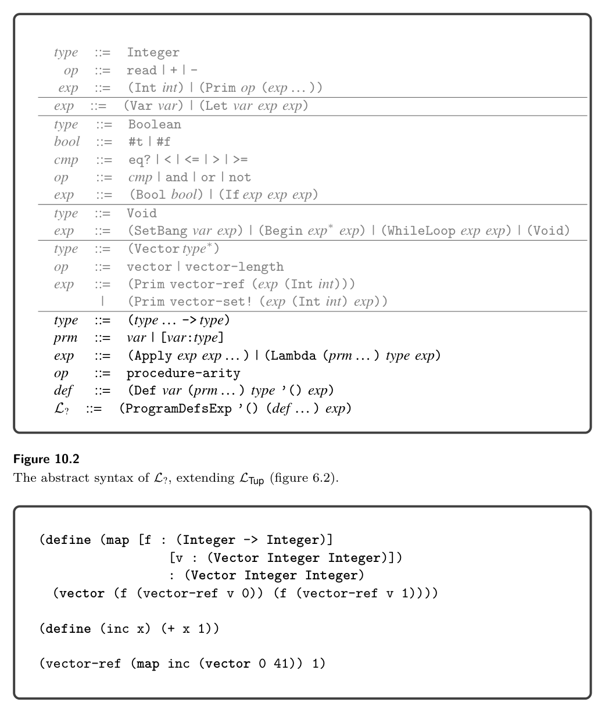
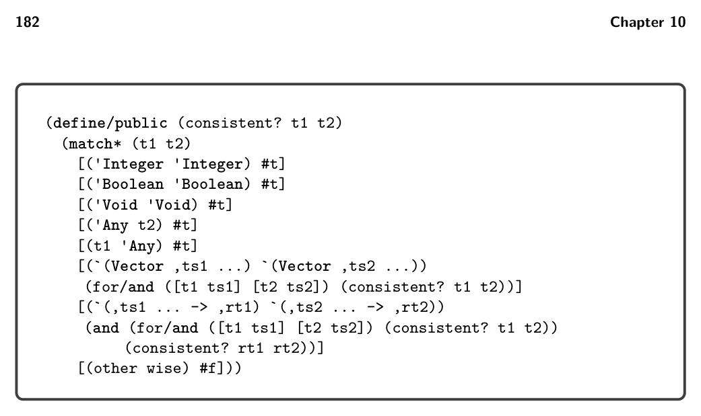
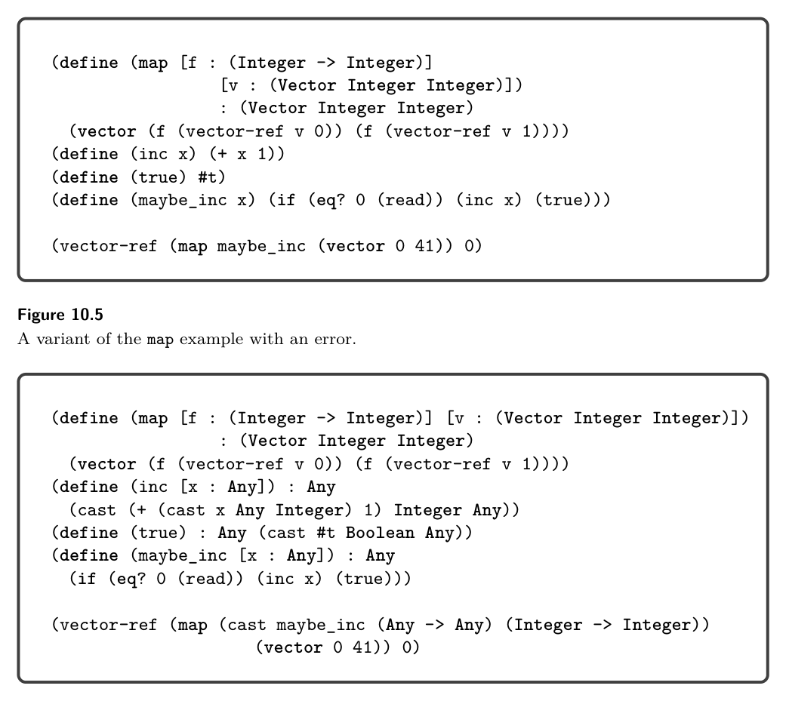
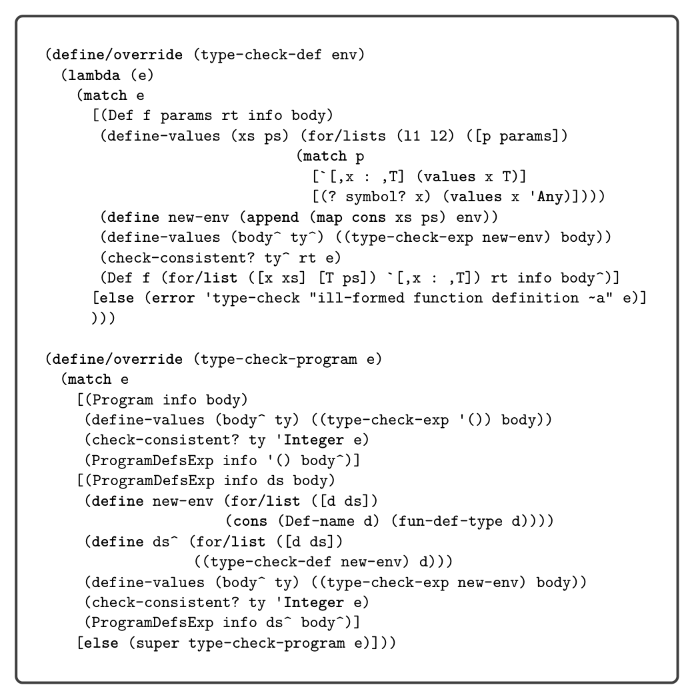
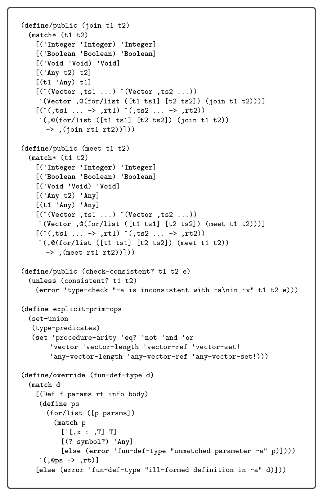

# 10 Gradual Typing

10

Gradual Typing

This chapter studies the language L?, in which the programmer can choose between static and dynamic type checking in different parts of a program, thereby mix- ing the statically typed Lλ language with the dynamically typed LDyn. There are several approaches to mixing static and dynamic typing, including multilanguage integration (Tobin-Hochstadt and Felleisen 2006; Matthews and Findler 2007) and hybrid type checking (Flanagan 2006; Gronski et al. 2006). In this chapter we focus on gradual typing, in which the programmer controls the amount of static ver- sus dynamic checking by adding or removing type annotations on parameters and variables (Anderson and Drossopoulou 2003; Siek and Taha 2006). The definition of the concrete syntax of L? is shown in figure 10.1, and the definition of its abstract syntax is shown in figure 10.2. The main syntactic difference between Lλ and L? is that type annotations are optional, which is specified in the grammar using the prm and ret nonterminals. In the abstract syntax, type annotations are not optional, but we use the Any type when a type annotation is absent. Both the type checker and the interpreter for L? require some interesting changes to enable gradual typing, which we discuss in the next two sections.

## 10.1 Type Checking L?

We begin by discussing the type checking of a partially typed variant of the map example from chapter 7, shown in figure 10.3. The map function itself is statically typed, so there is nothing special happening there with respect to type checking. On the other hand, the inc function does not have type annotations, so the type checker assigns the type Any to parameter x and the return type. Now consider the + operator inside inc. It expects both arguments to have type Integer, but its first argument x has type Any. In a gradually typed language, such differences are allowed so long as the types are consistent; that is, they are equal except in places where there is an Any type. That is, the type Any is consistent with every other type. Figure 10.4 shows the definition of the consistent? method. So the type checker allows the + operator to be applied to x because Any is consistent with Integer. Next consider the call to the map function shown in figure 10.3 with the arguments inc and a tuple. The inc function has type (Any -> Any), but parameter f of map has type (Integer -> Integer). The type checker for L? accepts this call because the two types are consistent.

*Figure 10.1*

It is also helpful to consider how gradual typing handles programs with an error, such as applying map to a function that sometimes returns a Boolean, as shown in figure 10.5. The type checker for L? accepts this program because the type of maybe_inc is consistent with the type of parameter f of map; that is, (Any -> Any) is consistent with (Integer -> Integer). One might say that a gradual type checker is optimistic in that it accepts programs that might execute without a runtime type error. The definition of the type checker for L? is shown in figures 10.7, 10.8, and 10.9. Running this program with input 1 triggers an error when the maybe_inc function returns #t. The L? language performs checking at runtime to ensure the integrity of the static types, such as the (Integer -> Integer) annotation on parameter f of map. Here we give a preview of how the runtime checking is accomplished; the following sections provide the details. The runtime checking is carried out by a new Cast AST node that is generated in a new pass named cast_insert. The output of cast_insert is a program in the LCast language, which simply adds Cast and Any to Lλ. Figure 10.6 shows the output of cast_insert for map and maybe_inc. The idea is that Cast is inserted every time the type checker encounters two types that are consistent but not equal. In the inc function, x is cast to Integer and the result of the + is cast to Any. In the call to map, the inc argument is cast from (Any -> Any) to (Integer -> Integer). In the next section we see how to interpret the Cast node.

*Figure 10.2*

*Figure 10.3*

## 10.2 Interpreting LCast

The runtime behavior of casts involving simple types such as Integer and Boolean is straightforward. For example, a cast from Integer to Any can be accomplished with the Inject operator of LAny, which puts the integer into a tagged value (figure 9.8). Similarly, a cast from Any to Integer is accomplished with the Project operator, by checking the value’s tag and either retrieving the underlying integer

*Figure 10.4*

*Figure 10.5*

*Figure 10.6*

*Figure 10.7*

or signaling an error if the tag is not the one for integers (figure 9.9). Things get more interesting with casts involving function and tuple types. Consider the cast of the function maybe_inc from (Any -> Any) to (Integer -> Integer) shown in figure 10.5. When the maybe_inc function flows through this cast at runtime, we don’t know whether it will return an integer, because that

*Figure 10.8*

*Figure 10.9*

depends on the input from the user. The LCast interpreter therefore delays the checking of the cast until the function is applied. To do so it wraps maybe_inc in a new function that casts its parameter from Integer to Any, applies maybe_inc, and then casts the return value from Any to Integer. Consider the example presented in figure 10.11 that defines a partially typed version of map whose parameter v has type (Vector Any Any) and that updates v in place instead of returning a new tuple. We name this function map_inplace. We apply map_inplace to a tuple of integers, so the type checker inserts a cast from (Vector Integer Integer) to (Vector Any Any). A naive way for the LCast interpreter to cast between tuple types would be to build a new tuple whose elements are the result of casting each of the original elements to the target type. However, this approach is not valid for mutable data structures. In the example of figure 10.11,

*Figure 10.10*

*Figure 10.11*

*Figure 10.12*

if the cast created a new tuple, then the updates inside map_inplace would happen to the new tuple and not the original one. Instead the interpreter needs to create a new kind of value, a proxy, that inter- cepts every tuple operation. On a read, the proxy reads from the underlying tuple and then applies a cast to the resulting value. On a write, the proxy casts the argument value and then performs the write to the underlying tuple. For the first (vector-ref v 0) in map_inplace, the proxy casts 0 from Integer to Any. For the first vector-set!, the proxy casts a tagged 1 from Any to Integer. Finally we consider casts between the Any type and higher-order types such as functions and tuples. Figure 10.12 shows a variant of map_inplace in which param- eter v does not have a type annotation, so it is given type Any. In the call to map_inplace, the tuple has type (Vector Integer Integer), so the type checker inserts a cast to Any. A first thought is to use Inject, but that doesn’t work because (Vector Integer Integer) is not a flat type. Instead, we must first cast to (Vector Any Any), which is flat, and then inject to Any.

*Figure 10.13*

The LCast interpreter uses an auxiliary function named apply_cast to cast a value from a source type to a target type, shown in figure 10.13. You’ll find that it handles all the kinds of casts that we’ve discussed in this section. The definition of the interpreter for LCast is shown in figure 10.14, with the case for Cast dispatch- ing to apply_cast. To handle the addition of tuple proxies, we update the tuple primitives in interp-op using the functions given in figure 10.15. Next we turn to the individual passes needed for compiling L?.

*Figure 10.14*

## 10.3 Cast Insertion

In our discussion of type checking of L?, we mentioned how the runtime aspect of type checking is carried out by the Cast AST node, which is added to the program by a new pass named cast_insert. The target of this pass is the LCast language. We now discuss the details of this pass. The cast_insert pass is closely related to the type checker for L? (starting in figure 10.7). In particular, the type checker allows implicit casts between consistent types. The job of the cast_insert pass is to make those casts explicit. It does so by inserting Cast nodes into the AST. For the most part, the implicit casts occur in places where the type checker checks two types for consistency. Consider the case for binary operators in figure 10.7. The type checker requires that the type of the left operand is consistent with Integer. Thus, the cast_insert pass should insert a Cast around the left operand, converting from its type to Integer. The story is similar for the right operand. It is not always necessary to insert a cast, for

*Figure 10.15*

example, if the left operand already has type Integer then there is no need for a Cast. Some of the implicit casts are not as straightforward. One such case arises with the conditional expression. In figure 10.7 we see that the type checker requires that the two branches have consistent types and that type of the conditional expression is the meet of the branches’ types. In the target language LCast, both branches will need to have the same type, and that type will be the type of the conditional expression. Thus, each branch requires a Cast to convert from its type to the meet of the branches’ types. The case for the function call exhibits another interesting situation. If the function expression is of type Any, then it needs to be cast to a function type so that it can be used in a function call in LCast. Which function type should it be cast to? The parameter and return types are unknown, so we can simply use Any for all of them. Furthermore, in LCast the argument types will need to exactly match the parameter types, so we must cast all the arguments to type Any (if they are not already of that type). Likewise, the cases for the tuple operators vector-length, vector-ref, and vector-set! need to handle the situation where the tuple expression is of type Any. Instead of handling these situations with casts, we recommend translating the special-purpose variants of the tuple operators that handle tuples of type Any: any-vector-length, any-vector-ref, and any-vector-set!.

## 10.4 Lower Casts

The next step in the journey toward x86 is the lower_casts pass that translates the casts in LCast to the lower-level Inject and Project operators and new operators for proxies, extending the Lλ language to LProxy. The LProxy language can also be described as an extension of LAny, with the addition of proxies. We recommend cre- ating an auxiliary function named lower_cast that takes an expression (in LCast), a source type, and a target type and translates it to an expression in LProxy. The lower_cast function can follow a code structure similar to the apply_cast function (figure 10.13) used in the interpreter for LCast, because it must handle the same cases as apply_cast and it needs to mimic the behavior of apply_cast. The most interesting cases concern the casts involving tuple and function types. As mentioned in section 10.2, a cast from one tuple type to another tuple type is accomplished by creating a proxy that intercepts the operations on the underlying tuple. Here we make the creation of the proxy explicit with the vector-proxy AST node. It takes three arguments: the first is an expression for the tuple, the second is a tuple of functions for casting an element that is being read from the tuple, and the third is a tuple of functions for casting an element that is being written to the array. You can create the functions for reading and writing using lambda expressions. Also, as we show in the next section, we need to differentiate these tuples of functions from the user-created ones, so we recommend using a new AST node named raw-vector instead of vector. Figure 10.16 shows the output of lower_casts on the example given in figure 10.11 that involved casting a tuple of integers to a tuple of Any. A cast from one function type to another function type is accomplished by gener- ating a lambda whose parameter and return types match the target function type. The body of the lambda should cast the parameters from the target type to the source type. (Yes, backward! Functions are contravariant in the parameters.) After- ward, call the underlying function and then cast the result from the source return type to the target return type. Figure 10.17 shows the output of the lower_casts pass on the map example given in figure 10.3. Note that the inc argument in the call to map is wrapped in a lambda.

## 10.5 Differentiate Proxies

So far, the responsibility of differentiating tuples and tuple proxies has been the job of the interpreter. For example, the interpreter for LCast implements vector-ref using the guarded-vector-ref function shown in figure 10.15. In the differentiate_proxies pass we shift this responsibility to the generated code. We begin by designing the output language LPOr. In L? we used the type Vector for both real tuples and tuple proxies. In LPOr we return the Vector type to its original meaning, as the type of just tuples, and we introduce a new type, PVector, whose values can be either real tuples or tuple proxies. A tuple proxy is represented by a tuple containing three things: (1) the underlying tuple, (2) a tuple of functions for casting elements that are read from the tuple,

*Figure 10.16*

*Figure 10.17*

and (3) a tuple of functions for casting values to be written to the tuple. So, we define the following abbreviation for the type of a tuple proxy:

TupleProxy(T … ⇒T′ … ) = (Vector (PVector T … ) R W)

where R = (Vector (T →T′) … ) and W = (Vector (T′ →T) … ). Next we describe each of the new primitive operations.

inject-vector : (Vector T … ) →(PVector T … )

This operation brands a vector as a value of the PVector type. inject-proxy : TupleProxy(T … ⇒T′ … ) →(PVector T′ … )

This operation brands a vector proxy as value of the PVector type. proxy? : (PVector T … ) →Boolean

This returns true if the value is a tuple proxy and false if it is a real tuple. project-vector : (PVector T … ) →(Vector T … )

Assuming that the input is a tuple, this operation returns the tuple. proxy-vector-length : (PVector T … ) →Integer

Given a tuple proxy, this operation returns the length of the tuple. proxy-vector-ref : (PVector T … ) →(i : Integer) →Ti

Given a tuple proxy, this operation returns the ith element of the tuple. proxy-vector-set! : (PVector T … ) →(i : Integer) →Ti →Void

Given a tuple proxy, this operation writes a value to the ith element of the tuple.

Now we discuss the translation that differentiates tuples and arrays from proxies. First, every type annotation in the program is translated (recursively) to replace Vector with PVector. Next, we insert uses of PVector operations in the appro- priate places. For example, we wrap every tuple creation with an inject-vector.

(vector e1 … en) ⇒ (inject-vector (vector e′ 1 … e′ n))

The raw-vector AST node that we introduced in the previous section does not get injected.

(raw-vector e1 … en) ⇒ (vector e′ 1 … e′ n)

The vector-proxy AST translates as follows:

(vector-proxy e1 e2 e3) ⇒ (inject-proxy (vector e′ 1 e′ 2 e′ 3))

We translate the element access operations into conditional expressions that check whether the value is a proxy and then dispatch to either the appropriate proxy tuple operation or the regular tuple operation.

(vector-ref e1 i) ⇒ (let ([v e1]) (if (proxy? v) (proxy-vector-ref v i) (vector-ref (project-vector v) i)

Note that in the branch for a tuple, we must apply project-vector before reading from the tuple. The translation of array operations is similar to the ones for tuples.

## 10.6 Reveal Casts

Recall that the reveal_casts pass (section 9.5) is responsible for lowering Inject and Project into lower-level operations. In particular, Project turns into a con- ditional expression that inspects the tag and retrieves the underlying value. Here we need to augment the translation of Project to handle the situation in which the target type is PVector. Instead of using vector-length we need to use proxy-vector-length.

(project e (PVector Any1 … Anyn)) ⇒ (let tmp e′

(if (eq? (tag-of-any tmp 2)) (let tup (value-of tmp (PVector Any … Any)) (if (eq? (proxy-vector-length tup) n) tup (exit))) (exit)))

Otherwise, the only other changes are adding cases that copy the new AST nodes.

## 10.7 Closure Conversion

The auxiliary function that translates type annotations needs to be updated to handle the PVector type. Otherwise, the only other changes are adding cases that copy the new AST nodes.

## 10.8 Select Instructions

Recall that the select_instructions pass is responsible for lowering the primitive operations into x86 instructions. So, we need to translate the new operations on PVector to x86. To do so, the first question we need to answer is how to differentiate between tuple and tuple proxies. We need just one bit to accomplish this; we use the bit in position 63 of the 64-bit tag at the front of every tuple (see figure 6.8). So far, this bit has been set to 0, so for inject-vector we leave it that way.

(Assign lhs (Prim 'inject-vector (list e1))) ⇒ movq e′ 1, lhs′

On the other hand, inject-proxy sets bit 63 to 1.

(Assign lhs (Prim 'inject-proxy (list e1))) ⇒ movq e′ 1, %r11 movq (1 << 63), %rax orq 0(%r11), %rax movq %rax, 0(%r11) movq %r11, lhs′

The proxy? operation consumes the information so carefully stashed away by the injections. It isolates bit 63 to tell whether the value is a proxy.

(Assign lhs (Prim 'proxy? (list e1))) ⇒ movq e′ 1, %r11 movq 0(%r11), %rax sarq $63, %rax andq $1, %rax movq %rax, lhs′

The project-vector operation is straightforward to translate, so we leave that to the reader. Regarding the element access operations for tuples, the runtime provides proce- dures that implement them (they are recursive functions!), so here we simply need to translate these tuple operations into the appropriate function call. For example, here is the translation for proxy-vector-ref.

(Assign lhs (Prim 'proxy-vector-ref (list e1 e2))) ⇒ movq e′ 1, %rdi movq e′ 2, %rsi callq proxy_vector_ref movq %rax, lhs′

We have another batch of operations to deal with: those for the Any type. Recall that we generate an any-vector-ref when there is a element access on some- thing of type Any, and similarly for any-vector-set! and any-vector-length. In section 9.8 we selected instructions for these operations on the basis of the idea that the underlying value was a tuple or array. But in the current setting, the underlying value is of type PVector. We have added three runtime functions to deal with this: proxy_vector_ref, proxy_vector_set, and proxy_vector_length that inspect bit 62 of the tag to determine whether the value is a proxy, and then dispatches to the the appropriate code. So any-vector-ref can be translated as follows. We begin by projecting the underlying value out of the tagged value and then call the proxy_vector_ref procedure in the runtime.

The any-vector-set! and any-vector-length operators are translated in a similar way. Alternatively, you could generate instructions to open-code the proxy_vector_ref, proxy_vector_set, and proxy_vector_length functions.

Exercise 10.1 Implement a compiler for the gradually typed L? language by extend- ing and adapting your compiler for Lλ. Create ten new partially typed test programs. In addition to testing with these new programs, test your compiler on all the tests for Lλ and for LDyn. Sometimes you may get a type-checking error on the LDyn programs, but you can adapt them by inserting a cast to the Any type around each subexpression that has caused a type error. Although LDyn does not have explicit casts, you can induce one by wrapping the subexpression e with a call to an unannotated identity function, as follows: ((lambda (x) x) e).

*Figure 10.18*

## 10.9 Further Reading

This chapter just scratches the surface of gradual typing. The basic approach described here is missing two key ingredients that one would want in an imple- mentation of gradual typing: blame tracking (Tobin-Hochstadt and Felleisen 2006;

*Figure 10.18*

Wadler and Findler 2009) and space-efficient casts (Herman, Tomb, and Flana- gan 2007, 2010). The problem addressed by blame tracking is that when a cast on a higher-order value fails, it often does so at a point in the program that is far removed from the original cast. Blame tracking is a technique for propagating extra information through casts and proxies so that when a cast fails, the error message can point back to the original location of the cast in the source program. The problem addressed by space-efficient casts also relates to higher-order casts. It turns out that in partially typed programs, a function or tuple can flow through a great many casts at runtime. With the approach described in this chapter, each cast adds another lambda wrapper or a tuple proxy. Not only does this take up considerable space, but it also makes the function calls and tuple operations slow. For example, a partially typed version of quicksort could, in the worst case, build a chain of proxies of length O(n) around the tuple, changing the overall time com- plexity of the algorithm from O(n2) to O(n3)! Herman, Tomb, and Flanagan (2007) suggested a solution to this problem by representing casts using the coercion cal- culus of Henglein (1994), which prevents the creation of long chains of proxies by compressing them into a concise normal form. Siek, Thiemann, and Wadler (2015)

give an algorithm for compressing coercions, and Kuhlenschmidt, Almahallawi, and Siek (2019) show how to implement these ideas in the Grift compiler:

https://github.com/Gradual-Typing/Grift

There are also interesting interactions between gradual typing and other language features, such as generics, information-flow types, and type inference, to name a few. We recommend to the reader the online gradual typing bibliography for more material:

http://samth.github.io/gradual-typing-bib/

