# 10.2 Interpreting LCast 

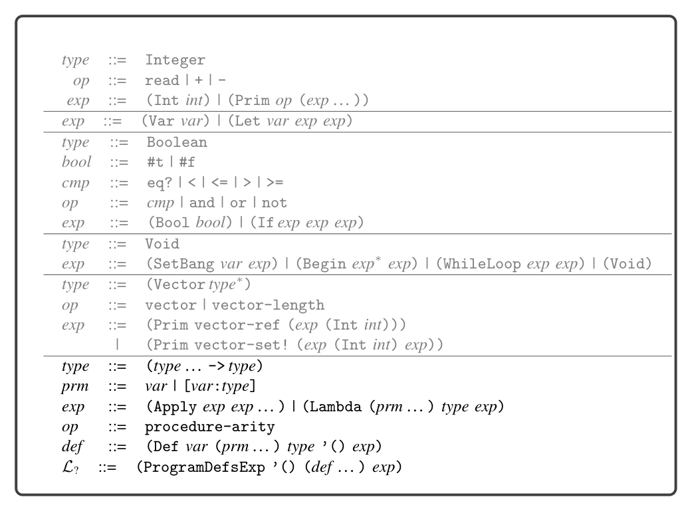
*Figure 10.2*

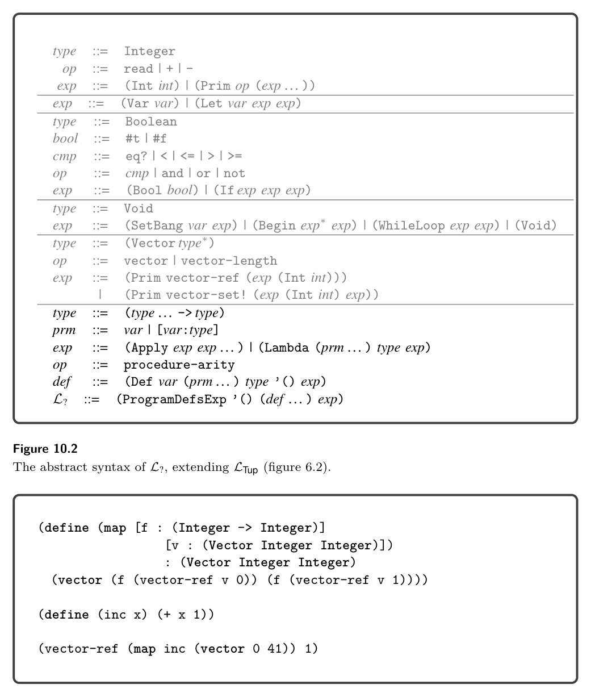
*Figure 10.3*

10.2 Interpreting LCast

The runtime behavior of casts involving simple types such as Integer and Boolean is straightforward. For example, a cast from Integer to Any can be accomplished with the Inject operator of LAny, which puts the integer into a tagged value (figure 9.8). Similarly, a cast from Any to Integer is accomplished with the Project operator, by checking the value’s tag and either retrieving the underlying integer

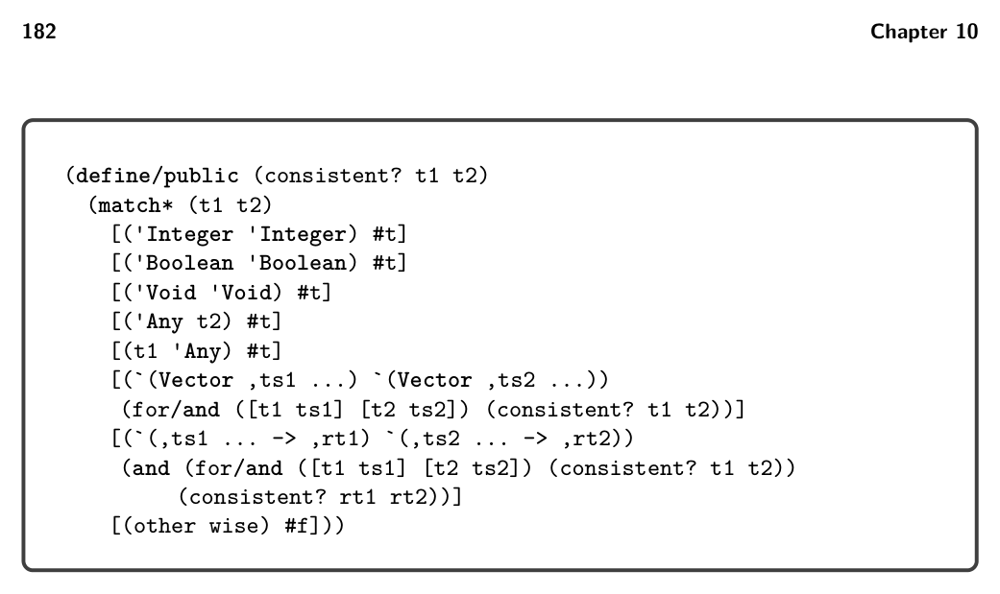
*Figure 10.4*

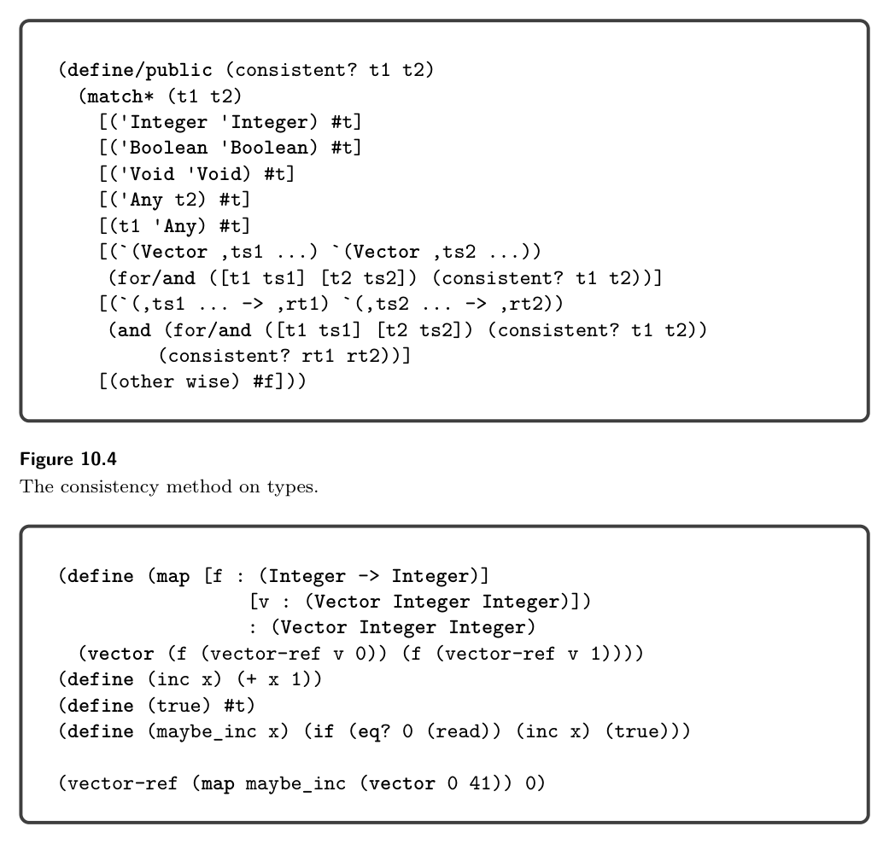
*Figure 10.5*

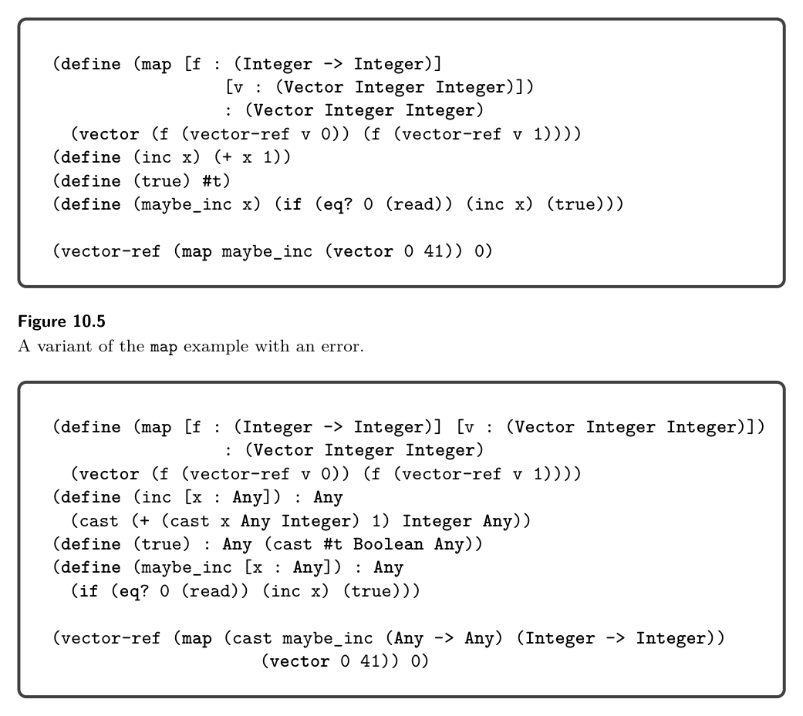
*Figure 10.6*

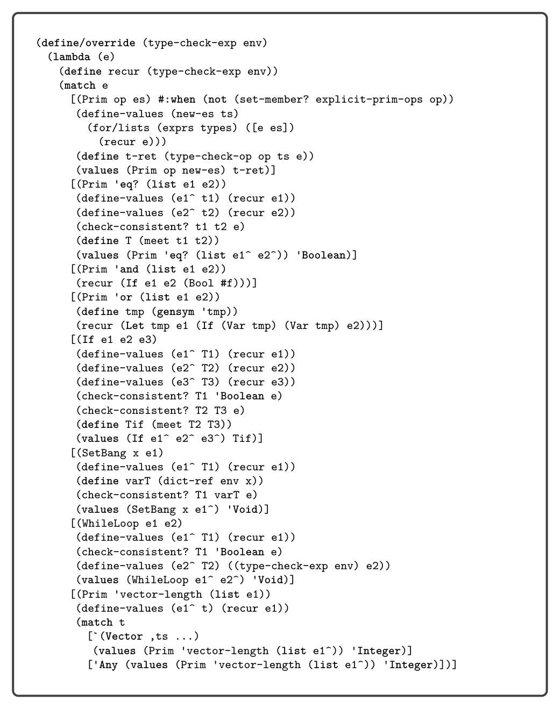
*Figure 10.7*

or signaling an error if the tag is not the one for integers (figure 9.9). Things get more interesting with casts involving function and tuple types. Consider the cast of the function maybe_inc from (Any -> Any) to (Integer -> Integer) shown in figure 10.5. When the maybe_inc function flows through this cast at runtime, we don’t know whether it will return an integer, because that

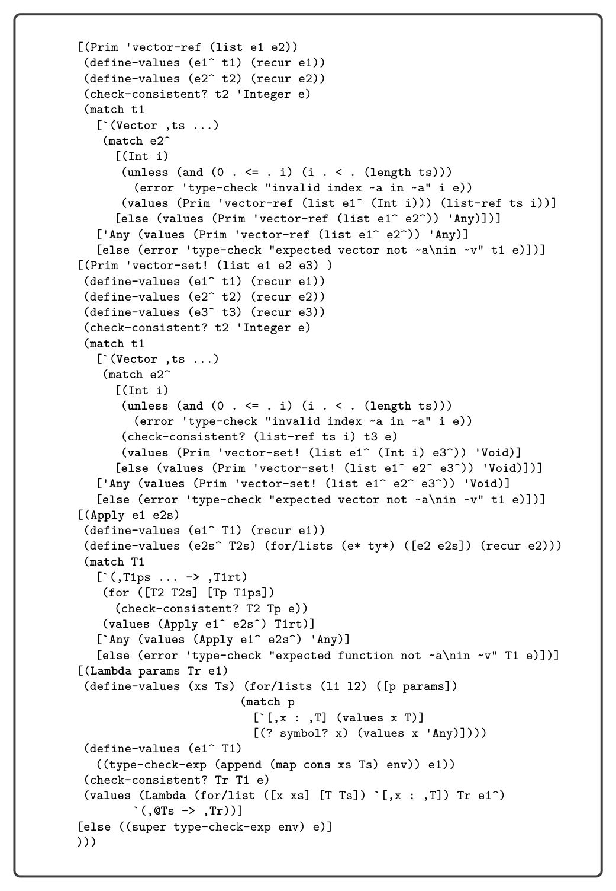
*Figure 10.8*

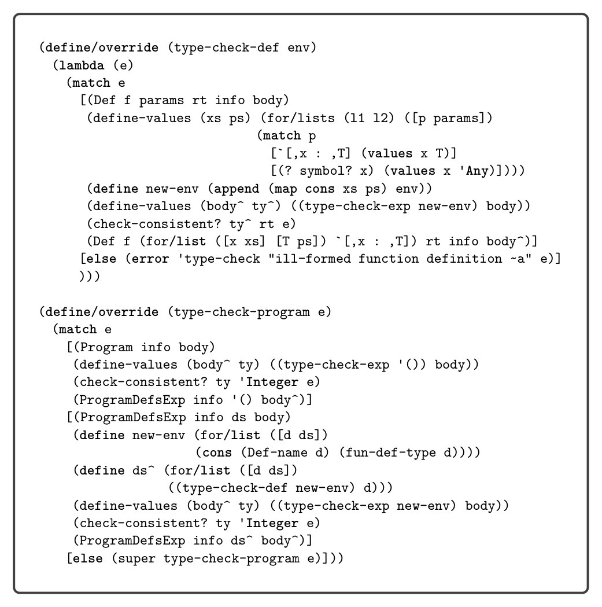
*Figure 10.9*

depends on the input from the user. The LCast interpreter therefore delays the checking of the cast until the function is applied. To do so it wraps maybe_inc in a new function that casts its parameter from Integer to Any, applies maybe_inc, and then casts the return value from Any to Integer. Consider the example presented in figure 10.11 that defines a partially typed version of map whose parameter v has type (Vector Any Any) and that updates v in place instead of returning a new tuple. We name this function map_inplace. We apply map_inplace to a tuple of integers, so the type checker inserts a cast from (Vector Integer Integer) to (Vector Any Any). A naive way for the LCast interpreter to cast between tuple types would be to build a new tuple whose elements are the result of casting each of the original elements to the target type. However, this approach is not valid for mutable data structures. In the example of figure 10.11,

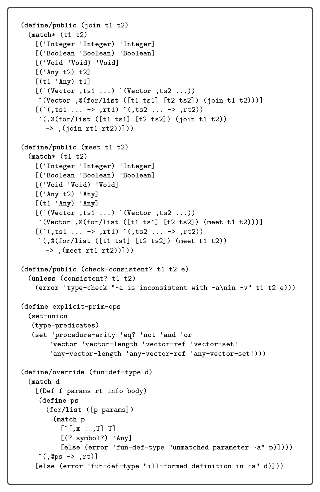
*Figure 10.10*

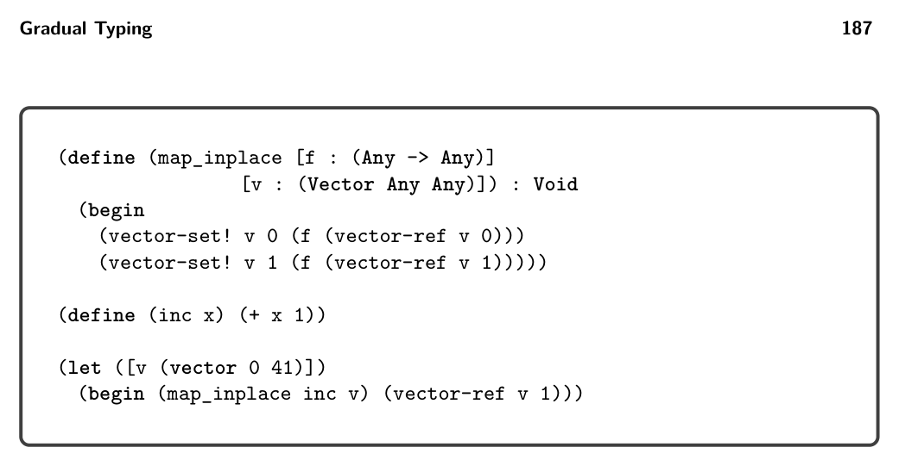
*Figure 10.11*

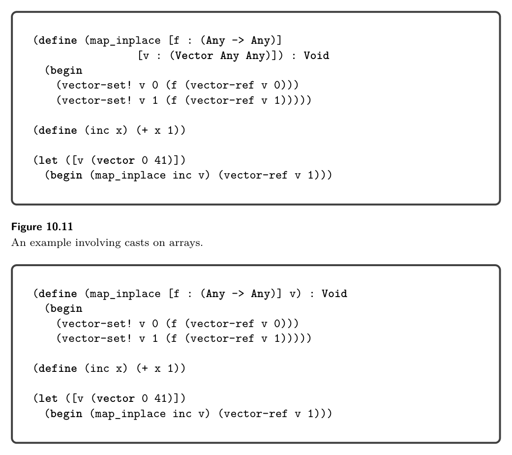
*Figure 10.12*

if the cast created a new tuple, then the updates inside map_inplace would happen to the new tuple and not the original one. Instead the interpreter needs to create a new kind of value, a proxy, that inter- cepts every tuple operation. On a read, the proxy reads from the underlying tuple and then applies a cast to the resulting value. On a write, the proxy casts the argument value and then performs the write to the underlying tuple. For the first (vector-ref v 0) in map_inplace, the proxy casts 0 from Integer to Any. For the first vector-set!, the proxy casts a tagged 1 from Any to Integer. Finally we consider casts between the Any type and higher-order types such as functions and tuples. Figure 10.12 shows a variant of map_inplace in which param- eter v does not have a type annotation, so it is given type Any. In the call to map_inplace, the tuple has type (Vector Integer Integer), so the type checker inserts a cast to Any. A first thought is to use Inject, but that doesn’t work because (Vector Integer Integer) is not a flat type. Instead, we must first cast to (Vector Any Any), which is flat, and then inject to Any.

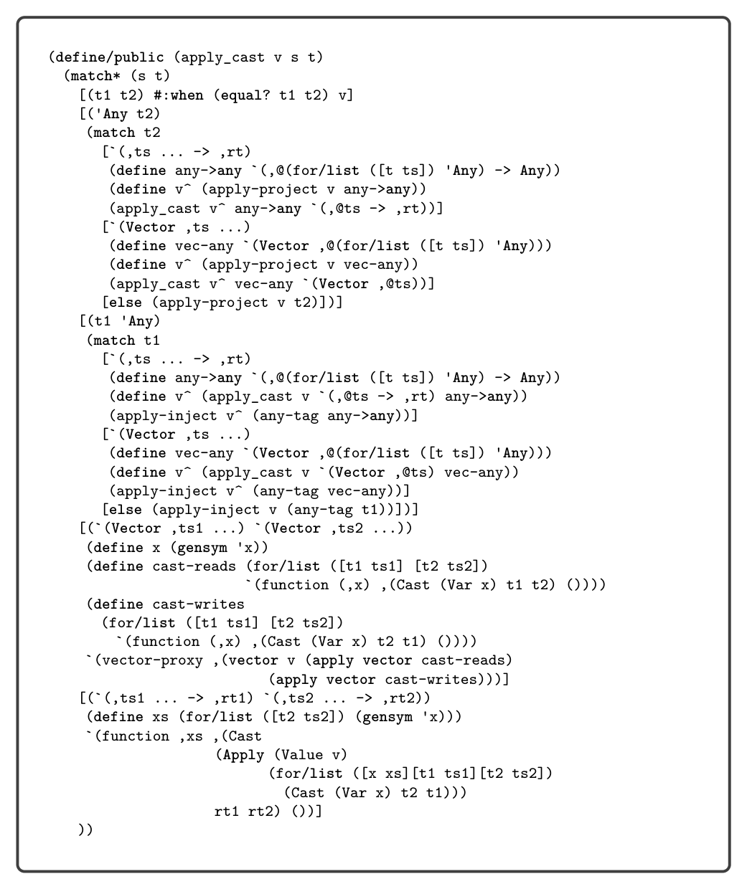
*Figure 10.13*

The LCast interpreter uses an auxiliary function named apply_cast to cast a value from a source type to a target type, shown in figure 10.13. You’ll find that it handles all the kinds of casts that we’ve discussed in this section. The definition of the interpreter for LCast is shown in figure 10.14, with the case for Cast dispatch- ing to apply_cast. To handle the addition of tuple proxies, we update the tuple primitives in interp-op using the functions given in figure 10.15. Next we turn to the individual passes needed for compiling L?.

