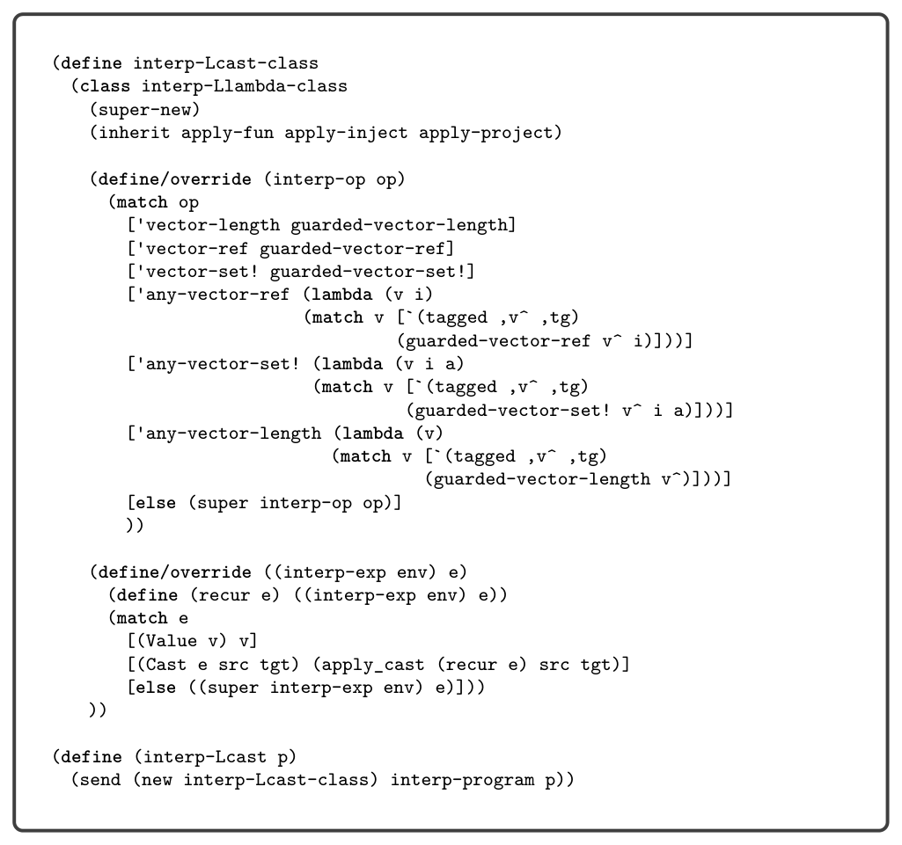
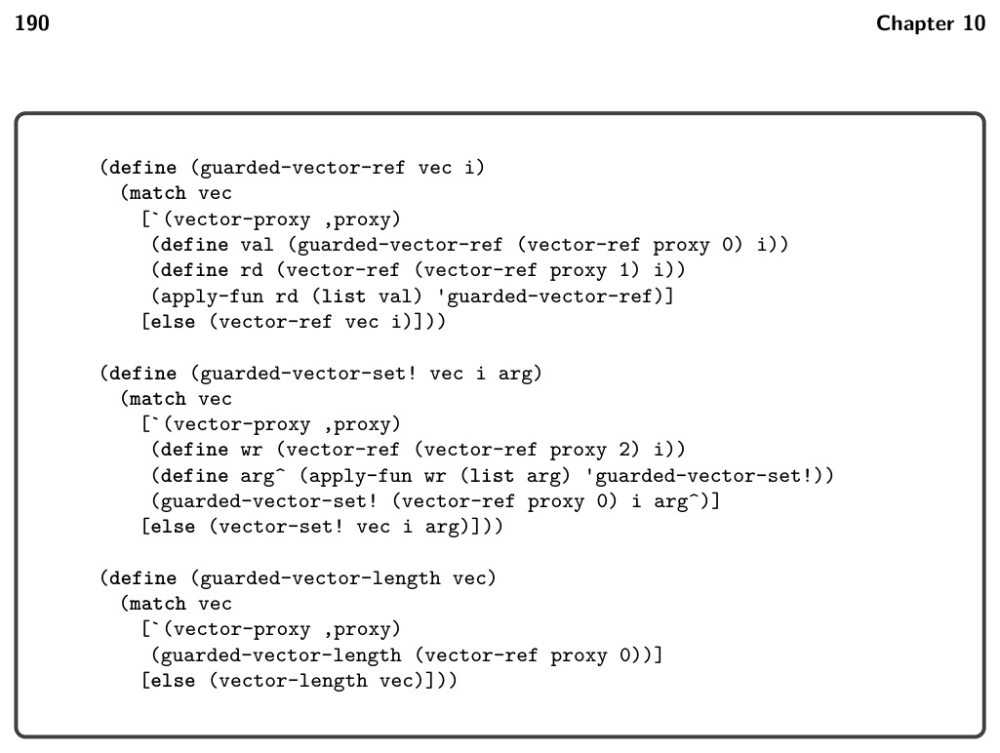

# 10.3 Cast Insertion 

*Figure 10.14*

10.3 Cast Insertion

In our discussion of type checking of L?, we mentioned how the runtime aspect of type checking is carried out by the Cast AST node, which is added to the program by a new pass named cast_insert. The target of this pass is the LCast language. We now discuss the details of this pass. The cast_insert pass is closely related to the type checker for L? (starting in figure 10.7). In particular, the type checker allows implicit casts between consistent types. The job of the cast_insert pass is to make those casts explicit. It does so by inserting Cast nodes into the AST. For the most part, the implicit casts occur in places where the type checker checks two types for consistency. Consider the case for binary operators in figure 10.7. The type checker requires that the type of the left operand is consistent with Integer. Thus, the cast_insert pass should insert a Cast around the left operand, converting from its type to Integer. The story is similar for the right operand. It is not always necessary to insert a cast, for

*Figure 10.15*

example, if the left operand already has type Integer then there is no need for a Cast. Some of the implicit casts are not as straightforward. One such case arises with the conditional expression. In figure 10.7 we see that the type checker requires that the two branches have consistent types and that type of the conditional expression is the meet of the branches’ types. In the target language LCast, both branches will need to have the same type, and that type will be the type of the conditional expression. Thus, each branch requires a Cast to convert from its type to the meet of the branches’ types. The case for the function call exhibits another interesting situation. If the function expression is of type Any, then it needs to be cast to a function type so that it can be used in a function call in LCast. Which function type should it be cast to? The parameter and return types are unknown, so we can simply use Any for all of them. Furthermore, in LCast the argument types will need to exactly match the parameter types, so we must cast all the arguments to type Any (if they are not already of that type). Likewise, the cases for the tuple operators vector-length, vector-ref, and vector-set! need to handle the situation where the tuple expression is of type Any. Instead of handling these situations with casts, we recommend translating the special-purpose variants of the tuple operators that handle tuples of type Any: any-vector-length, any-vector-ref, and any-vector-set!.

