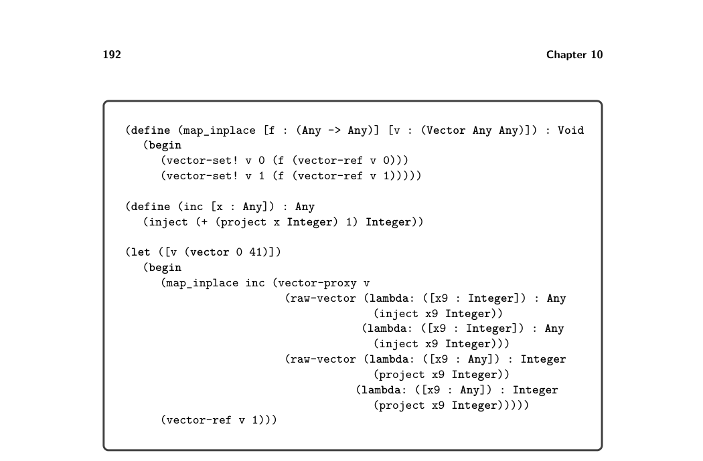
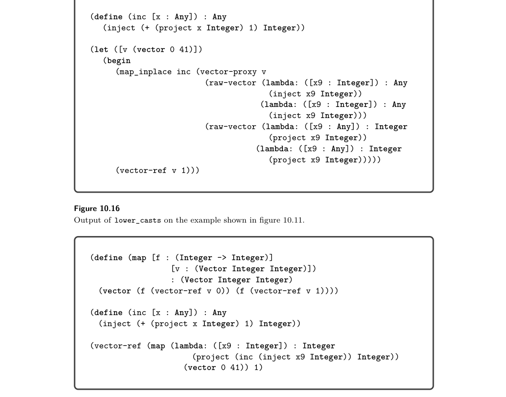

# 10.5 Differentiate Proxies 

10.4 Lower Casts

The next step in the journey toward x86 is the lower_casts pass that translates the casts in LCast to the lower-level Inject and Project operators and new operators for proxies, extending the Lλ language to LProxy. The LProxy language can also be described as an extension of LAny, with the addition of proxies. We recommend cre- ating an auxiliary function named lower_cast that takes an expression (in LCast), a source type, and a target type and translates it to an expression in LProxy. The lower_cast function can follow a code structure similar to the apply_cast function (figure 10.13) used in the interpreter for LCast, because it must handle the same cases as apply_cast and it needs to mimic the behavior of apply_cast. The most interesting cases concern the casts involving tuple and function types. As mentioned in section 10.2, a cast from one tuple type to another tuple type is accomplished by creating a proxy that intercepts the operations on the underlying tuple. Here we make the creation of the proxy explicit with the vector-proxy AST node. It takes three arguments: the first is an expression for the tuple, the second is a tuple of functions for casting an element that is being read from the tuple, and the third is a tuple of functions for casting an element that is being written to the array. You can create the functions for reading and writing using lambda expressions. Also, as we show in the next section, we need to differentiate these tuples of functions from the user-created ones, so we recommend using a new AST node named raw-vector instead of vector. Figure 10.16 shows the output of lower_casts on the example given in figure 10.11 that involved casting a tuple of integers to a tuple of Any. A cast from one function type to another function type is accomplished by gener- ating a lambda whose parameter and return types match the target function type. The body of the lambda should cast the parameters from the target type to the source type. (Yes, backward! Functions are contravariant in the parameters.) After- ward, call the underlying function and then cast the result from the source return type to the target return type. Figure 10.17 shows the output of the lower_casts pass on the map example given in figure 10.3. Note that the inc argument in the call to map is wrapped in a lambda.

10.5 Differentiate Proxies

So far, the responsibility of differentiating tuples and tuple proxies has been the job of the interpreter. For example, the interpreter for LCast implements vector-ref using the guarded-vector-ref function shown in figure 10.15. In the differentiate_proxies pass we shift this responsibility to the generated code. We begin by designing the output language LPOr. In L? we used the type Vector for both real tuples and tuple proxies. In LPOr we return the Vector type to its original meaning, as the type of just tuples, and we introduce a new type, PVector, whose values can be either real tuples or tuple proxies. A tuple proxy is represented by a tuple containing three things: (1) the underlying tuple, (2) a tuple of functions for casting elements that are read from the tuple,

*Figure 10.16*

*Figure 10.17*

and (3) a tuple of functions for casting values to be written to the tuple. So, we define the following abbreviation for the type of a tuple proxy:

TupleProxy(T … ⇒T′ … ) = (Vector (PVector T … ) R W)

where R = (Vector (T →T′) … ) and W = (Vector (T′ →T) … ). Next we describe each of the new primitive operations.

inject-vector : (Vector T … ) →(PVector T … )

This operation brands a vector as a value of the PVector type. inject-proxy : TupleProxy(T … ⇒T′ … ) →(PVector T′ … )

This operation brands a vector proxy as value of the PVector type. proxy? : (PVector T … ) →Boolean

This returns true if the value is a tuple proxy and false if it is a real tuple. project-vector : (PVector T … ) →(Vector T … )

Assuming that the input is a tuple, this operation returns the tuple. proxy-vector-length : (PVector T … ) →Integer

Given a tuple proxy, this operation returns the length of the tuple. proxy-vector-ref : (PVector T … ) →(i : Integer) →Ti

Given a tuple proxy, this operation returns the ith element of the tuple. proxy-vector-set! : (PVector T … ) →(i : Integer) →Ti →Void

Given a tuple proxy, this operation writes a value to the ith element of the tuple.

Now we discuss the translation that differentiates tuples and arrays from proxies. First, every type annotation in the program is translated (recursively) to replace Vector with PVector. Next, we insert uses of PVector operations in the appro- priate places. For example, we wrap every tuple creation with an inject-vector.

(vector e1 … en) ⇒ (inject-vector (vector e′ 1 … e′ n))

The raw-vector AST node that we introduced in the previous section does not get injected.

(raw-vector e1 … en) ⇒ (vector e′ 1 … e′ n)

The vector-proxy AST translates as follows:

(vector-proxy e1 e2 e3) ⇒ (inject-proxy (vector e′ 1 e′ 2 e′ 3))

We translate the element access operations into conditional expressions that check whether the value is a proxy and then dispatch to either the appropriate proxy tuple operation or the regular tuple operation.

(vector-ref e1 i) ⇒ (let ([v e1]) (if (proxy? v) (proxy-vector-ref v i) (vector-ref (project-vector v) i)

Note that in the branch for a tuple, we must apply project-vector before reading from the tuple. The translation of array operations is similar to the ones for tuples.

