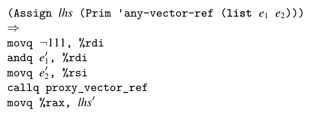
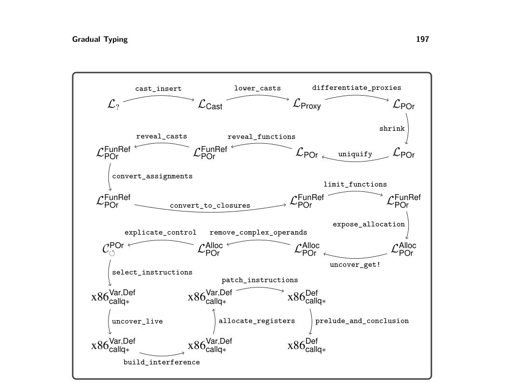
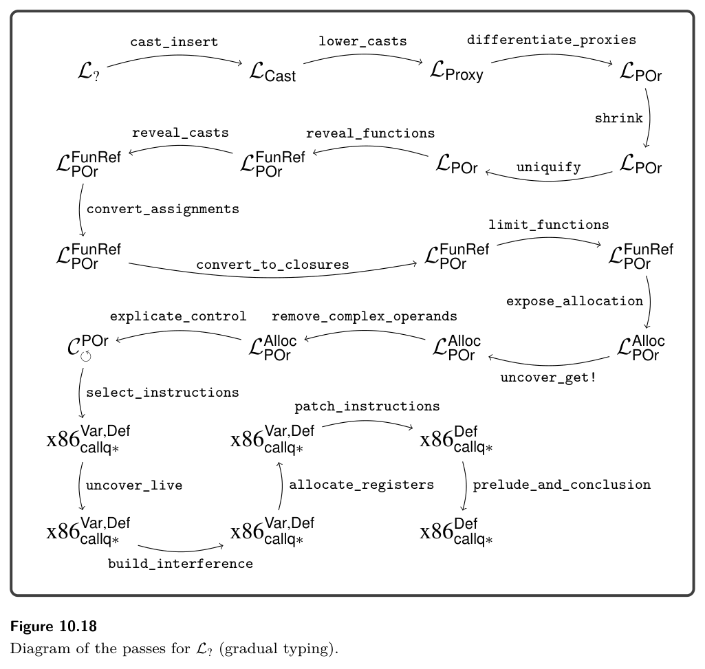

# 10.9 Further Reading

(Assign lhs (Prim 'proxy-vector-ref (list e1 e2))) ⇒ movq e′ 1, %rdi movq e′ 2, %rsi callq proxy_vector_ref movq %rax, lhs′

We have another batch of operations to deal with: those for the Any type. Recall that we generate an any-vector-ref when there is a element access on some- thing of type Any, and similarly for any-vector-set! and any-vector-length. In section 9.8 we selected instructions for these operations on the basis of the idea that the underlying value was a tuple or array. But in the current setting, the underlying value is of type PVector. We have added three runtime functions to deal with this: proxy_vector_ref, proxy_vector_set, and proxy_vector_length that inspect bit 62 of the tag to determine whether the value is a proxy, and then dispatches to the the appropriate code. So any-vector-ref can be translated as follows. We begin by projecting the underlying value out of the tagged value and then call the proxy_vector_ref procedure in the runtime.

The any-vector-set! and any-vector-length operators are translated in a similar way. Alternatively, you could generate instructions to open-code the proxy_vector_ref, proxy_vector_set, and proxy_vector_length functions.

Exercise 10.1 Implement a compiler for the gradually typed L? language by extend- ing and adapting your compiler for Lλ. Create ten new partially typed test programs. In addition to testing with these new programs, test your compiler on all the tests for Lλ and for LDyn. Sometimes you may get a type-checking error on the LDyn programs, but you can adapt them by inserting a cast to the Any type around each subexpression that has caused a type error. Although LDyn does not have explicit casts, you can induce one by wrapping the subexpression e with a call to an unannotated identity function, as follows: ((lambda (x) x) e).

*Figure 10.18*

10.9 Further Reading

This chapter just scratches the surface of gradual typing. The basic approach described here is missing two key ingredients that one would want in an imple- mentation of gradual typing: blame tracking (Tobin-Hochstadt and Felleisen 2006;

*Figure 10.18*

*(2015)*

give an algorithm for compressing coercions, and Kuhlenschmidt, Almahallawi, and Siek (2019) show how to implement these ideas in the Grift compiler:

https://github.com/Gradual-Typing/Grift

There are also interesting interactions between gradual typing and other language features, such as generics, information-flow types, and type inference, to name a few. We recommend to the reader the online gradual typing bibliography for more material:

http://samth.github.io/gradual-typing-bib/

