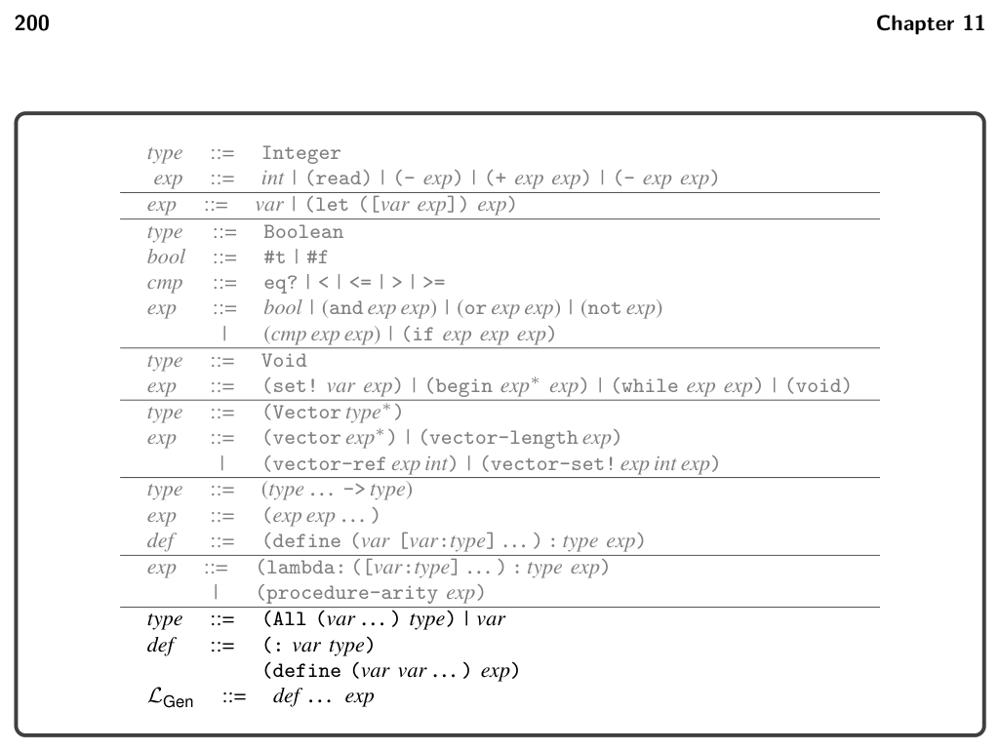
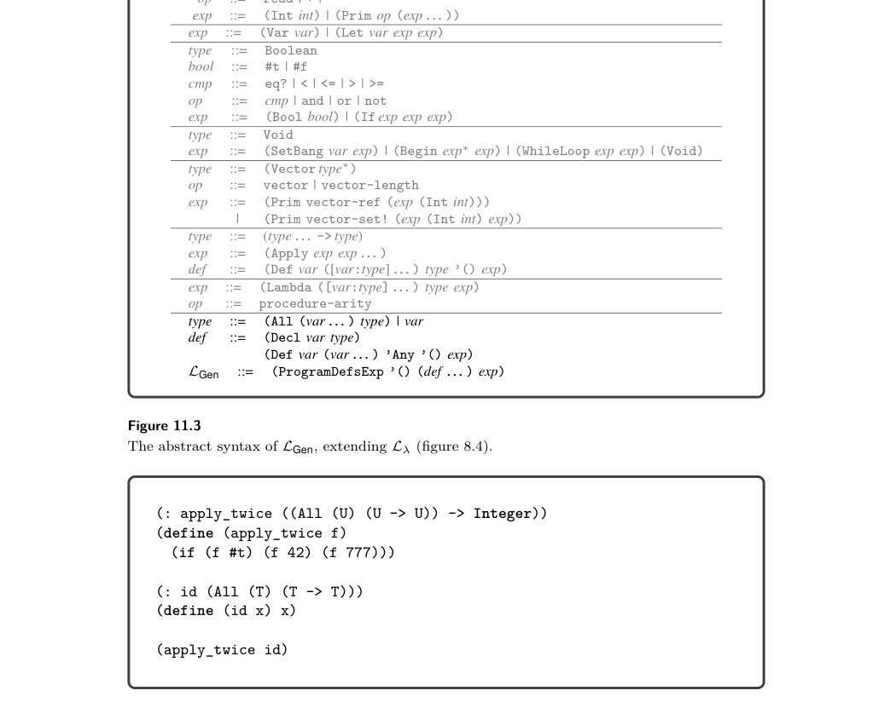
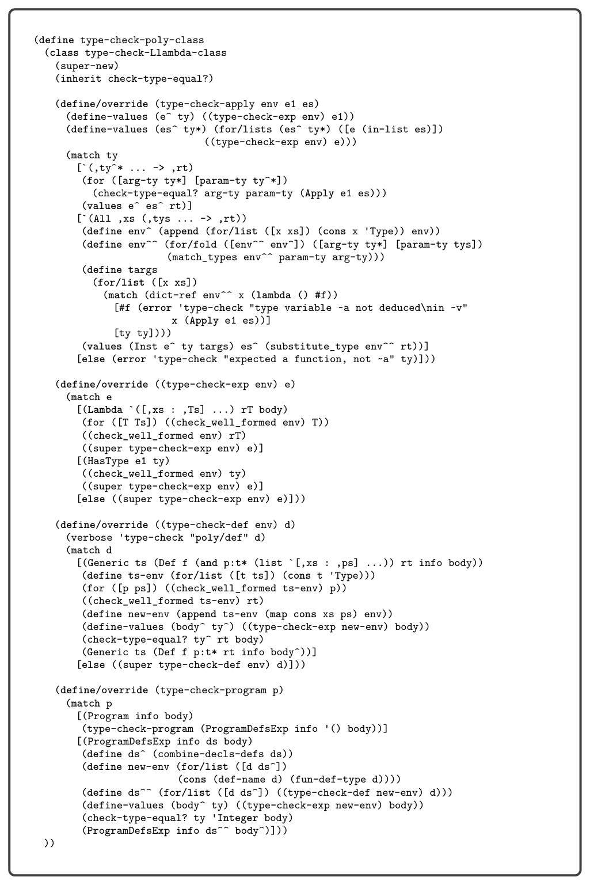
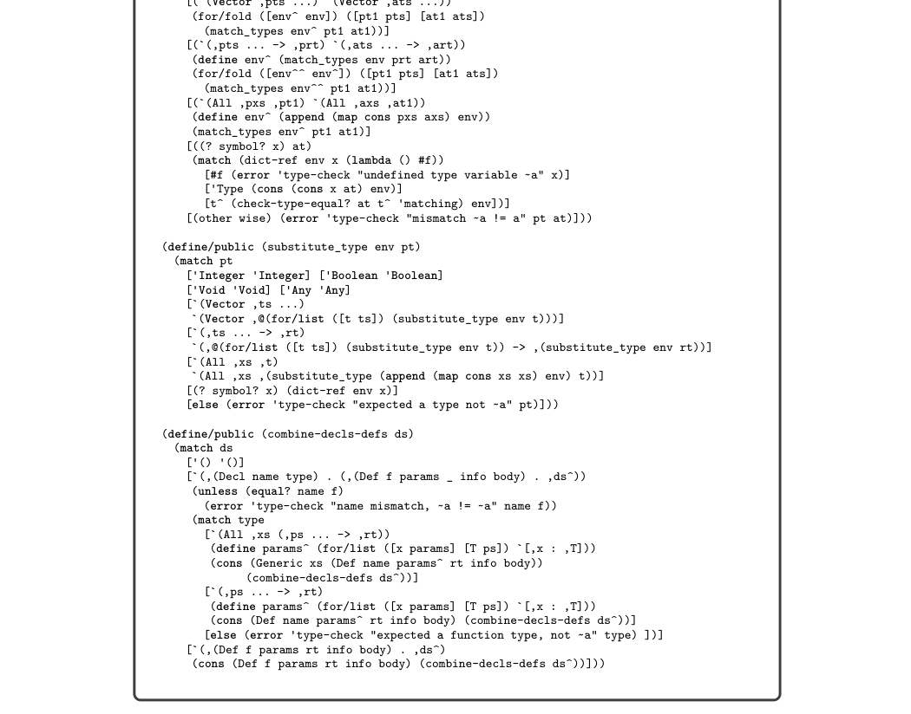
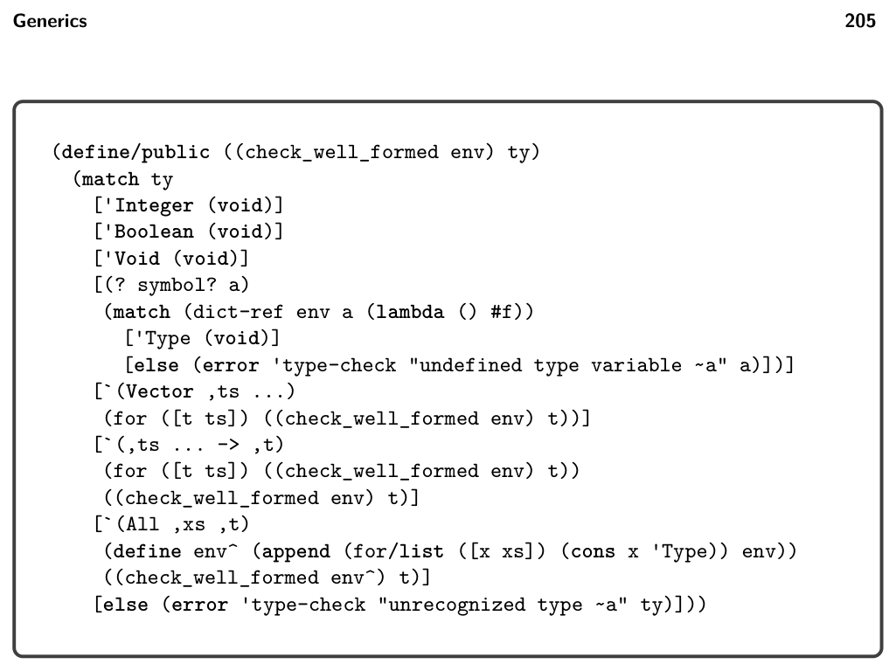
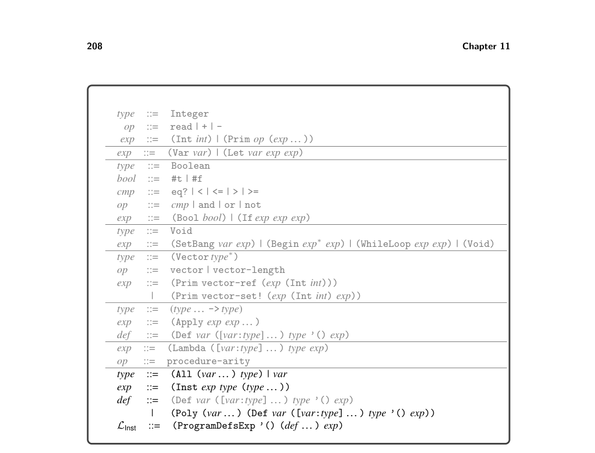
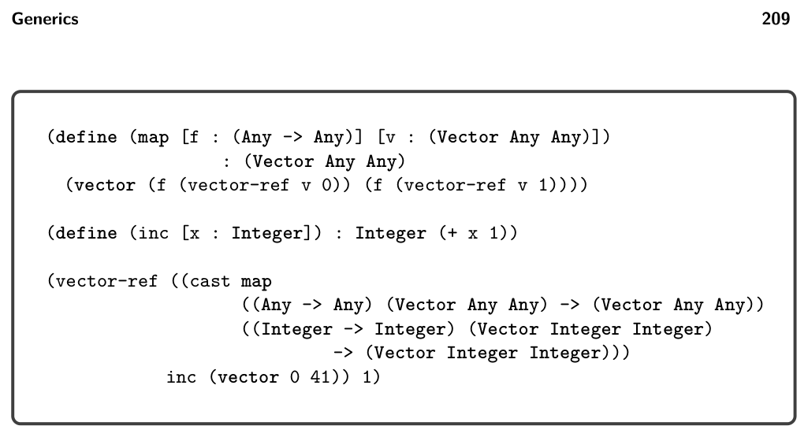
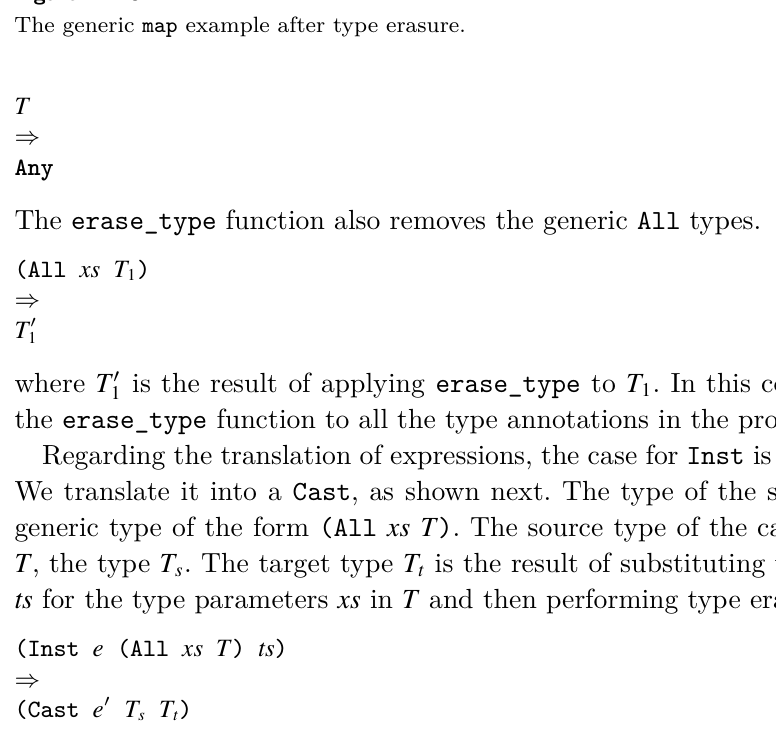
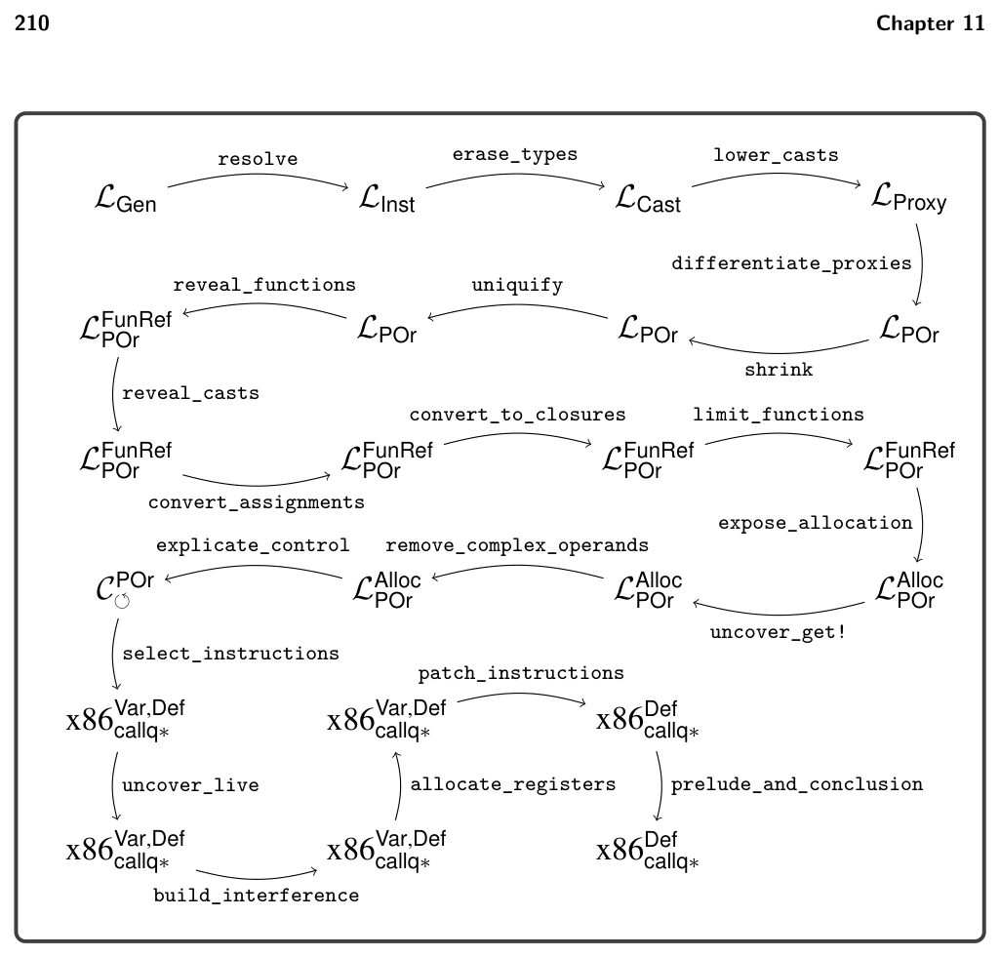

# 11 Generics

11

Generics

This chapter studies the compilation of generics (aka parametric polymorphism), compiling the LGen subset of Typed Racket. Generics enable programmers to make code more reusable by parameterizing functions and data structures with respect to the types on which they operate. For example, figure 11.1 revisits the map example and this time gives it a more fitting type. This map function is parameterized with respect to the element type of the tuple. The type of map is the following generic type specified by the All type with parameter T:


*Figure 11.1*


*Figure 11.2*

as discussed in chapter 9.) The presence of a type declaration enables the use of an All type for a function, thereby making it generic. The grammar for types is extended to include the type of a generic (All) and type variables. By including the All type in the type nonterminal of the grammar we choose to make generics first class, which has interesting repercussions on the compiler.1 Many languages with generics, such as C++ (Stroustrup 1988) and Standard ML (Milner, Tofte, and Harper 1990), support only second-class generics, so it may be helpful to see an example of first-class generics in action. In figure 11.4 we define a function apply_twice whose parameter is a generic function. Indeed, because the grammar for type includes the All type, a generic function may also be returned from a function or stored inside a tuple. The body of apply_twice applies the generic function f to a Boolean and also to an integer, which would not be possible if f were not generic. The type checker for LGen shown in figure 11.5 has several new responsibilities (compared to Lλ) which we discuss in the following paragraphs. The type checking of a function application is extended to handle the case in which the operator expression is a generic function. In that case the type argu- ments are deduced by matching the types of the parameters with the types of the arguments. The match_types auxiliary function (figure 11.6) carries out this deduction by recursively descending through a parameter type param_ty and the

* The Python typing library does not include syntax for the All type. It is inferred for functions
  whose type annotations contain type variables.


*Figure 11.3*


*Figure 11.4*

corresponding argument type arg_ty, making sure that they are equal except when there is a type parameter in the parameter type. Upon encountering a type param- eter for the first time, the algorithm deduces an association of the type parameter to the corresponding part of the argument type. If it is not the first time that the type parameter has been encountered, the algorithm looks up its deduced type and makes sure that it is equal to the corresponding part of the argument type. The return type of the application is the return type of the generic function with the type

parameters replaced by the deduced type arguments, using the substitute_type auxiliary function, which is also listed in figure 11.6. The type checker extends type equality to handle the All type. This is not quite as simple as for other types, such as function and tuple types, because two All types can be syntactically different even though they are equivalent. For example,

(All (T) (T -> T))

is equivalent to

(All (U) (U -> U)).

Two generic types are equal if they differ only in the choice of the names of the type parameters. The definition of type equality shown in figure 11.6 renames the type parameters in one type to match the type parameters of the other type. The type checker also ensures that only defined type variables appear in type annotations. The check_well_formed function for which the definition is shown in figure 11.7 recursively inspects a type, making sure that each type variable has been defined.


*Figure 11.5*


*Figure 11.6*


*Figure 11.7*

## 11.1 Compiling Generics

Broadly speaking, there are four approaches to compiling generics, as follows:

Monomorphization generates a different version of a generic function for each set of type arguments with which it is used, producing type-specialized code. This approach results in the most efficient code but requires whole-program compilation (no separate compilation) and may increase code size. Unfortu- nately, monomorphization is incompatible with first-class generics because it is not always possible to determine which generic functions are used with which type arguments during compilation. (It can be done at runtime with just-in-time compilation.) Monomorphization is used to compile C++ templates (Stroustrup 1988) and generic functions in NESL (Blelloch et al. 1993) and ML (Weeks 2006). Uniform representation generates one version of each generic function and requires all values to have a common boxed format, such as the tagged values of type Any in LAny. Both generic and monomorphic code is compiled similarly to code in a dynamically typed language (like LDyn), in which primitive operators require their arguments to be projected from Any and their results to be injected into Any. (In object-oriented languages, the projection is accomplished via virtual method dispatch.) The uniform representation approach is compatible with separate com- pilation and with first-class generics. However, it produces the least efficient code because it introduces overhead in the entire program. This approach is used in Java (Bracha et al. 1998), CLU (Liskov et al. 1979; Liskov 1993), and some implementations of ML (Cardelli 1984; Appel and MacQueen 1987). Mixed representation generates one version of each generic function, using a boxed representation for type variables. However, monomorphic code is compiled as usual (as in Lλ), and conversions are performed at the boundaries between monomorphic code and polymorphic code (for example, when a generic function is instantiated and called). This approach is compatible with separate compi- lation and first-class generics and maintains efficiency in monomorphic code. The trade-off is increased overhead at the boundary between monomorphic and generic code. This approach is used in implementations of ML (Leroy 1992) and Java, starting in Java 5 with the addition of autoboxing. Type passing uses the unboxed representation in both monomorphic and generic code. Each generic function is compiled to a single function with extra parameters that describe the type arguments. The type information is used by the generated code to determine how to access the unboxed values at runtime. This approach is used in implementation of Napier88 (Morrison et al. 1991) and ML (Harper and Morrisett 1995). Type passing is compatible with separate compilation and first-class generics and maintains the efficiency for monomorphic code. There is runtime overhead in polymorphic code from dispatching on type information.

In this chapter we use the mixed representation approach, partly because of its favorable attributes and partly because it is straightforward to implement using the tools that we have already built to support gradual typing. The work of compiling

generic functions is performed in two passes, resolve and erase_types, that we discuss next. The output of erase_types is LCast (section 10.3), so the rest of the compilation is handled by the compiler of chapter 10.

## 11.2 Resolve Instantiation

Recall that the type checker for LGen deduces the type arguments at call sites to a generic function. The purpose of the resolve pass is to turn this implicit instanti- ation into an explicit one, by adding inst nodes to the syntax of the intermediate language. An inst node records the mapping of type parameters to type arguments. The semantics of the inst node is to instantiate the result of its first argument, a generic function, to produce a monomorphic function. However, because the inter- preter never analyzes type annotations, instantiation can be a no-op and simply return the generic function. The output language of the resolve pass is LInst, for which the definition is shown in figure 11.8. The resolve pass combines the type declaration and polymorphic function into a single definition, using the Poly form, to make polymorphic functions more convenient to process in the next pass of the compiler. The output of the resolve pass on the generic map example is listed in figure 11.9. Note that the use of map is wrapped in an inst node, with the parameter T chosen to be Integer.

## 11.3 Erase Generic Types

We use the Any type presented in chapter 9 to represent type variables. For exam- ple, figure 11.10 shows the output of the erase_types pass on the generic map (figure 11.1). The occurrences of type parameter T are replaced by Any, and the generic All types are removed from the type of map. This process of type erasure creates a challenge at points of instantiation. For example, consider the instantiation of map shown in figure 11.9. The type of map is

(All (T) ((T -> T) (Vector T T) -> (Vector T T)))

and it is instantiated to

```
((Integer -> Integer) (Vector Integer Integer)
-> (Vector Integer Integer))
```

After erasure, the type of map is

((Any -> Any) (Vector Any Any) -> (Vector Any Any))

but we need to convert it to the instantiated type. This is easy to do in the language LCast with a single cast. In the example shown in figure 11.10, the instantiation of map has been compiled to a cast from the type of map to the instantiated type. The source and the target type of a cast must be consistent (figure 10.4), which indeed is the case because both the source and target are obtained from the same generic type of map, replacing the type parameters with Any in the former and with


*Figure 11.8*


*Figure 11.9*

the deduced type arguments in the latter. (Recall that the Any type is consistent with any type.) To implement the erase_types pass, we first recommend defining a recursive function that translates types, named erase_type. It replaces type variables with Any as follows.


*Figure 11.10*

where Tt = (erase_type (substitute_type s T)), and s = (map cons xs ts). Finally, each generic function is translated to a regular function in which type erasure has been applied to all the type annotations and the body.

Exercise 11.1 Implement a compiler for the polymorphic language LGen by extend- ing and adapting your compiler for L?. Create six new test programs that use polymorphic functions. Some of them should make use of first-class generics.


*Figure 11.11*


*Figure 11.11*

