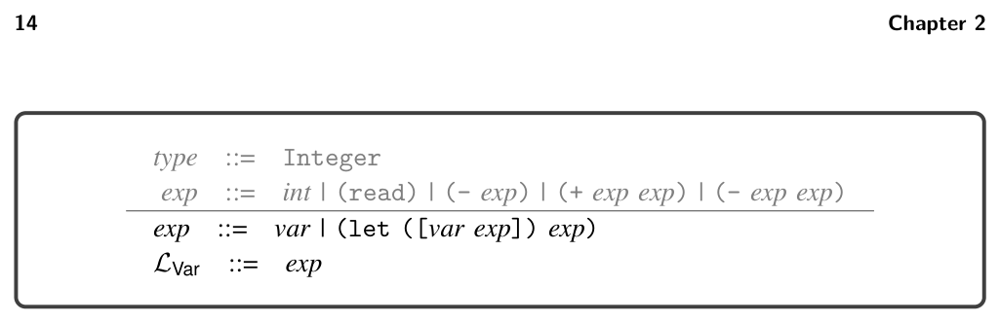
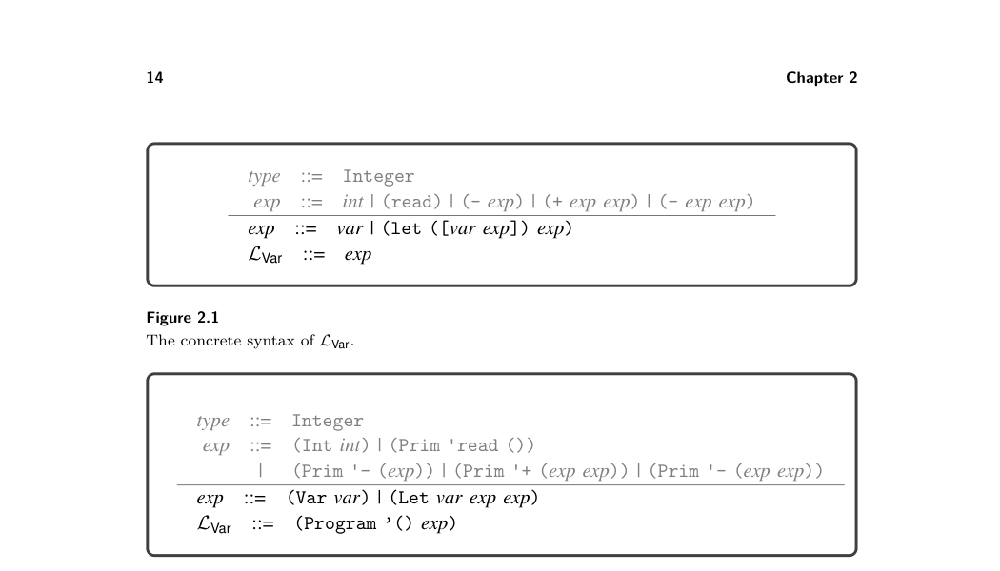
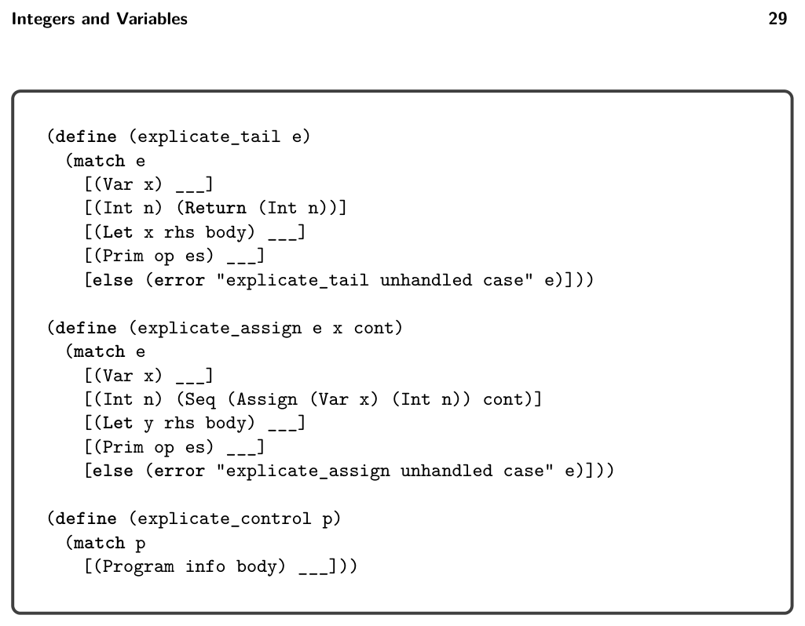

# 2 Integers and Variables

2

Integers and Variables

This chapter covers compiling a subset of Racket to x86-64 assembly code (Intel 2015). The subset, named LVar, includes integer arithmetic and local variables. We often refer to x86-64 simply as x86. The chapter first describes the LVar language (section 2.1) and then introduces x86 assembly (section 2.2). Because x86 assembly language is large, we discuss only the instructions needed for compiling LVar. We introduce more x86 instructions in subsequent chapters. After introducing LVar and x86, we reflect on their differences and create a plan to break down the translation from LVar to x86 into a handful of steps (section 2.3). The rest of the chapter gives detailed hints regarding each step. We aim to give enough hints that the well- prepared reader, together with a few friends, can implement a compiler from LVar to x86 in a short time. To suggest the scale of this first compiler, we note that the instructor solution for the LVar compiler is approximately 500 lines of code.

## 2.1 The LVar Language

The LVar language extends the LInt language with variables. The concrete syntax of the LVar language is defined by the grammar presented in figure 2.1, and the abstract syntax is presented in figure 2.2. The nonterminal var may be any Racket identifier. As in LInt, read is a nullary operator, - is a unary operator, and + is a binary operator. Similarly to LInt, the abstract syntax of LVar includes the Program struct to mark the top of the program. Despite the simplicity of the LVar language, it is rich enough to exhibit several compilation techniques. Let us dive further into the syntax and semantics of the LVar language. The let feature defines a variable for use within its body and initializes the variable with the value of an expression. The abstract syntax for let is shown in figure 2.2. The concrete syntax for let is

(let ([var exp]) exp)

For example, the following program initializes x to 32 and then evaluates the body (+ 10 x), producing 42.

(let ([x (+ 12 20)]) (+ 10 x))

When there are multiple lets for the same variable, the closest enclosing let is used. That is, variable definitions overshadow prior definitions. Consider the


*Figure 2.1 The concrete syntax of LVar.*


*Figure 2.2 The abstract syntax of LVar.*

following program with two lets that define two variables named x. Can you figure out the result?

(let ([x 32]) (+ (let ([x 10]) x) x))

For the purposes of depicting which variable occurrences correspond to which defi- nitions, the following shows the x’s annotated with subscripts to distinguish them. Double-check that your answer for the previous program is the same as your answer for this annotated version of the program.

(let ([x1 32]) (+ (let ([x2 10]) x2) x1))

The initializing expression is always evaluated before the body of the let, so in the following, the read for x is performed before the read for y. Given the input 52 then 10, the following produces 42 (not −42).

(let ([x (read)]) (let ([y (read)]) (+ x (- y))))

2.1.1 Extensible Interpreters via Method Overriding To prepare for discussing the interpreter of LVar, we explain why we implement it in an object-oriented style. Throughout this book we define many interpreters, one for each language that we study. Because each language builds on the prior one, there is a lot of commonality between these interpreters. We want to write down the common parts just once instead of many times. A naive interpreter for LVar would handle the cases for variables and let but dispatch to an interpreter for LInt in the rest of the cases. The following code sketches this idea. (We explain the env parameter in section 2.1.2.)

```
(define ((interp_Lvar env) e)
(match e
[(Var x)
(dict-ref env x)]
[(Let x e body)
(define v ((interp_Lvar env) e))
(define env^ (dict-set env x v))
((interp_Lvar env^) body)]
[else ((interp_Lint env) e)]))
```

```
(define ((interp_Lint env) e)
(match e
[(Prim '- (list e1))
(fx- 0 ((interp_Lint env) e1))]
...))
```

The problem with this naive approach is that it does not handle situations in which an LVar feature, such as a variable, is nested inside an LInt feature, such as the - operator, as in the following program.

(Let 'y (Int 10) (Prim '- (list (Var 'y))))

If we invoke interp_Lvar on this program, it dispatches to interp_Lint to handle the - operator, but then it recursively calls interp_Lint again on its argument. Because there is no case for Var in interp_Lint, we get an error! To make our interpreters extensible we need something called open recursion, in which the tying of the recursive knot is delayed until the functions are composed. Object-oriented languages provide open recursion via method overriding. The fol- lowing code uses method overriding to interpret LInt and LVar using the class feature of Racket. We define one class for each language and define a method for interpreting expressions inside each class. The class for LVar inherits from the class for LInt, and the method interp_exp in LVar overrides the interp_exp in LInt. Note that the default case of interp_exp in LVar uses super to invoke interp_exp, and because LVar inherits from LInt, that dispatches to the interp_exp in LInt.

```
(define interp-Lvar-class
(class interp-Lint-class
(define/override ((interp_exp env) e)
(match e
[(Var x)
(dict-ref env x)]
[(Let x e body)
(define v ((interp_exp env) e))
(define env^ (dict-set env x v))
((interp_exp env^) body)]
[else
((super interp_exp env) e)]))
...
))
```

```
(define interp-Lint-class
(class object%
(define/public ((interp_exp env) e)
(match e
[(Prim '- (list e))
(fx- 0 ((interp_exp env) e))]
...))
...))
```

We return to the troublesome example, repeated here:

(Let 'y (Int 10) (Prim '- (list (Var 'y))))

We can invoke the interp_exp method for LVar on this expression, which we call e0, by creating an object of the LVar class and calling the interp_exp method

((send (new interp-Lvar-class) interp_exp '()) e0)

To process the - operator, the default case of interp_exp in LVar dispatches to the interp_exp method in LInt. But then for the recursive method call, it dispatches to interp_exp in LVar, where the Var node is handled correctly. Thus, method overriding gives us the open recursion that we need to implement our interpreters in an extensible way.


*Figure 2.6 defines the concrete syntax for x86Int. We use the AT&T syntax expected by the GNU assembler. A program begins with a main label followed by a sequence*

* In Chapter 4 we introduce type checking rules that prohibit access to undefined variables.


*Figure 2.3 Interpreter for LInt as a class.*


*Figure 2.4 Interpreter for the LVar language.*


*Figure 2.5 Association lists implement the dictionary interface.*


*Figure 2.6 The syntax of the x86Int assembly language (AT&T syntax).*

of instructions. The globl directive makes the main procedure externally visible so that the operating system can call it. An x86 program is stored in the computer’s memory. For our purposes, the computer’s memory is a mapping of 64-bit addresses to 64-bit values. The computer has a program counter (PC) stored in the rip register that points to the address of the next instruction to be executed. For most instructions, the program counter is incremented after the instruction is executed so that it points to the next instruction in memory. Most x86 instructions take two operands, each of which is an integer constant (called an immediate value), a register, or a memory location. A register is a special kind of variable that holds a 64-bit value. There are 16 general-purpose registers in the computer; their names are given in figure 2.6. A register is written with a percent sign, %, followed by its name, for example, %rax.


*Figure 2.7 An x86 program that computes (+ 10 32).*

An immediate value is written using the notation $n where n is an integer. An access to memory is specified using the syntax n(%r), which obtains the address stored in register r and then adds n bytes to the address. The resulting address is used to load or to store to memory depending on whether it occurs as a source or destination argument of an instruction. An arithmetic instruction such as addq s, d reads from the source s and des- tination d, applies the arithmetic operation, and then writes the result to the destination d. The move instruction movq s, d reads from s and stores the result in d. The callq label instruction jumps to the procedure specified by the label, and retq returns from a procedure to its caller. We discuss procedure calls in more detail further in this chapter and in chapter 7. The last letter q indicates that these instructions operate on quadwords, which are 64-bit values. The instruction jmp label updates the program counter to the address of the instruction immediately after the specified label. Appendix A.3 contains a reference for all the x86 instructions used in this book. Figure 2.7 depicts an x86 program that computes (+ 10 32). The instruction movq $10, %rax puts 10 into register rax, and then addq $32, %rax adds 32 to the 10 in rax and puts the result, 42, into rax. The last instruction retq finishes the main function by returning the integer in rax to the operating system. The operating system interprets this integer as the program’s exit code. By convention, an exit code of 0 indicates that a program has completed successfully, and all other exit codes indicate various errors. However, in this book we return the result of the program as the exit code. We exhibit the use of memory for storing intermediate results in the next example. Figure 2.8 lists an x86 program that computes (+ 52 (- 10)). This program uses a region of memory called the procedure call stack (stack for short). The stack consists of a separate frame for each procedure call. The memory layout for an individual frame is shown in figure 2.9. The register rsp is called the stack pointer and contains the address of the item at the top of the stack. In general, we use the term pointer for something that contains an address. The stack grows downward in memory, so we increase the size of the stack by subtracting from the stack pointer. In the context of a procedure call, the return address is the location of the instruction that immediately follows the call instruction on the caller side. The function call instruction, callq, pushes the return address onto the stack prior to jumping to


*Figure 2.8 An x86 program that computes (+ 52 (- 10)).*


*Figure 2.9 Memory layout of a frame.*

the procedure. The register rbp is the base pointer and is used to access variables that are stored in the frame of the current procedure call. The base pointer of the caller is stored immediately after the return address. Figure 2.9 shows the memory layout of a frame with storage for n variables, which are numbered from 1 to n. Variable 1 is stored at address −8(%rbp), variable 2 at −16(%rbp), and so on. In the program shown in figure 2.8, consider how control is transferred from the operating system to the main function. The operating system issues a callq main instruction that pushes its return address on the stack and then jumps to main. In x86-64, the stack pointer rsp must be divisible by 16 bytes prior to the execution of any callq instruction, so that when control arrives at main, the rsp is 8 bytes out of alignment (because the callq pushed the return address). The first three instructions are the typical prelude for a procedure. The instruction pushq %rbp first subtracts 8 from the stack pointer rsp and then saves the base pointer of the


*Figure 2.10 The abstract syntax of x86Int assembly.*

caller at address rsp on the stack. The next instruction movq %rsp, %rbp sets the base pointer to the current stack pointer, which is pointing to the location of the old base pointer. The instruction subq $16, %rsp moves the stack pointer down to make enough room for storing variables. This program needs one variable (8 bytes), but we round up to 16 bytes so that rsp is 16-byte-aligned, and then we are ready to make calls to other functions. The last instruction of the prelude is jmp start, which transfers control to the instructions that were generated from the expression (+ 52 (- 10)). The first instruction under the start label is movq $10, -8(%rbp), which stores 10 in variable 1. The instruction negq -8(%rbp) changes the contents of variable 1 to −10. The next instruction moves the −10 from variable 1 into the rax register. Finally, addq $52, %rax adds 52 to the value in rax, updating its contents to 42. The three instructions under the label conclusion are the typical conclusion of a procedure. The first two restore the rsp and rbp registers to their states at the beginning of the procedure. In particular, addq $16, %rsp moves the stack pointer to point to the old base pointer. Then popq %rbp restores the old base pointer to rbp and adds 8 to the stack pointer. The last instruction, retq, jumps back to the procedure that called this one and adds 8 to the stack pointer. Our compiler needs a convenient representation for manipulating x86 programs, so we define an abstract syntax for x86, shown in figure 2.10. We refer to this language as x86Int. The main difference between this and the concrete syntax of x86Int (figure 2.6) is that labels are not allowed in front of every instruction. Instead instructions are grouped into basic blocks with a label associated with every basic block; this is why the X86Program struct includes an alist mapping labels to basic blocks. The reason for this organization becomes apparent in chapter 4 when we introduce conditional branching. The Block structure includes an info field that is not needed in this chapter but becomes useful in chapter 3. For now, the info field should contain an empty list. Regarding the abstract syntax for callq, the Callq AST node includes an integer for representing the arity of the function, that is, the number of arguments, which is helpful to know during register allocation (chapter 3).

## 2.3 Planning the Trip to x86

To compile one language to another, it helps to focus on the differences between the two languages because the compiler will need to bridge those differences. What are the differences between LVar and x86 assembly? Here are some of the most important ones:

* x86 arithmetic instructions typically have two arguments and update the second
  argument in place. In contrast, LVar arithmetic operations take two arguments
  and produce a new value. An x86 instruction may have at most one memory-
  accessing argument. Furthermore, some x86 instructions place special restrictions
  on their arguments.
* An argument of an LVar operator can be a deeply nested expression, whereas
  x86 instructions restrict their arguments to be integer constants, registers, and
  memory locations.
* The order of execution in x86 is explicit in the syntax, which is a sequence
  of instructions and jumps to labeled positions, whereas in LVar the order of
  evaluation is a left-to-right depth-first traversal of the abstract syntax tree.
* A program in LVar can have any number of variables, whereas x86 has 16 registers
  and the procedure call stack.
* Variables in LVar can shadow other variables with the same name. In x86,
  registers have unique names, and memory locations have unique addresses.

We ease the challenge of compiling from LVar to x86 by breaking down the problem into several steps, which deal with these differences one at a time. Each of these steps is called a pass of the compiler. This term indicates that each step passes over, or traverses, the AST of the program. Furthermore, we follow the nanopass approach, which means that we strive for each pass to accomplish one clear objective rather than two or three at the same time. We begin by sketching how we might implement each pass and give each pass a name. We then figure out an ordering of the passes and the input/output language for each pass. The very first pass has LVar as its input language, and the last pass has x86Int as its output language. In between these two passes, we can choose whichever language is most convenient for expressing the output of each pass, whether that be LVar, x86Int, or a new intermediate language of our own design. Finally, to implement each pass we write one recursive function per nonterminal in the grammar of the input language of the pass. Our compiler for LVar consists of the following passes:

uniquify deals with the shadowing of variables by renaming every variable to a unique name. remove_complex_operands ensures that each subexpression of a primitive opera- tion or function call is a variable or integer, that is, an atomic expression. We refer to nonatomic expressions as complex. This pass introduces temporary variables to hold the results of complex subexpressions.

explicate_control makes the execution order of the program explicit. It converts the abstract syntax tree representation into a graph in which each node is a labeled sequence of statements and the edges are goto statements. select_instructions handles the difference between LVar operations and x86 instructions. This pass converts each LVar operation to a short sequence of instructions that accomplishes the same task. assign_homes replaces variables with registers or stack locations.

Our treatment of remove_complex_operands and explicate_control as separate passes is an example of the nanopass approach.2 The traditional approach is to combine them into a single step (Aho et al. 2006). The next question is, in what order should we apply these passes? This question can be challenging because it is difficult to know ahead of time which orderings will be better (that is, will be easier to implement, produce more efficient code, and so on), and therefore ordering often involves trial and error. Nevertheless, we can plan ahead and make educated choices regarding the ordering. What should be the ordering of explicate_control with respect to uniquify? The uniquify pass should come first because explicate_control changes all the let-bound variables to become local variables whose scope is the entire program, which would confuse variables with the same name. We place remove_complex_operands before explicate_control because the lat- ter removes the let form, but it is convenient to use let in the out- put of remove_complex_operands. The ordering of uniquify with respect to remove_complex_operands does not matter, so we arbitrarily choose uniquify to come first. The select_instructions and assign_homes passes are intertwined. In chap- ter 7 we learn that in x86, registers are used for passing arguments to functions and that it is preferable to assign parameters to their corresponding registers. This suggests that it would be better to start with the select_instructions pass, which generates the instructions for argument passing, before performing register allocation. On the other hand, by selecting instructions first we may run into a dead end in assign_homes. Recall that only one argument of an x86 instruction may be a memory access, but assign_homes might be forced to assign both argu- ments to memory locations. A sophisticated approach is to repeat the two passes until a solution is found. However, to reduce implementation complexity we rec- ommend placing select_instructions first, followed by the assign_homes, and then a third pass named patch_instructions that uses a reserved register to fix outstanding problems. Figure 2.11 presents the ordering of the compiler passes and identifies the input and output language of each pass. The output of the select_instructions pass is the x86Var language, which extends x86Int with an unbounded number of

* For analogous decompositions of the translation into continuation passing style, see the work
  of Lawall and Danvy (1993) and Hatcliff and Danvy (1994).


*Figure 2.11 Diagram of the passes for compiling LVar.*

program-scope variables and removes the restrictions regarding instruction argu- ments. The last pass, prelude_and_conclusion, places the program instructions inside a main function with instructions for the prelude and conclusion. In the next section we discuss the CVar intermediate language that serves as the output of explicate_control. The remainder of this chapter provides guidance on the implementation of each of the compiler passes represented in figure 2.11.

2.3.1 The CVar Intermediate Language The output of explicate_control is similar to the C language (Kernighan and Ritchie 1988) in that it has separate syntactic categories for expressions and state- ments, so we name it CVar. This style of intermediate language is also known as three-address code, to emphasize that the typical form of a statement such as x = (+ y z); involves three addresses: x, y, and z (Aho et al. 2006). The concrete syntax for CVar is shown in figure 2.12, and the abstract syntax for CVar is shown in figure 2.13. The CVar language supports the same operators as LVar but the arguments of operators are restricted to atomic expressions. Instead of let expressions, CVar has assignment statements that can be executed in sequence using the Seq form. A sequence of statements always ends with Return, a guarantee that is baked into the grammar rules for tail. The naming of this nonterminal comes from the term tail position, which refers to an expression that is the last one to execute within a function or program. A CVar program consists of an alist mapping labels to tails. This is more general than necessary for the present chapter, as we do not yet introduce goto for jumping to labels, but it saves us from having to change the syntax in chapter 4. For now there is just one label, start, and the whole program is its tail. The info field of the CProgram form, after the explicate_control pass, contains an alist that associates the symbol locals with a list of all the variables used in the program. At the start


*Figure 2.12 The concrete syntax of the CVar intermediate language.*


*Figure 2.13 The abstract syntax of the CVar intermediate language.*

of the program, these variables are uninitialized; they become initialized on their first assignment. The definitional interpreter for CVar is in the support code, in the file interp-Cvar.rkt.

## 2.4 Uniquify Variables

The uniquify pass replaces the variable bound by each let with a unique name. Both the input and output of the uniquify pass is the LVar language. For example, the uniquify pass should translate the program on the left into the program on the right.

(let ([x 32]) (+ (let ([x 10]) x) x)) ⇒ (let ([x.1 32]) (+ (let ([x.2 10]) x.2) x.1))

The following is another example translation, this time of a program with a let nested inside the initializing expression of another let.

```
(let ([x (let ([x 4])
(+ x 1))])
(+ x 2))
```

⇒ (let ([x.2 (let ([x.1 4]) (+ x.1 1))]) (+ x.2 2))

We recommend implementing uniquify by creating a structurally recursive func- tion named uniquify_exp that does little other than copy an expression. However,


*Figure 2.14 Skeleton for the uniquify pass.*

when encountering a let, it should generate a unique name for the variable and associate the old name with the new name in an alist.3 The uniquify_exp function needs to access this alist when it gets to a variable reference, so we add a parameter to uniquify_exp for the alist. The skeleton of the uniquify_exp function is shown in figure 2.14. The for/list form of Racket is useful for transforming the element of a list to produce a new list.

Exercise 2.1 Complete the uniquify pass by filling in the blanks in figure 2.14; that is, implement the cases for variables and for the let form in the file compiler.rkt in the support code.

Exercise 2.2 Create five LVar programs that exercise the most interesting parts of the uniquify pass; that is, the programs should include let forms, variables, and variables that shadow each other. The five programs should be placed in the subdirectory named tests, and the file names should start with var_test_ followed by a unique integer and end with the file extension .rkt. The run-tests.rkt script in the support code checks whether the output programs produce the same result as the input programs. The script uses the interp-tests function (appendix A.2) from utilities.rkt to test your uniquify pass on the example programs. The passes parameter of interp-tests is a list that should have one entry for each pass in your compiler. For now, define passes to contain just one entry for uniquify as follows:

```
(define passes
(list (list "uniquify" uniquify interp_Lvar type-check-Lvar)))
```

Run the run-tests.rkt script in the support code to check whether the output programs produce the same result as the input programs.

* The Racket function gensym is handy for generating unique variable names.


*Figure 2.15 Lmon Var is LVar with operands restricted to atomic expressions.*


*Figure 2.15 presents the grammar for the output of this pass, the language Lmon Var . The only difference is that operator arguments are restricted to be atomic expres- sions that are defined by the atm nonterminal. In particular, integer constants and variables are atomic. The atomic expressions are pure (they do not cause or depend on side effects) whereas complex expressions may have side effects, such as (Prim 'read ()). A language with this separation between pure expressions versus expressions with side effects is said to be in monadic normal form (Moggi 1991; Danvy 2003), which explains the mon in the name Lmon Var . An important invariant of the remove_complex_operands pass is that the relative ordering among complex expressions is not changed, but the relative ordering between atomic expressions and complex expressions can change and often does. These changes are behavior preserving because atomic expressions are pure. Another well-known form for intermediate languages is the administrative normal form (ANF) (Danvy 1991; Flanagan et al. 1993). The Lmon Var language is not quite in ANF because it allows the right-hand side of a let to be a complex expression, such as another let. The flattening of nested let expressions is instead one of the responsibilities of the explicate_control pass. We recommend implementing this pass with two mutually recursive functions, rco_atom and rco_exp. The idea is to apply rco_atom to subexpressions that need*

to become atomic and to apply rco_exp to subexpressions that do not. Both func- tions take an LVar expression as input. The rco_exp function returns an expression. The rco_atom function returns two things: an atomic expression and an alist map- ping temporary variables to complex subexpressions. You can return multiple things from a function using Racket’s values form, and you can receive multiple things from a function call using the define-values form. In the example program with the expression (+ 42 (- 10)), the subexpression (- 10) should be processed using the rco_atom function because it is an argument of the + operator and therefore needs to become atomic. The output of rco_atom applied to (- 10) is as follows:

(- 10) ⇒ tmp.1 ((tmp.1 . (- 10)))

Take special care of programs, such as the following, that bind a variable to an atomic expression. You should leave such variable bindings unchanged, as shown in the program on the right:

```
(let ([a 42])
(let ([b a])
b))
```

⇒ (let ([a 42]) (let ([b a]) b))

A careless implementation might produce the following output with unnecessary temporary variables.

```
(let ([tmp.1 42])
(let ([a tmp.1])
(let ([tmp.2 a])
(let ([b tmp.2])
b))))
```

Exercise 2.3 Implement the remove_complex_operands function in compiler.rkt. Create three new LVar programs that exercise the interesting code in the remove_complex_operands pass. Follow the guidelines regarding file names described in exercise 2.2. In the run-tests.rkt script, add the following entry to the list of passes, and then run the script to test your compiler.

(list "remove-complex" remove_complex_operands interp_Lvar type-check-Lvar)

In debugging your compiler, it is often useful to see the intermediate programs that are output from each pass. To print the intermediate programs, place (debug-level 1) before the call to interp-tests in run-tests.rkt.

## 2.6 Explicate Control

The explicate_control pass compiles Lmon Var programs into CVar programs that make the order of execution explicit in their syntax. For now this amounts to flattening


*Figure 2.16 Skeleton for the explicate_control pass.*

let constructs into a sequence of assignment statements. For example, consider the following LVar program:

```
(let ([y (let ([x 20])
(+ x (let ([x 22]) x)))])
y)
```

The output of the previous pass is shown next, on the left, and the output of explicate_control is on the right. Recall that the right-hand side of a let executes before its body, so that the order of evaluation for this program is to assign 20 to x.1, 22 to x.2, and (+ x.1 x.2) to y, and then to return y. Indeed, the output of explicate_control makes this ordering explicit.

```
start:
x.1 = 20;
x.2 = 22;
y = (+ x.1 x.2);
return y;
```

```
(let ([y (let ([x.1 20])
(let ([x.2 22])
(+ x.1 x.2)))])
y)
```

⇒

The organization of this pass depends on the notion of tail position to which we have alluded. Here is the definition.

Definition 2.1 The following rules define when an expression is in tail position for the language LVar.

* In (Program () e), expression e is in tail position.

* If (Let x e1 e2) is in tail position, then so is e2.

We recommend implementing explicate_control using two recursive functions, explicate_tail and explicate_assign, as suggested in the skeleton code shown in figure 2.16. The explicate_tail function should be applied to expressions in tail position, whereas the explicate_assign should be applied to expressions that occur on the right-hand side of a let. The explicate_tail function takes an exp in Lmon Var as input and produces a tail in CVar (see figure 2.13). The explicate_assign function takes an exp in Lmon Var , the variable to which it is to be assigned, and a tail in CVar for the code that comes after the assignment. The explicate_assign function returns a tail in CVar. The explicate_assign function is in accumulator-passing style: the cont param- eter is used for accumulating the output. This accumulator-passing style plays an important role in the way that we generate high-quality code for conditional expres- sions in chapter 4. The abbreviation cont is for continuation because it contains the generated code that should come after the current assignment. This code orga- nization is also related to continuation-passing style, except that cont is not what happens next during compilation but is what happens next in the generated code.

Exercise 2.4 Implement the explicate_control function in compiler.rkt. Create three new LVar programs that exercise the code in explicate_control. In the run-tests.rkt script, add the following entry to the list of passes and then run the script to test your compiler.

(list "explicate control" explicate_control interp_Cvar type-check-Cvar)

## 2.7 Select Instructions

In the select_instructions pass we begin the work of translating from CVar to x86Var. The target language of this pass, x86Var, is a variant of x86 that still uses variables, so we add an AST node of the form (Var var) to the arg non- terminal of the x86Int abstract syntax (figure 2.10). We recommend implementing the select_instructions with three auxiliary functions, one for each of the nonterminals of CVar: atm, stmt, and tail. The cases for atm are straightforward; variables stay the same and integer constants change to immediates; that is, (Int n) changes to (Imm n). Next consider the cases for the stmt nonterminal, starting with arithmetic opera- tions. For example, consider the following addition operation, on the left side. (Let arg1 and arg2 be the translations of atm1 and atm2, respectively.) There is an addq instruction in x86, but it performs an in-place update. So, we could move arg1 into the rax register, then add arg2 to rax, and then finally move rax into var.

var = (+ atm1 atm2); ⇒ movq arg1, %rax addq arg2, %rax movq %rax, var

However, with some care we can generate shorter sequences of instructions. Suppose that one or more of the arguments of the addition is the same variable as the left- hand side of the assignment. Then the assignment statement can be translated into a single addq instruction, as follows.

var = (+ atm1 var); ⇒ addq arg1, var

On the other hand, if atm2 is not the same variable as the left-hand side, then we can move arg1 into the left-hand var and then add arg2 to var.

var = (+ atm1 atm2); ⇒ movq arg1, var addq arg2, var

The read operation does not have a direct counterpart in x86 assembly, so we provide this functionality with the function read_int in the file runtime.c, written in C (Kernighan and Ritchie 1988). In general, we refer to all the functionality in this file as the runtime system, or simply the runtime for short. When compiling your generated x86 assembly code, you need to compile runtime.c to runtime.o (an object file, using gcc with option -c) and link it into the executable. For our purposes of code generation, all you need to do is translate an assignment of read into a call to the read_int function followed by a move from rax to the left-hand side variable. (The return value of a function is placed in rax.)

var = (read); ⇒ callq read_int movq %rax, var

There are two cases for the tail nonterminal: Return and Seq. Regarding Return, we recommend treating it as an assignment to the rax register followed by a jump to the label conclusion. Later, in Section 2.10, we discuss the generation of the conclusion block. In the meantime, the interpreter for x86Var recognizes a jump to conclusion as the end of the program. For (Seq s t), you can translate the statement s and tail t recursively and then append the resulting instructions.

Exercise 2.5 Implement the select_instructions pass in compiler.rkt. Create three new example programs that are designed to exercise all the interesting cases in this pass. In the run-tests.rkt script, add the following entry to the list of passes and then run the script to test your compiler.

(list "instruction selection" select_instructions interp_pseudo-x86-0)

## 2.8 Assign Homes

The assign_homes pass compiles x86Var programs to x86Var programs that no longer use program variables. Thus, the assign_homes pass is responsible for placing all the program variables in registers or on the stack. For runtime efficiency, it is better to place variables in registers, but because there are only sixteen registers, some

programs must necessarily resort to placing some variables on the stack. In this chapter we focus on the mechanics of placing variables on the stack. We study an algorithm for placing variables in registers in chapter 3. Consider again the following LVar program from section 2.5:

```
(let ([a 42])
(let ([b a])
b))
```

The output of select_instructions is shown next, on the left, and the output of assign_homes is on the right. In this example, we assign variable a to stack location -8(%rbp) and variable b to location -16(%rbp).

⇒ movq $42, -8(%rbp) movq -8(%rbp), -16(%rbp) movq -16(%rbp), %rax

```
movq $42, a
movq a, b
movq b, %rax
```

The assign_homes pass should replace all variables with stack locations. The list of variables can be obtained from the locals-types entry in the info of the X86Program node. The locals-types entry is an alist mapping all the variables in the program to their types (for now, just Integer). As an aside, the locals-types entry is computed by type-check-Cvar in the support code, which installs it in the info field of the CProgram node, which you should propagate to the X86Program node. In the process of assigning variables to stack locations, it is convenient for you to compute and store the size of the frame (in bytes) in the info field of the X86Program node, with the key stack-space, which is needed later to generate the conclusion of the main procedure. The x86-64 standard requires the frame size to be a multiple of 16 bytes.

Exercise 2.6 Implement the assign_homes pass in compiler.rkt, defining auxil- iary functions for each of the nonterminals in the x86Var grammar. We recommend that the auxiliary functions take an extra parameter that maps variable names to homes (stack locations for now). In the run-tests.rkt script, add the following entry to the list of passes and then run the script to test your compiler.

(list "assign homes" assign-homes interp_x86-0)

## 2.9 Patch Instructions

The patch_instructions pass compiles from x86Var to x86Int by making sure that each instruction adheres to the restriction that at most one argument of an instruction may be a memory reference. We return to the following example.

```
(let ([a 42])
(let ([b a])
b))
```

The assign_homes pass produces the following translation.

```
movq $42, -8(%rbp)
movq -8(%rbp), -16(%rbp)
movq -16(%rbp), %rax
```

The second movq instruction is problematic because both arguments are stack loca- tions. We suggest fixing this problem by moving from the source location to the register rax and then from rax to the destination location, as follows.

```
movq -8(%rbp), %rax
movq %rax, -16(%rbp)
```

There is a similar corner case that also needs to be dealt with. If one argument is an immediate integer larger than 32 bits (either greater or equal to 231 or less than −231) and the other is a memory reference, then the instruction is invalid. One can fix this, for example, by first moving the immediate integer into rax and then using rax in place of the integer.

Exercise 2.7 Implement the patch_instructions pass in compiler.rkt. Create three new example programs that are designed to exercise all the interesting cases in this pass. In the run-tests.rkt script, add the following entry to the list of passes and then run the script to test your compiler.

(list "patch instructions" patch_instructions interp_x86-0)

## 2.10 Generate Prelude and Conclusion

The last step of the compiler from LVar to x86 is to generate the main function with a prelude and conclusion wrapped around the rest of the program, as shown in figure 2.8 and discussed in section 2.2. When running on Mac OS X, your compiler should prefix an underscore to all labels (for example, changing main to _main). The Racket call (system-type ’os) is useful for determining which operating system the compiler is running on. It returns ’macosx, ’unix, or ’windows.

Exercise 2.8 Implement the prelude_and_conclusion pass in compiler.rkt. In the run-tests.rkt script, add the following entry to the list of passes and then run the script to test your compiler.

(list "prelude and conclusion" prelude-and-conclusion interp_x86-0)

Uncomment the call to the compiler-tests function (appendix A.2), which tests your complete compiler by executing the generated x86 code. It translates the x86 AST that you produce into a string by invoking the print-x86 method of the print-x86-class in utilities.rkt. Compile the provided runtime.c file to runtime.o using gcc. Run the script to test your compiler.

## 2.11 Challenge: Partial Evaluator for LVar

This section describes two optional challenge exercises that involve adapting and improving the partial evaluator for LInt that was introduced in section 1.6.

Exercise 2.9 Adapt the partial evaluator from section 1.6 (figure 1.5) so that it applies to LVar programs instead of LInt programs. Recall that LVar adds variables and let binding to the LInt language, so you will need to add cases for them in the pe_exp function. Once complete, add the partial evaluation pass to the front of your compiler. Check that your compiler still passes all the tests.

Exercise 2.10 Improve on the partial evaluator by replacing the pe_neg and pe_add auxiliary functions with functions that know more about arithmetic. For example, your partial evaluator should translate

(+ 1 (+ (read) 1)) into (+ 2 (read))

To accomplish this, the pe_exp function should produce output in the form of the residual nonterminal of the following grammar. The idea is that when processing an addition expression, we can always produce one of the following: (1) an inte- ger constant, (2) an addition expression with an integer constant on the left-hand side but not the right-hand side, or (3) an addition expression in which neither subexpression is a constant.

inert ::= var | (read) | (- var) | (- (read)) | (+ inert inert) | (let ([var residual]) residual) residual ::= int | (+ int inert) | inert

The pe_add and pe_neg functions may assume that their inputs are residual expressions and they should return residual expressions. Once the improvements are complete, make sure that your compiler still passes all the tests. After all, fast code is useless if it produces incorrect results!

