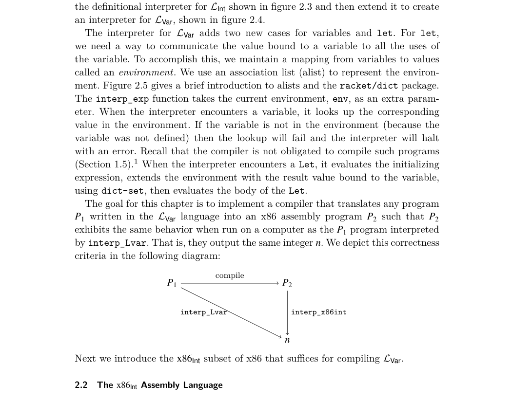
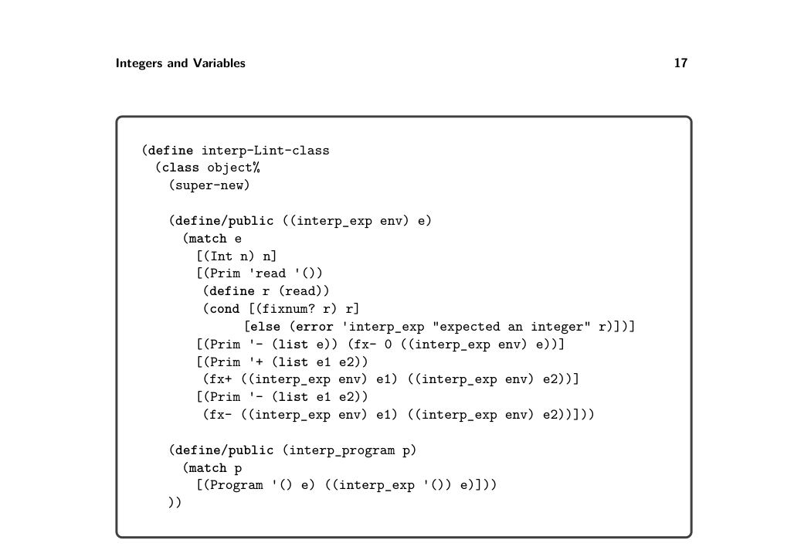
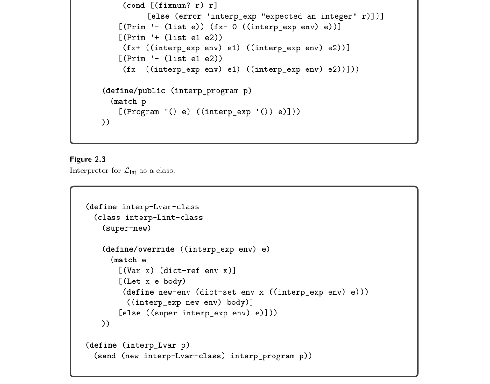
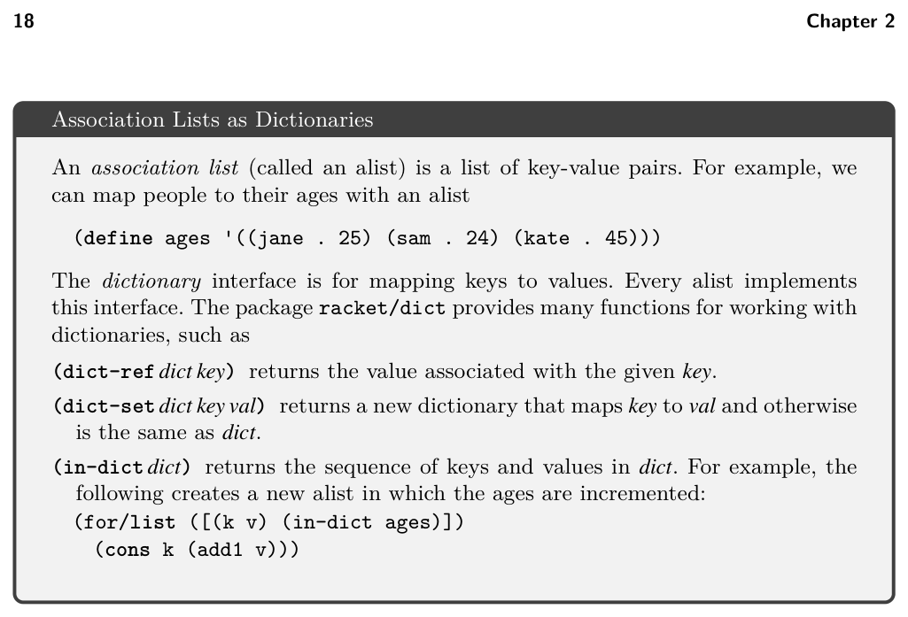
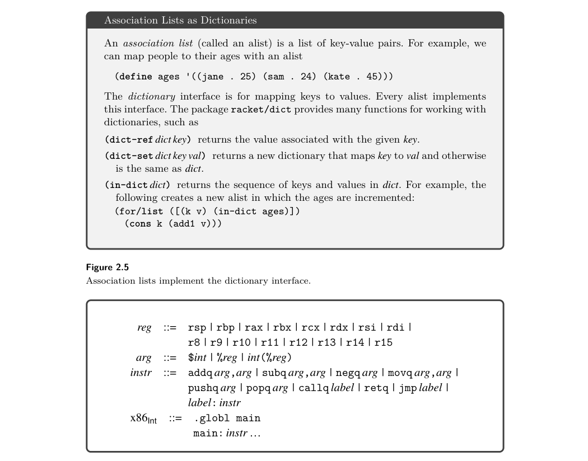
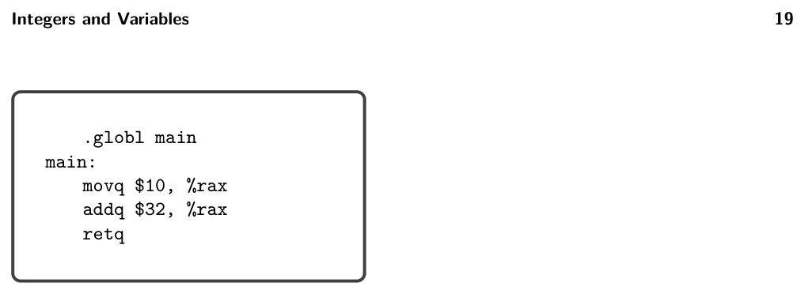
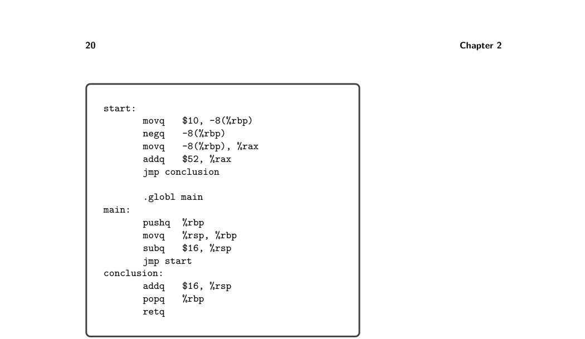
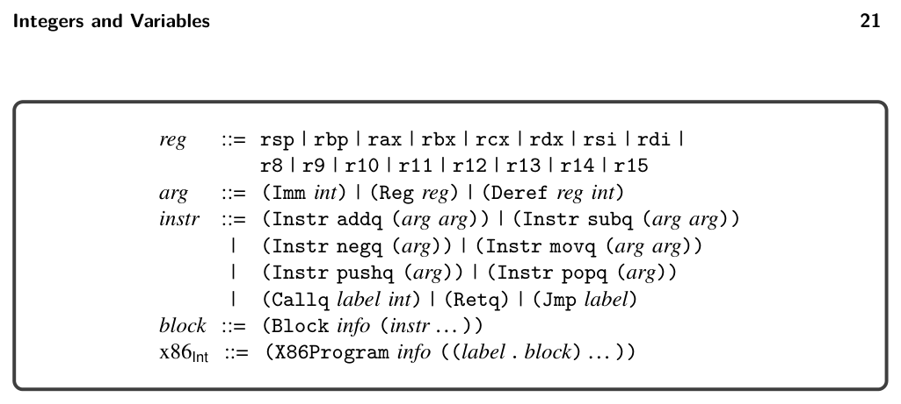

# 2.2 The x86Int Assembly Language

((send (new interp-Lvar-class) interp_exp '()) e0)

To process the - operator, the default case of interp_exp in LVar dispatches to the interp_exp method in LInt. But then for the recursive method call, it dispatches to interp_exp in LVar, where the Var node is handled correctly. Thus, method overriding gives us the open recursion that we need to implement our interpreters in an extensible way.

*Figure 2.6 defines the concrete syntax for x86Int. We use the AT&T syntax expected by the GNU assembler. A program begins with a main label followed by a sequence*

* In Chapter 4 we introduce type checking rules that prohibit access to undefined variables.

*Figure 2.3 Interpreter for LInt as a class.*

*Figure 2.4 Interpreter for the LVar language.*

*Figure 2.5 Association lists implement the dictionary interface.*

*Figure 2.6 The syntax of the x86Int assembly language (AT&T syntax).*

of instructions. The globl directive makes the main procedure externally visible so that the operating system can call it. An x86 program is stored in the computer’s memory. For our purposes, the computer’s memory is a mapping of 64-bit addresses to 64-bit values. The computer has a program counter (PC) stored in the rip register that points to the address of the next instruction to be executed. For most instructions, the program counter is incremented after the instruction is executed so that it points to the next instruction in memory. Most x86 instructions take two operands, each of which is an integer constant (called an immediate value), a register, or a memory location. A register is a special kind of variable that holds a 64-bit value. There are 16 general-purpose registers in the computer; their names are given in figure 2.6. A register is written with a percent sign, %, followed by its name, for example, %rax.

*Figure 2.7 An x86 program that computes (+ 10 32).*

An immediate value is written using the notation $n where n is an integer. An access to memory is specified using the syntax n(%r), which obtains the address stored in register r and then adds n bytes to the address. The resulting address is used to load or to store to memory depending on whether it occurs as a source or destination argument of an instruction. An arithmetic instruction such as addq s, d reads from the source s and des- tination d, applies the arithmetic operation, and then writes the result to the destination d. The move instruction movq s, d reads from s and stores the result in d. The callq label instruction jumps to the procedure specified by the label, and retq returns from a procedure to its caller. We discuss procedure calls in more detail further in this chapter and in chapter 7. The last letter q indicates that these instructions operate on quadwords, which are 64-bit values. The instruction jmp label updates the program counter to the address of the instruction immediately after the specified label. Appendix A.3 contains a reference for all the x86 instructions used in this book. Figure 2.7 depicts an x86 program that computes (+ 10 32). The instruction movq $10, %rax puts 10 into register rax, and then addq $32, %rax adds 32 to the 10 in rax and puts the result, 42, into rax. The last instruction retq finishes the main function by returning the integer in rax to the operating system. The operating system interprets this integer as the program’s exit code. By convention, an exit code of 0 indicates that a program has completed successfully, and all other exit codes indicate various errors. However, in this book we return the result of the program as the exit code. We exhibit the use of memory for storing intermediate results in the next example. Figure 2.8 lists an x86 program that computes (+ 52 (- 10)). This program uses a region of memory called the procedure call stack (stack for short). The stack consists of a separate frame for each procedure call. The memory layout for an individual frame is shown in figure 2.9. The register rsp is called the stack pointer and contains the address of the item at the top of the stack. In general, we use the term pointer for something that contains an address. The stack grows downward in memory, so we increase the size of the stack by subtracting from the stack pointer. In the context of a procedure call, the return address is the location of the instruction that immediately follows the call instruction on the caller side. The function call instruction, callq, pushes the return address onto the stack prior to jumping to

*Figure 2.8 An x86 program that computes (+ 52 (- 10)).*

*Figure 2.9 Memory layout of a frame.*

the procedure. The register rbp is the base pointer and is used to access variables that are stored in the frame of the current procedure call. The base pointer of the caller is stored immediately after the return address. Figure 2.9 shows the memory layout of a frame with storage for n variables, which are numbered from 1 to n. Variable 1 is stored at address −8(%rbp), variable 2 at −16(%rbp), and so on. In the program shown in figure 2.8, consider how control is transferred from the operating system to the main function. The operating system issues a callq main instruction that pushes its return address on the stack and then jumps to main. In x86-64, the stack pointer rsp must be divisible by 16 bytes prior to the execution of any callq instruction, so that when control arrives at main, the rsp is 8 bytes out of alignment (because the callq pushed the return address). The first three instructions are the typical prelude for a procedure. The instruction pushq %rbp first subtracts 8 from the stack pointer rsp and then saves the base pointer of the

*Figure 2.10 The abstract syntax of x86Int assembly.*

caller at address rsp on the stack. The next instruction movq %rsp, %rbp sets the base pointer to the current stack pointer, which is pointing to the location of the old base pointer. The instruction subq $16, %rsp moves the stack pointer down to make enough room for storing variables. This program needs one variable (8 bytes), but we round up to 16 bytes so that rsp is 16-byte-aligned, and then we are ready to make calls to other functions. The last instruction of the prelude is jmp start, which transfers control to the instructions that were generated from the expression (+ 52 (- 10)). The first instruction under the start label is movq $10, -8(%rbp), which stores 10 in variable 1. The instruction negq -8(%rbp) changes the contents of variable 1 to −10. The next instruction moves the −10 from variable 1 into the rax register. Finally, addq $52, %rax adds 52 to the value in rax, updating its contents to 42. The three instructions under the label conclusion are the typical conclusion of a procedure. The first two restore the rsp and rbp registers to their states at the beginning of the procedure. In particular, addq $16, %rsp moves the stack pointer to point to the old base pointer. Then popq %rbp restores the old base pointer to rbp and adds 8 to the stack pointer. The last instruction, retq, jumps back to the procedure that called this one and adds 8 to the stack pointer. Our compiler needs a convenient representation for manipulating x86 programs, so we define an abstract syntax for x86, shown in figure 2.10. We refer to this language as x86Int. The main difference between this and the concrete syntax of x86Int (figure 2.6) is that labels are not allowed in front of every instruction. Instead instructions are grouped into basic blocks with a label associated with every basic block; this is why the X86Program struct includes an alist mapping labels to basic blocks. The reason for this organization becomes apparent in chapter 4 when we introduce conditional branching. The Block structure includes an info field that is not needed in this chapter but becomes useful in chapter 3. For now, the info field should contain an empty list. Regarding the abstract syntax for callq, the Callq AST node includes an integer for representing the arity of the function, that is, the number of arguments, which is helpful to know during register allocation (chapter 3).

