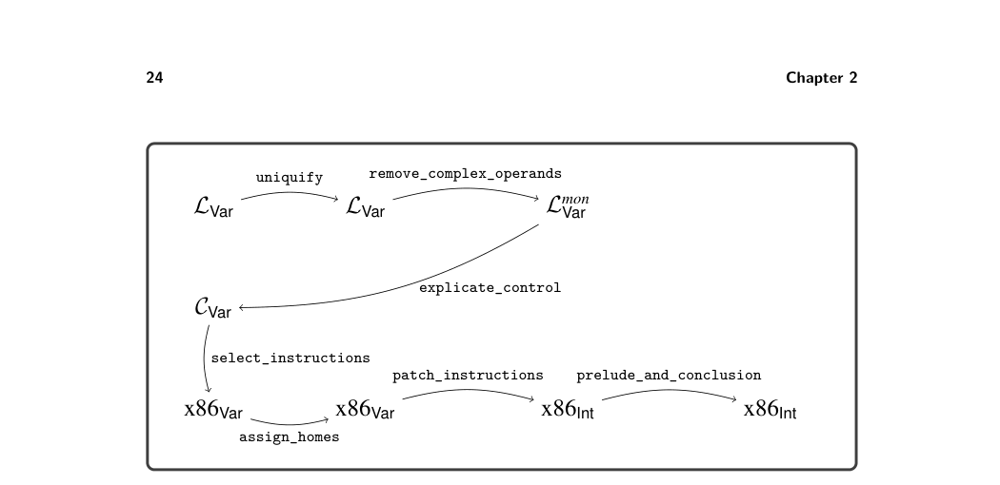

# 2.3 Planning the Trip to x86

2.3 Planning the Trip to x86

To compile one language to another, it helps to focus on the differences between the two languages because the compiler will need to bridge those differences. What are the differences between LVar and x86 assembly? Here are some of the most important ones:

* x86 arithmetic instructions typically have two arguments and update the second
  argument in place. In contrast, LVar arithmetic operations take two arguments
  and produce a new value. An x86 instruction may have at most one memory-
  accessing argument. Furthermore, some x86 instructions place special restrictions
  on their arguments.
* An argument of an LVar operator can be a deeply nested expression, whereas
  x86 instructions restrict their arguments to be integer constants, registers, and
  memory locations.
* The order of execution in x86 is explicit in the syntax, which is a sequence
  of instructions and jumps to labeled positions, whereas in LVar the order of
  evaluation is a left-to-right depth-first traversal of the abstract syntax tree.
* A program in LVar can have any number of variables, whereas x86 has 16 registers
  and the procedure call stack.
* Variables in LVar can shadow other variables with the same name. In x86,
  registers have unique names, and memory locations have unique addresses.

We ease the challenge of compiling from LVar to x86 by breaking down the problem into several steps, which deal with these differences one at a time. Each of these steps is called a pass of the compiler. This term indicates that each step passes over, or traverses, the AST of the program. Furthermore, we follow the nanopass approach, which means that we strive for each pass to accomplish one clear objective rather than two or three at the same time. We begin by sketching how we might implement each pass and give each pass a name. We then figure out an ordering of the passes and the input/output language for each pass. The very first pass has LVar as its input language, and the last pass has x86Int as its output language. In between these two passes, we can choose whichever language is most convenient for expressing the output of each pass, whether that be LVar, x86Int, or a new intermediate language of our own design. Finally, to implement each pass we write one recursive function per nonterminal in the grammar of the input language of the pass. Our compiler for LVar consists of the following passes:

uniquify deals with the shadowing of variables by renaming every variable to a unique name. remove_complex_operands ensures that each subexpression of a primitive opera- tion or function call is a variable or integer, that is, an atomic expression. We refer to nonatomic expressions as complex. This pass introduces temporary variables to hold the results of complex subexpressions.

explicate_control makes the execution order of the program explicit. It converts the abstract syntax tree representation into a graph in which each node is a labeled sequence of statements and the edges are goto statements. select_instructions handles the difference between LVar operations and x86 instructions. This pass converts each LVar operation to a short sequence of instructions that accomplishes the same task. assign_homes replaces variables with registers or stack locations.

Our treatment of remove_complex_operands and explicate_control as separate passes is an example of the nanopass approach.2 The traditional approach is to combine them into a single step (Aho et al. 2006). The next question is, in what order should we apply these passes? This question can be challenging because it is difficult to know ahead of time which orderings will be better (that is, will be easier to implement, produce more efficient code, and so on), and therefore ordering often involves trial and error. Nevertheless, we can plan ahead and make educated choices regarding the ordering. What should be the ordering of explicate_control with respect to uniquify? The uniquify pass should come first because explicate_control changes all the let-bound variables to become local variables whose scope is the entire program, which would confuse variables with the same name. We place remove_complex_operands before explicate_control because the lat- ter removes the let form, but it is convenient to use let in the out- put of remove_complex_operands. The ordering of uniquify with respect to remove_complex_operands does not matter, so we arbitrarily choose uniquify to come first. The select_instructions and assign_homes passes are intertwined. In chap- ter 7 we learn that in x86, registers are used for passing arguments to functions and that it is preferable to assign parameters to their corresponding registers. This suggests that it would be better to start with the select_instructions pass, which generates the instructions for argument passing, before performing register allocation. On the other hand, by selecting instructions first we may run into a dead end in assign_homes. Recall that only one argument of an x86 instruction may be a memory access, but assign_homes might be forced to assign both argu- ments to memory locations. A sophisticated approach is to repeat the two passes until a solution is found. However, to reduce implementation complexity we rec- ommend placing select_instructions first, followed by the assign_homes, and then a third pass named patch_instructions that uses a reserved register to fix outstanding problems. Figure 2.11 presents the ordering of the compiler passes and identifies the input and output language of each pass. The output of the select_instructions pass is the x86Var language, which extends x86Int with an unbounded number of

* For analogous decompositions of the translation into continuation passing style, see the work
  of Lawall and Danvy (1993) and Hatcliff and Danvy (1994).

*Figure 2.11 Diagram of the passes for compiling LVar.*

program-scope variables and removes the restrictions regarding instruction argu- ments. The last pass, prelude_and_conclusion, places the program instructions inside a main function with instructions for the prelude and conclusion. In the next section we discuss the CVar intermediate language that serves as the output of explicate_control. The remainder of this chapter provides guidance on the implementation of each of the compiler passes represented in figure 2.11.

2.3.1 The CVar Intermediate Language The output of explicate_control is similar to the C language (Kernighan and Ritchie 1988) in that it has separate syntactic categories for expressions and state- ments, so we name it CVar. This style of intermediate language is also known as three-address code, to emphasize that the typical form of a statement such as x = (+ y z); involves three addresses: x, y, and z (Aho et al. 2006). The concrete syntax for CVar is shown in figure 2.12, and the abstract syntax for CVar is shown in figure 2.13. The CVar language supports the same operators as LVar but the arguments of operators are restricted to atomic expressions. Instead of let expressions, CVar has assignment statements that can be executed in sequence using the Seq form. A sequence of statements always ends with Return, a guarantee that is baked into the grammar rules for tail. The naming of this nonterminal comes from the term tail position, which refers to an expression that is the last one to execute within a function or program. A CVar program consists of an alist mapping labels to tails. This is more general than necessary for the present chapter, as we do not yet introduce goto for jumping to labels, but it saves us from having to change the syntax in chapter 4. For now there is just one label, start, and the whole program is its tail. The info field of the CProgram form, after the explicate_control pass, contains an alist that associates the symbol locals with a list of all the variables used in the program. At the start

