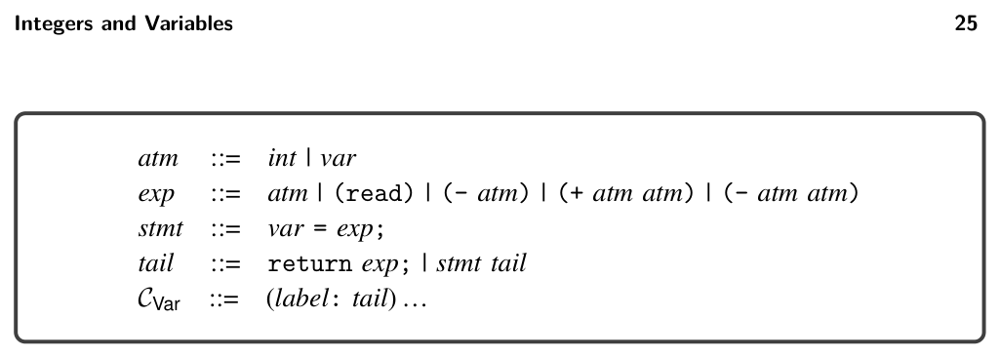
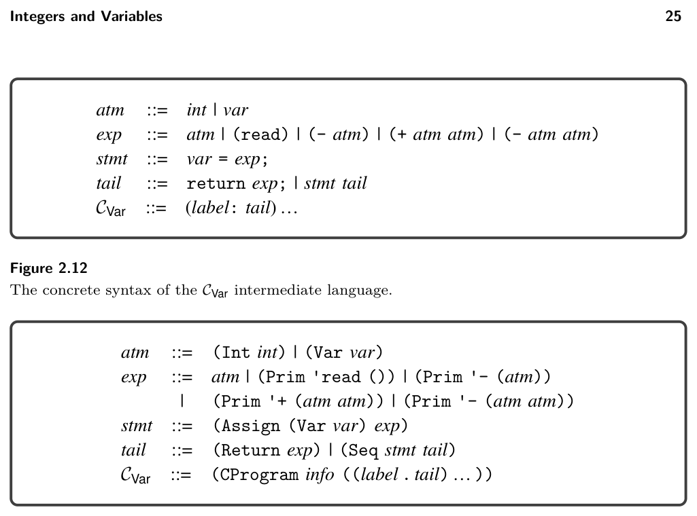
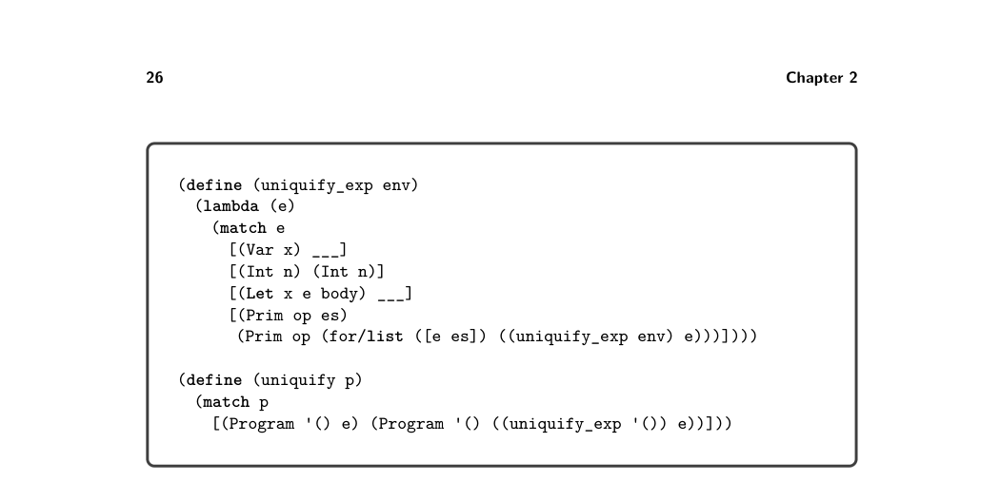

# 2.4 Uniquify Variables


*Figure 2.12*


*Figure 2.13*

of the program, these variables are uninitialized; they become initialized on their first assignment. The definitional interpreter for CVar is in the support code, in the file interp-Cvar.rkt.

2.4 Uniquify Variables

The uniquify pass replaces the variable bound by each let with a unique name. Both the input and output of the uniquify pass is the LVar language. For example, the uniquify pass should translate the program on the left into the program on the right.

(let ([x 32]) (+ (let ([x 10]) x) x)) ⇒ (let ([x.1 32]) (+ (let ([x.2 10]) x.2) x.1))

The following is another example translation, this time of a program with a let nested inside the initializing expression of another let.

```
(let ([x (let ([x 4])
(+ x 1))])
(+ x 2))
```

⇒ (let ([x.2 (let ([x.1 4]) (+ x.1 1))]) (+ x.2 2))

We recommend implementing uniquify by creating a structurally recursive func- tion named uniquify_exp that does little other than copy an expression. However,


*Figure 2.14*

when encountering a let, it should generate a unique name for the variable and associate the old name with the new name in an alist.3 The uniquify_exp function needs to access this alist when it gets to a variable reference, so we add a parameter to uniquify_exp for the alist. The skeleton of the uniquify_exp function is shown in figure 2.14. The for/list form of Racket is useful for transforming the element of a list to produce a new list.

Exercise 2.1 Complete the uniquify pass by filling in the blanks in figure 2.14; that is, implement the cases for variables and for the let form in the file compiler.rkt in the support code.

Exercise 2.2 Create five LVar programs that exercise the most interesting parts of the uniquify pass; that is, the programs should include let forms, variables, and variables that shadow each other. The five programs should be placed in the subdirectory named tests, and the file names should start with var_test_ followed by a unique integer and end with the file extension .rkt. The run-tests.rkt script in the support code checks whether the output programs produce the same result as the input programs. The script uses the interp-tests function (appendix A.2) from utilities.rkt to test your uniquify pass on the example programs. The passes parameter of interp-tests is a list that should have one entry for each pass in your compiler. For now, define passes to contain just one entry for uniquify as follows:

```
(define passes
(list (list "uniquify" uniquify interp_Lvar type-check-Lvar)))
```

Run the run-tests.rkt script in the support code to check whether the output programs produce the same result as the input programs.

* The Racket function gensym is handy for generating unique variable names.

