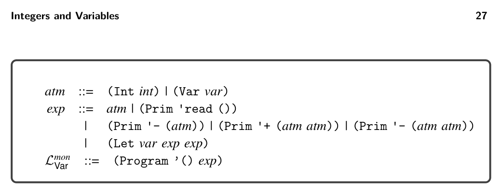
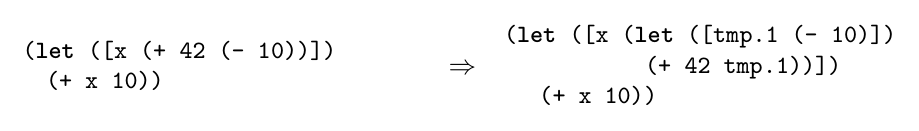

# 2.5 Remove Complex Operands

*Figure 2.15*

2.5 Remove Complex Operands

The remove_complex_operands pass compiles LVar programs into a restricted form in which the arguments of operations are atomic expressions. Put another way, this pass removes complex operands, such as the expression (- 10) in the following program. This is accomplished by introducing a new temporary variable, assigning the complex operand to the new variable, and then using the new variable in place of the complex operand, as shown in the output of remove_complex_operands on the right.

*Figure 2.15*

