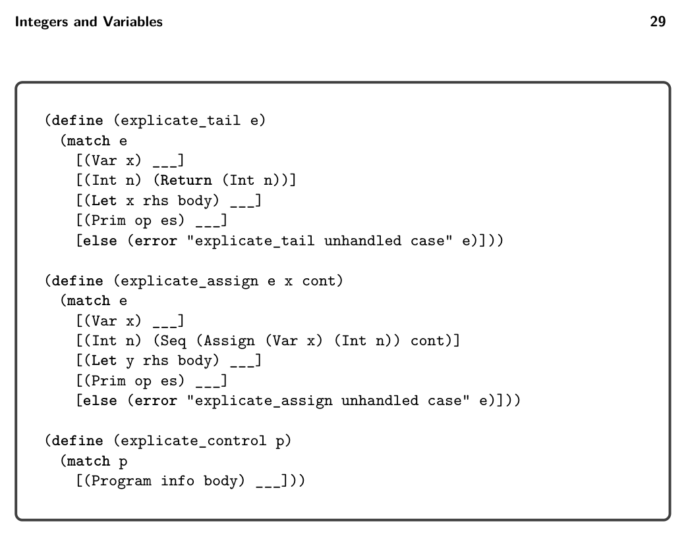

# 2.6 Explicate Control

to become atomic and to apply rco_exp to subexpressions that do not. Both func- tions take an LVar expression as input. The rco_exp function returns an expression. The rco_atom function returns two things: an atomic expression and an alist map- ping temporary variables to complex subexpressions. You can return multiple things from a function using Racket’s values form, and you can receive multiple things from a function call using the define-values form. In the example program with the expression (+ 42 (- 10)), the subexpression (- 10) should be processed using the rco_atom function because it is an argument of the + operator and therefore needs to become atomic. The output of rco_atom applied to (- 10) is as follows:

(- 10) ⇒ tmp.1 ((tmp.1 . (- 10)))

Take special care of programs, such as the following, that bind a variable to an atomic expression. You should leave such variable bindings unchanged, as shown in the program on the right:

```
(let ([a 42])
(let ([b a])
b))
```

⇒ (let ([a 42]) (let ([b a]) b))

A careless implementation might produce the following output with unnecessary temporary variables.

```
(let ([tmp.1 42])
(let ([a tmp.1])
(let ([tmp.2 a])
(let ([b tmp.2])
b))))
```

Exercise 2.3 Implement the remove_complex_operands function in compiler.rkt. Create three new LVar programs that exercise the interesting code in the remove_complex_operands pass. Follow the guidelines regarding file names described in exercise 2.2. In the run-tests.rkt script, add the following entry to the list of passes, and then run the script to test your compiler.

(list "remove-complex" remove_complex_operands interp_Lvar type-check-Lvar)

In debugging your compiler, it is often useful to see the intermediate programs that are output from each pass. To print the intermediate programs, place (debug-level 1) before the call to interp-tests in run-tests.rkt.

2.6 Explicate Control

The explicate_control pass compiles Lmon Var programs into CVar programs that make the order of execution explicit in their syntax. For now this amounts to flattening


*Figure 2.16*

let constructs into a sequence of assignment statements. For example, consider the following LVar program:

```
(let ([y (let ([x 20])
(+ x (let ([x 22]) x)))])
y)
```

The output of the previous pass is shown next, on the left, and the output of explicate_control is on the right. Recall that the right-hand side of a let executes before its body, so that the order of evaluation for this program is to assign 20 to x.1, 22 to x.2, and (+ x.1 x.2) to y, and then to return y. Indeed, the output of explicate_control makes this ordering explicit.

```
start:
x.1 = 20;
x.2 = 22;
y = (+ x.1 x.2);
return y;
```

```
(let ([y (let ([x.1 20])
(let ([x.2 22])
(+ x.1 x.2)))])
y)
```

⇒

The organization of this pass depends on the notion of tail position to which we have alluded. Here is the definition.

Definition 2.1 The following rules define when an expression is in tail position for the language LVar.

* In (Program () e), expression e is in tail position.

