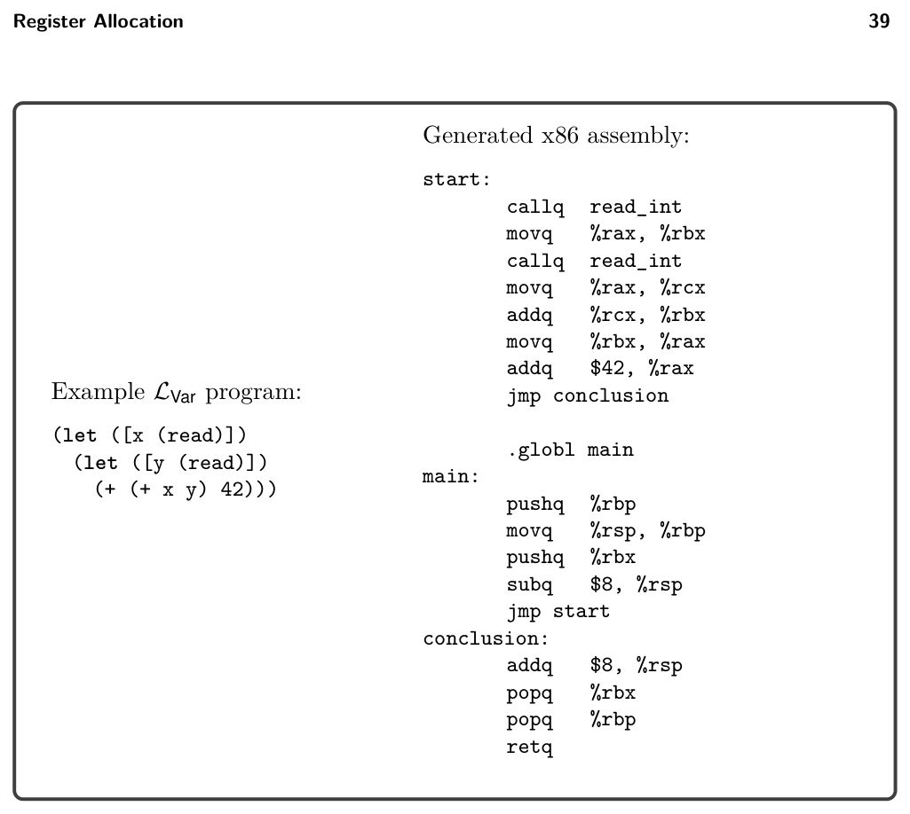
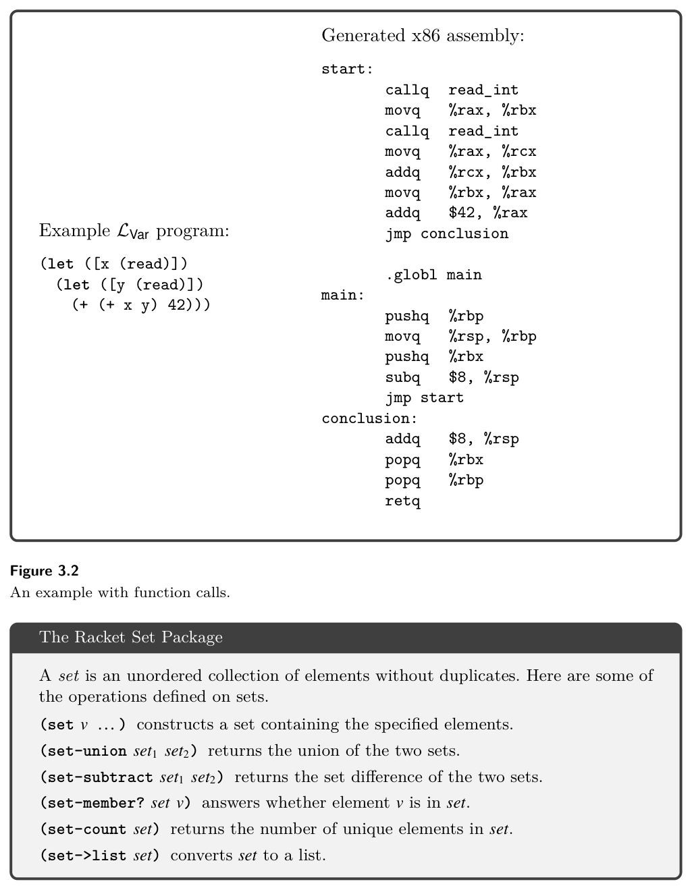
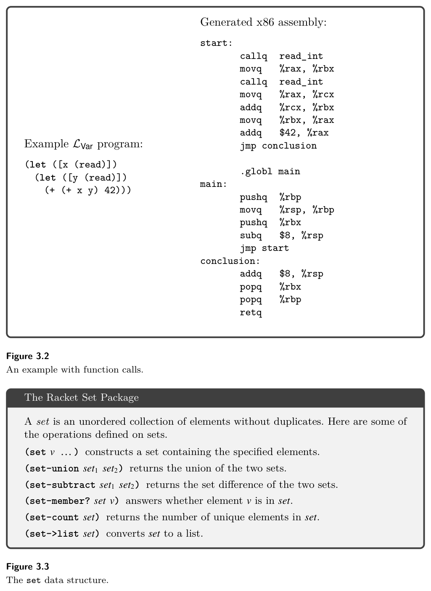
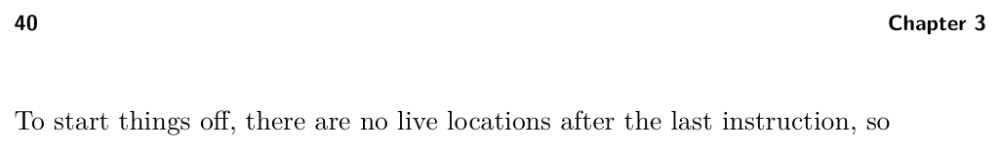
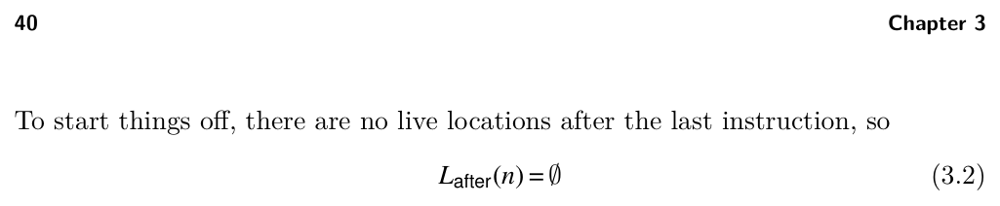
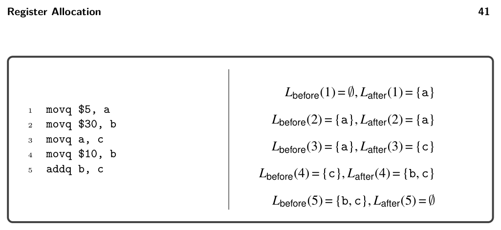
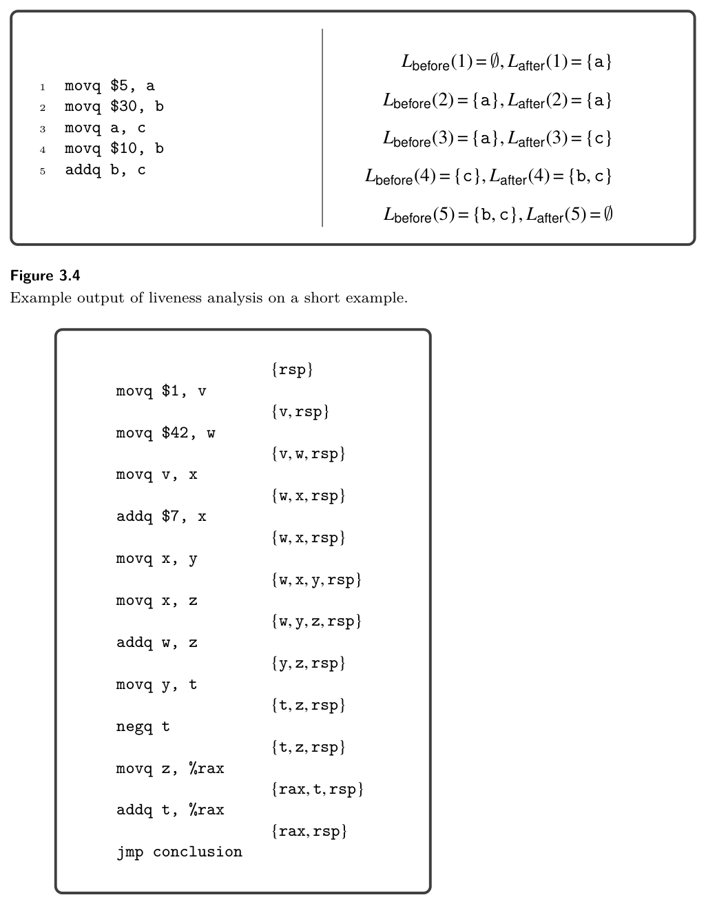
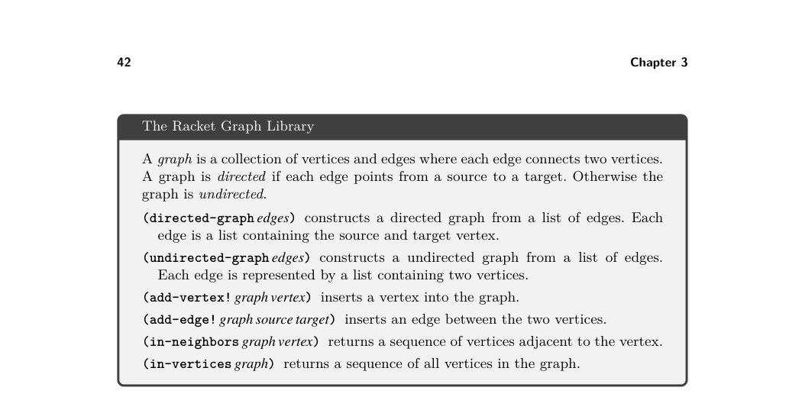

# 3 Register Allocation

3

Register Allocation

In chapter 2 we learned how to compile LVar to x86, storing variables on the pro- cedure call stack. The CPU may require tens to hundreds of cycles to access a location on the stack, whereas accessing a register takes only a single cycle. In this chapter we improve the efficiency of our generated code by storing some variables in registers. The goal of register allocation is to fit as many variables into registers as possible. Some programs have more variables than registers, so we cannot always map each variable to a different register. Fortunately, it is common for different variables to be in use during different periods of time during program execution, and in those cases we can map multiple variables to the same register. The program shown in figure 3.1 serves as a running example. The source program is on the left and the output of instruction selection is on the right. The program is almost completely in the x86 assembly language, but it still uses variables. Consider variables x and z. After the variable x has been moved to z, it is no longer in use. Variable z, on the other hand, is used only after this point, so x and z could share the same register. The topic of section 3.2 is how to compute where a variable is in use. Once we have that information, we compute which variables are in use at the same time, that is, which ones interfere with each other, and represent this relation as an undirected graph whose vertices are variables and edges indicate when two variables interfere (section 3.3). We then model register allocation as a graph coloring problem (section 3.4). If we run out of registers despite these efforts, we place the remaining variables on the stack, similarly to how we handled variables in chapter 2. It is common to use the verb spill for assigning a variable to a stack location. The decision to spill a variable is handled as part of the graph coloring process. We make the simplifying assumption that each variable is assigned to one location (a register or stack address). A more sophisticated approach is to assign a variable to one or more locations in different regions of the program. For example, if a variable is used many times in short sequence and then used again only after many other instructions, it could be more efficient to assign the variable to a register during the initial sequence and then move it to the stack for the rest of its lifetime. We refer the interested reader to Cooper and Torczon (2011) (chapter 13) for more information about that approach.


*Figure 3.1*

## 3.1 Registers and Calling Conventions

As we perform register allocation, we must be aware of the calling conventions that govern how function calls are performed in x86. Even though LVar does not include programmer-defined functions, our generated code includes a main function that is called by the operating system and our generated code contains calls to the read_int function. Function calls require coordination between two pieces of code that may be writ- ten by different programmers or generated by different compilers. Here we follow the System V calling conventions that are used by the GNU C compiler on Linux and MacOS (Bryant and O’Hallaron 2005; Matz et al. 2013). The calling conven- tions include rules about how functions share the use of registers. In particular, the caller is responsible for freeing some registers prior to the function call for use by the callee. These are called the caller-saved registers and they are

rax rcx rdx rsi rdi r8 r9 r10 r11

On the other hand, the callee is responsible for preserving the values of the callee- saved registers, which are

rsp rbp rbx r12 r13 r14 r15

We can think about this caller/callee convention from two points of view, the caller view and the callee view, as follows:

* The caller should assume that all the caller-saved registers get overwritten with
  arbitrary values by the callee. On the other hand, the caller can safely assume
  that all the callee-saved registers retain their original values.

* The callee can freely use any of the caller-saved registers. However, if the callee
  wants to use a callee-saved register, the callee must arrange to put the orig-
  inal value back in the register prior to returning to the caller. This can be
  accomplished by saving the value to the stack in the prelude of the function
  and restoring the value in the conclusion of the function.

In x86, registers are also used for passing arguments to a function and for the return value. In particular, the first six arguments of a function are passed in the following six registers, in this order.

rdi rsi rdx rcx r8 r9

We refer to these six registers are the argument-passing registers . If there are more than six arguments, the convention is to use space on the frame of the caller for the rest of the arguments. In chapter 7, we instead pass a tuple containing the sixth argument and the rest of the arguments, which simplifies the treatment of efficient tail calls. For now, the only function we care about is read_int, which takes zero arguments. The register rax is used for the return value of a function. The next question is how these calling conventions impact register allocation. Consider the LVar program presented in figure 3.2. We first analyze this example from the caller point of view and then from the callee point of view. We refer to a variable that is in use during a function call as a call-live variable. The program makes two calls to read. The variable x is call-live because it is in use during the second call to read; we must ensure that the value in x does not get overwritten during the call to read. One obvious approach is to save all the values that reside in caller-saved registers to the stack prior to each function call and to restore them after each call. That way, if the register allocator chooses to assign x to a caller-saved register, its value will be preserved across the call to read. However, saving and restoring to the stack is relatively slow. If x is not used many times, it may be better to assign x to a stack location in the first place. Or better yet, if we can arrange for x to be placed in a callee-saved register, then it won’t need to be saved and restored during function calls. We recommend an approach that captures these issues in the interference graph, without complicating the graph coloring algorithm. During liveness analysis we know which variables are call-live because we compute which variables are in use at every instruction (section 3.2). When we build the interference graph (section 3.3), we can place an edge in the interference graph between each call-live variable and the caller-saved registers. This will prevent the graph coloring algorithm from assigning call-live variables to caller-saved registers. On the other hand, for variables that are not call-live, we prefer placing them in caller-saved registers to leave more room for call-live variables in the callee-saved registers. This can also be implemented without complicating the graph coloring algorithm. We recommend that the graph coloring algorithm assign variables to

natural numbers, choosing the lowest number for which there is no interference. After the coloring is complete, we map the numbers to registers and stack locations: mapping the lowest numbers to caller-saved registers, the next lowest to callee- saved registers, and the largest numbers to stack locations. This ordering gives preference to registers over stack locations and to caller-saved registers over callee- saved registers. Returning to the example in figure 3.2, let us analyze the generated x86 code on the right-hand side. Variable x is assigned to rbx, a callee-saved register. Thus, it is already in a safe place during the second call to read_int. Next, variable y is assigned to rcx, a caller-saved register, because y is not a call-live variable. We have completed the analysis from the caller point of view, so now we switch to the callee point of view, focusing on the prelude and conclusion of the main function. As usual, the prelude begins with saving the rbp register to the stack and setting the rbp to the current stack pointer. We now know why it is necessary to save the rbp: it is a callee-saved register. The prelude then pushes rbx to the stack because (1) rbx is a callee-saved register and (2) rbx is assigned to a variable (x). The other callee-saved registers are not saved in the prelude because they are not used. The prelude subtracts 8 bytes from the rsp to make it 16-byte aligned. Shifting attention to the conclusion, we see that rbx is restored from the stack with a popq instruction.

## 3.2 Liveness Analysis

The uncover_live pass performs liveness analysis; that is, it discovers which vari- ables are in use in different regions of a program. A variable or register is live at a program point if its current value is used at some later point in the program. We refer to variables, stack locations, and registers collectively as locations. Consider the following code fragment in which there are two writes to b. Are variables a and b both live at the same time?

1 movq $5, a

2 movq $30, b

3 movq a, c

4 movq $10, b

5 addq b, c

The answer is no, because a is live from line 1 to 3 and b is live from line 4 to 5. The integer written to b on line 2 is never used because it is overwritten (line 4) before the next read (line 5). The live locations for each instruction can be computed by traversing the instruc- tion sequence back to front (i.e., backward in execution order). Let I1, … , In be the instruction sequence. We write Lafter(k) for the set of live locations after instruc- tion Ik and write Lbefore(k) for the set of live locations before instruction Ik. We recommend representing these sets with the Racket set data structure described in figure 3.3.


*Figure 3.2*


*Figure 3.3*

The locations that are live after an instruction are its live-after set, and the locations that are live before an instruction are its live-before set. The live-after set of an instruction is always the same as the live-before set of the next instruction.


*(3.1)*


*(3.2)*


*(3.3)*

where W(k) are the locations written to by instruction Ik, and R(k) are the locations read by instruction Ik. There is a special case for jmp instructions. The locations that are live before a jmp should be the locations in Lbefore at the target of the jump. So, we recommend maintaining an alist named label->live that maps each label to the Lbefore for the first instruction in its block. For now the only jmp in a x86Var program is the jump to the conclusion. (For example, see figure 3.1.) The conclusion reads from rax and rsp, so the alist should map conclusion to the set {rax, rsp}. Let us walk through the previous example, applying these formulas starting with the instruction on line 5 of the code fragment. We collect the answers in figure 3.4. The Lafter for the addq b, c instruction is ∅because it is the last instruction (for- mula (3.2)). The Lbefore for this instruction is {b, c} because it reads from variables b and c (formula (3.3)):

Lbefore(5) = (∅−{c}) ∪{b, c} = {b, c}

Moving on the the instruction movq $10, b at line 4, we copy the live-before set from line 5 to be the live-after set for this instruction (formula (3.1)).

Lafter(4) = {b, c}

This move instruction writes to b and does not read from any variables, so we have the following live-before set (formula (3.3)).

Lbefore(4) = ({b, c} −{b}) ∪∅= {c}

The live-before for instruction movq a, c is {a} because it writes to {c} and reads from {a} (formula (3.3)). The live-before for movq $30, b is {a} because it writes to a variable that is not live and does not read from a variable. Finally, the live-before for movq $5, a is ∅because it writes to variable a.

Exercise 3.1 Perform liveness analysis by hand on the running example in figure 3.1, computing the live-before and live-after sets for each instruction. Compare your answers to the solution shown in figure 3.5.

Exercise 3.2 Implement the uncover_live pass. Store the sequence of live-after sets in the info field of the Block structure. We recommend creating an auxil- iary function that takes a list of instructions and an initial live-after set (typically empty) and returns the list of live-after sets. We recommend creating auxiliary functions to (1) compute the set of locations that appear in an arg, (2) compute the locations read by an instruction (the R function), and (3) the locations written


*Figure 3.4*


*Figure 3.5*

by an instruction (the W function). The callq instruction should include all the caller-saved registers in its write set W because the calling convention says that those registers may be written to during the function call. Likewise, the callq instruction should include the appropriate argument-passing registers in its read


*Figure 3.6*

set R, depending on the arity of the function being called. (This is why the abstract syntax for callq includes the arity.)

## 3.3 Build the Interference Graph

On the basis of the liveness analysis, we know where each location is live. However, during register allocation, we need to answer questions of the specific form: are locations u and v live at the same time? (If so, they cannot be assigned to the same register.) To make this question more efficient to answer, we create an explicit data structure, an interference graph. An interference graph is an undirected graph that has a node for every variable and register and has an edge between two nodes if they are live at the same time, that is, if they interfere with each other. We recommend using the Racket graph package (figure 3.6) to represent the interference graph. A straightforward way to compute the interference graph is to look at the set of live locations between each instruction and add an edge to the graph for every pair of variables in the same set. This approach is less than ideal for two reasons. First, it can be expensive because it takes O(n2) time to consider every pair in a set of n live locations. Second, in the special case in which two locations hold the same value (because one was assigned to the other), they can be live at the same time without interfering with each other. A better way to compute the interference graph is to focus on writes (Appel and Palsberg 2003). The writes performed by an instruction must not overwrite something in a live location. So for each instruction, we create an edge between the locations being written to and the live locations. (However, a location never interferes with itself.) For the callq instruction, we consider all the caller-saved registers to have been written to, so an edge is added between every live variable and every caller-saved register. Also, for movq there is the special case of two variables holding the same value. If a live variable v is the same as the source of the movq,


*Figure 3.7*

then there is no need to add an edge between v and the destination, because they both hold the same value. Hence we have the following two rules:

* If instruction Ik is a move instruction of the form movq s, d, then for every
  v ∈Lafter(k), if v ̸= d and v ̸= s, add the edge (d, v).
* For any other instruction Ik, for every d ∈W(k) and every v ∈Lafter(k), if v ̸= d, add
  the edge (d, v).

Working from the top to bottom of figure 3.5, we apply these rules to each instruc- tion. We highlight a few of the instructions. The first instruction is movq $1, v, and the live-after set is {v, rsp}. Rule 1 applies, so v interferes with rsp. The fourth instruction is addq $7, x, and the live-after set is {w, x, rsp}. Rule 2 applies, so x interferes with w and rsp. The next instruction is movq x, y, and the live-after set is {w, x, y, rsp}. Rule 1 applies, so y interferes with w and rsp but not x, because x is the source of the move and therefore x and y hold the same value. Figure 3.7 lists the interference results for all the instructions, and the resulting interference graph is shown in figure 3.8. We elide the register nodes from the interference graph in figure 3.8 because there were no interference edges involving registers and we did not wish to clutter the graph, but in general one needs to include all the registers in the interference graph.

Exercise 3.3 Implement the compiler pass named build_interference according to the algorithm suggested here. We recommend using the Racket graph package to create and inspect the interference graph. The output graph of this pass should be stored in the info field of the program, under the key conflicts.

## 3.4 Graph Coloring via Sudoku

We come to the main event discussed in this chapter, mapping variables to registers and stack locations. Variables that interfere with each other must be mapped to


*Figure 3.8*

different locations. In terms of the interference graph, this means that adjacent vertices must be mapped to different locations. If we think of locations as colors, the register allocation problem becomes the graph coloring problem (Balakrishnan 1996; Rosen 2002). The reader may be more familiar with the graph coloring problem than he or she realizes; the popular game of sudoku is an instance of the graph coloring problem. The following describes how to build a graph out of an initial sudoku board.

* There is one vertex in the graph for each sudoku square.

* There is an edge between two vertices if the corresponding squares are in the
  same row, in the same column, or in the same 3 × 3 region.

* Choose nine colors to correspond to the numbers 1 to 9.

* On the basis of the initial assignment of numbers to squares on the sudoku board,
  assign the corresponding colors to the corresponding vertices in the graph.

If you can color the remaining vertices in the graph with the nine colors, then you have also solved the corresponding game of sudoku. Figure 3.9 shows an initial sudoku game board and the corresponding graph with colored vertices. Here we use a monochrome representation of colors, mapping the sudoku number 1 to black, 2 to white, and 3 to gray. We show edges for only a sampling of the vertices (the colored ones) because showing edges for all the vertices would make the graph unreadable. Some techniques for playing sudoku correspond to heuristics used in graph color- ing algorithms. For example, one of the basic techniques for sudoku is called Pencil Marks. The idea is to use a process of elimination to determine what numbers are no longer available for a square and to write those numbers in the square (writing very small). For example, if the number 1 is assigned to a square, then write the pencil mark 1 in all the squares in the same row, column, and region to indicate that 1 is no longer an option for those other squares. The Pencil Marks technique corresponds to the notion of saturation due to Brélaz (1979). The saturation of a vertex, in sudoku terms, is the set of numbers that are no longer available. In graph terminology, we have the following definition:

saturation(u) = {c | ∃v.v ∈adjacent(u) and color(v) = c}


*Figure 3.9*

where adjacent(u) is the set of vertices that share an edge with u. The Pencil Marks technique leads to a simple strategy for filling in numbers: if there is a square with only one possible number left, then choose that number! But what if there are no squares with only one possibility left? One brute-force approach is to try them all: choose the first one, and if that ultimately leads to a solution, great. If not, backtrack and choose the next possibility. One good thing about Pencil Marks is that it reduces the degree of branching in the search tree. Nevertheless, backtracking can be terribly time consuming. One way to reduce the amount of backtracking is to use the most-constrained-first heuristic (aka minimum remaining values) (Russell and Norvig 2003). That is, in choosing a square, always choose one with the fewest possibilities left (the vertex with the highest saturation). The idea is that choosing highly constrained squares earlier rather than later is better, because later on there may not be any possibilities left in the highly saturated squares. However, register allocation is easier than sudoku, because the register alloca- tor can fall back to assigning variables to stack locations when the registers run out. Thus, it makes sense to replace backtracking with greedy search: make the best choice at the time and keep going. We still wish to minimize the number of colors needed, so we use the most-constrained-first heuristic in the greedy search. Figure 3.10 gives the pseudocode for a simple greedy algorithm for register allo- cation based on saturation and the most-constrained-first heuristic. It is roughly equivalent to the DSATUR graph coloring algorithm (Brélaz 1979). Just as in sudoku, the algorithm represents colors with integers. The integers 0 through k −1 correspond to the k registers that we use for register allocation. In particular, we recommend the following correspondence, with k = 11.

```
0: rcx, 1: rdx, 2: rsi, 3: rdi, 4: r8, 5: r9,
6: r10, 7: rbx, 8: r12, 9: r13, 10: r14
```


*Figure 3.10*

The integers k and larger correspond to stack locations. The registers that are not used for register allocation, such as rax, are assigned to negative integers. In particular, we recommend the following correspondence.

-1: rax, -2: rsp, -3: rbp, -4: r11, -5: r15

With the DSATUR algorithm in hand, let us return to the running example and consider how to color the interference graph shown in figure 3.8. We start by assigning each register node to its own color. For example, rax is assigned the color −1, rsp is assign −2, rcx is assigned 0, and rdx is assigned 1. (To reduce clutter in the interference graph, we elide nodes that do not have interference edges, such as rcx.) The variables are not yet colored, so they are annotated with a dash. We then update the saturation for vertices that are adjacent to a register, obtaining the following annotated graph. For example, the saturation for t is {−1, −2} because it interferes with both rax and rsp.

rsp : −2, {−1} t : −, {−1, −2} z : −, {−2} x : −, {−2}

y : −, {−2} w : −, {−2} v : −, {−2}

rax : −1, {−2}

The algorithm says to select a maximally saturated vertex. So, we pick t and color it with the first available integer, which is 0. We mark 0 as no longer available for

z, rax, and rsp because they interfere with t.

rsp : −2, {−1, 0} t : 0, {−1, −2} z : −, {0, −2} x : −, {−2}

y : −, {−2} w : −, {−2} v : −, {−2}

rax : −1, {0, −2}

We repeat the process, selecting a maximally saturated vertex, choosing z, and coloring it with the first available number, which is 1. We add 1 to the saturation for the neighboring vertices t, y, w, and rsp.

rsp : −2, {−1, 0, 1} t : 0, {−1, 1, −2} z : 1, {0, −2} x : −, {−2}

y : −, {1, −2} w : −, {1, −2} v : −, {−2}

rax : −1, {0, −2}

The most saturated vertices are now w and y. We color w with the first available color, which is 0.

rsp : −2, {−1, 0, 1} t : 0, {−1, 1, −2} z : 1, {0, −2} x : −, {0, −2}

y : −, {0, 1, −2} w : 0, {1, −2} v : −, {0, −2}

rax : −1, {0, −2}

Vertex y is now the most highly saturated, so we color y with 2. We cannot choose 0 or 1 because those numbers are in y’s saturation set. Indeed, y interferes with w and z, whose colors are 0 and 1 respectively.

rsp : −2, {−1, 0, 1, 2} t : 0, {−1, 1, −2} z : 1, {0, 2, −2} x : −, {0, −2}

y : 2, {0, 1, −2} w : 0, {1, 2, −2} v : −, {0, −2}

rax : −1, {0, −2}

Now x and v are the most saturated, so we color v with 1.

rsp : −2, {−1, 0, 1, 2} t : 0, {−1, 1, −2} z : 1, {0, 2, −2} x : −, {0, −2}

y : 2, {0, 1, −2} w : 0, {1, 2, −2} v : 1, {0, −2}

rax : −1, {0, −2}


*Figure 3.11*

In the last step of the algorithm, we color x with 1.

rsp : −2, {−1, 0, 1, 2} t : 0, {−1, 1, −2} z : 1, {0, 2, −2} x : 1, {0, −2}

y : 2, {0, 1, −2} w : 0, {1, 2, −2} v : 1, {0, −2}

rax : −1, {0, −2}

So, we obtain the following coloring:

{rax 7→−1, rsp 7→−2, t 7→0, z 7→1, x 7→1, y 7→2, w 7→0, v 7→1}

We recommend creating an auxiliary function named color_graph that takes an interference graph and a list of all the variables in the program. This function should return a mapping of variables to their colors (represented as natural numbers). By creating this helper function, you will be able to reuse it in chapter 7 when we add support for functions. To prioritize the processing of highly saturated nodes inside the color_graph function, we recommend using the priority queue data structure described in figure 3.11. In addition, you will need to maintain a mapping from variables to their handles in the priority queue so that you can notify the priority queue when their saturation changes. With the coloring complete, we finalize the assignment of variables to registers and stack locations. We map the first k colors to the k registers and the rest of the colors to stack locations. Suppose for the moment that we have just one register to

use for register allocation, rcx. Then we have the following assignment.

{0 7→%rcx, 1 7→-8(%rbp), 2 7→-16(%rbp)}

Composing this mapping with the coloring, we arrive at the following assignment of variables to locations.

{v 7→-8(%rbp), w 7→%rcx, x 7→-8(%rbp), y 7→-16(%rbp),

z 7→-8(%rbp), t 7→%rcx}

Adapt the code from the assign_homes pass (section 2.8) to replace the variables with their assigned location. Applying this assignment to our running example shown next, on the left, yields the program on the right.

```
movq $1, -8(%rbp)
movq $42, %rcx
movq -8(%rbp), -8(%rbp)
addq $7, -8(%rbp)
movq -8(%rbp), -16(%rbp)
movq -8(%rbp), -8(%rbp)
addq %rcx, -8(%rbp)
movq -16(%rbp), %rcx
negq %rcx
movq -8(%rbp), %rax
addq %rcx, %rax
jmp conclusion
```

```
movq $1, v
movq $42, w
movq v, x
addq $7, x
movq x, y
movq x, z
addq w, z
movq y, t
negq t
movq z, %rax
addq t, %rax
jmp conclusion
```

⇒

Exercise 3.4 Implement the allocate_registers pass. Create five programs that exercise all aspects of the register allocation algorithm, including spilling variables to the stack. Replace assign_homes in the list of passes in the run-tests.rkt script with the three new passes: uncover_live, build_interference, and allocate_registers. Temporarily remove the call to compiler-tests. Run the script to test the register allocator.

## 3.5 Patch Instructions

The remaining step in the compilation to x86 is to ensure that the instructions have at most one argument that is a memory access. In the running example, the instruc- tion movq -8(%rbp), -16(%rbp) is problematic. Recall from section 2.9 that the fix is to first move -8(%rbp) into rax and then move rax into -16(%rbp). The moves from -8(%rbp) to -8(%rbp) are also problematic, but they can simply be deleted. In general, we recommend deleting all the trivial moves whose source and destina- tion are the same location. The following is the output of patch_instructions on the running example.

```
movq $1, -8(%rbp)
movq $42, %rcx
movq -8(%rbp), -8(%rbp)
addq $7, -8(%rbp)
movq -8(%rbp), -16(%rbp)
movq -8(%rbp), -8(%rbp)
addq %rcx, -8(%rbp)
movq -16(%rbp), %rcx
negq %rcx
movq -8(%rbp), %rax
addq %rcx, %rax
jmp conclusion
```

```
movq $1, -8(%rbp)
movq $42, %rcx
addq $7, -8(%rbp)
movq -8(%rbp), %rax
movq %rax, -16(%rbp)
addq %rcx, -8(%rbp)
movq -16(%rbp), %rcx
negq %rcx
movq -8(%rbp), %rax
addq %rcx, %rax
jmp conclusion
```

⇒

Exercise 3.5 Update the patch_instructions compiler pass to delete trivial moves. Run the script to test the patch_instructions pass.

## 3.6 Generate Prelude and Conclusion

Recall that this pass generates the prelude and conclusion instructions to satisfy the x86 calling conventions (section 3.1). With the addition of the register allocator, the callee-saved registers used by the register allocator must be saved in the prelude and restored in the conclusion. In the allocate_registers pass, add an entry to the info of X86Program named used_callee that stores the set of callee-saved registers that were assigned to variables. The prelude_and_conclusion pass can then access this information to decide which callee-saved registers need to be saved and restored. When calculating the amount to adjust the rsp in the prelude, make sure to take into account the space used for saving the callee-saved registers. Also, remember that the frame needs to be a multiple of 16 bytes! We recommend using the following equation for the amount A to subtract from the rsp. Let S be the number of stack locations used by spilled variables1 and C be the number of callee- saved registers that were allocated to variables. The align function rounds a number up to the nearest 16 bytes.

A = align(8S + 8C) −8C

The reason we subtract 8C in this equation is that the prelude uses pushq to save each of the callee-saved registers, and pushq subtracts 8 from the rsp. An overview of all the passes involved in register allocation is shown in figure 3.12. Figure 3.13 shows the x86 code generated for the running example (figure 3.1). To demonstrate both the use of registers and the stack, we limit the register allocator for this example to use just two registers: rcx (color 0) and rbx (color 1). In the prelude of the main function, we push rbx onto the stack because it is a callee-saved register and it was assigned to a variable by the register allocator. We subtract 8

* Sometimes two or more spilled variables are assigned to the same stack location, so S can be
  less than the number of spilled variables.


*Figure 3.12*

from the rsp at the end of the prelude to reserve space for the one spilled variable. After that subtraction, the rsp is aligned to 16 bytes. Moving on to the program proper, we see how the registers were allocated. Vari- ables v, x, and z were assigned to rbx, and variables w and t was assigned to rcx. Variable y was spilled to the stack location -16(%rbp). Recall that the prelude saved the callee-save register rbx onto the stack. The spilled variables must be placed lower on the stack than the saved callee-save registers, so in this case y is placed at -16(%rbp). In the conclusion, we undo the work that was done in the prelude. We move the stack pointer up by 8 bytes (the room for spilled variables), then pop the old values of rbx and rbp (callee-saved registers), and finish with retq to return control to the operating system.

Exercise 3.6 Update the prelude_and_conclusion pass as described in this section. In the run-tests.rkt script, add prelude_and_conclusion to the list of passes and the call to compiler-tests. Run the script to test the complete compiler for LVar that performs register allocation.

## 3.7 Challenge: Move Biasing

This section describes an enhancement to the register allocator, called move biasing, for students who are looking for an extra challenge. To motivate the need for move biasing we return to the running example, but this time we use all the general purpose registers. So, we have the following mapping of


*Figure 3.13*

color numbers to registers.

{0 7→%rcx, 1 7→%rdx, 2 7→%rsi, … }

Using the same assignment of variables to color numbers that was produced by the register allocator described in the last section, we get the following program.

```
movq $1, v
movq $42, w
movq v, x
addq $7, x
movq x, y
movq x, z
addq w, z
movq y, t
negq t
movq z, %rax
addq t, %rax
jmp conclusion
```

```
movq $1, %rdx
movq $42, %rcx
movq %rdx, %rdx
addq $7, %rdx
movq %rdx, %rsi
movq %rdx, %rdx
addq %rcx, %rdx
movq %rsi, %rcx
negq %rcx
movq %rdx, %rax
addq %rcx, %rax
jmp conclusion
```

⇒

In this output code there are two movq instructions that can be removed because their source and target are the same. However, if we had put t, v, x, and y into the same register, we could instead remove three movq instructions. We can accomplish this by taking into account which variables appear in movq instructions with which other variables. We say that two variables p and q are move related if they participate together in a movq instruction, that is, movq p, q or movq q, p. Recall that we color variables that are more saturated before coloring variables that are less saturated, and in the case of equally saturated variables, we choose randomly. Now we break such ties by giving preference to variables that have an available color that is the same as the color of a move-related variable. Furthermore, when the register allocator chooses a color for a variable, it should prefer a color that has already been used for a move-related variable if one exists (and assuming that they do not interfere). This preference should not override the preference for registers over stack locations. So, this preference should be used as a tie breaker in choosing between two registers or in choosing between two stack locations. We recommend representing the move relationships in a graph, similarly to how we represented interference. The following is the move graph for our example.

```
rsp
t
z
x
```

```
y
w
v
```

rax

Now we replay the graph coloring, pausing to see the coloring of y. Recall the following configuration. The most saturated vertices were w and y.

rsp : −2, {−1, 0, 1, 2} t : 0, {1, −2} z : 1, {0, −2} x : −, {−2}

y : −, {1, −2} w : −, {1, −2} v : −, {−2}

rax : −1, {0, −2}

The last time, we chose to color w with 0. This time, we see that w is not move- related to any vertex, but y is move-related to t. So we choose to color y with 0, the same color as t.

rsp : −2, {−1, 0, 1, 2} t : 0, {1, −2} z : 1, {0, −2} x : −, {−2}

y : 0, {1, −2} w : −, {0, 1, −2} v : −, {−2}

rax : −1, {0, −2}

Now w is the most saturated, so we color it 2.

rsp : −2, {−1, 0, 1, 2} t : 0, {1, −2} z : 1, {0, 2, −2} x : −, {2, −2}

y : 0, {1, 2, −2} w : 2, {0, 1, −2} v : −, {2, −2}

rax : −1, {0, −2}

At this point, vertices x and v are most saturated, but x is move related to y and z, so we color x to 0 to match y. Finally, we color v to 0.

rsp : −2, {−1, 0, 1, 2} t : 0, {1, −2} z : 1, {0, 2, −2} x : 0, {2, −2}

y : 0, {1, 2, −2} w : 2, {0, 1, −2} v : 0, {2, −2}

rax : −1, {0, −2}

So, we have the following assignment of variables to registers.

{v 7→%rcx, w 7→%rsi, x 7→%rcx, y 7→%rcx, z 7→%rdx, t 7→%rcx}

We apply this register assignment to the running example shown next, on the left, to obtain the code in the middle. The patch_instructions then deletes the trivial moves to obtain the code on the right.

```
movq $1, %rcx
movq $42, %rsi
movq %rcx, %rcx
addq $7, %rcx
movq %rcx, %rcx
movq %rcx, %rdx
addq %rsi, %rdx
movq %rcx, %rcx
negq %rcx
movq %rdx, %rax
addq %rcx, %rax
jmp conclusion
```

```
movq $1, v
movq $42, w
movq v, x
addq $7, x
movq x, y
movq x, z
addq w, z
movq y, t
negq t
movq z, %rax
addq t, %rax
jmp conclusion
```

```
movq $1, %rcx
movq $42, %rsi
addq $7, %rcx
movq %rcx, %rdx
addq %rsi, %rdx
negq %rcx
movq %rdx, %rax
addq %rcx, %rax
jmp conclusion
```

⇒

⇒

Exercise 3.7 Change your implementation of allocate_registers to take move biasing into account. Create two new tests that include at least one opportunity for move biasing, and visually inspect the output x86 programs to make sure that your move biasing is working properly. Make sure that your compiler still passes all the tests.

## 3.8 Further Reading

Early register allocation algorithms were developed for Fortran compilers in the 1950s (Horwitz et al. 1966; Backus 1978). The use of graph coloring began in the late 1970s and early 1980s with the work of Chaitin et al. (1981) on an optimizing compiler for PL/I. The algorithm is based on the following observation of Kempe (1879). If a graph G has a vertex v with degree lower than k, then G is k colorable if the subgraph of G with v removed is also k colorable. To see why, suppose that the subgraph is k colorable. At worst, the neighbors of v are assigned different colors, but because there are fewer than k neighbors, there will be one or more colors left over to use for coloring v in G. The algorithm of Chaitin et al. (1981) removes a vertex v of degree less than k from the graph and recursively colors the rest of the graph. Upon returning from the recursion, it colors v with one of the available colors and returns. Chaitin (1982) augments this algorithm to handle spilling as follows. If there are no vertices of degree lower than k then pick a vertex at random, spill it, remove it from the graph, and proceed recursively to color the rest of the graph. Prior to coloring, Chaitin et al. (1981) merged variables that are move-related and that don’t interfere with each other, in a process called coalescing. Although coalescing decreases the number of moves, it can make the graph more difficult to color. Briggs, Cooper, and Torczon (1994) proposed conservative coalescing in which two variables are merged only if they have fewer than k neighbors of high degree. George and Appel (1996) observes that conservative coalescing is sometimes too conservative and made it more aggressive by iterating the coalescing with the removal of low-degree vertices. Attacking the problem from a different angle, Briggs, Cooper, and Torczon (1994) also proposed biased coloring, in which a variable is assigned to the same color as another move-related variable if possible, as discussed in section 3.7. The algorithm of Chaitin et al. (1981) and its successors iteratively performs coalescing, graph coloring, and spill code insertion until all variables have been assigned a location. Briggs, Cooper, and Torczon (1994) observes that Chaitin (1982) sometimes spilled variables that don’t have to be: a high-degree variable can be colorable if many of its neighbors are assigned the same color. Briggs, Cooper, and Torczon (1994) proposed optimistic coloring, in which a high-degree vertex is not immedi- ately spilled. Instead the decision is deferred until after the recursive call, when it is apparent whether there is an available color or not. We observe that this algorithm is equivalent to the smallest-last ordering algorithm (Matula, Marble, and Isaacson 1972) if one takes the first k colors to be registers and the rest to be stack locations. Earlier editions of the compiler course at Indiana University (Dybvig and Keep 2010) were based on the algorithm of Briggs, Cooper, and Torczon (1994). The smallest-last ordering algorithm is one of many greedy coloring algorithms. A greedy coloring algorithm visits all the vertices in a particular order and assigns each one the first available color. An offline greedy algorithm chooses the ordering up front, prior to assigning colors. The algorithm of Chaitin et al. (1981) should be considered offline because the vertex ordering does not depend on the colors

assigned. Other orderings are possible. For example, Chow and Hennessy (1984) ordered variables according to an estimate of runtime cost. An online greedy coloring algorithm uses information about the current assign- ment of colors to influence the order in which the remaining vertices are colored. The saturation-based algorithm described in this chapter is one such algorithm. We choose to use saturation-based coloring because it is fun to introduce graph coloring via sudoku! A register allocator may choose to map each variable to just one location, as in Chaitin et al. (1981), or it may choose to map a variable to one or more locations. The latter can be achieved by live range splitting, where a variable is replaced by several variables that each handle part of its live range (Chow and Hennessy 1984; Briggs, Cooper, and Torczon 1994; Cooper and Simpson 1998). Palsberg (2007) observes that many of the interference graphs that arise from Java programs in the JoeQ compiler are chordal; that is, every cycle with four or more edges has an edge that is not part of the cycle but that connects two vertices on the cycle. Such graphs can be optimally colored by the greedy algorithm with a vertex ordering determined by maximum cardinality search. In situations in which compile time is of utmost importance, such as in just-in- time compilers, graph coloring algorithms can be too expensive, and the linear scan algorithm of Poletto and Sarkar (1999) may be more appropriate.

