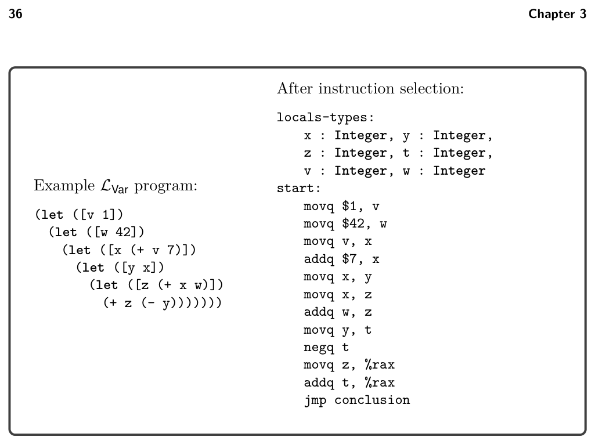

# 3.1 Registers and Calling Conventions

*Figure 3.1*

3.1 Registers and Calling Conventions

As we perform register allocation, we must be aware of the calling conventions that govern how function calls are performed in x86. Even though LVar does not include programmer-defined functions, our generated code includes a main function that is called by the operating system and our generated code contains calls to the read_int function. Function calls require coordination between two pieces of code that may be writ- ten by different programmers or generated by different compilers. Here we follow the System V calling conventions that are used by the GNU C compiler on Linux and MacOS (Bryant and O’Hallaron 2005; Matz et al. 2013). The calling conven- tions include rules about how functions share the use of registers. In particular, the caller is responsible for freeing some registers prior to the function call for use by the callee. These are called the caller-saved registers and they are

rax rcx rdx rsi rdi r8 r9 r10 r11

On the other hand, the callee is responsible for preserving the values of the callee- saved registers, which are

rsp rbp rbx r12 r13 r14 r15

We can think about this caller/callee convention from two points of view, the caller view and the callee view, as follows:

* The caller should assume that all the caller-saved registers get overwritten with
  arbitrary values by the callee. On the other hand, the caller can safely assume
  that all the callee-saved registers retain their original values.

* The callee can freely use any of the caller-saved registers. However, if the callee
  wants to use a callee-saved register, the callee must arrange to put the orig-
  inal value back in the register prior to returning to the caller. This can be
  accomplished by saving the value to the stack in the prelude of the function
  and restoring the value in the conclusion of the function.

In x86, registers are also used for passing arguments to a function and for the return value. In particular, the first six arguments of a function are passed in the following six registers, in this order.

rdi rsi rdx rcx r8 r9

We refer to these six registers are the argument-passing registers . If there are more than six arguments, the convention is to use space on the frame of the caller for the rest of the arguments. In chapter 7, we instead pass a tuple containing the sixth argument and the rest of the arguments, which simplifies the treatment of efficient tail calls. For now, the only function we care about is read_int, which takes zero arguments. The register rax is used for the return value of a function. The next question is how these calling conventions impact register allocation. Consider the LVar program presented in figure 3.2. We first analyze this example from the caller point of view and then from the callee point of view. We refer to a variable that is in use during a function call as a call-live variable. The program makes two calls to read. The variable x is call-live because it is in use during the second call to read; we must ensure that the value in x does not get overwritten during the call to read. One obvious approach is to save all the values that reside in caller-saved registers to the stack prior to each function call and to restore them after each call. That way, if the register allocator chooses to assign x to a caller-saved register, its value will be preserved across the call to read. However, saving and restoring to the stack is relatively slow. If x is not used many times, it may be better to assign x to a stack location in the first place. Or better yet, if we can arrange for x to be placed in a callee-saved register, then it won’t need to be saved and restored during function calls. We recommend an approach that captures these issues in the interference graph, without complicating the graph coloring algorithm. During liveness analysis we know which variables are call-live because we compute which variables are in use at every instruction (section 3.2). When we build the interference graph (section 3.3), we can place an edge in the interference graph between each call-live variable and the caller-saved registers. This will prevent the graph coloring algorithm from assigning call-live variables to caller-saved registers. On the other hand, for variables that are not call-live, we prefer placing them in caller-saved registers to leave more room for call-live variables in the callee-saved registers. This can also be implemented without complicating the graph coloring algorithm. We recommend that the graph coloring algorithm assign variables to

