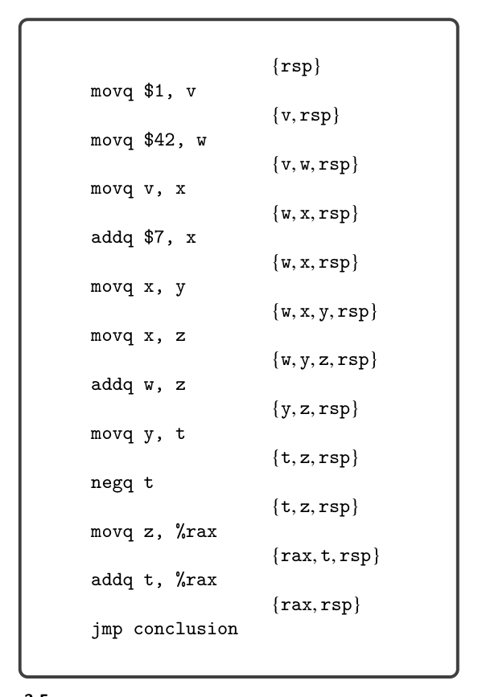

# 3.2 Liveness Analysis

natural numbers, choosing the lowest number for which there is no interference. After the coloring is complete, we map the numbers to registers and stack locations: mapping the lowest numbers to caller-saved registers, the next lowest to callee- saved registers, and the largest numbers to stack locations. This ordering gives preference to registers over stack locations and to caller-saved registers over callee- saved registers. Returning to the example in figure 3.2, let us analyze the generated x86 code on the right-hand side. Variable x is assigned to rbx, a callee-saved register. Thus, it is already in a safe place during the second call to read_int. Next, variable y is assigned to rcx, a caller-saved register, because y is not a call-live variable. We have completed the analysis from the caller point of view, so now we switch to the callee point of view, focusing on the prelude and conclusion of the main function. As usual, the prelude begins with saving the rbp register to the stack and setting the rbp to the current stack pointer. We now know why it is necessary to save the rbp: it is a callee-saved register. The prelude then pushes rbx to the stack because (1) rbx is a callee-saved register and (2) rbx is assigned to a variable (x). The other callee-saved registers are not saved in the prelude because they are not used. The prelude subtracts 8 bytes from the rsp to make it 16-byte aligned. Shifting attention to the conclusion, we see that rbx is restored from the stack with a popq instruction.

3.2 Liveness Analysis

The uncover_live pass performs liveness analysis; that is, it discovers which vari- ables are in use in different regions of a program. A variable or register is live at a program point if its current value is used at some later point in the program. We refer to variables, stack locations, and registers collectively as locations. Consider the following code fragment in which there are two writes to b. Are variables a and b both live at the same time?

1 movq $5, a

2 movq $30, b

3 movq a, c

4 movq $10, b

5 addq b, c

The answer is no, because a is live from line 1 to 3 and b is live from line 4 to 5. The integer written to b on line 2 is never used because it is overwritten (line 4) before the next read (line 5). The live locations for each instruction can be computed by traversing the instruc- tion sequence back to front (i.e., backward in execution order). Let I1, … , In be the instruction sequence. We write Lafter(k) for the set of live locations after instruc- tion Ik and write Lbefore(k) for the set of live locations before instruction Ik. We recommend representing these sets with the Racket set data structure described in figure 3.3.

*Figure 3.2*

*Figure 3.3*

The locations that are live after an instruction are its live-after set, and the locations that are live before an instruction are its live-before set. The live-after set of an instruction is always the same as the live-before set of the next instruction.

*(3.1)*

*(3.2)*

*(3.3)*

where W(k) are the locations written to by instruction Ik, and R(k) are the locations read by instruction Ik. There is a special case for jmp instructions. The locations that are live before a jmp should be the locations in Lbefore at the target of the jump. So, we recommend maintaining an alist named label->live that maps each label to the Lbefore for the first instruction in its block. For now the only jmp in a x86Var program is the jump to the conclusion. (For example, see figure 3.1.) The conclusion reads from rax and rsp, so the alist should map conclusion to the set {rax, rsp}. Let us walk through the previous example, applying these formulas starting with the instruction on line 5 of the code fragment. We collect the answers in figure 3.4. The Lafter for the addq b, c instruction is ∅because it is the last instruction (for- mula (3.2)). The Lbefore for this instruction is {b, c} because it reads from variables b and c (formula (3.3)):

Lbefore(5) = (∅−{c}) ∪{b, c} = {b, c}

Moving on the the instruction movq $10, b at line 4, we copy the live-before set from line 5 to be the live-after set for this instruction (formula (3.1)).

Lafter(4) = {b, c}

This move instruction writes to b and does not read from any variables, so we have the following live-before set (formula (3.3)).

Lbefore(4) = ({b, c} −{b}) ∪∅= {c}

The live-before for instruction movq a, c is {a} because it writes to {c} and reads from {a} (formula (3.3)). The live-before for movq $30, b is {a} because it writes to a variable that is not live and does not read from a variable. Finally, the live-before for movq $5, a is ∅because it writes to variable a.

Exercise 3.1 Perform liveness analysis by hand on the running example in figure 3.1, computing the live-before and live-after sets for each instruction. Compare your answers to the solution shown in figure 3.5.

Exercise 3.2 Implement the uncover_live pass. Store the sequence of live-after sets in the info field of the Block structure. We recommend creating an auxil- iary function that takes a list of instructions and an initial live-after set (typically empty) and returns the list of live-after sets. We recommend creating auxiliary functions to (1) compute the set of locations that appear in an arg, (2) compute the locations read by an instruction (the R function), and (3) the locations written

*Figure 3.4*

*Figure 3.5*

by an instruction (the W function). The callq instruction should include all the caller-saved registers in its write set W because the calling convention says that those registers may be written to during the function call. Likewise, the callq instruction should include the appropriate argument-passing registers in its read

