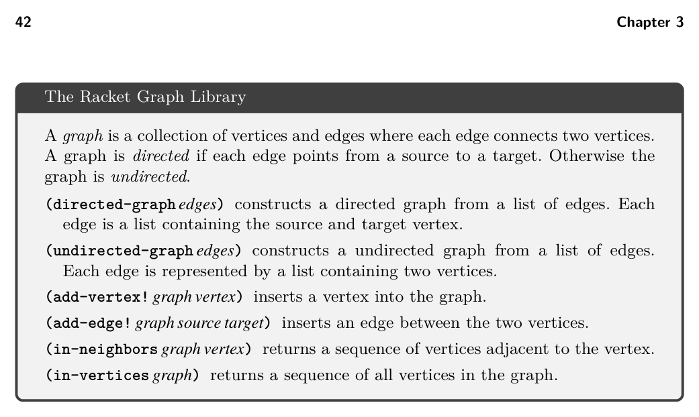

# 3.3 Build the Interference Graph

*Figure 3.6*

set R, depending on the arity of the function being called. (This is why the abstract syntax for callq includes the arity.)

3.3 Build the Interference Graph

On the basis of the liveness analysis, we know where each location is live. However, during register allocation, we need to answer questions of the specific form: are locations u and v live at the same time? (If so, they cannot be assigned to the same register.) To make this question more efficient to answer, we create an explicit data structure, an interference graph. An interference graph is an undirected graph that has a node for every variable and register and has an edge between two nodes if they are live at the same time, that is, if they interfere with each other. We recommend using the Racket graph package (figure 3.6) to represent the interference graph. A straightforward way to compute the interference graph is to look at the set of live locations between each instruction and add an edge to the graph for every pair of variables in the same set. This approach is less than ideal for two reasons. First, it can be expensive because it takes O(n2) time to consider every pair in a set of n live locations. Second, in the special case in which two locations hold the same value (because one was assigned to the other), they can be live at the same time without interfering with each other. A better way to compute the interference graph is to focus on writes (Appel and Palsberg 2003). The writes performed by an instruction must not overwrite something in a live location. So for each instruction, we create an edge between the locations being written to and the live locations. (However, a location never interferes with itself.) For the callq instruction, we consider all the caller-saved registers to have been written to, so an edge is added between every live variable and every caller-saved register. Also, for movq there is the special case of two variables holding the same value. If a live variable v is the same as the source of the movq,

