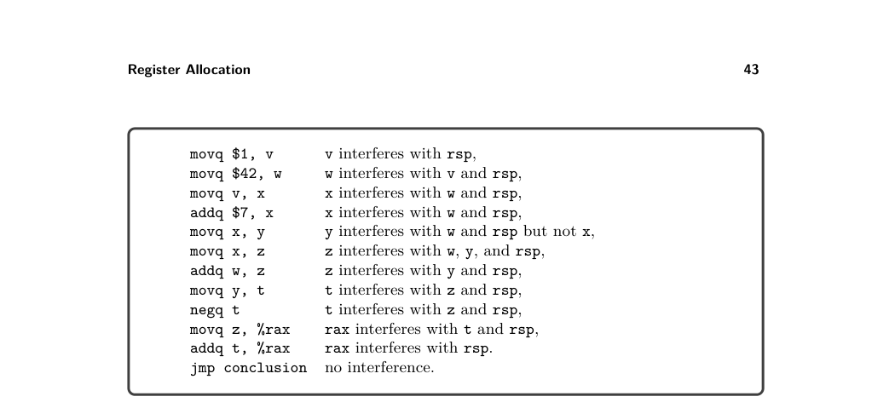
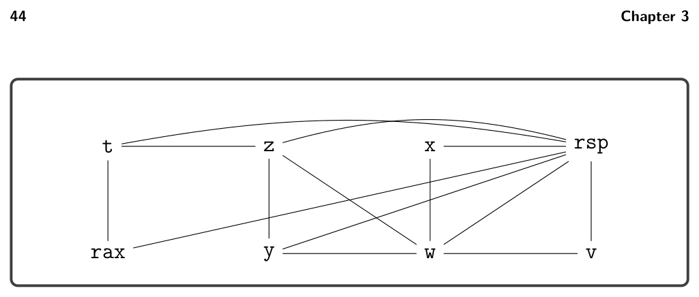
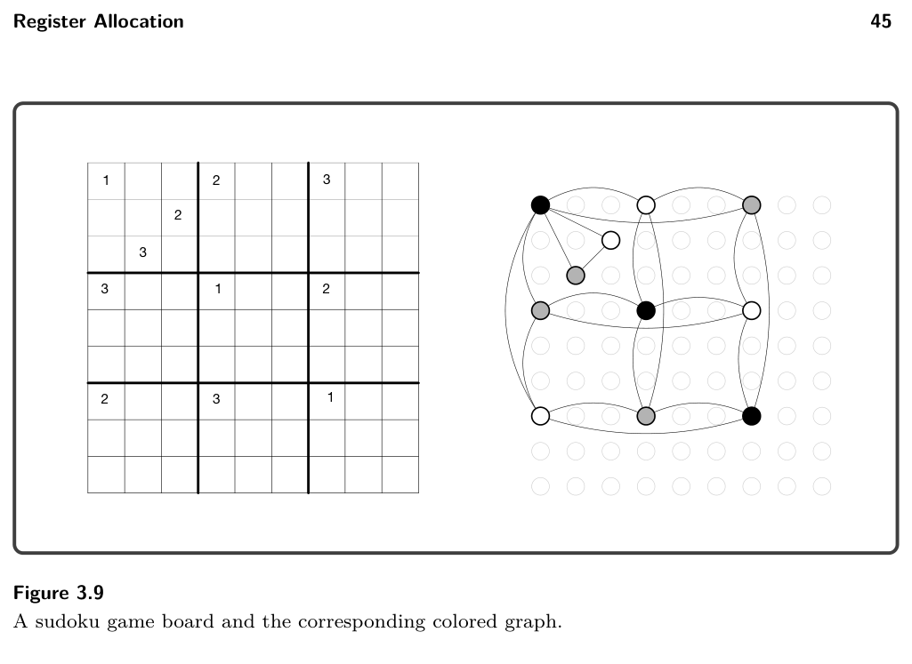
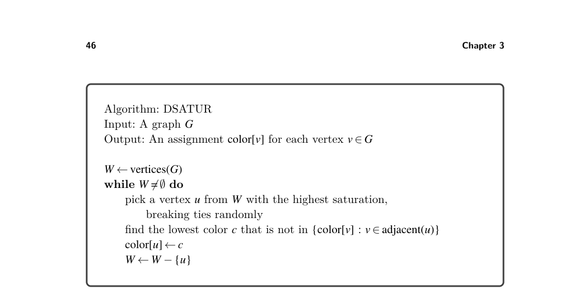
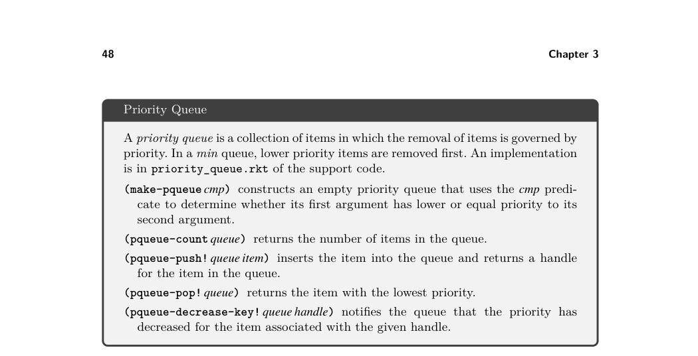

# 3.4 Graph Coloring via Sudoku


*Figure 3.7*

then there is no need to add an edge between v and the destination, because they both hold the same value. Hence we have the following two rules:

* If instruction Ik is a move instruction of the form movq s, d, then for every
  v ∈Lafter(k), if v ̸= d and v ̸= s, add the edge (d, v).
* For any other instruction Ik, for every d ∈W(k) and every v ∈Lafter(k), if v ̸= d, add
  the edge (d, v).

Working from the top to bottom of figure 3.5, we apply these rules to each instruc- tion. We highlight a few of the instructions. The first instruction is movq $1, v, and the live-after set is {v, rsp}. Rule 1 applies, so v interferes with rsp. The fourth instruction is addq $7, x, and the live-after set is {w, x, rsp}. Rule 2 applies, so x interferes with w and rsp. The next instruction is movq x, y, and the live-after set is {w, x, y, rsp}. Rule 1 applies, so y interferes with w and rsp but not x, because x is the source of the move and therefore x and y hold the same value. Figure 3.7 lists the interference results for all the instructions, and the resulting interference graph is shown in figure 3.8. We elide the register nodes from the interference graph in figure 3.8 because there were no interference edges involving registers and we did not wish to clutter the graph, but in general one needs to include all the registers in the interference graph.

Exercise 3.3 Implement the compiler pass named build_interference according to the algorithm suggested here. We recommend using the Racket graph package to create and inspect the interference graph. The output graph of this pass should be stored in the info field of the program, under the key conflicts.

3.4 Graph Coloring via Sudoku

We come to the main event discussed in this chapter, mapping variables to registers and stack locations. Variables that interfere with each other must be mapped to


*Figure 3.8*

different locations. In terms of the interference graph, this means that adjacent vertices must be mapped to different locations. If we think of locations as colors, the register allocation problem becomes the graph coloring problem (Balakrishnan 1996; Rosen 2002). The reader may be more familiar with the graph coloring problem than he or she realizes; the popular game of sudoku is an instance of the graph coloring problem. The following describes how to build a graph out of an initial sudoku board.

* There is one vertex in the graph for each sudoku square.

* There is an edge between two vertices if the corresponding squares are in the
  same row, in the same column, or in the same 3 × 3 region.

* Choose nine colors to correspond to the numbers 1 to 9.

* On the basis of the initial assignment of numbers to squares on the sudoku board,
  assign the corresponding colors to the corresponding vertices in the graph.

If you can color the remaining vertices in the graph with the nine colors, then you have also solved the corresponding game of sudoku. Figure 3.9 shows an initial sudoku game board and the corresponding graph with colored vertices. Here we use a monochrome representation of colors, mapping the sudoku number 1 to black, 2 to white, and 3 to gray. We show edges for only a sampling of the vertices (the colored ones) because showing edges for all the vertices would make the graph unreadable. Some techniques for playing sudoku correspond to heuristics used in graph color- ing algorithms. For example, one of the basic techniques for sudoku is called Pencil Marks. The idea is to use a process of elimination to determine what numbers are no longer available for a square and to write those numbers in the square (writing very small). For example, if the number 1 is assigned to a square, then write the pencil mark 1 in all the squares in the same row, column, and region to indicate that 1 is no longer an option for those other squares. The Pencil Marks technique corresponds to the notion of saturation due to Brélaz (1979). The saturation of a vertex, in sudoku terms, is the set of numbers that are no longer available. In graph terminology, we have the following definition:

saturation(u) = {c | ∃v.v ∈adjacent(u) and color(v) = c}


*Figure 3.9*

where adjacent(u) is the set of vertices that share an edge with u. The Pencil Marks technique leads to a simple strategy for filling in numbers: if there is a square with only one possible number left, then choose that number! But what if there are no squares with only one possibility left? One brute-force approach is to try them all: choose the first one, and if that ultimately leads to a solution, great. If not, backtrack and choose the next possibility. One good thing about Pencil Marks is that it reduces the degree of branching in the search tree. Nevertheless, backtracking can be terribly time consuming. One way to reduce the amount of backtracking is to use the most-constrained-first heuristic (aka minimum remaining values) (Russell and Norvig 2003). That is, in choosing a square, always choose one with the fewest possibilities left (the vertex with the highest saturation). The idea is that choosing highly constrained squares earlier rather than later is better, because later on there may not be any possibilities left in the highly saturated squares. However, register allocation is easier than sudoku, because the register alloca- tor can fall back to assigning variables to stack locations when the registers run out. Thus, it makes sense to replace backtracking with greedy search: make the best choice at the time and keep going. We still wish to minimize the number of colors needed, so we use the most-constrained-first heuristic in the greedy search. Figure 3.10 gives the pseudocode for a simple greedy algorithm for register allo- cation based on saturation and the most-constrained-first heuristic. It is roughly equivalent to the DSATUR graph coloring algorithm (Brélaz 1979). Just as in sudoku, the algorithm represents colors with integers. The integers 0 through k −1 correspond to the k registers that we use for register allocation. In particular, we recommend the following correspondence, with k = 11.

```
0: rcx, 1: rdx, 2: rsi, 3: rdi, 4: r8, 5: r9,
6: r10, 7: rbx, 8: r12, 9: r13, 10: r14
```


*Figure 3.10*

The integers k and larger correspond to stack locations. The registers that are not used for register allocation, such as rax, are assigned to negative integers. In particular, we recommend the following correspondence.

-1: rax, -2: rsp, -3: rbp, -4: r11, -5: r15

With the DSATUR algorithm in hand, let us return to the running example and consider how to color the interference graph shown in figure 3.8. We start by assigning each register node to its own color. For example, rax is assigned the color −1, rsp is assign −2, rcx is assigned 0, and rdx is assigned 1. (To reduce clutter in the interference graph, we elide nodes that do not have interference edges, such as rcx.) The variables are not yet colored, so they are annotated with a dash. We then update the saturation for vertices that are adjacent to a register, obtaining the following annotated graph. For example, the saturation for t is {−1, −2} because it interferes with both rax and rsp.

rsp : −2, {−1} t : −, {−1, −2} z : −, {−2} x : −, {−2}

y : −, {−2} w : −, {−2} v : −, {−2}

rax : −1, {−2}

The algorithm says to select a maximally saturated vertex. So, we pick t and color it with the first available integer, which is 0. We mark 0 as no longer available for

z, rax, and rsp because they interfere with t.

rsp : −2, {−1, 0} t : 0, {−1, −2} z : −, {0, −2} x : −, {−2}

y : −, {−2} w : −, {−2} v : −, {−2}

rax : −1, {0, −2}

We repeat the process, selecting a maximally saturated vertex, choosing z, and coloring it with the first available number, which is 1. We add 1 to the saturation for the neighboring vertices t, y, w, and rsp.

rsp : −2, {−1, 0, 1} t : 0, {−1, 1, −2} z : 1, {0, −2} x : −, {−2}

y : −, {1, −2} w : −, {1, −2} v : −, {−2}

rax : −1, {0, −2}

The most saturated vertices are now w and y. We color w with the first available color, which is 0.

rsp : −2, {−1, 0, 1} t : 0, {−1, 1, −2} z : 1, {0, −2} x : −, {0, −2}

y : −, {0, 1, −2} w : 0, {1, −2} v : −, {0, −2}

rax : −1, {0, −2}

Vertex y is now the most highly saturated, so we color y with 2. We cannot choose 0 or 1 because those numbers are in y’s saturation set. Indeed, y interferes with w and z, whose colors are 0 and 1 respectively.

rsp : −2, {−1, 0, 1, 2} t : 0, {−1, 1, −2} z : 1, {0, 2, −2} x : −, {0, −2}

y : 2, {0, 1, −2} w : 0, {1, 2, −2} v : −, {0, −2}

rax : −1, {0, −2}

Now x and v are the most saturated, so we color v with 1.

rsp : −2, {−1, 0, 1, 2} t : 0, {−1, 1, −2} z : 1, {0, 2, −2} x : −, {0, −2}

y : 2, {0, 1, −2} w : 0, {1, 2, −2} v : 1, {0, −2}

rax : −1, {0, −2}


*Figure 3.11*

In the last step of the algorithm, we color x with 1.

rsp : −2, {−1, 0, 1, 2} t : 0, {−1, 1, −2} z : 1, {0, 2, −2} x : 1, {0, −2}

y : 2, {0, 1, −2} w : 0, {1, 2, −2} v : 1, {0, −2}

rax : −1, {0, −2}

So, we obtain the following coloring:

{rax 7→−1, rsp 7→−2, t 7→0, z 7→1, x 7→1, y 7→2, w 7→0, v 7→1}

We recommend creating an auxiliary function named color_graph that takes an interference graph and a list of all the variables in the program. This function should return a mapping of variables to their colors (represented as natural numbers). By creating this helper function, you will be able to reuse it in chapter 7 when we add support for functions. To prioritize the processing of highly saturated nodes inside the color_graph function, we recommend using the priority queue data structure described in figure 3.11. In addition, you will need to maintain a mapping from variables to their handles in the priority queue so that you can notify the priority queue when their saturation changes. With the coloring complete, we finalize the assignment of variables to registers and stack locations. We map the first k colors to the k registers and the rest of the colors to stack locations. Suppose for the moment that we have just one register to

