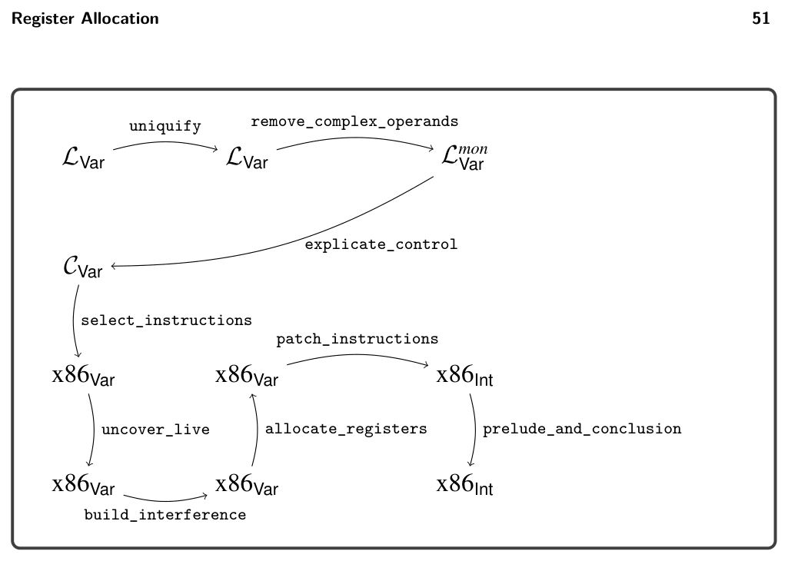
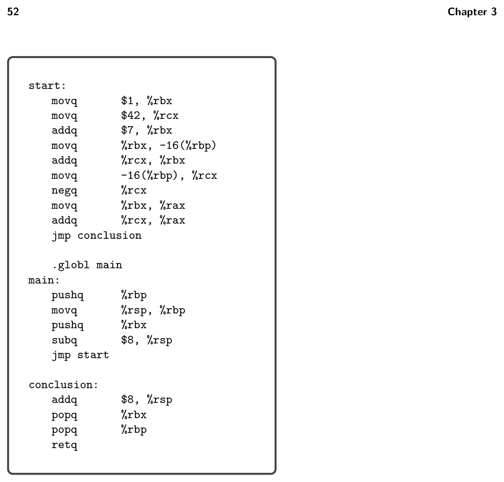

# 3.7 Challenge: Move Biasing


*Figure 3.12 Diagram of the passes for LVar with register allocation.*

from the rsp at the end of the prelude to reserve space for the one spilled variable. After that subtraction, the rsp is aligned to 16 bytes. Moving on to the program proper, we see how the registers were allocated. Vari- ables v, x, and z were assigned to rbx, and variables w and t was assigned to rcx. Variable y was spilled to the stack location -16(%rbp). Recall that the prelude saved the callee-save register rbx onto the stack. The spilled variables must be placed lower on the stack than the saved callee-save registers, so in this case y is placed at -16(%rbp). In the conclusion, we undo the work that was done in the prelude. We move the stack pointer up by 8 bytes (the room for spilled variables), then pop the old values of rbx and rbp (callee-saved registers), and finish with retq to return control to the operating system.

Exercise 3.6 Update the prelude_and_conclusion pass as described in this section. In the run-tests.rkt script, add prelude_and_conclusion to the list of passes and the call to compiler-tests. Run the script to test the complete compiler for LVar that performs register allocation.

3.7 Challenge: Move Biasing

This section describes an enhancement to the register allocator, called move biasing, for students who are looking for an extra challenge. To motivate the need for move biasing we return to the running example, but this time we use all the general purpose registers. So, we have the following mapping of


*Figure 3.13 The x86 output from the running example (figure 3.1), limiting allocation to just rbx and rcx.*

color numbers to registers.

{0 7→%rcx, 1 7→%rdx, 2 7→%rsi, … }

Using the same assignment of variables to color numbers that was produced by the register allocator described in the last section, we get the following program.

```
movq $1, v
movq $42, w
movq v, x
addq $7, x
movq x, y
movq x, z
addq w, z
movq y, t
negq t
movq z, %rax
addq t, %rax
jmp conclusion
```

```
movq $1, %rdx
movq $42, %rcx
movq %rdx, %rdx
addq $7, %rdx
movq %rdx, %rsi
movq %rdx, %rdx
addq %rcx, %rdx
movq %rsi, %rcx
negq %rcx
movq %rdx, %rax
addq %rcx, %rax
jmp conclusion
```

⇒

In this output code there are two movq instructions that can be removed because their source and target are the same. However, if we had put t, v, x, and y into the same register, we could instead remove three movq instructions. We can accomplish this by taking into account which variables appear in movq instructions with which other variables. We say that two variables p and q are move related if they participate together in a movq instruction, that is, movq p, q or movq q, p. Recall that we color variables that are more saturated before coloring variables that are less saturated, and in the case of equally saturated variables, we choose randomly. Now we break such ties by giving preference to variables that have an available color that is the same as the color of a move-related variable. Furthermore, when the register allocator chooses a color for a variable, it should prefer a color that has already been used for a move-related variable if one exists (and assuming that they do not interfere). This preference should not override the preference for registers over stack locations. So, this preference should be used as a tie breaker in choosing between two registers or in choosing between two stack locations. We recommend representing the move relationships in a graph, similarly to how we represented interference. The following is the move graph for our example.

```
rsp
t
z
x
```

```
y
w
v
```

rax

Now we replay the graph coloring, pausing to see the coloring of y. Recall the following configuration. The most saturated vertices were w and y.

rsp : −2, {−1, 0, 1, 2} t : 0, {1, −2} z : 1, {0, −2} x : −, {−2}

y : −, {1, −2} w : −, {1, −2} v : −, {−2}

rax : −1, {0, −2}

The last time, we chose to color w with 0. This time, we see that w is not move- related to any vertex, but y is move-related to t. So we choose to color y with 0, the same color as t.

rsp : −2, {−1, 0, 1, 2} t : 0, {1, −2} z : 1, {0, −2} x : −, {−2}

y : 0, {1, −2} w : −, {0, 1, −2} v : −, {−2}

rax : −1, {0, −2}

Now w is the most saturated, so we color it 2.

rsp : −2, {−1, 0, 1, 2} t : 0, {1, −2} z : 1, {0, 2, −2} x : −, {2, −2}

y : 0, {1, 2, −2} w : 2, {0, 1, −2} v : −, {2, −2}

rax : −1, {0, −2}

At this point, vertices x and v are most saturated, but x is move related to y and z, so we color x to 0 to match y. Finally, we color v to 0.

rsp : −2, {−1, 0, 1, 2} t : 0, {1, −2} z : 1, {0, 2, −2} x : 0, {2, −2}

y : 0, {1, 2, −2} w : 2, {0, 1, −2} v : 0, {2, −2}

rax : −1, {0, −2}

So, we have the following assignment of variables to registers.

{v 7→%rcx, w 7→%rsi, x 7→%rcx, y 7→%rcx, z 7→%rdx, t 7→%rcx}

We apply this register assignment to the running example shown next, on the left, to obtain the code in the middle. The patch_instructions then deletes the trivial moves to obtain the code on the right.

```
movq $1, %rcx
movq $42, %rsi
movq %rcx, %rcx
addq $7, %rcx
movq %rcx, %rcx
movq %rcx, %rdx
addq %rsi, %rdx
movq %rcx, %rcx
negq %rcx
movq %rdx, %rax
addq %rcx, %rax
jmp conclusion
```

```
movq $1, v
movq $42, w
movq v, x
addq $7, x
movq x, y
movq x, z
addq w, z
movq y, t
negq t
movq z, %rax
addq t, %rax
jmp conclusion
```

```
movq $1, %rcx
movq $42, %rsi
addq $7, %rcx
movq %rcx, %rdx
addq %rsi, %rdx
negq %rcx
movq %rdx, %rax
addq %rcx, %rax
jmp conclusion
```

⇒

⇒

Exercise 3.7 Change your implementation of allocate_registers to take move biasing into account. Create two new tests that include at least one opportunity for move biasing, and visually inspect the output x86 programs to make sure that your move biasing is working properly. Make sure that your compiler still passes all the tests.

