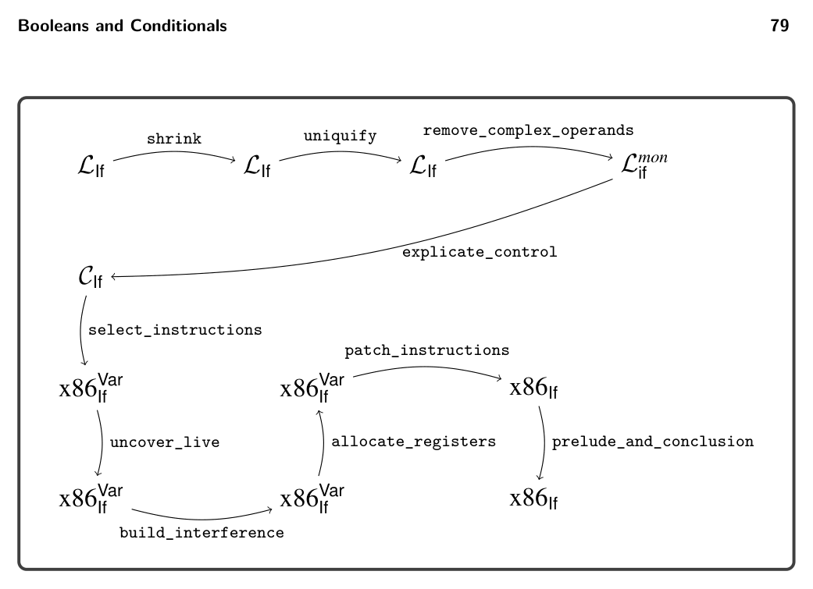

# 4 Booleans and Conditionals

4

Booleans and Conditionals

The LVar language has only a single kind of value, the integers. In this chapter we add a second kind of value, the Booleans, to create the LIf language. In Racket, the Boolean values true and false are written #t and #f, respectively. The LIf language includes several operations that involve Booleans (and, or, not, eq?, <, etc.) and the if conditional expression. With the addition of if, programs can have nontrivial control flow, which impacts explicate_control and liveness analysis. Also, because we now have two kinds of values, we need to handle programs that apply an operation to the wrong kind of value, such as (not 1). There are two language design options for such situations. One option is to signal an error and the other is to provide a wider interpretation of the operation. The Racket language uses a mixture of these two options, depending on the operation and the kind of value. For example, the result of (not 1) is #f because Racket treats nonzero integers as if they were #t. On the other hand, (car 1) results in a runtime error in Racket because car expects a pair. Typed Racket makes similar design choices as Racket, except that much of the error detection happens at compile time instead of runtime. Typed Racket accepts (not 1). But in the case of (car 1), Typed Racket reports a compile-time error because Racket expects the type of the argument to be of the form (Listof T) or (Pairof T1 T2). The LIf language performs type checking during compilation just as Typed Racket. In chapter 9 we study the alternative choice, that is, a dynamically typed language like Racket. The LIf language is a subset of Typed Racket; for some oper- ations we are more restrictive, for example, rejecting (not 1). We keep the type checker for LIf fairly simple because the focus of this book is on compilation and not type systems, about which there are already several excellent books (Pierce 2002, 2004; Harper 2016; Pierce et al. 2018). This chapter is organized as follows. We begin by defining the syntax and inter- preter for the LIf language (section 4.1). We then introduce the idea of type checking (aka semantic analysis) and define a type checker for LIf (section 4.2). To compile LIf we need to enlarge the intermediate language CVar into CIf (section 4.3) and x86Int into x86If (section 4.4). The remaining sections of this chapter discuss how Booleans and conditional control flow require changes to the existing compiler passes and the addition of new ones. We introduce the shrink pass to translate some operators into others, thereby reducing the number of operators that need to be handled in


*Figure 4.1*

later passes. The main event of this chapter is the explicate_control pass that is responsible for translating ifs into conditional gotos (section 4.8). Regarding register allocation, there is the interesting question of how to handle conditional gotos during liveness analysis.

## 4.1 The LIf Language

Definitions of the concrete syntax and abstract syntax of the LIf language are shown in figures 4.1 and 4.2, respectively. The LIf language includes all of LVar (shown in gray), the Boolean literals #t and #f, and the if expression. We expand the set of operators to include

* the logical operators and, or, and not,
* the eq? operation for comparing integers or Booleans for equality, and
* the <, <=, >, and >= operations for comparing integers.

We reorganize the abstract syntax for the primitive operations given in figure 4.2, using only one grammar rule for all of them. This means that the grammar no longer checks whether the arity of an operator matches the number of arguments. That responsibility is moved to the type checker for LIf (section 4.2). Figure 4.3 shows the definition of the interpreter for LIf, which inherits from the interpreter for LVar (figure 2.4). The constants #t and #f evaluate to the corre- sponding Boolean values, behavior that is inherited from the interpreter for LInt (figure 2.3). The conditional expression (if e1 e2 e3) evaluates expression e1 and then either evaluates e2 or e3, depending on whether e1 produced #t or #f. The logical operations and, or, and not behave according to propositional logic. In addi- tion, the and and or operations perform short-circuit evaluation. That is, given the expression (and e1 e2), the expression e2 is not evaluated if e1 evaluates to #f. Similarly, given (or e1 e2), the expression e2 is not evaluated if e1 evaluates to #t. With the increase in the number of primitive operations, the interpreter would become repetitive without some care. We refactor the case for Prim, moving the code


*Figure 4.2*

that differs with each operation into the interp_op method shown in figure 4.4. We handle the and and or operations separately because of their short-circuiting behavior.

## 4.2 Type Checking LIf Programs

It is helpful to think about type checking in two complementary ways. A type checker predicts the type of value that will be produced by each expression in the program. For LIf, we have just two types, Integer and Boolean. So, a type checker should predict that

(+ 10 (- (+ 12 20)))

produces a value of type Integer, whereas

(and (not #f) #t)

produces a value of type Boolean. A second way to think about type checking is that it enforces a set of rules about which operators can be applied to which kinds of values. For example, our type checker for LIf signals an error for the following expression:

(not (+ 10 (- (+ 12 20))))

The subexpression (+ 10 (- (+ 12 20))) has type Integer, but the type checker enforces the rule that the argument of not must be an expression of type Boolean. We implement type checking using classes and methods because they provide the open recursion needed to reuse code as we extend the type checker in subse- quent chapters, analogous to the use of classes and methods for the interpreters (section 2.1.1). We separate the type checker for the LVar subset into its own class, shown in figure 4.5. The type checker for LIf is shown in figure 4.6, and it inherits from the


*(super-new)*


*Figure 4.3*

type checker for LVar. These type checkers are in the files type-check-Lvar.rkt and type-check-Lif.rkt of the support code. Each type checker is a structurally recursive function over the AST. Given an input expression e, the type checker either signals an error or returns an expression and its type. It returns an expression because there are situations in which we want to change or update the expression. Next we discuss the type_check_exp function of LVar shown in figure 4.5. The type of an integer constant is Integer. To handle variables, the type checker uses the environment env to map variables to types. Consider the case for let. We type check the initializing expression to obtain its type T and then associate type T with the variable x in the environment used to type check the body of the let. Thus, when the type checker encounters a use of variable x, it can find its type in the environment. Regarding primitive operators, we recursively analyze the arguments and then invoke type_check_op to check whether the argument types are allowed.


*Figure 4.4*

Several auxiliary methods are used in the type checker. The method operator-types defines a dictionary that maps the operator names to their parameter and return types. The type-equal? method determines whether two types are equal, which for now simply dispatches to equal? (deep equality). The check-type-equal? method triggers an error if the two types are not equal. The type-check-op method looks up the operator in the operator-types dictionary and then checks whether the argument types are equal to the parameter types. The result is the return type of the operator. The definition of the type checker for LIf is shown in figure 4.6. The type of a Boolean constant is Boolean. The operator-types function adds dictionary entries for the new operators. The equality operator requires the two arguments to have the same type, and therefore we handle it separately from the other operators. The condition of an if must be of Boolean type, and the two branches must have the same type.

Exercise 4.1 Create ten new test programs in LIf. Half the programs should have a type error. For those programs, create an empty file with the same base name and with file extension .tyerr. For example, if the test cond_test_14.rkt is expected


*(super-new)*


*Figure 4.5*


*Figure 4.6*

to error, then create an empty file named cond_test_14.tyerr. This indicates to interp-tests and compiler-tests that a type error is expected. The other half of the test programs should not have type errors. In the run-tests.rkt script, change the second argument of interp-tests and compiler-tests to type-check-Lif, which causes the type checker to run prior to the compiler passes. Temporarily change the passes to an empty list and run the script, thereby checking that the new test programs either type check or do not, as intended. Run the test script to check that these test programs type check as expected.


*Figure 4.7*


*Figure 4.8*

## 4.3 The CIf Intermediate Language

The CIf language builds on CVar by adding logical and comparison operators to the exp nonterminal and the literals #t and #f to the arg nonterminal. Regarding con- trol flow, CIf adds goto and if statements to the tail nonterminal. The condition of an if statement is a comparison operation and the branches are goto statements, making it straightforward to compile if statements to x86. The CProgram construct contains an alist mapping labels to tail expressions. A goto statement transfers con- trol to the tail expression corresponding to its label. Figure 4.7 defines the concrete syntax of the CIf intermediate language, and figure 4.8 defines its abstract syntax.

## 4.4 The x86If Language

To implement Booleans, the new logical operations, the comparison operations, and the if expression, we delve further into the x86 language. Figures 4.9 and 4.10 present the definitions of the concrete and abstract syntax for the x86If subset of


*Figure 4.9*

x86, which includes instructions for logical operations, comparisons, and conditional jumps. As x86 does not provide direct support for Booleans, we take the usual approach of encoding Booleans as integers, with True as 1 and False as 0. Furthermore, x86 does not provide an instruction that directly implements logical negation (not in LIf and CIf). However, the xorq instruction can be used to encode not. The xorq instruction takes two arguments, performs a pairwise exclusive-or (XOR) operation on each bit of its arguments, and writes the results into its second argument. Recall the following truth table for exclusive-or:

0 1 0 0 1 1 1 0

For example, applying XOR to each bit of the binary numbers 0011 and 0101 yields 0110. Notice that in the row of the table for the bit 1, the result is the opposite of the second bit. Thus, the not operation can be implemented by xorq with 1 as the first argument, as follows, where arg is the translation of atm to x86:

var = (not atm); ⇒ movq arg,var xorq $1,var

Next we consider the x86 instructions that are relevant for compiling the com- parison operations. The cmpq instruction compares its two arguments to determine whether one argument is less than, equal to, or greater than the other argument. The cmpq instruction is unusual regarding the order of its arguments and where the result is placed. The argument order is backward: if you want to test whether x < y, then write cmpq y, x. The result of cmpq is placed in the special EFLAGS


*Figure 4.10*

register. This register cannot be accessed directly, but it can be queried by a num- ber of instructions, including the set instruction. The instruction setcc d puts a 1 or 0 into the destination d, depending on whether the contents of the EFLAGS register matches the condition code cc: e for equal, l for less, le for less-or-equal, g for greater, ge for greater-or-equal. The set instruction has a quirk in that its destination argument must be a single-byte register, such as al (l for lower bits) or ah (h for higher bits), which are part of the rax register. Thankfully, the movzbq instruction can be used to move from a single-byte register to a normal 64-bit reg- ister. The abstract syntax for the set instruction differs from the concrete syntax in that it separates the instruction name from the condition code. The x86 instruction for conditional jump is relevant to the compilation of if expressions. The instruction jcc label updates the program counter to point to the instruction after label, depending on whether the result in the EFLAGS register matches the condition code cc; otherwise, the jump instruction falls through to the next instruction. Like the abstract syntax for set, the abstract syntax for condi- tional jump separates the instruction name from the condition code. For example, (JmpIf 'le 'foo) corresponds to jle foo. Because the conditional jump instruc- tion relies on the EFLAGS register, it is common for it to be immediately preceded by a cmpq instruction to set the EFLAGS register.

## 4.5 Shrink the LIf Language

The shrink pass translates some of the language features into other features, thereby reducing the kinds of expressions in the language. For example, the short- circuiting nature of the and and or logical operators can be expressed using if as

follows.

(and e1 e2) ⇒ (if e1 e2 #f)

(or e1 e2) ⇒ (if e1 #t e2)

By performing these translations in the front end of the compiler, subsequent passes of the compiler can be shorter. On the other hand, translations sometimes reduce the efficiency of the generated code by increasing the number of instructions. For example, expressing subtraction in terms of addition and negation

(- e1 e2) ⇒ (+ e1 (- e2))

produces code with two x86 instructions (negq and addq) instead of just one (subq). Thus, we do not recommend translating subtraction into addition and negation.

Exercise 4.2 Implement the pass shrink to remove and and or from the language by translating them to if expressions in LIf. Create four test programs that involve these operators. In the run-tests.rkt script, add the following entry for shrink to the list of passes (it should be the only pass at this point).

(list "shrink" shrink interp_Lif type-check-Lif)

This instructs interp-tests to run the interpreter interp_Lif and the type checker type-check-Lif on the output of shrink. Run the script to test your compiler on all the test programs.

## 4.6 Uniquify Variables

Add cases to uniquify_exp to handle Boolean constants and if expressions.

Exercise 4.3 Update the uniquify_exp for LIf and add the following entry to the list of passes in the run-tests.rkt script:

(list "uniquify" uniquify interp_Lif type_check_Lif)

Run the script to test your compiler.

## 4.7 Remove Complex Operands

The output language of remove_complex_operands is Lmon if (figure 4.11), the monadic normal form of LIf. A Boolean constant is an atomic expression, but the if expression is not. All three subexpressions of an if are allowed to be complex expressions, but the operands of the not operator and comparison operators must be atomic. Add cases to the rco_exp and rco_atom functions for the new features in LIf. In recursively processing subexpressions, recall that you should invoke rco_atom when the output needs to be an atm (as specified in the grammar for Lmon if ) and invoke rco_exp when the output should be exp. Regarding if, it is particularly important


*Figure 4.11*

not to replace its condition with a temporary variable, because that would interfere with the generation of high-quality output in the upcoming explicate_control pass.

Exercise 4.4 Add cases for Boolean constants and if to the rco_atom and rco_exp functions. Create three new LIf programs that exercise the interesting code in this pass. In the run-tests.rkt script, add the following entry to the list of passes and then run the script to test your compiler.

(list "remove-complex" remove_complex_operands interp-Lif type-check-Lif)

## 4.8 Explicate Control

Recall that the purpose of explicate_control is to make the order of evaluation explicit in the syntax of the program. With the addition of if, this becomes more interesting. The explicate_control pass translates from Lmon if to CIf. The main challenge to overcome is that the condition of an if can be an arbitrary expression in Lmon if , whereas in CIf the condition must be a comparison. As a motivating example, consider the following Lmon if program that has an if expression nested in the condition of another if:

```
(let ([x (read)])
(let ([y (read)])
(if (if (< x 1) (eq? x 0) (eq? x 2))
(+ y 2)
(+ y 10))))
```

The naive way to compile if and the comparison operations would be to handle each of them in isolation, regardless of their context. Each comparison would be translated into a cmpq instruction followed by several instructions to move the result from the EFLAGS register into a general purpose register or stack location. Each if would be translated into a cmpq instruction followed by a conditional jump. The generated code for the inner if in this example would be as follows:

```
cmpq $1, x
setl %al
movzbq %al, tmp
cmpq $1, tmp
je then_branch_1
jmp else_branch_1
```

Notice that the three instructions starting with setl are redundant; the conditional jump could come immediately after the first cmpq. Our goal is to compile if expressions so that the relevant comparison instruction appears directly before the conditional jump. For example, we want to generate the following code for the inner if:

```
cmpq $1, x
jl then_branch_1
jmp else_branch_1
```

One way to achieve this goal is to reorganize the code at the level of Lmon if , pushing the outer if inside the inner one, yielding the following code:

```
(let ([x (read)])
(let ([y (read)])
(if (< x 1)
(if (eq? x 0)
(+ y 2)
(+ y 10))
(if (eq? x 2)
(+ y 2)
(+ y 10)))))
```

Unfortunately, this approach duplicates the two branches from the outer if, and a compiler must never duplicate code! After all, the two branches could be very large expressions. How can we apply this transformation without duplicating code? In other words, how can two different parts of a program refer to one piece of code? The answer is that we must move away from abstract syntax trees and instead use graphs. At the level of x86 assembly, this is straightforward because we can label the code for each branch and insert jumps in all the places that need to execute the branch. In this way, jump instructions are edges in the graph and the basic blocks are the nodes. Likewise, our intermediate language CIf provides the ability to label a sequence of statements and to jump to a label via goto. As a preview of what explicate_control will do, figure 4.12 shows the output of explicate_control on this example. Note how the condition of every if is a comparison operation and that we have not duplicated any code but instead have used labels and goto to enable sharing of code. Recall that in section 2.6 we implement explicate_control for Lmon Var using two recursive functions, explicate_tail and explicate_assign. The former function


*Figure 4.12*

translates expressions in tail position, whereas the latter function translates expres- sions on the right-hand side of a let. With the addition of if expression to Lmon if we have a new kind of position to deal with: the predicate position of the if. We need another function, explicate_pred, that decides how to compile an if by analyzing its condition. So, explicate_pred takes an Lmon if expression and two CIf tails for the then branch and else branch and outputs a tail. In the following para- graphs we discuss specific cases in the explicate_tail, explicate_assign, and explicate_pred functions.

4.8.1 Explicate Tail and Assign The explicate_tail and explicate_assign functions need additional cases for Boolean constants and if. The cases for if should recursively compile the two branches using either explicate_tail or explicate_assign, respectively. The cases should then invoke explicate_pred on the condition expression, passing in the generated code for the two branches. For example, consider the following program with an if in tail position.

```
(let ([x (read)])
(if (eq? x 0) 42 777))
```

The two branches are recursively compiled to return statements. We then del- egate to explicate_pred, passing the condition (eq? x 0) and the two return statements. We return to this example shortly when we discuss explicate_pred. Next let us consider a program with an if on the right-hand side of a let.

```
(let ([y (read)])
(let ([x (if (eq? y 0) 40 777)])
(+ x 2)))
```

Note that the body of the inner let will have already been compiled to return (+ x 2); and passed as the cont parameter of explicate_assign. We’ll need to use cont to recursively process both branches of the if, and we do not want to duplicate code, so we generate the following block using an auxiliary function named create_block, discussed in the next section.

```
block_6:
return (+ x 2)
```

We then use goto block_6; as the cont argument for compiling the branches. So the two branches compile to

x = 40; goto block_6; and x = 777; goto block_6;

Finally, we delegate to explicate_pred, passing the condition (eq? y 0) and the previously presented code for the branches.

4.8.2 Create Block We recommend implementing the create_block auxiliary function as follows, using a global variable basic-blocks to store a dictionary that maps labels to tail expres- sions. The main idea is that create_block generates a new label and then associates the given tail with the new label in the basic-blocks dictionary. The result of create_block is a Goto to the new label. However, if the given tail is already a Goto, then there is no need to generate a new label and entry in basic-blocks; we can simply return that Goto.

```
(define (create_block tail)
(match tail
[(Goto label) (Goto label)]
[else
(let ([label (gensym 'block)])
(set! basic-blocks (cons (cons label tail) basic-blocks))
(Goto label))]))
```

4.8.3 Explicate Predicate The skeleton for the explicate_pred function is given in figure 4.13. It takes three parameters: (1) cnd, the condition expression of the if; (2) thn, the code generated by explicate for the then branch; and (3) els, the code generated by explicate for


*Figure 4.13*

the else branch. The explicate_pred function should match on cnd with a case for every kind of expression that can have type Boolean. Consider the case for comparison operators. We translate the comparison to an if statement whose branches are goto statements created by applying create_block to the thn and els parameters. Let us illustrate this translation by returning to the program with an if expression in tail position, shown next. We invoke explicate_pred on its condition (eq? x 0).

```
(let ([x (read)])
(if (eq? x 0) 42 777))
```

The two branches 42 and 777 were already compiled to return statements, from which we now create the following blocks:

```
block_1:
return 42;
block_2:
return 777;
```

After that, explicate_pred compiles the comparison (eq? x 0) to the following if statement:

```
if (eq? x 0)
goto block_1;
else
goto block_2;
```

Next consider the case for Boolean constants. We perform a kind of partial eval- uation and output either the thn or els parameter, depending on whether the constant is #t or #f. Let us illustrate this with the following program:

(if #t 42 777)

Again, the two branches 42 and 777 were compiled to return statements, so explicate_pred compiles the constant #t to the code for the then branch.

return 42;

This case demonstrates that we sometimes discard the thn or els blocks that are input to explicate_pred. The case for if expressions in explicate_pred is particularly illuminating because it deals with the challenges discussed previously regarding nested if expres- sions (figure 4.12). The thn^ and els^ branches of the if inherit their context from the current one, that is, predicate context. So, you should recursively apply explicate_pred to the thn^ and els^ branches. For both of those recursive calls, pass thn and els as the extra parameters. Thus, thn and els may be used twice, once inside each recursive call. As discussed previously, to avoid duplicating code, we need to add them to the dictionary of basic blocks so that we can instead refer to them by name and execute them with a goto. Figure 4.12 shows the output of the remove_complex_operands pass and then the explicate_control pass on the example program. We walk through the output program. Following the order of evaluation in the output of remove_complex_operands, we first have two calls to (read) and then the compar- ison (< x 1) in the predicate of the inner if. In the output of explicate_control, in the block labeled start, two assignment statements are followed by an if state- ment that branches to block_4 or block_5. The blocks associated with those labels contain the translations of the code (eq? x 0) and (eq? x 2), respectively. In particular, we start block_4 with the comparison (eq? x 0) and then branch to block_2 or block_3, which correspond to the two branches of the outer if, that is, (+ y 2) and (+ y 10). The story for block_5 is similar to that of block_4.

4.8.4 Interactions between Explicate and Shrink The way in which the shrink pass transforms logical operations such as and and or can impact the quality of code generated by explicate_control. For example, consider the following program:

```
(if (and (eq? (read) 0) (eq? (read) 1))
0
42)
```

The and operation should transform into something that the explicate_pred func- tion can analyze and descend through to reach the underlying eq? conditions. Ideally, for this program your explicate_control pass should generate code similar to the following:

```
start:
tmp1 = (read);
if (eq? tmp1 0) goto block40;
else goto block39;
block40:
tmp2 = (read);
if (eq? tmp2 1) goto block38;
else goto block39;
block38:
return 0;
block39:
return 42;
```

Exercise 4.5 Implement the pass explicate_control by adding the cases for Boolean constants and if to the explicate_tail and explicate_assign func- tions. Implement the auxiliary function explicate_pred for predicate contexts. Create test cases that exercise all the new cases in the code for this pass. Add the following entry to the list of passes in run-tests.rkt:

(list "explicate_control" explicate_control interp-Cif type-check-Cif)

and then run run-tests.rkt to test your compiler.

## 4.9 Select Instructions

The select_instructions pass translates CIf to x86Var If . Recall that we implement this pass using three auxiliary functions, one for each of the nonterminals atm, stmt, and tail in CIf (figure 4.8). For atm, we have new cases for the Booleans. As previously discussed, we encode them as integers.

#t ⇒ 1 #f ⇒ 0

For translating statements, we discuss some of the cases. The not operation can be implemented in terms of xorq, as we discussed at the beginning of this section. Given an assignment, if the left-hand-side variable is the same as the argument of not, then just the xorq instruction suffices.

var = (not var); ⇒ xorq $1, var

Otherwise, a movq is needed to adapt to the update-in-place semantics of x86. In the following translation, let arg be the result of translating atm to x86.

var = (not atm); ⇒ movq arg, var xorq $1, var

Next consider the cases for equality comparisons. Translating this operation to x86 is slightly involved due to the unusual nature of the cmpq instruction that we discussed in section 4.4. We recommend translating an assignment with an equality on the right-hand side into a sequence of three instructions. Let arg1 be the translation of atm1 to x86 and likewise for arg2.

var = (eq? atm1 atm2); ⇒ cmpq arg2, arg1 sete %al movzbq %al, var

The translations for the other comparison operators are similar to this but use different condition codes for the set instruction. Regarding the tail nonterminal, we have two new cases: goto and if statements. Both are straightforward to translate to x86. A goto statement becomes a jump instruction. goto ℓ; ⇒ jmp ℓ

An if statement becomes a compare instruction followed by a conditional jump (for the then branch), and the fall-through is to a regular jump (for the else branch). Again, arg1 and arg2 are the translations of atm1 and atm2, respectively.

if (eq? atm1 atm2) goto ℓ1; else goto ℓ2;

⇒ cmpq arg2, arg1 je ℓ1 jmp ℓ2

Again, the translations for the other comparison operators are similar to this but use different condition codes for the conditional jump instruction.

Exercise 4.6 Expand your select_instructions pass to handle the new features of the CIf language. Add the following entry to the list of passes in run-tests.rkt

(list "select_instructions" select_instructions interp-pseudo-x86-1)

Run the script to test your compiler on all the test programs.

## 4.10 Register Allocation

The changes required for compiling LIf affect liveness analysis, building the inter- ference graph, and assigning homes, but the graph coloring algorithm itself does not change.

4.10.1 Liveness Analysis Recall that for LVar we implemented liveness analysis for a single basic block (section 3.2). With the addition of if expressions to LIf, explicate_control produces many basic blocks. The first question is, in what order should we process the basic blocks? Recall that to perform liveness analysis on a basic block we need to know the live-after set for the last instruction in the block. If a basic block has no successors (i.e., contains no jumps to other blocks), then it has an empty live-after set and we can immediately apply liveness analysis to it. If a basic block has some successors, then we need to complete liveness analysis on those blocks first. These ordering constraints are the reverse of a topological order on a graph representation of the program. In particular, the control flow graph (CFG) (Allen 1970) of a program has a node for each basic block and an edge for each jump from one block to another. It is straightforward to

generate a CFG from the dictionary of basic blocks. One then transposes the CFG and applies the topological sort algorithm. We recommend using the tsort and transpose functions of the Racket graph package to accomplish this. As an aside, a topological ordering is only guaranteed to exist if the graph does not contain any cycles. This is the case for the control-flow graphs that we generate from LIf programs. However, in chapter 5 we add loops to create LWhile and learn how to handle cycles in the control-flow graph. You need to construct a directed graph to represent the control-flow graph. Do not use the directed-graph of the graph package because that allows at most one edge between each pair of vertices, whereas a control-flow graph may have multiple edges between a pair of vertices. The multigraph.rkt file in the support code implements a graph representation that allows multiple edges between a pair of vertices. The next question is how to analyze jump instructions. Recall that in section 3.2 we maintain an alist named label->live that maps each label to the set of live locations at the beginning of its block. We use label->live to determine the live- before set for each (Jmp label) instruction. Now that we have many basic blocks, label->live needs to be updated as we process the blocks. In particular, after per- forming liveness analysis on a block, we take the live-before set of its first instruction and associate that with the block’s label in the label->live alist. In x86Var If we also have the conditional jump (JmpIf cc label) to deal with. Liveness analysis for this instruction is particularly interesting because during compilation, we do not know which way a conditional jump will go. Thus we do not know whether to use the live-before set for the block associated with the label or the live-before set for the following instruction. So we use both, by taking the union of the live-before sets from the following instruction and from the mapping for label in label->live. The auxiliary functions for computing the variables in an instruction’s argument and for computing the variables read-from (R) or written-to (W) by an instruction need to be updated to handle the new kinds of arguments and instructions in x86Var If .

Exercise 4.7 Update the uncover_live pass to apply liveness analysis to every basic block in the program. Add the following entry to the list of passes in the run-tests.rkt script:

(list "uncover_live" uncover_live interp-pseudo-x86-1)

4.10.2 Build the Interference Graph Many of the new instructions in x86Var If can be handled in the same way as the instructions in x86Var. Some instructions, such as the movzbq instruction, require special care, similar to the movq instruction. Refer to rule number 1 in section 3.3.

Exercise 4.8 Update the build_interference pass for x86Var If . Add the following entries to the list of passes in the run-tests.rkt script:

```
(list "build_interference" build_interference interp-pseudo-x86-1)
(list "allocate_registers" allocate_registers interp-pseudo-x86-1)
```

## 4.11 Patch Instructions

The new instructions cmpq and movzbq have some special restrictions that need to be handled in the patch_instructions pass. The second argument of the cmpq instruction must not be an immediate value (such as an integer). So, if you are comparing two immediates, we recommend inserting a movq instruction to put the second argument in rax. On the other hand, if you implemented the partial evaluator (section 2.11), you could update it for LIf and then this situation would not arise. As usual, cmpq may have at most one memory reference. The second argument of the movzbq must be a register.

Exercise 4.9 Update patch_instructions pass for x86Var If . Add the following entry to the list of passes in run-tests.rkt, and then run this script to test your compiler.


*Figure 4.14*

## 4.12 Challenge: Optimize Blocks and Remove Jumps

We discuss two challenges that involve optimizing the control-flow of the program.

4.12.1 Optimize Blocks The algorithm for explicate_control that we discussed in section 4.8 sometimes generates too many blocks. It creates a block whenever a continuation might get used more than once (for example, whenever the cont parameter is passed into two or more recursive calls). However, some continuation arguments may not be used at all. Consider the case for the constant #t in explicate_pred, in which we discard the els continuation. The following example program falls into this case, and it creates two unused blocks.

```
start:
y = (read);
goto block_5;
block_5:
return (+ y 2);
block_6:
y = 777;
goto block_5;
block_7:
x = (read);
y = (+ 1 x2);
goto block_5;
```

```
(let ([y (if #t
(read)
(if (eq? (read) 0)
777
(let ([x (read)])
(+ 1 x))))])
(+ y 2))
```

⇒


*Figure 4.14*

The question is, how can we decide whether to create a basic block? Lazy evalua- tion (Friedman and Wise 1976) can solve this conundrum by delaying the creation of a basic block until the point in time at which we know that it will be used. Racket provides support for lazy evaluation with the racket/promise package. The expression (delay e1 … en) creates a promise in which the evaluation of the expressions is postponed. When (force p) is applied to a promise p for the first time, the expressions e1 … en are evaluated and the result of en is cached in the promise and returned. If force is applied again to the same promise, then the cached result is returned. If force is applied to an argument that is not a promise, force simply returns the argument.


*Figure 4.15*

We use promises for the input and output of the functions explicate_pred, explicate_assign, and explicate_tail. So, instead of taking and returning tail expressions, they take and return promises. Furthermore, when we come to a situation in which a continuation might be used more than once, as in the case for if in explicate_pred, we create a delayed computation that creates a basic block for each continuation (if there is not already one) and then returns a goto statement to that basic block. When we come to a situation in which we have a promise but need an actual piece of code, for example, to create a larger piece of code with a constructor such as Seq, then insert a call to force. Also, we must modify the create_block function to begin with delay to create a promise. When forced, this promise forces the original promise. If that returns a Goto (because the block was already added to basic-blocks), then we return the Goto. Otherwise, we add the block to basic-blocks and return a Goto to the new label.

```
(define (create_block tail)
(delay
(define t (force tail))
(match t
[(Goto label) (Goto label)]
[else
(let ([label (gensym 'block)])
(set! basic-blocks (cons (cons label t) basic-blocks))
(Goto label))])))
```


*Figure 4.16*


*Figure 4.17*


*Figure 4.16*

Exercise 4.10 Implement the improvements to the explicate_control pass. Check that it removes trivial blocks in a few example programs. Then check that your compiler still passes all your tests.

4.12.2 Remove Jumps There is an opportunity for removing jumps that is apparent in the example of figure 4.16. The start block ends with a jump to block_5, and there are no other jumps to block_5 in the rest of the program. In this situation we can avoid the run- time overhead of this jump by merging block_5 into the preceding block, which in this case is the start block. Figure 4.17 shows the output of allocate_registers on the left and the result of this optimization on the right.

Exercise 4.11 Implement a pass named remove_jumps that merges basic blocks into their preceding basic block, when there is only one preceding block. The pass should translate from x86Var If to x86Var If . In the run-tests.rkt script, add the following entry to the list of passes between allocate_registers and patch_instructions:

(list "remove_jumps" remove_jumps interp-pseudo-x86-1)

Run the script to test your compiler. Check that remove_jumps accomplishes the goal of merging basic blocks on several test programs.

## 4.13 Further Reading

The algorithm for explicate_control is based on the expose-basic-blocks pass in the course notes of Dybvig and Keep (2010). It has similarities to the algorithms of Danvy (2003) and Appel and Palsberg (2003), and is related to translations into continuation passing style (van Wijngaarden 1966; Fischer 1972; Reynolds 1972; Plotkin 1975; Friedman, Wand, and Haynes 2001). The treatment of conditionals in the explicate_control pass is similar to short-cut Boolean evaluation (Logothetis and Mishra 1981; Aho et al. 2006; Clarke 1989; Danvy 2003) and the case-of-case transformation (Peyton Jones and Santos 1998).

