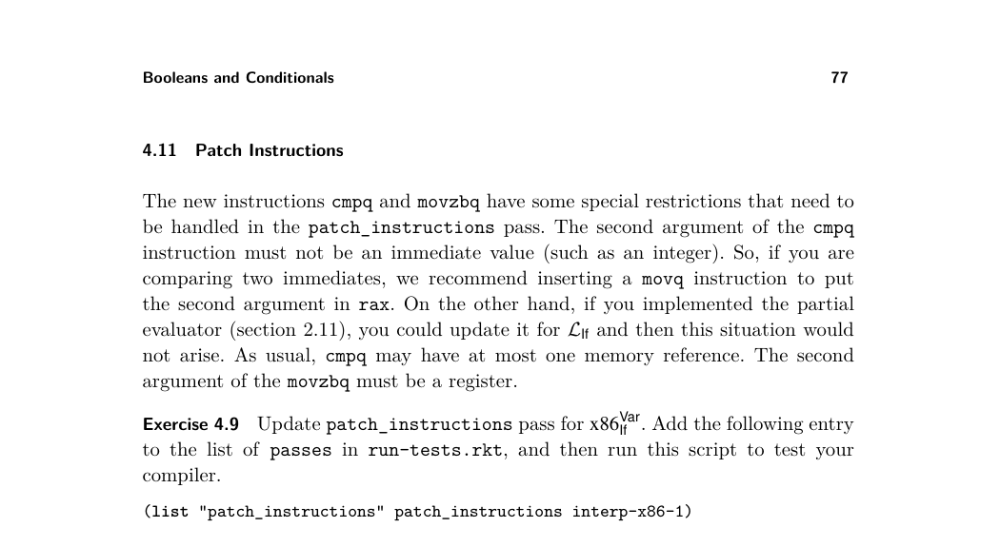
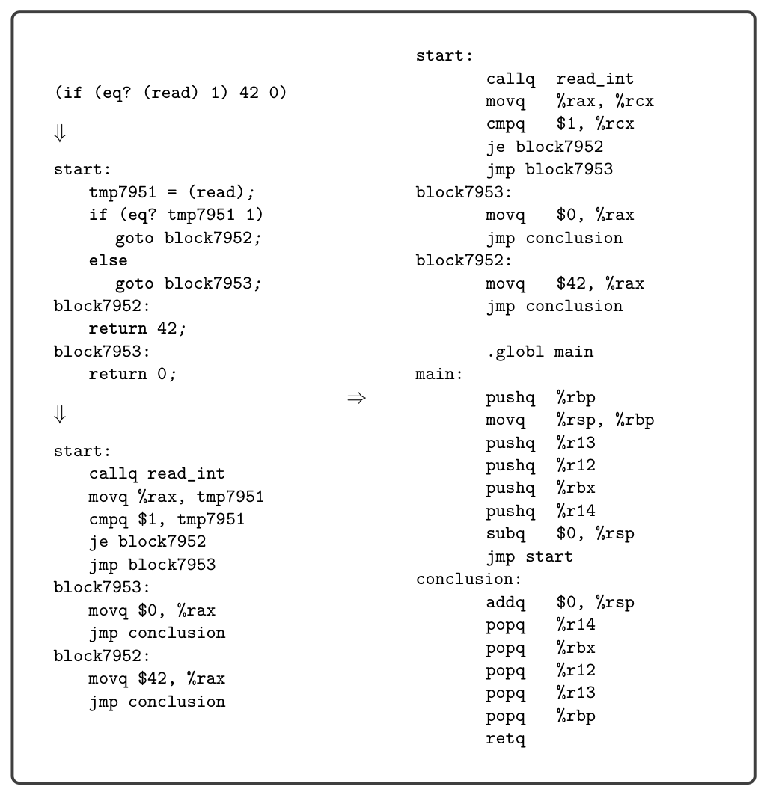
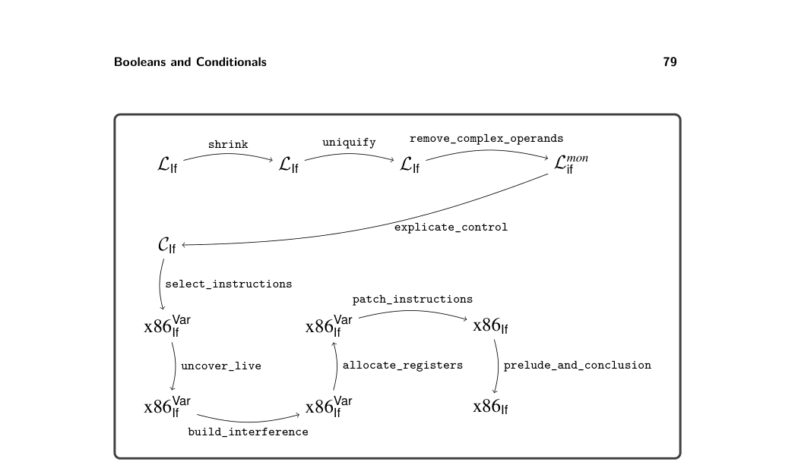
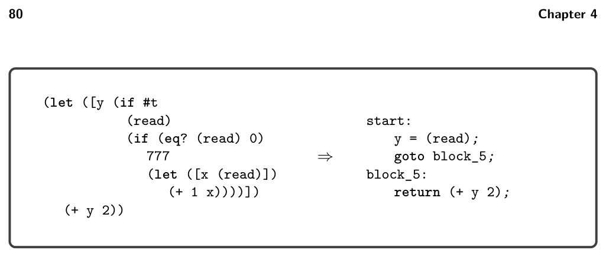
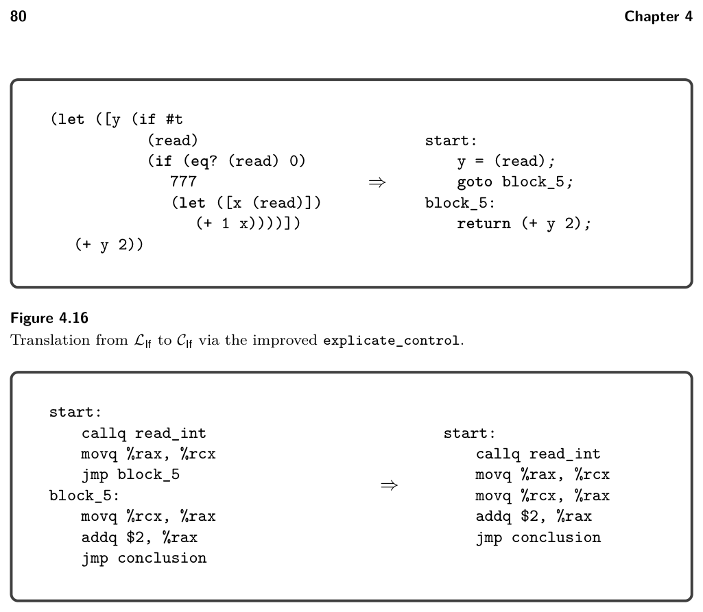
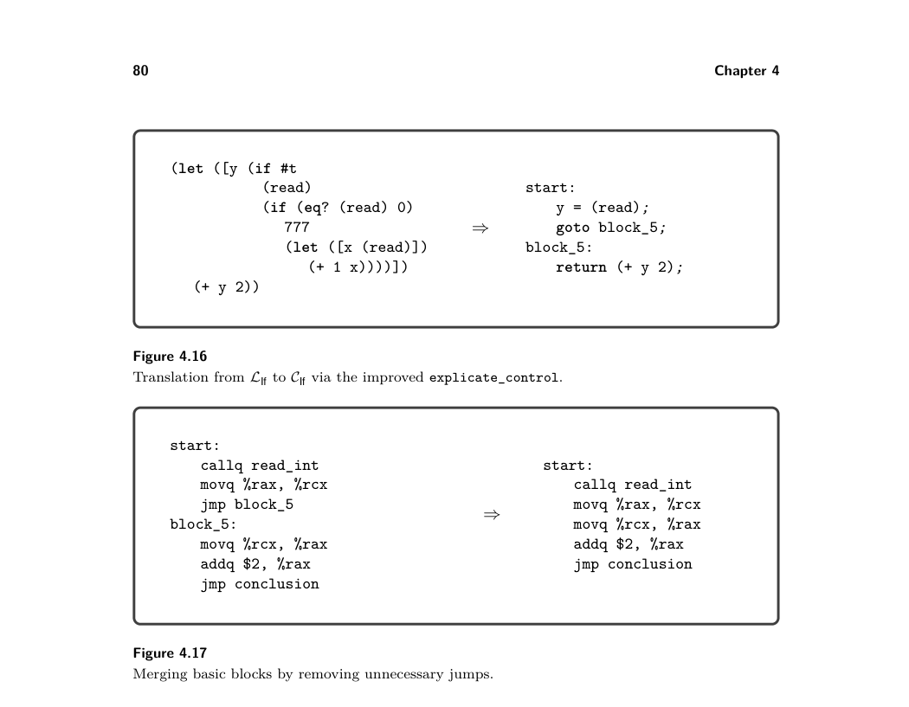

# 4.12 Challenge: Optimize Blocks and Remove Jumps


*Figure 4.14*

## 4.12 Challenge: Optimize Blocks and Remove Jumps

We discuss two challenges that involve optimizing the control-flow of the program.

4.12.1 Optimize Blocks The algorithm for explicate_control that we discussed in section 4.8 sometimes generates too many blocks. It creates a block whenever a continuation might get used more than once (for example, whenever the cont parameter is passed into two or more recursive calls). However, some continuation arguments may not be used at all. Consider the case for the constant #t in explicate_pred, in which we discard the els continuation. The following example program falls into this case, and it creates two unused blocks.

```
start:
y = (read);
goto block_5;
block_5:
return (+ y 2);
block_6:
y = 777;
goto block_5;
block_7:
x = (read);
y = (+ 1 x2);
goto block_5;
```

```
(let ([y (if #t
(read)
(if (eq? (read) 0)
777
(let ([x (read)])
(+ 1 x))))])
(+ y 2))
```

⇒


*Figure 4.14*

The question is, how can we decide whether to create a basic block? Lazy evalua- tion (Friedman and Wise 1976) can solve this conundrum by delaying the creation of a basic block until the point in time at which we know that it will be used. Racket provides support for lazy evaluation with the racket/promise package. The expression (delay e1 … en) creates a promise in which the evaluation of the expressions is postponed. When (force p) is applied to a promise p for the first time, the expressions e1 … en are evaluated and the result of en is cached in the promise and returned. If force is applied again to the same promise, then the cached result is returned. If force is applied to an argument that is not a promise, force simply returns the argument.


*Figure 4.15*

We use promises for the input and output of the functions explicate_pred, explicate_assign, and explicate_tail. So, instead of taking and returning tail expressions, they take and return promises. Furthermore, when we come to a situation in which a continuation might be used more than once, as in the case for if in explicate_pred, we create a delayed computation that creates a basic block for each continuation (if there is not already one) and then returns a goto statement to that basic block. When we come to a situation in which we have a promise but need an actual piece of code, for example, to create a larger piece of code with a constructor such as Seq, then insert a call to force. Also, we must modify the create_block function to begin with delay to create a promise. When forced, this promise forces the original promise. If that returns a Goto (because the block was already added to basic-blocks), then we return the Goto. Otherwise, we add the block to basic-blocks and return a Goto to the new label.

```
(define (create_block tail)
(delay
(define t (force tail))
(match t
[(Goto label) (Goto label)]
[else
(let ([label (gensym 'block)])
(set! basic-blocks (cons (cons label t) basic-blocks))
(Goto label))])))
```


*Figure 4.16*


*Figure 4.17*


*Figure 4.16*

Exercise 4.10 Implement the improvements to the explicate_control pass. Check that it removes trivial blocks in a few example programs. Then check that your compiler still passes all your tests.

4.12.2 Remove Jumps There is an opportunity for removing jumps that is apparent in the example of figure 4.16. The start block ends with a jump to block_5, and there are no other jumps to block_5 in the rest of the program. In this situation we can avoid the run- time overhead of this jump by merging block_5 into the preceding block, which in this case is the start block. Figure 4.17 shows the output of allocate_registers on the left and the result of this optimization on the right.

Exercise 4.11 Implement a pass named remove_jumps that merges basic blocks into their preceding basic block, when there is only one preceding block. The pass should translate from x86Var If to x86Var If . In the run-tests.rkt script, add the following entry to the list of passes between allocate_registers and patch_instructions:

