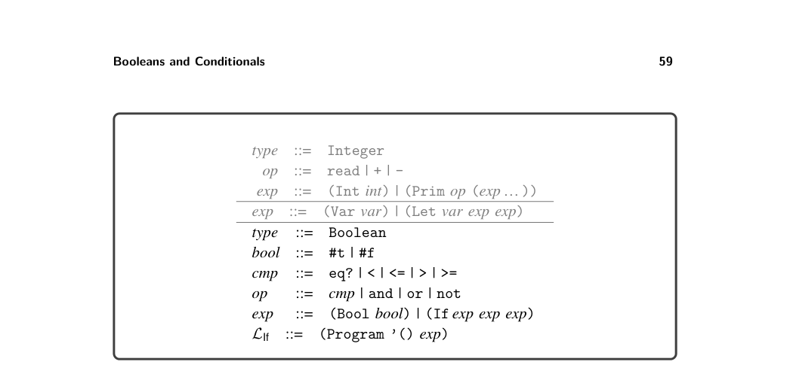
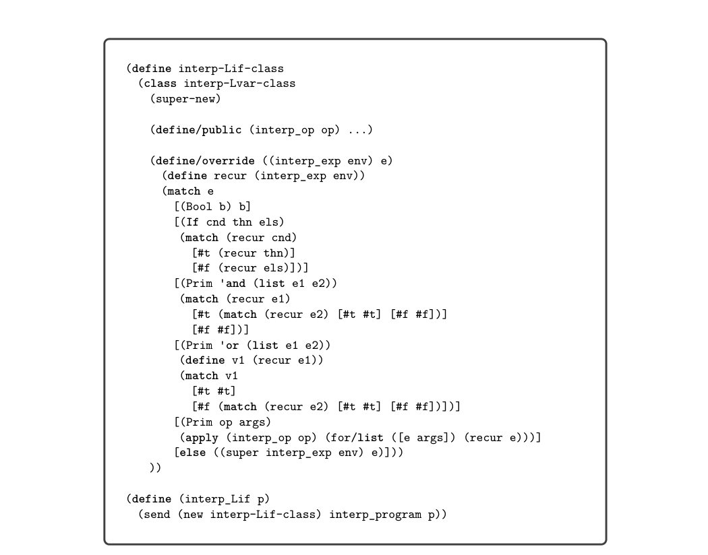
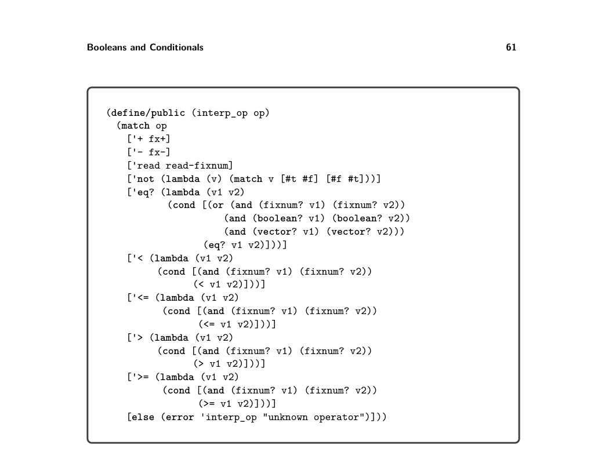
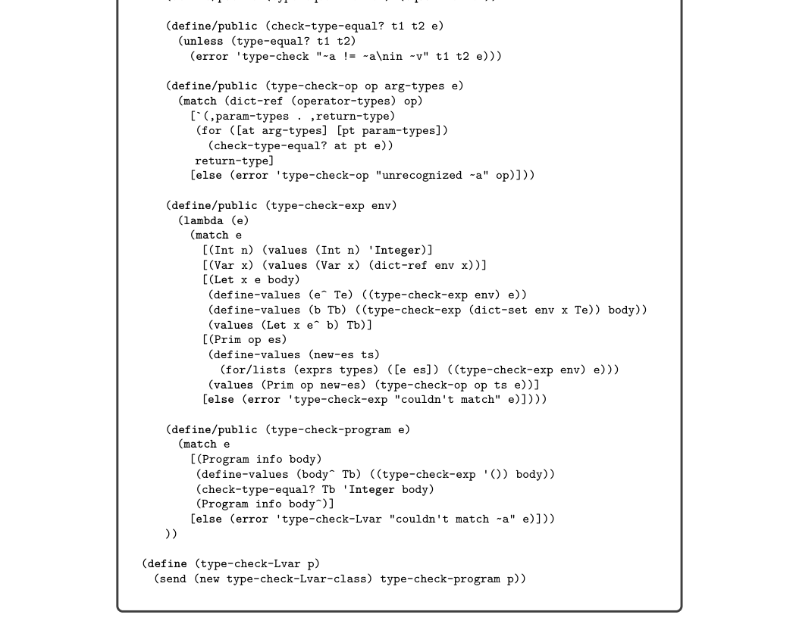
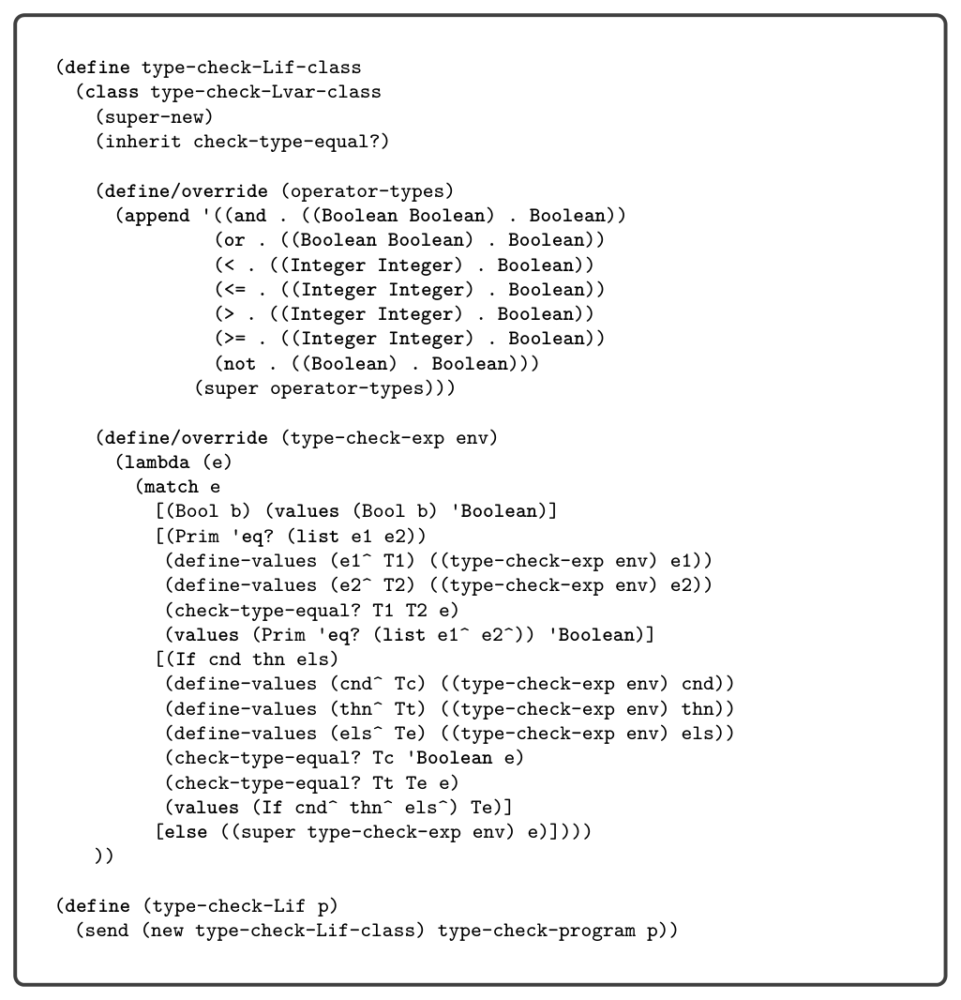

# 4.2 Type Checking LIf Programs


*Figure 4.2 The abstract syntax of LIf.*

that differs with each operation into the interp_op method shown in figure 4.4. We handle the and and or operations separately because of their short-circuiting behavior.

4.2 Type Checking LIf Programs

It is helpful to think about type checking in two complementary ways. A type checker predicts the type of value that will be produced by each expression in the program. For LIf, we have just two types, Integer and Boolean. So, a type checker should predict that

(+ 10 (- (+ 12 20)))

produces a value of type Integer, whereas

(and (not #f) #t)

produces a value of type Boolean. A second way to think about type checking is that it enforces a set of rules about which operators can be applied to which kinds of values. For example, our type checker for LIf signals an error for the following expression:

(not (+ 10 (- (+ 12 20))))

The subexpression (+ 10 (- (+ 12 20))) has type Integer, but the type checker enforces the rule that the argument of not must be an expression of type Boolean. We implement type checking using classes and methods because they provide the open recursion needed to reuse code as we extend the type checker in subse- quent chapters, analogous to the use of classes and methods for the interpreters (section 2.1.1). We separate the type checker for the LVar subset into its own class, shown in figure 4.5. The type checker for LIf is shown in figure 4.6, and it inherits from the


*Figure 4.3 Interpreter for the LIf language. (See figure 4.4 for interp-op.)*

type checker for LVar. These type checkers are in the files type-check-Lvar.rkt and type-check-Lif.rkt of the support code. Each type checker is a structurally recursive function over the AST. Given an input expression e, the type checker either signals an error or returns an expression and its type. It returns an expression because there are situations in which we want to change or update the expression. Next we discuss the type_check_exp function of LVar shown in figure 4.5. The type of an integer constant is Integer. To handle variables, the type checker uses the environment env to map variables to types. Consider the case for let. We type check the initializing expression to obtain its type T and then associate type T with the variable x in the environment used to type check the body of the let. Thus, when the type checker encounters a use of variable x, it can find its type in the environment. Regarding primitive operators, we recursively analyze the arguments and then invoke type_check_op to check whether the argument types are allowed.


*Figure 4.4 Interpreter for the primitive operators in the LIf language.*

Several auxiliary methods are used in the type checker. The method operator-types defines a dictionary that maps the operator names to their parameter and return types. The type-equal? method determines whether two types are equal, which for now simply dispatches to equal? (deep equality). The check-type-equal? method triggers an error if the two types are not equal. The type-check-op method looks up the operator in the operator-types dictionary and then checks whether the argument types are equal to the parameter types. The result is the return type of the operator. The definition of the type checker for LIf is shown in figure 4.6. The type of a Boolean constant is Boolean. The operator-types function adds dictionary entries for the new operators. The equality operator requires the two arguments to have the same type, and therefore we handle it separately from the other operators. The condition of an if must be of Boolean type, and the two branches must have the same type.

Exercise 4.1 Create ten new test programs in LIf. Half the programs should have a type error. For those programs, create an empty file with the same base name and with file extension .tyerr. For example, if the test cond_test_14.rkt is expected

```
(define type-check-Lvar-class
(class object%
(super-new)
```

```
(define/public (operator-types)
'((+ . ((Integer Integer) . Integer))
(- . ((Integer Integer) . Integer))
(read . (() . Integer))))
```


*Figure 4.5 Type checker for the LVar language.*


*Figure 4.6 Type checker for the LIf language.*

to error, then create an empty file named cond_test_14.tyerr. This indicates to interp-tests and compiler-tests that a type error is expected. The other half of the test programs should not have type errors. In the run-tests.rkt script, change the second argument of interp-tests and compiler-tests to type-check-Lif, which causes the type checker to run prior to the compiler passes. Temporarily change the passes to an empty list and run the script, thereby checking that the new test programs either type check or do not, as intended. Run the test script to check that these test programs type check as expected.

