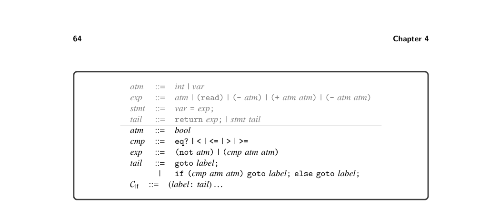
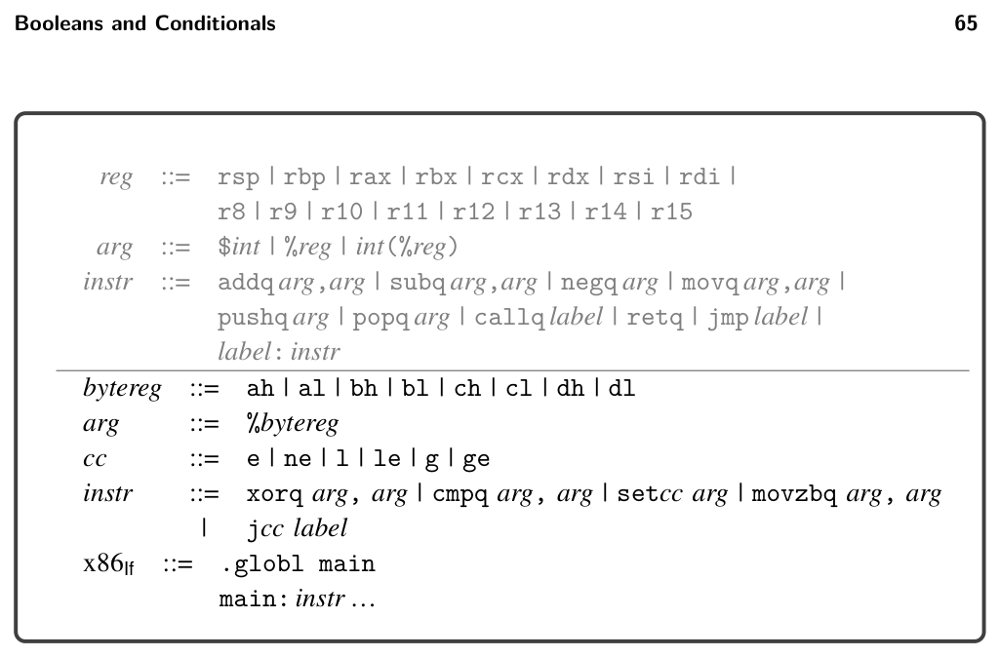

# 4.4 The x86If Language

*Figure 4.7 The concrete syntax of the CIf intermediate language, an extension of CVar (figure 2.12).*

*Figure 4.8 The abstract syntax of CIf, an extension of CVar (figure 2.13).*

4.3 The CIf Intermediate Language

The CIf language builds on CVar by adding logical and comparison operators to the exp nonterminal and the literals #t and #f to the arg nonterminal. Regarding con- trol flow, CIf adds goto and if statements to the tail nonterminal. The condition of an if statement is a comparison operation and the branches are goto statements, making it straightforward to compile if statements to x86. The CProgram construct contains an alist mapping labels to tail expressions. A goto statement transfers con- trol to the tail expression corresponding to its label. Figure 4.7 defines the concrete syntax of the CIf intermediate language, and figure 4.8 defines its abstract syntax.

4.4 The x86If Language

To implement Booleans, the new logical operations, the comparison operations, and the if expression, we delve further into the x86 language. Figures 4.9 and 4.10 present the definitions of the concrete and abstract syntax for the x86If subset of

*Figure 4.9 The concrete syntax of x86If (extends x86Int of figure 2.6).*

x86, which includes instructions for logical operations, comparisons, and conditional jumps. As x86 does not provide direct support for Booleans, we take the usual approach of encoding Booleans as integers, with True as 1 and False as 0. Furthermore, x86 does not provide an instruction that directly implements logical negation (not in LIf and CIf). However, the xorq instruction can be used to encode not. The xorq instruction takes two arguments, performs a pairwise exclusive-or (XOR) operation on each bit of its arguments, and writes the results into its second argument. Recall the following truth table for exclusive-or:

0 1 0 0 1 1 1 0

For example, applying XOR to each bit of the binary numbers 0011 and 0101 yields 0110. Notice that in the row of the table for the bit 1, the result is the opposite of the second bit. Thus, the not operation can be implemented by xorq with 1 as the first argument, as follows, where arg is the translation of atm to x86:

var = (not atm); ⇒ movq arg,var xorq $1,var

Next we consider the x86 instructions that are relevant for compiling the com- parison operations. The cmpq instruction compares its two arguments to determine whether one argument is less than, equal to, or greater than the other argument. The cmpq instruction is unusual regarding the order of its arguments and where the result is placed. The argument order is backward: if you want to test whether x < y, then write cmpq y, x. The result of cmpq is placed in the special EFLAGS

