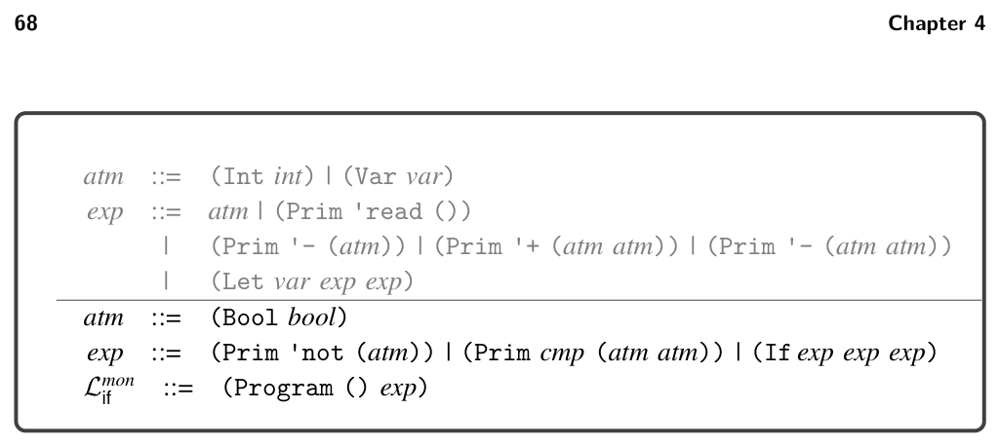
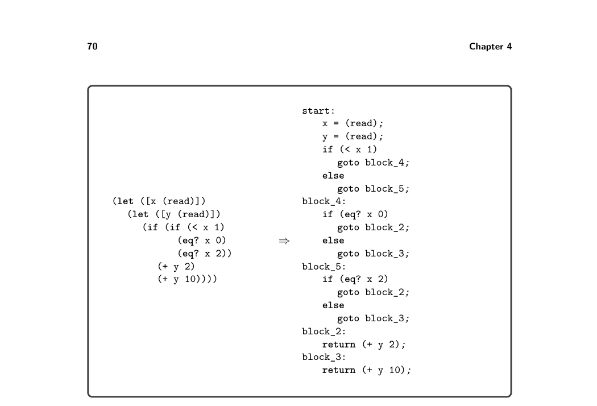
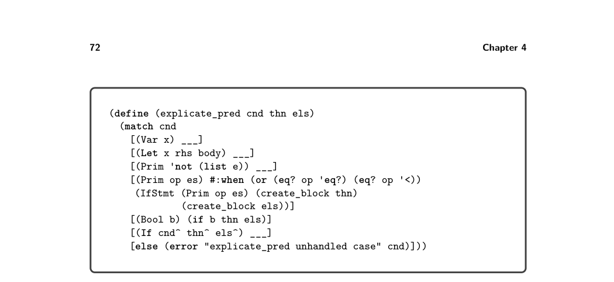

# 4.8 Explicate Control


*Figure 4.11*

not to replace its condition with a temporary variable, because that would interfere with the generation of high-quality output in the upcoming explicate_control pass.

Exercise 4.4 Add cases for Boolean constants and if to the rco_atom and rco_exp functions. Create three new LIf programs that exercise the interesting code in this pass. In the run-tests.rkt script, add the following entry to the list of passes and then run the script to test your compiler.

(list "remove-complex" remove_complex_operands interp-Lif type-check-Lif)

4.8 Explicate Control

Recall that the purpose of explicate_control is to make the order of evaluation explicit in the syntax of the program. With the addition of if, this becomes more interesting. The explicate_control pass translates from Lmon if to CIf. The main challenge to overcome is that the condition of an if can be an arbitrary expression in Lmon if , whereas in CIf the condition must be a comparison. As a motivating example, consider the following Lmon if program that has an if expression nested in the condition of another if:

```
(let ([x (read)])
(let ([y (read)])
(if (if (< x 1) (eq? x 0) (eq? x 2))
(+ y 2)
(+ y 10))))
```

The naive way to compile if and the comparison operations would be to handle each of them in isolation, regardless of their context. Each comparison would be translated into a cmpq instruction followed by several instructions to move the result from the EFLAGS register into a general purpose register or stack location. Each if would be translated into a cmpq instruction followed by a conditional jump. The generated code for the inner if in this example would be as follows:

```
cmpq $1, x
setl %al
movzbq %al, tmp
cmpq $1, tmp
je then_branch_1
jmp else_branch_1
```

Notice that the three instructions starting with setl are redundant; the conditional jump could come immediately after the first cmpq. Our goal is to compile if expressions so that the relevant comparison instruction appears directly before the conditional jump. For example, we want to generate the following code for the inner if:

```
cmpq $1, x
jl then_branch_1
jmp else_branch_1
```

One way to achieve this goal is to reorganize the code at the level of Lmon if , pushing the outer if inside the inner one, yielding the following code:

```
(let ([x (read)])
(let ([y (read)])
(if (< x 1)
(if (eq? x 0)
(+ y 2)
(+ y 10))
(if (eq? x 2)
(+ y 2)
(+ y 10)))))
```

Unfortunately, this approach duplicates the two branches from the outer if, and a compiler must never duplicate code! After all, the two branches could be very large expressions. How can we apply this transformation without duplicating code? In other words, how can two different parts of a program refer to one piece of code? The answer is that we must move away from abstract syntax trees and instead use graphs. At the level of x86 assembly, this is straightforward because we can label the code for each branch and insert jumps in all the places that need to execute the branch. In this way, jump instructions are edges in the graph and the basic blocks are the nodes. Likewise, our intermediate language CIf provides the ability to label a sequence of statements and to jump to a label via goto. As a preview of what explicate_control will do, figure 4.12 shows the output of explicate_control on this example. Note how the condition of every if is a comparison operation and that we have not duplicated any code but instead have used labels and goto to enable sharing of code. Recall that in section 2.6 we implement explicate_control for Lmon Var using two recursive functions, explicate_tail and explicate_assign. The former function


*Figure 4.12*

translates expressions in tail position, whereas the latter function translates expres- sions on the right-hand side of a let. With the addition of if expression to Lmon if we have a new kind of position to deal with: the predicate position of the if. We need another function, explicate_pred, that decides how to compile an if by analyzing its condition. So, explicate_pred takes an Lmon if expression and two CIf tails for the then branch and else branch and outputs a tail. In the following para- graphs we discuss specific cases in the explicate_tail, explicate_assign, and explicate_pred functions.

4.8.1 Explicate Tail and Assign The explicate_tail and explicate_assign functions need additional cases for Boolean constants and if. The cases for if should recursively compile the two branches using either explicate_tail or explicate_assign, respectively. The cases should then invoke explicate_pred on the condition expression, passing in the generated code for the two branches. For example, consider the following program with an if in tail position.

```
(let ([x (read)])
(if (eq? x 0) 42 777))
```

The two branches are recursively compiled to return statements. We then del- egate to explicate_pred, passing the condition (eq? x 0) and the two return statements. We return to this example shortly when we discuss explicate_pred. Next let us consider a program with an if on the right-hand side of a let.

```
(let ([y (read)])
(let ([x (if (eq? y 0) 40 777)])
(+ x 2)))
```

Note that the body of the inner let will have already been compiled to return (+ x 2); and passed as the cont parameter of explicate_assign. We’ll need to use cont to recursively process both branches of the if, and we do not want to duplicate code, so we generate the following block using an auxiliary function named create_block, discussed in the next section.

```
block_6:
return (+ x 2)
```

We then use goto block_6; as the cont argument for compiling the branches. So the two branches compile to

x = 40; goto block_6; and x = 777; goto block_6;

Finally, we delegate to explicate_pred, passing the condition (eq? y 0) and the previously presented code for the branches.

4.8.2 Create Block We recommend implementing the create_block auxiliary function as follows, using a global variable basic-blocks to store a dictionary that maps labels to tail expres- sions. The main idea is that create_block generates a new label and then associates the given tail with the new label in the basic-blocks dictionary. The result of create_block is a Goto to the new label. However, if the given tail is already a Goto, then there is no need to generate a new label and entry in basic-blocks; we can simply return that Goto.

```
(define (create_block tail)
(match tail
[(Goto label) (Goto label)]
[else
(let ([label (gensym 'block)])
(set! basic-blocks (cons (cons label tail) basic-blocks))
(Goto label))]))
```

4.8.3 Explicate Predicate The skeleton for the explicate_pred function is given in figure 4.13. It takes three parameters: (1) cnd, the condition expression of the if; (2) thn, the code generated by explicate for the then branch; and (3) els, the code generated by explicate for


*Figure 4.13*

the else branch. The explicate_pred function should match on cnd with a case for every kind of expression that can have type Boolean. Consider the case for comparison operators. We translate the comparison to an if statement whose branches are goto statements created by applying create_block to the thn and els parameters. Let us illustrate this translation by returning to the program with an if expression in tail position, shown next. We invoke explicate_pred on its condition (eq? x 0).

```
(let ([x (read)])
(if (eq? x 0) 42 777))
```

The two branches 42 and 777 were already compiled to return statements, from which we now create the following blocks:

```
block_1:
return 42;
block_2:
return 777;
```

After that, explicate_pred compiles the comparison (eq? x 0) to the following if statement:

```
if (eq? x 0)
goto block_1;
else
goto block_2;
```

Next consider the case for Boolean constants. We perform a kind of partial eval- uation and output either the thn or els parameter, depending on whether the constant is #t or #f. Let us illustrate this with the following program:

(if #t 42 777)

Again, the two branches 42 and 777 were compiled to return statements, so explicate_pred compiles the constant #t to the code for the then branch.

return 42;

This case demonstrates that we sometimes discard the thn or els blocks that are input to explicate_pred. The case for if expressions in explicate_pred is particularly illuminating because it deals with the challenges discussed previously regarding nested if expres- sions (figure 4.12). The thn^ and els^ branches of the if inherit their context from the current one, that is, predicate context. So, you should recursively apply explicate_pred to the thn^ and els^ branches. For both of those recursive calls, pass thn and els as the extra parameters. Thus, thn and els may be used twice, once inside each recursive call. As discussed previously, to avoid duplicating code, we need to add them to the dictionary of basic blocks so that we can instead refer to them by name and execute them with a goto. Figure 4.12 shows the output of the remove_complex_operands pass and then the explicate_control pass on the example program. We walk through the output program. Following the order of evaluation in the output of remove_complex_operands, we first have two calls to (read) and then the compar- ison (< x 1) in the predicate of the inner if. In the output of explicate_control, in the block labeled start, two assignment statements are followed by an if state- ment that branches to block_4 or block_5. The blocks associated with those labels contain the translations of the code (eq? x 0) and (eq? x 2), respectively. In particular, we start block_4 with the comparison (eq? x 0) and then branch to block_2 or block_3, which correspond to the two branches of the outer if, that is, (+ y 2) and (+ y 10). The story for block_5 is similar to that of block_4.

4.8.4 Interactions between Explicate and Shrink The way in which the shrink pass transforms logical operations such as and and or can impact the quality of code generated by explicate_control. For example, consider the following program:

```
(if (and (eq? (read) 0) (eq? (read) 1))
0
42)
```

The and operation should transform into something that the explicate_pred func- tion can analyze and descend through to reach the underlying eq? conditions. Ideally, for this program your explicate_control pass should generate code similar to the following:

