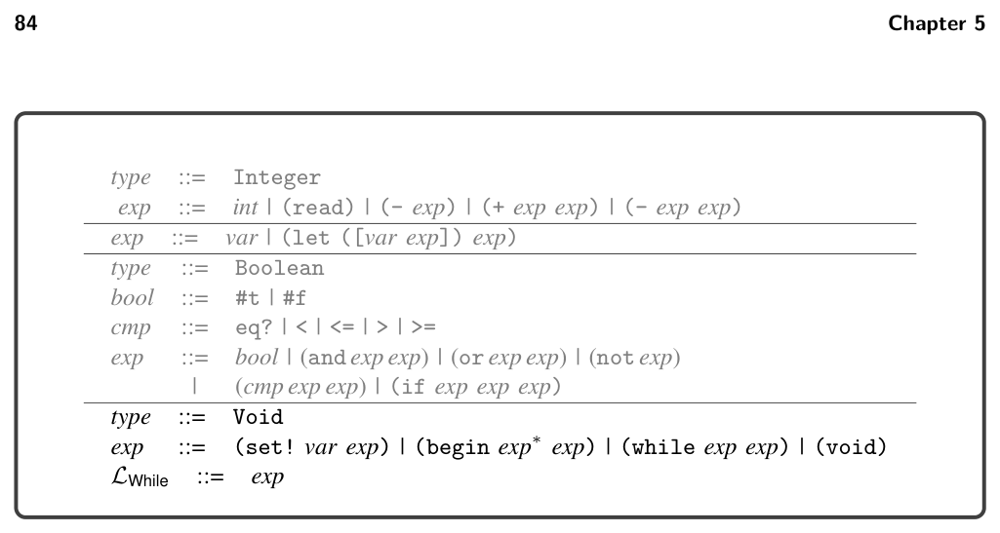
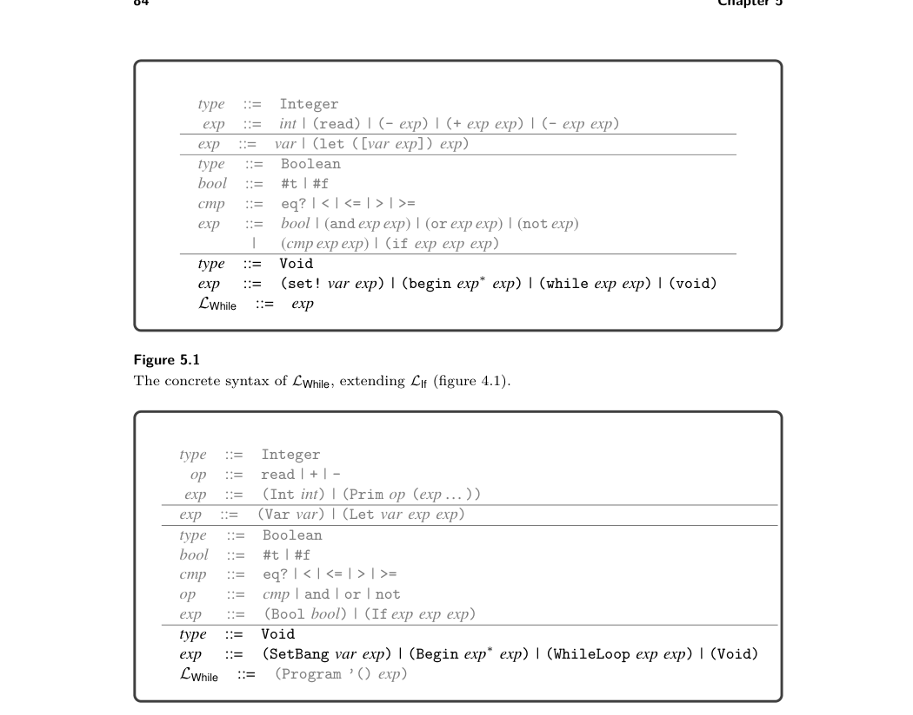
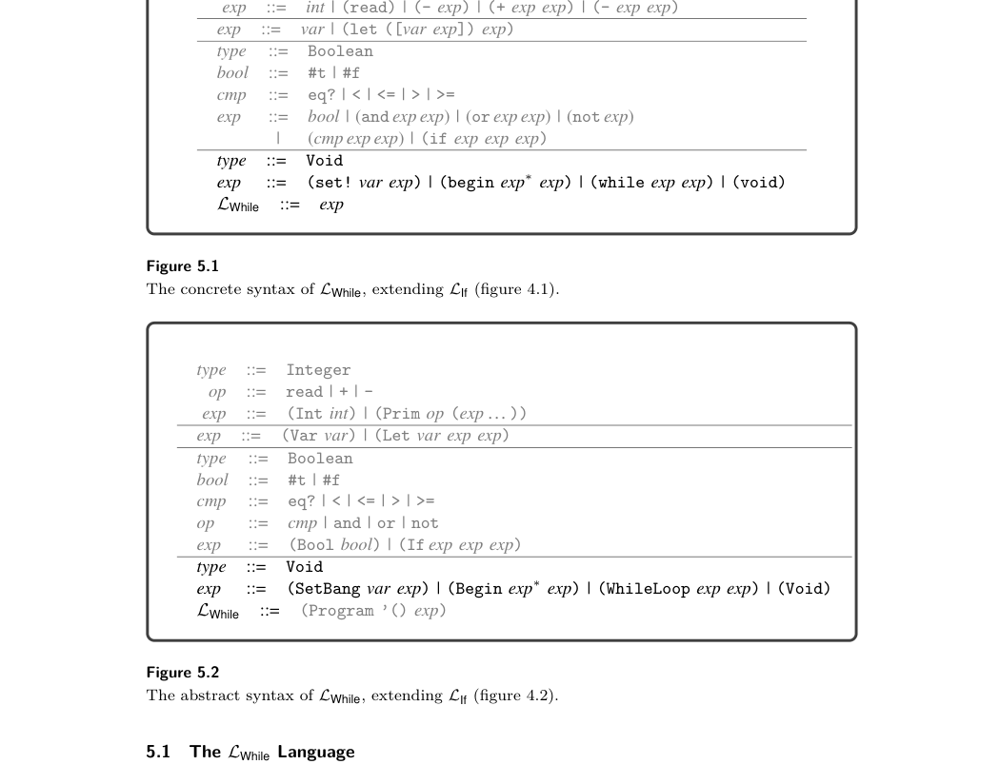
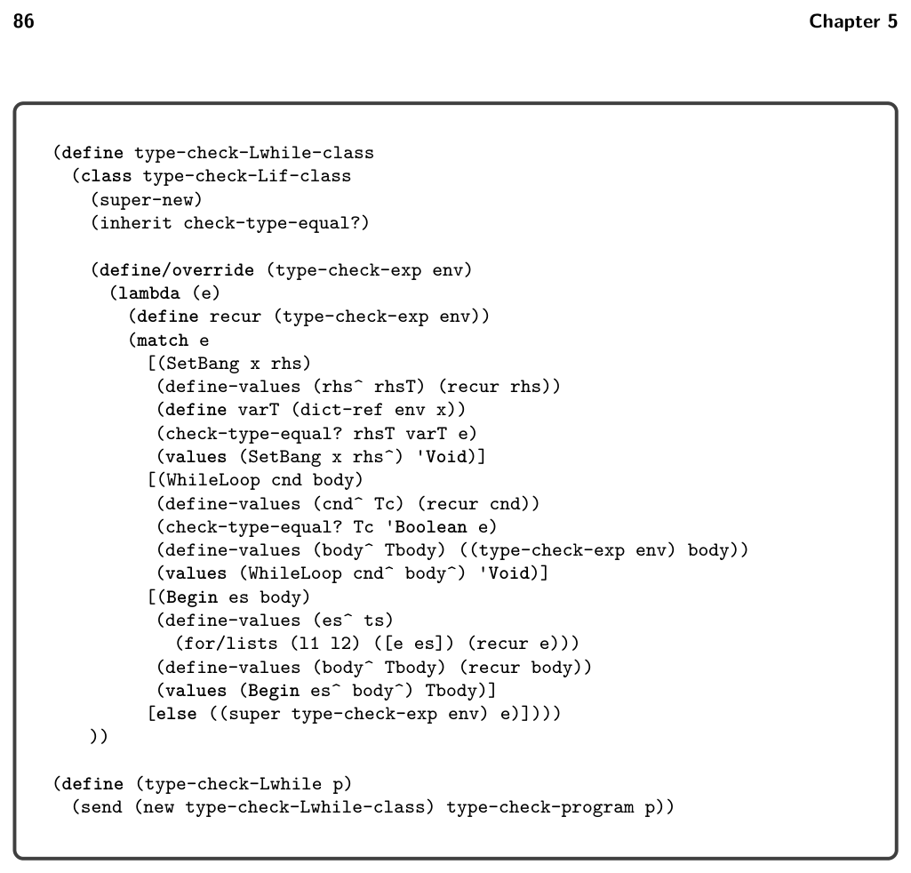
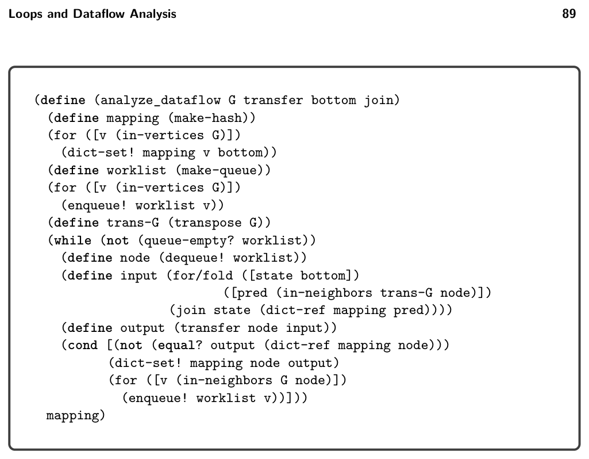
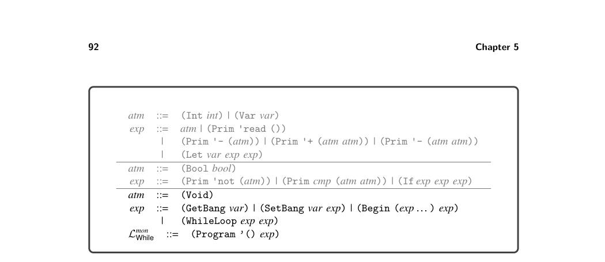
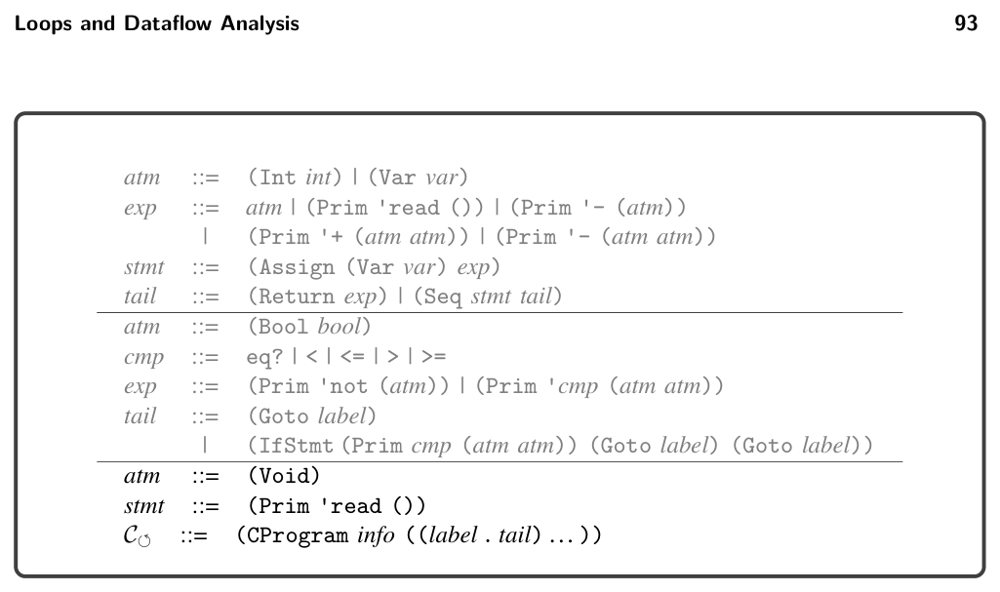
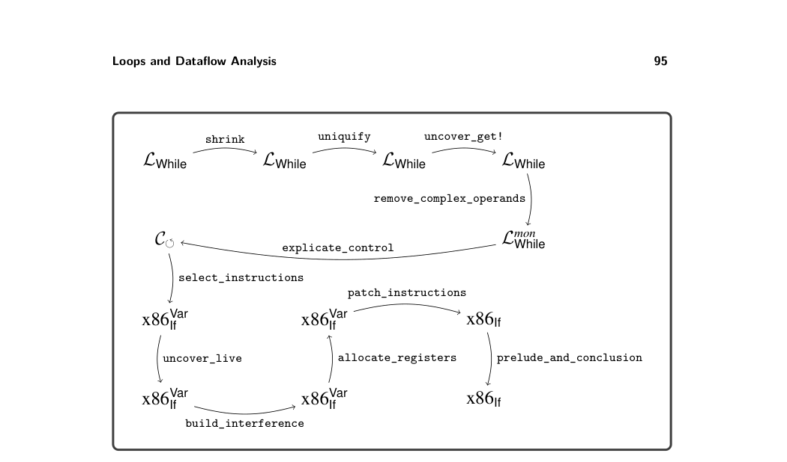
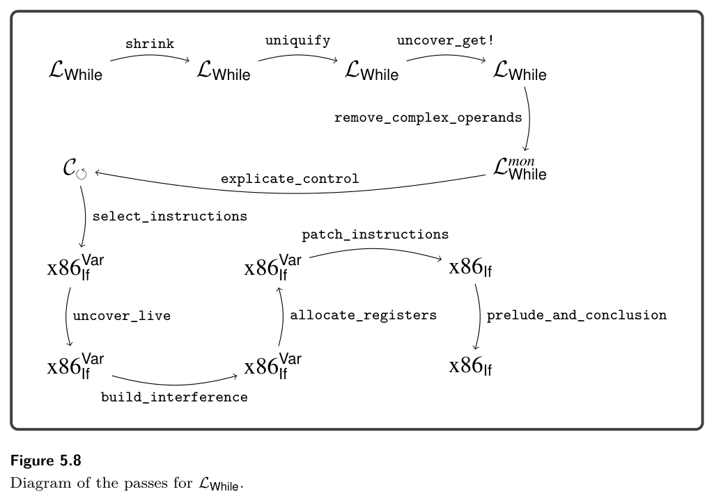

# 5 Loops and Dataflow Analysis

5

Loops and Dataflow Analysis

In this chapter we study two features that are the hallmarks of imperative program- ming languages: loops and assignments to local variables. The following example demonstrates these new features by computing the sum of the first five positive integers:

```
(let ([sum 0])
(let ([i 5])
(begin
(while (> i 0)
(begin
(set! sum (+ sum i))
(set! i (- i 1))))
sum)))
```

The while loop consists of a condition and a body.1 The body is evaluated repeat- edly so long as the condition remains true. The set! consists of a variable and a right-hand side expression. The set! updates value of the variable to the value of the right-hand side. The primary purpose of both the while loop and set! is to cause side effects, so they do not give a meaningful result value. Instead, their result is the #<void> value. The expression (void) is an explicit way to create the #<void> value, and it has type Void. The #<void> value can be passed around just like other values inside an LWhile program, and it can be compared for equal- ity with another #<void> value. However, there are no other operations specific to the #<void> value in LWhile. In contrast, Racket defines the void? predicate that returns #t when applied to #<void> and #f otherwise.2 With the addition of side effect-producing features such as while loop and set!, it is helpful to include a language feature for sequencing side effects: the begin expression. It consists of one or more subexpressions that are evaluated left to right.

* The while loop is not a built-in feature of the Racket language, but Racket includes many
  looping constructs and it is straightforward to define while as a macro.
* Racket’s Void type corresponds to what is often called the Unit type. Racket’s Void type is
  inhabited by a single value #<void>, which corresponds to unit or () in the literature (Pierce
  2002).


*Figure 5.1 The concrete syntax of LWhile, extending LIf (figure 4.1).*


*Figure 5.2 The abstract syntax of LWhile, extending LIf (figure 4.2).*


*Figure 5.1 shows the definition of the concrete syntax of LWhile, and figure 5.2 shows the definition of its abstract syntax. The definitional interpreter for LWhile is shown in figure 5.3. We add new cases for SetBang, WhileLoop, Begin, and Void, and we make changes to the cases for Var and Let regarding variables. To support assign- ment to variables and to make their lifetimes indefinite (see the second example in section 8.2), we box the value that is bound to each variable (in Let). The case for Var unboxes the value. Now we discuss the new cases. For SetBang, we find the variable in the environment to obtain a boxed value, and then we change it using set-box! to the result of evaluating the right-hand side. The result value of a SetBang is #<void>. For the WhileLoop, we repeatedly (1) evaluate the condition, and if the result is true, (2) evaluate the body. The result value of a while loop*


*Figure 5.3 Interpreter for LWhile.*

is also #<void>. The (Begin es body) expression evaluates the subexpressions es for their effects and then evaluates and returns the result from body. The (Void) expression produces the #<void> value. The definition of the type checker for LWhile is shown in figure 5.4. The type checking of the SetBang expression requires the type of the variable and the right- hand side to agree. The result type is Void. For while, the condition must be a Boolean and the result type is Void. For Begin, the result type is the type of its last subexpression. At first glance, the translation of these language features to x86 seems straight- forward because the CIf intermediate language already supports all the ingredients that we need: assignment, goto, conditional branching, and sequencing. However, complications arise, which we discuss in the next section. After that we introduce the changes necessary to the existing passes.

## 5.2 Cyclic Control Flow and Dataflow Analysis

Up until this point, the programs generated in explicate_control were guaranteed to be acyclic. However, each while loop introduces a cycle. Does that matter? Indeed, it does. Recall that for register allocation, the compiler performs liveness


*Figure 5.4 Type checker for the LWhile language.*

analysis to determine which variables can share the same register. To accomplish this, we analyzed the control-flow graph in reverse topological order (section 4.10.1), but topological order is well defined only for acyclic graphs. Let us return to the example of computing the sum of the first five posi- tive integers. Here is the program after instruction selection but before register allocation.

```
(define (main) : Integer
mainstart:
movq $0, sum
movq $5, i
jmp block5
block5:
movq i, tmp3
cmpq tmp3, $0
jl block7
jmp block8
```

```
block7:
addq i, sum
movq $1, tmp4
negq tmp4
addq tmp4, i
jmp block5
block8:
movq $27, %rax
addq sum, %rax
jmp mainconclusion)
```

Recall that liveness analysis works backward, starting at the end of each function. For this example we could start with block8 because we know what is live at the beginning of the conclusion: only rax and rsp. So the live-before set for block8 is {rsp,sum}. Next we might try to analyze block5 or block7, but block5 jumps to block7 and vice versa, so it seems that we are stuck. The way out of this impasse is to realize that we can compute an underap- proximation of each live-before set by starting with empty live-after sets. By underapproximation, we mean that the set contains only variables that are live for some execution of the program, but the set may be missing some variables that are live. Next, the underapproximations for each block can be improved by (1) updating the live-after set for each block using the approximate live-before sets from the other blocks, and (2) performing liveness analysis again on each block. In fact, by iterating this process, the underapproximations eventually become the correct solutions! This approach of iteratively analyzing a control-flow graph is applicable to many static analysis problems and goes by the name dataflow analysis. It was invented by Kildall (1973) in his PhD thesis at the University of Washington. Let us apply this approach to the previously presented example. We use the empty set for the initial live-before set for each block. Let m0 be the following mapping from label names to sets of locations (variables and registers):

mainstart: {}, block5: {}, block7: {}, block8: {}

Using the above live-before approximations, we determine the live-after for each block and then apply liveness analysis to each block. This produces our next approximation m1 of the live-before sets.

mainstart: {}, block5: {i}, block7: {i, sum}, block8: {rsp, sum}

For the second round, the live-after for mainstart is the current live-before for block5, which is {i}. Therefore the liveness analysis for mainstart computes the empty set. The live-after for block5 is the union of the live-before sets for block7 and block8, which is {i, rsp, sum}. So the liveness analysis for block5 computes {i, rsp, sum}. The live-after for block7 is the live-before for block5 (from the previous iteration), which is {i}. So the liveness analysis for block7 remains {i, sum}. Together these yield the following approximation m2 of the live-before sets:

mainstart: {}, block5: {i, rsp, sum}, block7: {i, sum}, block8: {rsp, sum}

In the preceding iteration, only block5 changed, so we can limit our attention to mainstart and block7, the two blocks that jump to block5. As a result, the live- before sets for mainstart and block7 are updated to include rsp, yielding the following approximation m3:

mainstart: {rsp}, block5: {i,rsp,sum}, block7: {i,rsp,sum}, block8: {rsp,sum}

Because block7 changed, we analyze block5 once more, but its live-before set remains {i,rsp,sum}. At this point our approximations have converged, so m3 is the solution. This iteration process is guaranteed to converge to a solution by the Kleene fixed-point theorem, a general theorem about functions on lattices (Kleene 1952). Roughly speaking, a lattice is any collection that comes with a partial ordering ⊑ on its elements, a least element ⊥(pronounced bottom), and a join operator ⊔.3

When two elements are ordered mi ⊑mj, it means that mj contains at least as much information as mi, so we can think of mj as a better-than-or-equal-to approximation in relation to mi. The bottom element ⊥represents the complete lack of information, that is, the worst approximation. The join operator takes two lattice elements and combines their information; that is, it produces the least upper bound of the two. A dataflow analysis typically involves two lattices: one lattice to represent abstract states and another lattice that aggregates the abstract states of all the blocks in the control-flow graph. For liveness analysis, an abstract state is a set of locations. We form the lattice L by taking its elements to be sets of locations, the ordering to be set inclusion (⊆), the bottom to be the empty set, and the join operator to be set union. We form a second lattice M by taking its elements to be mappings from the block labels to sets of locations (elements of L). We order the mappings point-wise, using the ordering of L. So, given any two mappings mi and mj, mi ⊑M mj when mi(ℓ) ⊆mj(ℓ) for every block label ℓin the program. The bottom element of M is the mapping ⊥M that sends every label to the empty set, ⊥M(ℓ) = ∅. We can think of one iteration of liveness analysis applied to the whole program as being a function f on the lattice M. It takes a mapping as input and computes a new mapping. f(mi) = mi+1

Next let us think for a moment about what a final solution ms should look like. If we perform liveness analysis using the solution ms as input, we should get ms again as the output. That is, the solution should be a fixed point of the function f.

f(ms) = ms

Furthermore, the solution should include only locations that are forced to be there by performing liveness analysis on the program, so the solution should be the least fixed point. The Kleene fixed-point theorem states that if a function f is monotone (better inputs produce better outputs), then the least fixed point of f is the least upper bound of the ascending Kleene chain that starts at ⊥and iterates f as follows:

⊥⊑f(⊥) ⊑f(f(⊥)) ⊑· · · ⊑f n(⊥) ⊑· · ·

When a lattice contains only finitely long ascending chains, then every Kleene chain tops out at some fixed point after some number of iterations of f.

⊥⊑f(⊥) ⊑f(f(⊥)) ⊑· · · ⊑f k(⊥) = f k+1(⊥) = ms

* Technically speaking, we will be working with join semilattices.


*Figure 5.5 Generic work list algorithm for dataflow analysis.*

The liveness analysis is indeed a monotone function and the lattice M has finitely long ascending chains because there are only a finite number of variables and blocks in the program. Thus we are guaranteed that iteratively applying liveness analysis to all blocks in the program will eventually produce the least fixed point solution. Next let us consider dataflow analysis in general and discuss the generic work list algorithm (figure 5.5). The algorithm has four parameters: the control-flow graph G, a function transfer that applies the analysis to one block, and the bottom and join operators for the lattice of abstract states. The analyze_dataflow function is formulated as a forward dataflow analysis; that is, the inputs to the transfer function come from the predecessor nodes in the control-flow graph. However, live- ness analysis is a backward dataflow analysis, so in that case one must supply the analyze_dataflow function with the transpose of the control-flow graph. The algorithm begins by creating the bottom mapping, represented by a hash table. It then pushes all the nodes in the control-flow graph onto the work list (a queue). The algorithm repeats the while loop as long as there are items in the work list. In each iteration, a node is popped from the work list and processed. The input for the node is computed by taking the join of the abstract states of all the predecessor nodes. The transfer function is then applied to obtain the output abstract state. If the output differs from the previous state for this block, the mapping for this block is updated and its successor nodes are pushed onto the work list.

## 5.3 Mutable Variables and Remove Complex Operands

There is a subtle interaction between the remove_complex_operands pass, the addition of set!, and the left-to-right order of evaluation of Racket. Consider the following example:

```
(let ([x 2])
(+ x (begin (set! x 40) x)))
```

The result of this program is 42 because the first read from x produces 2 and the second produces 40. However, if we naively apply the remove_complex_operands pass to this example we obtain the following program whose result is 80!

```
(let ([x 2])
(let ([tmp (begin (set! x 40) x)])
(+ x tmp)))
```

The problem is that with mutable variables, the ordering between reads and writes is important, and the remove_complex_operands pass moved the set! to happen before the first read of x. We recommend solving this problem by giving special treatment to reads from mutable variables, that is, variables that occur on the left-hand side of a set!. We mark each read from a mutable variable with the form get! (GetBang in abstract syntax) to indicate that the read operation is effectful in that it can produce different results at different points in time. Let’s apply this idea to the following variation that also involves a variable that is not mutated:

```
(let ([x 2])
(let ([y 0])
(+ y (+ x (begin (set! x 40) x)))))
```

We first analyze this program to discover that variable x is mutable but y is not. We then transform the program as follows, replacing each occurrence of x with (get! x):

```
(let ([x 2])
(let ([y 0])
(+ y (+ (get! x) (begin (set! x 40) (get! x))))))
```

Now that we have a clear distinction between reads from mutable and immutable variables, we can apply the remove_complex_operands pass, where reads from immutable variables are still classified as atomic expressions but reads from mutable variables are classified as complex. Thus, remove_complex_operands yields the following program:

```
(let ([x 2])
(let ([y 0])
(let ([t1 x])
(let ([t2 (begin (set! x 40) x)])
(let ([t3 (+ t1 t2)])
(+ y t3))))))
```

The temporary variable t1 gets the value of x before the set!, so it is 2. The

temporary variable t2 gets the value of x after the set!, so it is 40. We do not generate a temporary variable for the occurrence of y because it’s an immutable variable. We want to avoid such unnecessary extra temporaries because they would needlessly increase the number of variables, making it more likely for some of them to be spilled. The result of this program is 42, the same as the result prior to remove_complex_operands. The approach that we’ve sketched requires only a small modification to remove_complex_operands to handle get!. However, it requires a new pass, called uncover-get!, that we discuss in section 5.4. As an aside, this problematic interaction between set! and the pass remove_complex_operands is particular to Racket and not its predecessor, the Scheme language. The key difference is that Scheme does not specify an order of evaluation for the arguments of an operator or function call (Sperber et al. 2009). Thus, a compiler for Scheme is free to choose any ordering: both 42 and 80 would be correct results for the example program. Interestingly, Racket is implemented on top of the Chez Scheme compiler (Dybvig 2006) and an approach similar to the one presented in this section (using extra let bindings to control the order of evaluation) is used in the translation from Racket to Scheme (Flatt et al. 2019). Having discussed the complications that arise from adding support for assignment and loops, we turn to discussing the individual compilation passes.

## 5.4 Uncover get!

The goal of this pass is to mark uses of mutable variables so that remove_complex_operands can treat them as complex expressions and thereby pre- serve their ordering relative to the side effects in other operands. So, the first step is to collect all the mutable variables. We recommend creating an auxiliary function for this, named collect-set!, that recursively traverses expressions, returning the set of all variables that occur on the left-hand side of a set!. Here’s an excerpt of its implementation.

```
(define (collect-set! e)
(match e
[(Var x) (set)]
[(Int n) (set)]
[(Let x rhs body)
(set-union (collect-set! rhs) (collect-set! body))]
[(SetBang var rhs)
(set-union (set var) (collect-set! rhs))]
...))
```

By placing this pass after uniquify, we need not worry about variable shadowing, and our logic for Let can remain simple, as in this excerpt. The second step is to mark the occurrences of the mutable variables with the new GetBang AST node (get! in concrete syntax). The following is an excerpt of the uncover-get!-exp function, which takes two parameters: the set of mutable


*Figure 5.6 Lmon While is LWhile in monadic normal form.*

variables set!-vars and the expression e to be processed. The case for (Var x) replaces it with (GetBang x) if it is a mutable variable or leaves it alone if not.

```
(define ((uncover-get!-exp set!-vars) e)
(match e
[(Var x)
(if (set-member? set!-vars x)
(GetBang x)
(Var x))]
...))
```

To wrap things up, define the uncover-get! function for processing a whole program, using collect-set! to obtain the set of mutable variables and then uncover-get!-exp to replace their occurrences with GetBang.

## 5.5 Remove Complex Operands

The new language forms, get!, set!, begin, and while are all complex expres- sions. The subexpressions of set!, begin, and while are allowed to be complex. Figure 5.6 defines the output language Lmon While of this pass. As usual, when a complex expression appears in a grammar position that needs to be atomic, such as the argument of a primitive operator, we must introduce a temporary variable and bind it to the complex expression. This approach applies, unchanged, to handle the new language forms. For example, in the following code there are two begin expressions appearing as arguments to the + operator. The output of rco_exp is then shown, in which the begin expressions have been bound to temporary variables. Recall that let expressions in Lmon While are allowed to have arbitrary expressions in their right-hand side expression, so it is fine to place begin there.


*Figure 5.7 The abstract syntax of C⟲, extending CIf (figure 4.8).*

```
(let ([x2 10])
(let ([y3 0])
(let ([tmp4 (begin
(set! y3 (read))
x2)])
(let ([tmp5 (begin
(set! x2 (read))
y3)])
(let ([tmp6 (+ tmp4 tmp5)])
(let ([tmp7 x2])
(+ tmp6 tmp7)))))))
```

```
(let ([x2 10])
(let ([y3 0])
(+ (+ (begin
(set! y3 (read))
(get! x2))
(begin
(set! x2 (read))
(get! y3)))
(get! x2))))
```

⇒

## 5.6 Explicate Control and C⟲

Recall that in the explicate_control pass we define one helper function for each kind of position in the program. For the Lmon Var language of integers and variables, we needed assignment and tail positions. The if expressions of Lmon if introduced predicate positions. For Lmon While, the begin expression introduces yet another kind of position: effect position. Except for the last subexpression, the subexpressions inside a begin are evaluated only for their effect. Their result values are discarded. We can generate better code by taking this fact into account. The output language of explicate_control is C⟲(figure 5.7), which is nearly identical to CIf. The only syntactic differences are the addition of (Void) and that read may appear as a statement. The most significant difference between the pro- grams generated by explicate_control in chapter 4 versus explicate_control in this chapter is that the control-flow graphs of the latter may contain cycles. The new auxiliary function explicate_effect takes an expression (in an effect position) and the code for its continuation. The function returns a tail that

includes the generated code for the input expression followed by the continua- tion. If the expression is obviously pure, that is, never causes side effects, then the expression can be removed, so the result is just the continuation. The case for (WhileLoop cnd body) expressions is interesting; the generated code is depicted in the following diagram:

else

goto loop / loop: cnd′

cont

then

body′ goto loop

We start by creating a fresh label loop for the top of the loop. Next, recursively process the body (in effect position) with a goto to loop as the continuation, pro- ducing body′. Process the cnd (in predicate position) with body′ as the then branch and the continuation block as the else branch. The result should be added to the dictionary of basic-blocks with the label loop. The result for the whole while loop is a goto to the loop label. The auxiliary functions for tail, assignment, and predicate positions need to be updated. The three new language forms, while, set!, and begin, can appear in assignment and tail positions. Only begin may appear in predicate positions; the other two have result type Void.

## 5.7 Select Instructions

Only two small additions are needed in the select_instructions pass to handle the changes to C⟲. First, to handle the addition of (Void) we simply translate it to 0. Second, read may appear as a stand-alone statement instead of appearing only on the right-hand side of an assignment statement. The code generation is nearly identical to the one for assignment; just leave off the instruction for moving the result into the left-hand side.

## 5.8 Register Allocation

As discussed in section 5.2, the presence of loops in LWhile means that the control- flow graphs may contain cycles, which complicates the liveness analysis needed for register allocation. We recommend using the generic analyze_dataflow function that was presented at the end of section 5.2 to perform liveness analysis, replacing the code in uncover_live that processed the basic blocks in topological order (section 4.10.1). The analyze_dataflow function has the following four parameters.

* The first parameter G should be passed the transpose of the control-flow graph.


*Figure 5.8 Diagram of the passes for LWhile.*


*Figure 5.8 provides an overview of all the passes needed for the compilation of LWhile.*

