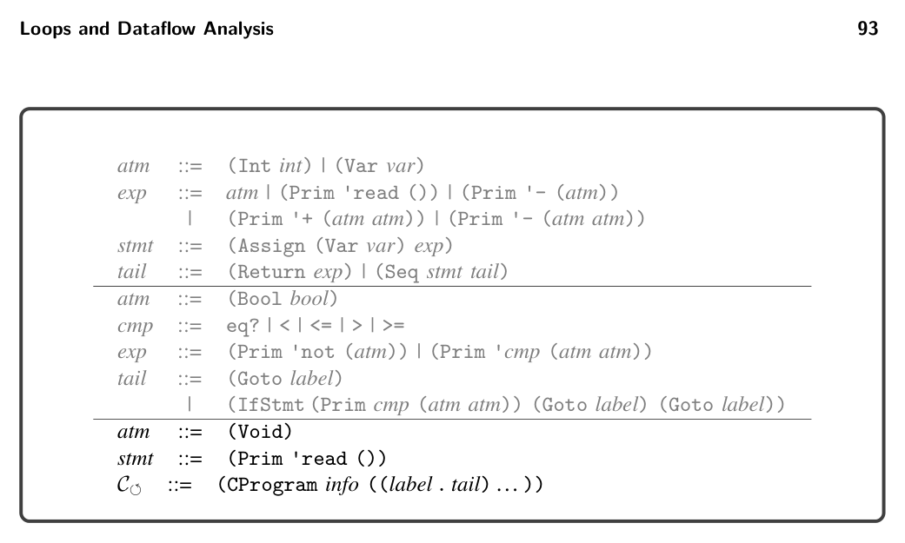

# 5.6 Explicate Control and C


*Figure 5.7*

```
(let ([x2 10])
(let ([y3 0])
(let ([tmp4 (begin
(set! y3 (read))
x2)])
(let ([tmp5 (begin
(set! x2 (read))
y3)])
(let ([tmp6 (+ tmp4 tmp5)])
(let ([tmp7 x2])
(+ tmp6 tmp7)))))))
```

```
(let ([x2 10])
(let ([y3 0])
(+ (+ (begin
(set! y3 (read))
(get! x2))
(begin
(set! x2 (read))
(get! y3)))
(get! x2))))
```

⇒

5.6 Explicate Control and C⟲

Recall that in the explicate_control pass we define one helper function for each kind of position in the program. For the Lmon Var language of integers and variables, we needed assignment and tail positions. The if expressions of Lmon if introduced predicate positions. For Lmon While, the begin expression introduces yet another kind of position: effect position. Except for the last subexpression, the subexpressions inside a begin are evaluated only for their effect. Their result values are discarded. We can generate better code by taking this fact into account. The output language of explicate_control is C⟲(figure 5.7), which is nearly identical to CIf. The only syntactic differences are the addition of (Void) and that read may appear as a statement. The most significant difference between the pro- grams generated by explicate_control in chapter 4 versus explicate_control in this chapter is that the control-flow graphs of the latter may contain cycles. The new auxiliary function explicate_effect takes an expression (in an effect position) and the code for its continuation. The function returns a tail that

