# 6 Tuples and Garbage Collection


*Figure 6.1*

```
(let ([t (vector 40 #t (vector 2))])
(if (vector-ref t 1)
(+ (vector-ref t 0)
(vector-ref (vector-ref t 2) 0))
44))
```

Tuples raise several interesting new issues. First, variable binding performs a shallow copy in dealing with tuples, which means that different variables can refer


*Figure 6.1*


*Figure 6.2*

to the same tuple; that is, two variables can be aliases for the same entity. Consider the following example, in which t1 and t2 refer to the same tuple value and t3 refers to a different tuple value with equal elements. The result of the program is 42.

```
(let ([t1 (vector 3 7)])
(let ([t2 t1])
(let ([t3 (vector 3 7)])
(if (and (eq? t1 t2) (not (eq? t1 t3)))
42
0))))
```

Whether two variables are aliased or not affects what happens when the under- lying tuple is mutated. Consider the following example in which t1 and t2 again refer to the same tuple value.

```
(let ([t1 (vector 3 7)])
(let ([t2 t1])
(let ([_ (vector-set! t2 0 42)])
(vector-ref t1 0))))
```

The mutation through t2 is visible in referencing the tuple from t1, so the result of this program is 42. The next issue concerns the lifetime of tuples. When does a tuple’s lifetime end? Notice that LTup does not include an operation for deleting tuples. Furthermore, the lifetime of a tuple is not tied to any notion of static scoping. For example, the following program returns 42 even though the variable w goes out of scope prior to the vector-ref that reads from the vector to which it was bound.

```
(let ([v (vector (vector 44))])
(let ([x (let ([w (vector 42)])
(let ([_ (vector-set! v 0 w)])
0))])
(+ x (vector-ref (vector-ref v 0) 0))))
```

From the perspective of programmer-observable behavior, tuples live forever. How- ever, if they really lived forever then many long-running programs would run out of memory. To solve this problem, the language’s runtime system performs automatic garbage collection. Figure 6.3 shows the definitional interpreter for the LTup language. We define the vector, vector-ref, vector-set!, and vector-length operations for LTup in terms of the corresponding operations in Racket. One subtle point is that the vector-set! operation returns the #<void> value. Figure 6.4 shows the type checker for LTup. The type of a tuple is a Vector type that contains a type for each of its elements. To create the s-expression for the Vector type, we use the unquote-splicing operator ,@ to insert the list t* without its usual start and end parentheses. The type of accessing the ith element of a tuple is the ith element type of the tuple’s type, if there is one. If not, an error is signaled. Note that the index i is required to be a constant integer (and not, for example, a call to read) so that the type checker can determine the element’s type given the tuple type. Regarding writing an element to a tuple, the element’s type must be equal to the ith element type of the tuple’s type. The result type is Void.

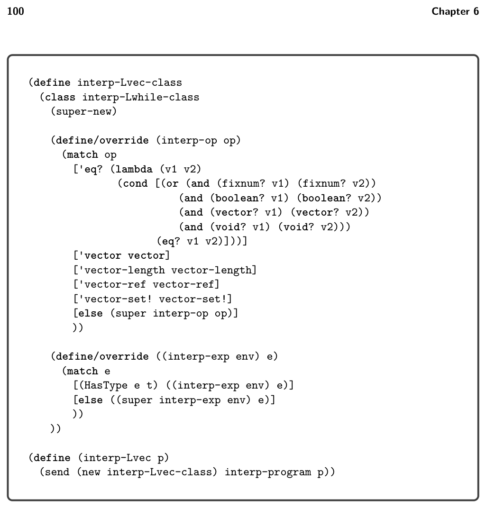
*(super-new)*

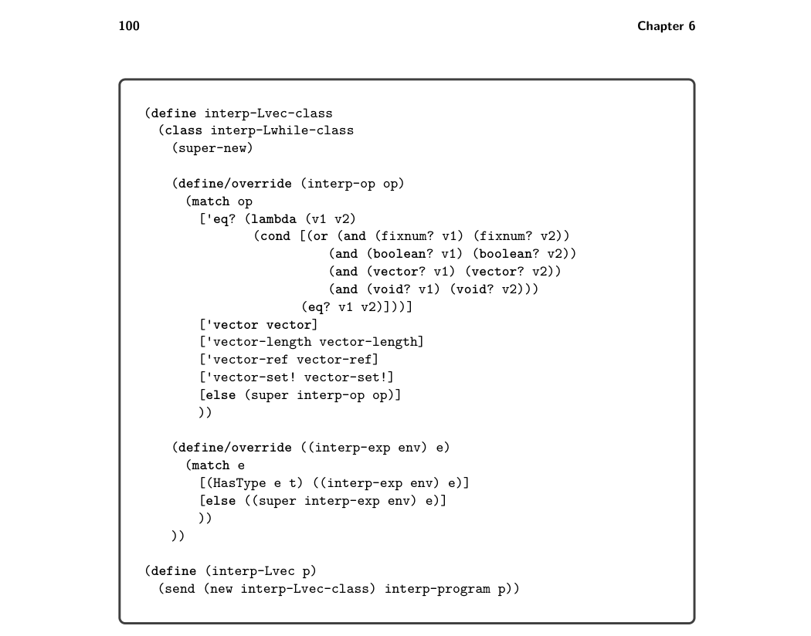
*Figure 6.3*

## 6.2 Garbage Collection

Garbage collection is a runtime technique for reclaiming space on the heap that will not be used in the future of the running program. We use the term object to refer to any value that is stored in the heap, which for now includes only tuples.1

Unfortunately, it is impossible to know precisely which objects will be accessed in the future and which will not. Instead, garbage collectors overapproximate the set of objects that will be accessed by identifying which objects can possibly be accessed. The running program can directly access objects that are in registers and on the procedure call stack. It can also transitively access the elements of tuples, starting with a tuple whose address is in a register or on the procedure call stack. We define the root set to be all the tuple addresses that are in registers or on the procedure

* The term object as it is used in the context of object-oriented programming has a more specific
  meaning than the way in which we use the term here.

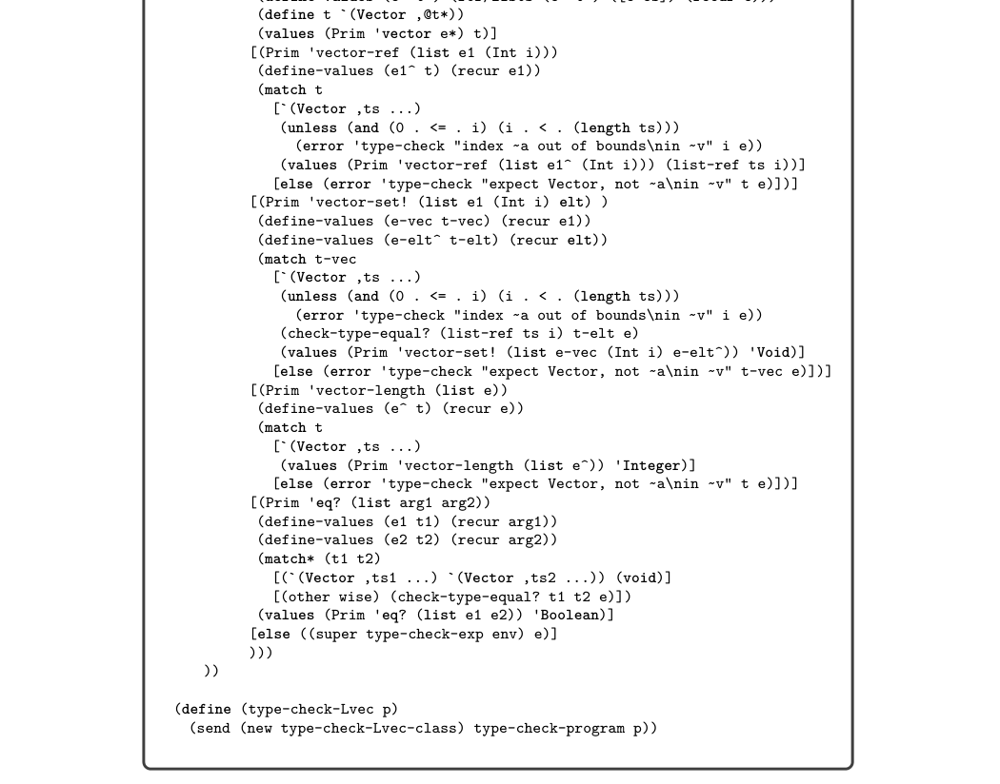
*Figure 6.4*

call stack. We define the live objects to be the objects that are reachable from the root set. Garbage collectors reclaim the space that is allocated to objects that are no longer live. That means that some objects may not get reclaimed as soon as they could be, but at least garbage collectors do not reclaim the space dedicated to objects that will be accessed in the future! The programmer can influence which objects get reclaimed by causing them to become unreachable. So the goal of the garbage collector is twofold:

* to preserve all the live objects, and
* to reclaim the memory of everything else, that is, the garbage.

6.2.1 Two-Space Copying Collector Here we study a relatively simple algorithm for garbage collection that is the basis of many state-of-the-art garbage collectors (Lieberman and Hewitt 1983; Ungar 1984; Jones and Lins 1996; Detlefs et al. 2004; Dybvig 2006; Tene, Iyengar, and Wolf 2011). In particular, we describe a two-space copying collector (Wilson 1992) that uses Cheney’s algorithm to perform the copy (Cheney 1970). Figure 6.5 gives a coarse-grained depiction of what happens in a two-space collector, showing two time steps, prior to garbage collection (on the top) and after garbage collection (on the bottom). In a two-space collector, the heap is divided into two parts named the FromSpace and the ToSpace. Initially, all allocations go to the FromSpace until there is not enough room for the next allocation request. At that point, the garbage collector goes to work to make room for the next allocation. A copying collector makes more room by copying all the live objects from the FromSpace into the ToSpace and then performs a sleight of hand, treating the ToSpace as the new FromSpace and the old FromSpace as the new ToSpace. In the example shown in figure 6.5, the root set consists of three pointers, one in a register and two on the stack. All the live objects have been copied to the ToSpace (the right-hand side of figure 6.5) in a way that preserves the pointer relationships. For example, the pointer in the register still points to a tuple that in turn points to two other tuples. There are four tuples that are not reachable from the root set and therefore do not get copied into the ToSpace. The exact situation shown in figure 6.5 cannot be created by a well-typed program in LTup because it contains a cycle. However, creating cycles will be possible once we get to LDyn (chapter 9). We design the garbage collector to deal with cycles to begin with, so we will not need to revisit this issue.

6.2.2 Graph Copying via Cheney’s Algorithm Let us take a closer look at the copying of the live objects. The allocated objects and pointers can be viewed as a graph, and we need to copy the part of the graph that is reachable from the root set. To make sure that we copy all the reachable vertices in the graph, we need an exhaustive graph traversal algorithm, such as depth-first search or breadth-first search (Moore 1959; Cormen et al. 2001). Recall that such algorithms take into account the possibility of cycles by marking which vertices have already been visited, so to ensure termination of the algorithm. These

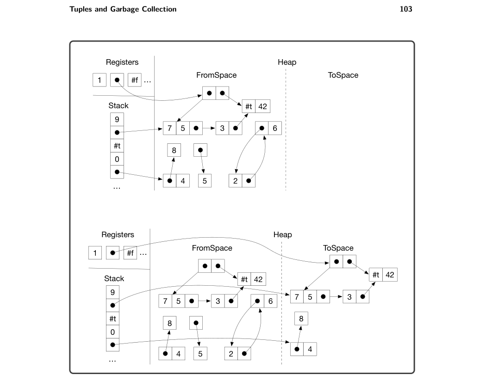
*Figure 6.5*

search algorithms also use a data structure such as a stack or queue as a to-do list to keep track of the vertices that need to be visited. We use breadth-first search and a trick due to Cheney (1970) for simultaneously representing the queue and copying tuples into the ToSpace. Figure 6.6 shows several snapshots of the ToSpace as the copy progresses. The queue is represented by a chunk of contiguous memory at the beginning of the ToSpace, using two pointers to track the front and the back of the queue, called the scan pointer and the free pointer, respectively. The algorithm starts by copying all tuples that are immediately reachable from the root set into the ToSpace to form the initial queue. When we copy a tuple, we mark the old tuple to indicate that it has been visited. We discuss how this marking is accomplished in section 6.2.3. Note that any pointers inside the copied tuples in the queue still point back to the FromSpace. Once the initial queue has been created, the algorithm enters a loop in which it repeatedly processes the tuple at the front of the queue and pops

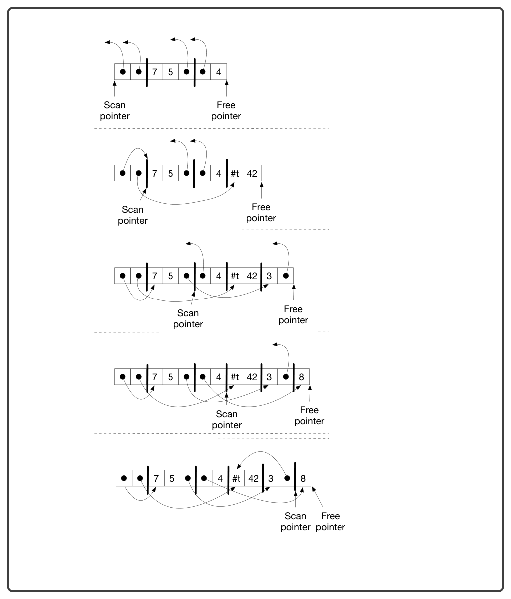
*Figure 6.6*

it off the queue. To process a tuple, the algorithm copies all the objects that are directly reachable from it to the ToSpace, placing them at the back of the queue. The algorithm then updates the pointers in the popped tuple so that they point to the newly copied objects. As shown in figure 6.6, in the first step we copy the tuple whose second element is 42 to the back of the queue. The other pointer goes to a tuple that has already been copied, so we do not need to copy it again, but we do need to update the pointer to the new location. This can be accomplished by storing a forwarding pointer to the

new location in the old tuple, when we initially copied the tuple into the ToSpace. This completes one step of the algorithm. The algorithm continues in this way until the queue is empty; that is, when the scan pointer catches up with the free pointer.

6.2.3 Data Representation The garbage collector places some requirements on the data representations used by our compiler. First, the garbage collector needs to distinguish between pointers and other kinds of data such as integers. The following are three ways to accomplish this:

* Attach a tag to each object that identifies what type of object it is (McCarthy
  1960).
* Store different types of objects in different regions (Steele 1977).
* Use type information from the program to either (a) generate type-specific
  code for collecting, or (b) generate tables that guide the collector (Appel 1989;
  Goldberg 1991; Diwan, Moss, and Hudson 1992).

Dynamically typed languages, such as Racket, need to tag objects in any case, so option 1 is a natural choice for those languages. However, LTup is a statically typed language, so it would be unfortunate to require tags on every object, especially small and pervasive objects like integers and Booleans. Option 3 is the best-performing choice for statically typed languages, but it comes with a relatively high implemen- tation complexity. To keep this chapter within a reasonable scope of complexity, we recommend a combination of options 1 and 2, using separate strategies for the stack and the heap. Regarding the stack, we recommend using a separate stack for pointers, which we call the root stack (aka shadow stack) (Siebert 2001; Henderson 2002; Baker et al. 2009). That is, when a local variable needs to be spilled and is of type Vector, we put it on the root stack instead of putting it on the procedure call stack. Furthermore, we always spill tuple-typed variables if they are live during a call to the collector, thereby ensuring that no pointers are in registers during a collection. Figure 6.7 reproduces the example shown in figure 6.5 and contrasts it with the data layout using a root stack. The root stack contains the two pointers from the regular stack and also the pointer in the second register. The problem of distinguishing between pointers and other kinds of data also arises inside each tuple on the heap. We solve this problem by attaching a tag, an extra 64 bits, to each tuple. Figure 6.8 shows a zoomed-in view of the tags for two of the tuples in the example given in figure 6.5. Note that we have drawn the bits in a big-endian way, from right to left, with bit location 0 (the least significant bit) on the far right, which corresponds to the direction of the x86 shifting instructions salq (shift left) and sarq (shift right). Part of each tag is dedicated to specifying which elements of the tuple are pointers, the part labeled pointer mask. Within the pointer mask, a 1 bit indicates that there is a pointer, and a 0 bit indicates some other kind of data. The pointer mask starts at bit location 7. We limit tuples to

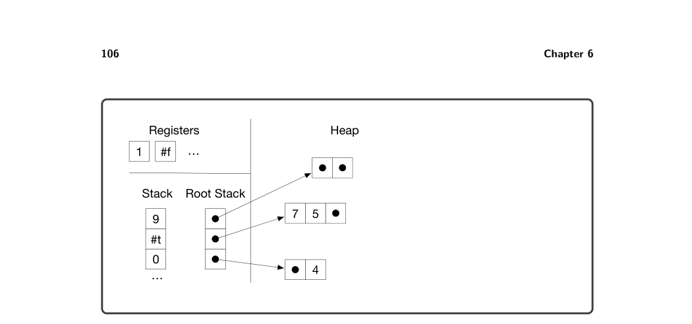
*Figure 6.7*


*Figure 6.8*

a maximum size of fifty elements, so we need 50 bits for the pointer mask.2 The tag also contains two other pieces of information. The length of the tuple (number of elements) is stored in bits at locations 1 through 6. Finally, the bit at location 0 indicates whether the tuple has yet to be copied to the ToSpace. If the bit has value 1, then this tuple has not yet been copied. If the bit has value 0, then the entire tag is a forwarding pointer. (The lower 3 bits of a pointer are always zero in any case, because our tuples are 8-byte aligned.)

* A production-quality compiler would handle arbitrarily sized tuples and use a more complex
  approach.

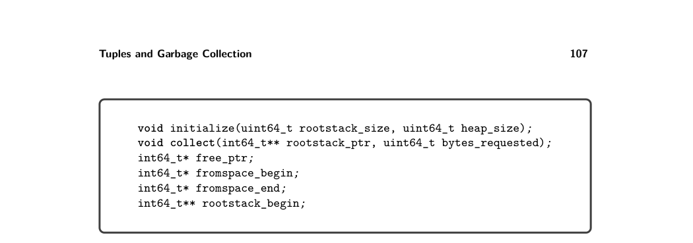
*Figure 6.9*

6.2.4 Implementation of the Garbage Collector An implementation of the copying collector is provided in the runtime.c file. Figure 6.9 defines the interface to the garbage collector that is used by the com- piler. The initialize function creates the FromSpace, ToSpace, and root stack and should be called in the prelude of the main function. The arguments of initialize are the root stack size and the heap size. Both need to be multiples of sixty-four, and 16, 384 is a good choice for both. The initialize function puts the address of the beginning of the FromSpace into the global variable free_ptr. The global variable fromspace_end points to the address that is one past the last element of the FromSpace. We use half-open intervals to represent chunks of memory (Dijkstra 1982). The rootstack_begin variable points to the first element of the root stack. As long as there is room left in the FromSpace, your generated code can allo- cate tuples simply by moving the free_ptr forward. The amount of room left in the FromSpace is the difference between the fromspace_end and the free_ptr. The collect function should be called when there is not enough room left in the FromSpace for the next allocation. The collect function takes a pointer to the current top of the root stack (one past the last item that was pushed) and the number of bytes that need to be allocated. The collect function performs the copying collection and leaves the heap in a state such that there is enough room for the next allocation. The introduction of garbage collection has a nontrivial impact on our com- piler passes. We introduce a new compiler pass named expose_allocation that elaborates the code for allocating tuples. We also make significant changes to select_instructions, build_interference, allocate_registers, and prelude_and_conclusion and make minor changes in several more passes. The following program serves as our running example. It creates two tuples, one nested inside the other. Both tuples have length one. The program accesses the element in the inner tuple.

(vector-ref (vector-ref (vector (vector 42)) 0) 0)

## 6.3 Expose Allocation

The pass expose_allocation lowers tuple creation into making a condi- tional call to the collector followed by allocating the appropriate amount of memory and initializing it. We choose to place the expose_allocation pass before remove_complex_operands because it generates code that con- tains complex operands. However, with some care it can also be placed after remove_complex_operands, which would simplify tuple creation by removing the need to assign the initializing expressions to temporary variables (see below). The output of expose_allocation is a language LAlloc that replaces tuple creation with new forms that we use in the translation of tuple creation.

exp ::= (Collect int) | (Allocate int type) | (GlobalValue var)

The (Collect n) form runs the garbage collector, requesting that there be n bytes ready to be allocated. During instruction selection, the (Collect n) form will become a call to the collect function in runtime.c. The (Allocate n type) form obtains memory for n elements (and space at the front for the 64-bit tag), but the elements are not initialized. The type parameter is the type of the tuple: (Vector type1 … typen) where typei is the type of the ith element. The (GlobalValue name) form reads the value of a global variable, such as free_ptr. The type information that you need for (Allocate n type) can be obtained by running the type-check-Lvec-has-type type checker immediately before the expose_allocation pass. This version of the type checker places a special AST node of the form (HasType e type) around each tuple creation. The concrete syntax for HasType is has-type. The following shows the transformation of tuple creation into (1) a sequence of temporary variable bindings for the initializing expressions, (2) a conditional call to collect, (3) a call to allocate, and (4) the initialization of the tuple. The len placeholder refers to the length of the tuple, and bytes is the total number of bytes that need to be allocated for the tuple, which is 8 for the tag plus len times 8.

(has-type (vector e0 … en−1) type) =⇒ (let ([x0 e0]) ... (let ([xn−1 en−1]) (let ([_ (if (< (+ (global-value free_ptr) bytes) (global-value fromspace_end)) (void) (collect bytes))]) (let ([v (allocate len type)]) (let ([_ (vector-set! v 0 x0)]) ... (let ([_ (vector-set! v n −1 xn−1)]) v) ... )))) ...)

The sequencing of the initializing expressions e0, … , en−1 prior to the allocate is important because they may trigger garbage collection and we cannot have an allocated but uninitialized tuple on the heap during a collection.

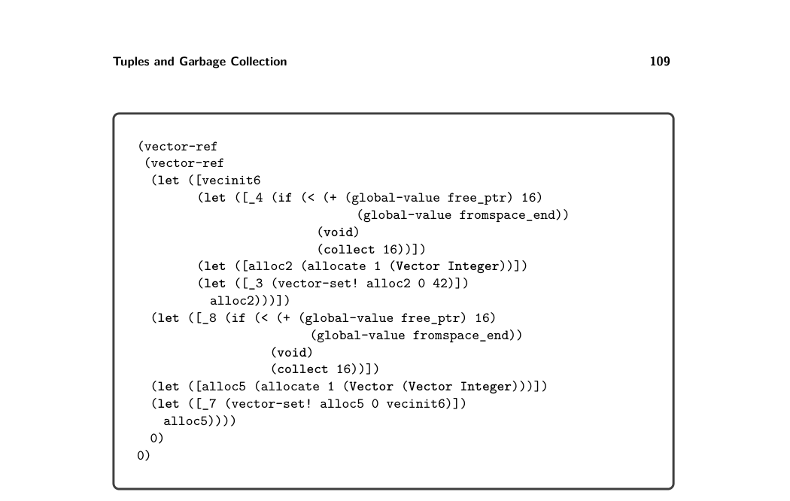
*Figure 6.10*

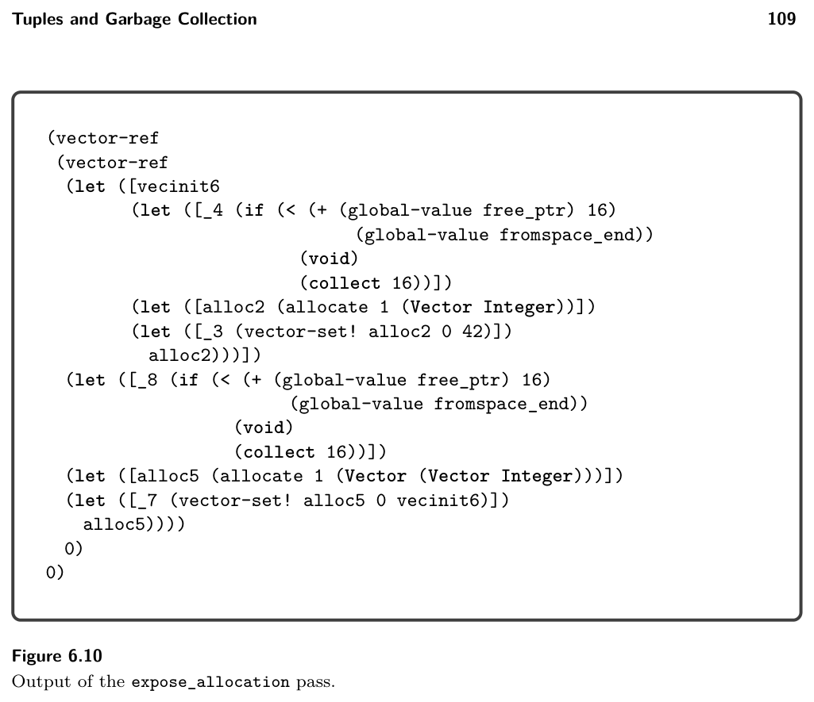
*Figure 6.10*

## 6.4 Remove Complex Operands

The forms collect, allocate, and global_value should be treated as complex operands. Figure 6.11 shows the grammar for the output language Lmon Alloc of this pass, which is LAlloc in monadic normal form.

## 6.5 Explicate Control and the CTup Language

The output of explicate_control is a program in the intermediate language CTup, for which figure 6.12 shows the definition of the abstract syntax. The new expres- sions of CTup include allocate, vector-ref, and vector-set!, and global_value. CTup also includes the new collect statement. The explicate_control pass can treat these new forms much like the other forms that we’ve already encountered. The output of the explicate_control pass on the running example is shown on the left side of figure 6.15 in the next section.


*Figure 6.11*


*Figure 6.12*

## 6.6 Select Instructions and the x86Global Language

In this pass we generate x86 code for most of the new operations that are needed to compile tuples, including Allocate, Collect, accessing tuple elements, and the Is comparison. We compile GlobalValue to Global because the latter has a different concrete syntax (see figures 6.13 and 6.14).

The tuple read and write forms translate into movq instructions. (The +1 in the offset serves to move past the tag at the beginning of the tuple representation.)

lhs = (vector-ref tup n); =⇒ movq tup′, %r11 movq 8(n + 1)(%r11), lhs′

lhs = (vector-set! tup n rhs); =⇒ movq tup′, %r11 movq rhs′, 8(n + 1)(%r11) movq $0, lhs′

The lhs′, tup′, and rhs′ are obtained by translating from CTup to x86. The move of tup′ to register r11 ensures that the offset expression 8(n + 1)(%r11) contains a register operand. This requires removing r11 from consideration by the register allocator. Why not use rax instead of r11? Suppose that we instead used rax. Then the generated code for tuple assignment would be

movq tup′, %rax movq rhs′, 8(n + 1)(%rax)

Next, suppose that rhs′ ends up as a stack location, so patch_instructions would insert a move through rax as follows:

movq tup′, %rax movq rhs′, %rax movq %rax, 8(n + 1)(%rax)

However, this sequence of instructions does not work because we’re trying to use rax for two different values (tup′ and rhs′) at the same time! The vector-length operation should be translated into a sequence of instruc- tions that read the tag of the tuple and extract the 6 bits that represent the tuple length, which are the bits starting at index 1 and going up to and including bit 6. The x86 instructions andq (for bitwise-and) and sarq (shift right) can be used to accomplish this. We compile the allocate form to operations on the free_ptr, as shown next. This approach is called inline allocation because it implements allocation without a function call by simply incrementing the allocation pointer. It is much more efficient than calling a function for each allocation. The address in the free_ptr is the next free address in the FromSpace, so we copy it into r11 and then move it forward by enough space for the tuple being allocated, which is 8(len + 1) bytes because each element is 8 bytes (64 bits) and we use 8 bytes for the tag. We then initialize the tag and finally copy the address in r11 to the left-hand side. Refer to figure 6.8 to see how the tag is organized. We recommend using the Racket operations bitwise-ior and arithmetic-shift to compute the tag during compilation. The type anno- tation in the allocate form is used to determine the pointer mask region of the


*Figure 6.13*

tag. The addressing mode free_ptr(%rip) essentially stands for the address of the free_ptr global variable using a special instruction-pointer-relative addressing mode of the x86-64 processor. In particular, the assembler computes the distance d between the address of free_ptr and where the rip would be at that moment and then changes the free_ptr(%rip) argument to d(%rip), which at runtime will compute the address of free_ptr.

lhs = (allocate len (Vector type … )); =⇒ movq free_ptr(%rip), %r11 addq 8(len + 1), free_ptr(%rip) movq $tag, 0(%r11) movq %r11, lhs′

The collect form is compiled to a call to the collect function in the runtime. The arguments to collect are (1) the top of the root stack, and (2) the number of bytes that need to be allocated. We use another dedicated register, r15, to store the pointer to the top of the root stack. Therefore r15 is not available for use by the register allocator.

(collect bytes) =⇒ movq %r15, %rdi movq $bytes, %rsi callq collect


*Figure 6.14*

The definitions of the concrete and abstract syntax of the x86Global language are shown in figures 6.13 and 6.14. It differs from x86If with the addition of global variables and the instructions needed to compile tuple length: andq and sarq. Figure 6.15 shows the output of the select_instructions pass on the running example.


*Figure 6.15*

## 6.7 Register Allocation

As discussed previously in this chapter, the garbage collector needs to access all the pointers in the root set, that is, all variables that are tuples. It will be the responsibility of the register allocator to make sure that

* the root stack is used for spilling tuple-typed variables, and
* if a tuple-typed variable is live during a call to the collector, it must be spilled
  to ensure that it is visible to the collector.

The latter responsibility can be handled during construction of the interference graph, by adding interference edges between the call-live tuple-typed variables and all the callee-saved registers. (They already interfere with the caller-saved registers.) The type information for variables is in the Program form, so we recommend adding another parameter to the build_interference function to communicate this alist. The spilling of tuple-typed variables to the root stack can be handled after graph coloring, in choosing how to assign the colors (integers) to registers and stack loca- tions. The Program output of this pass changes to also record the number of spills to the root stack. Figure 6.16 shows the output of register allocation on the running example. The register allocator chose the below assignment of variables to locations. Many of the variables were assigned to register %rcx. Variables _3, _7, tmp0, and tmp4 were instead assigned to %rdx because they conflict with variables that were assigned to %rcx. Variable vecinit6 was spilled to the root stack because its type is (Vector Integer) and it is live during a call to collect.

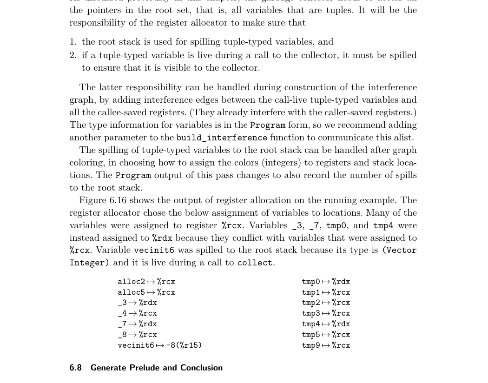
*Figure 6.17*

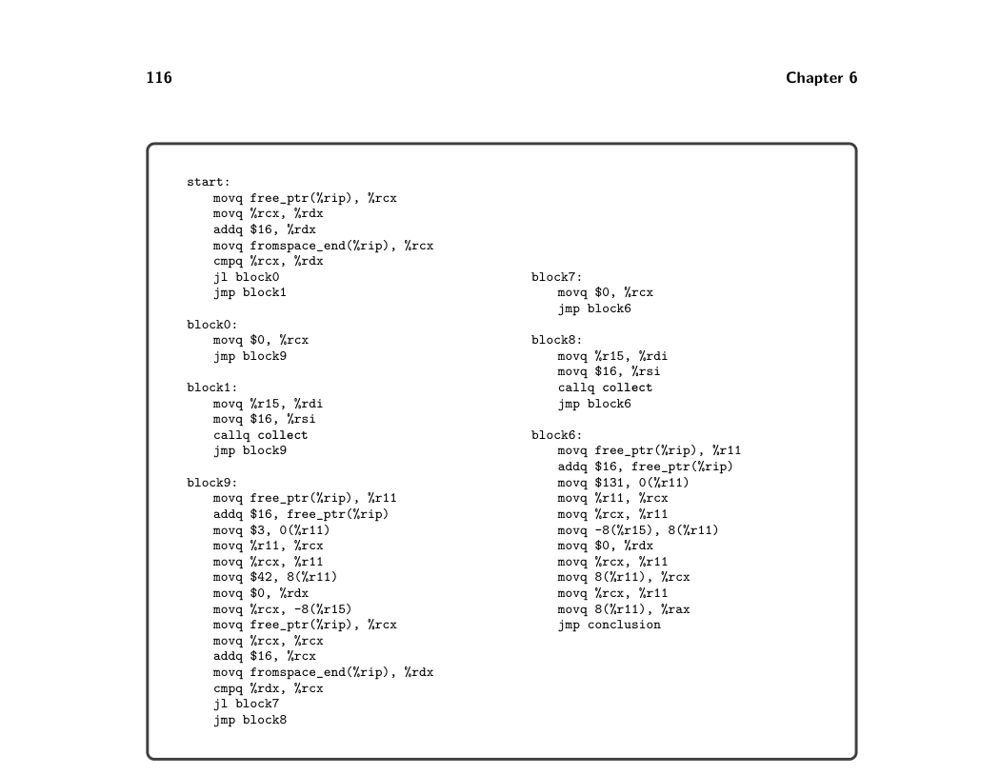
*Figure 6.16*

to accomplish this task because there is only one spill. In general, we have to clear as many words as there are spills of tuple-typed variables. The garbage collector tests each root to see if it is null prior to dereferencing it. Figure 6.18 gives an overview of all the passes needed for the compilation of LTup.

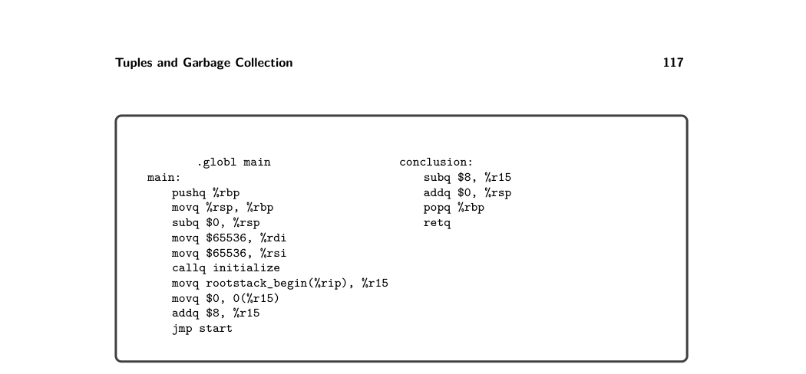
*Figure 6.17*

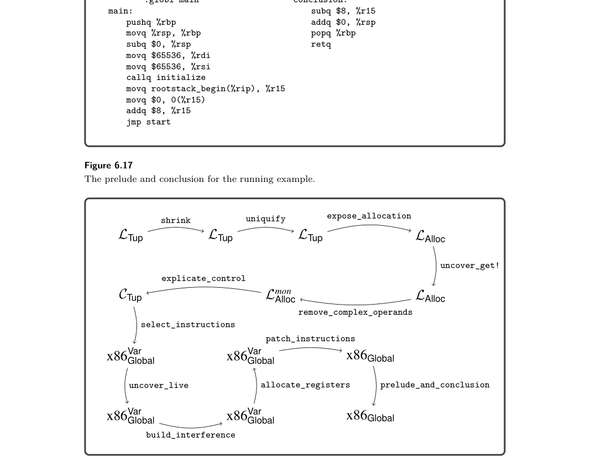
*Figure 6.18*

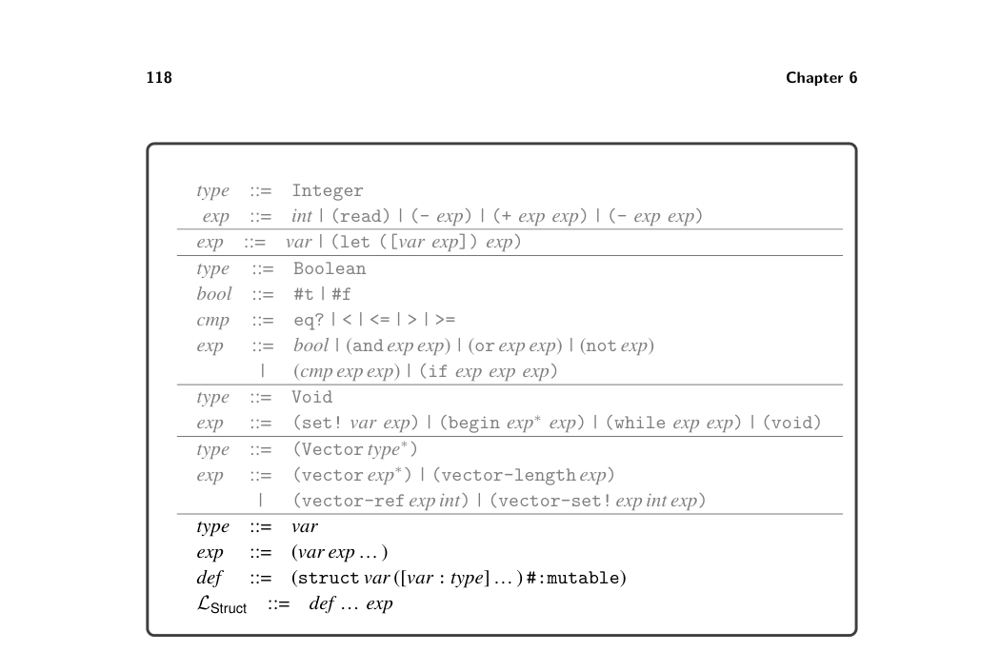
*Figure 6.19*

## 6.9 Challenge: Simple Structures

The language LStruct extends LTup with support for simple structures. The definition of its concrete syntax is shown in figure 6.19, and the abstract syntax is shown in figure 6.20. Recall that a struct in Typed Racket is a user-defined data type that contains named fields and that is heap allocated, similarly to a vector. The following is an example of a structure definition, in this case the definition of a point type:

(struct point ([x : Integer] [y : Integer]) #:mutable)

An instance of a structure is created using function-call syntax, with the name of the structure in the function position, as follows:

(point 7 12)

Function-call syntax is also used to read a field of a structure. The function name is formed by the structure name, a dash, and the field name. The following example uses point-x and point-y to access the x and y fields of two point instances:

```
(let ([pt1 (point 7 12)])
(let ([pt2 (point 4 3)])
(+ (- (point-x pt1) (point-x pt2))
(- (point-y pt1) (point-y pt2)))))
```


*Figure 6.20*

Similarly, to write to a field of a structure, use its set function, whose name starts with set-, followed by the structure name, then a dash, then the field name, and finally with an exclamation mark. The following example uses set-point-x! to change the x field from 7 to 42:

```
(let ([pt (point 7 12)])
(let ([_ (set-point-x! pt 42)])
(point-x pt)))
```

Exercise 6.1 Create a type checker for LStruct by extending the type checker for LTup. Extend your compiler with support for simple structures, compiling LStruct to x86 assembly code. Create five new test cases that use structures, and test your compiler.


*Figure 6.21*

## 6.10 Challenge: Arrays

In this chapter we have studied tuples, that is, heterogeneous sequences of elements whose length is determined at compile time. This challenge is also about sequences, but this time the length is determined at runtime and all the elements have the same type (they are homogeneous). We use the traditional term array for this latter kind of sequence. The Racket language does not distinguish between tuples and arrays; they are both represented by vectors. However, Typed Racket distinguishes between tuples and arrays: the Vector type is for tuples, and the Vectorof type is for arrays. Figure 6.21 presents the definition of the concrete syntax for LArray, and figure 6.22 presents the definition of the abstract syntax, extending LTup with the Vectorof type and the make-vector primitive operator for creating an array, whose argu- ments are the length of the array and an initial value for all the elements in the array. The vector-length, vector-ref, and vector-ref! operators that we defined for tuples become overloaded for use with arrays. We include integer multiplication in LArray because it is useful in many examples involving arrays such as computing the inner product of two arrays (figure 6.23). Figure 6.24 shows the definition of the type checker for LArray. The result type of make-vector is (Vectorof T), where T is the type of the initializing expression. The length expression is required to have type Integer. The type checking of the operators vector-length, vector-ref, and vector-set! is updated to handle the situation in which the vector has type Vectorof. In these cases we translate the operators to their vectorof form so that later passes can easily distinguish between operations on tuples versus arrays. We override the operator-types method to

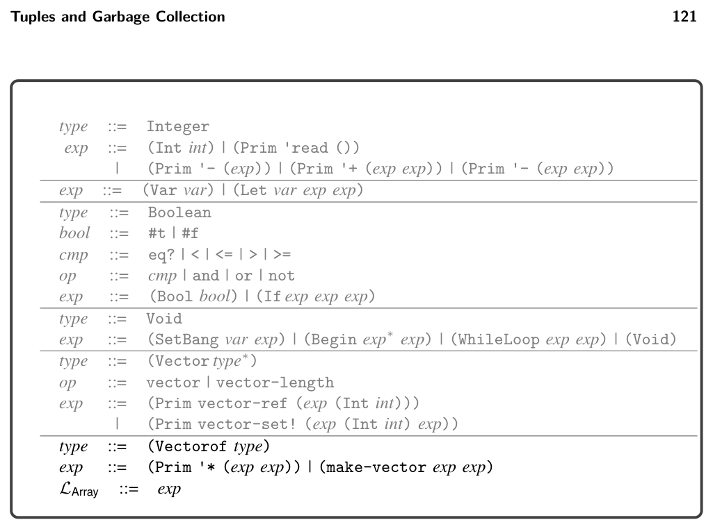
*Figure 6.22*

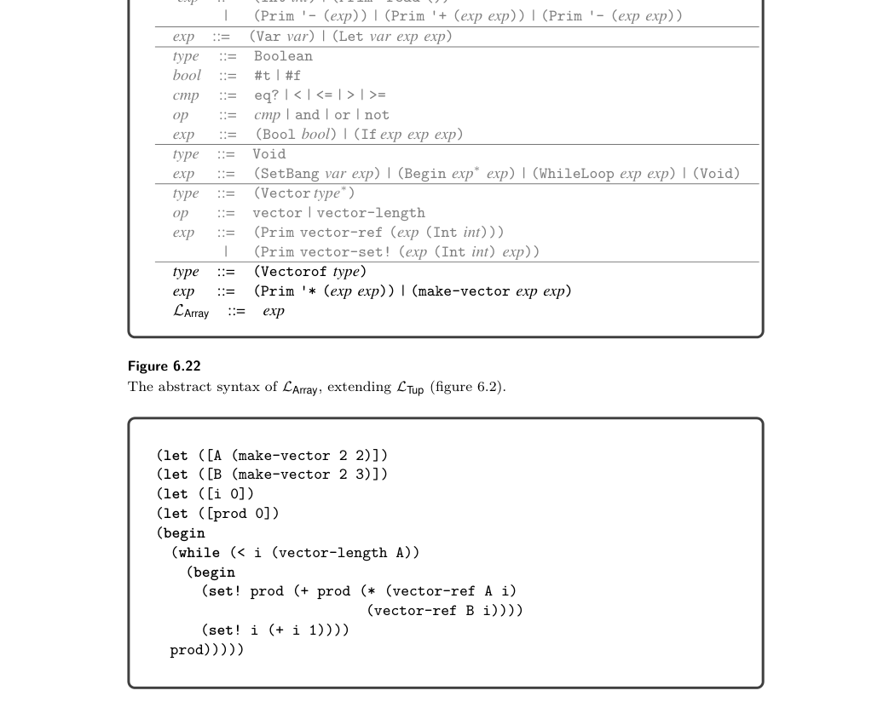
*Figure 6.23*

provide the type signature for multiplication: it takes two integers and returns an integer. The definition of the interpreter for LArray is shown in figure 6.25 . The make-vector operator is interpreted using Racket’s make-vector function, and multiplication is interpreted using fx*, which is multiplication for fixnum inte- gers. In the resolve pass (section 6.10.2) we translate array access operations into vectorof-ref and vectorof-set! operations, which we interpret using vector operations with additional bounds checks that signal a trapped-error.

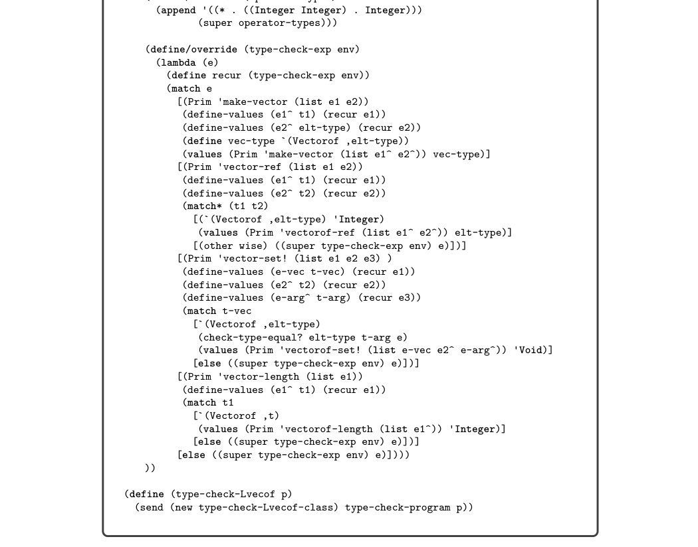
*Figure 6.24*

6.10.1 Data Representation Just as with tuples, we store arrays on the heap, which means that the garbage collector will need to inspect arrays. An immediate thought is to use the same representation for arrays that we use for tuples. However, we limit tuples to a length of fifty so that their length and pointer mask can fit into the 64-bit tag at

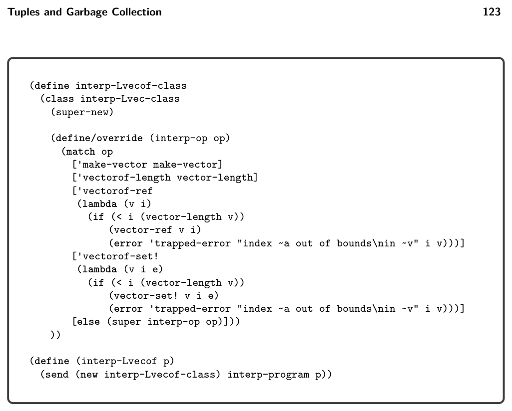
*(super-new)*

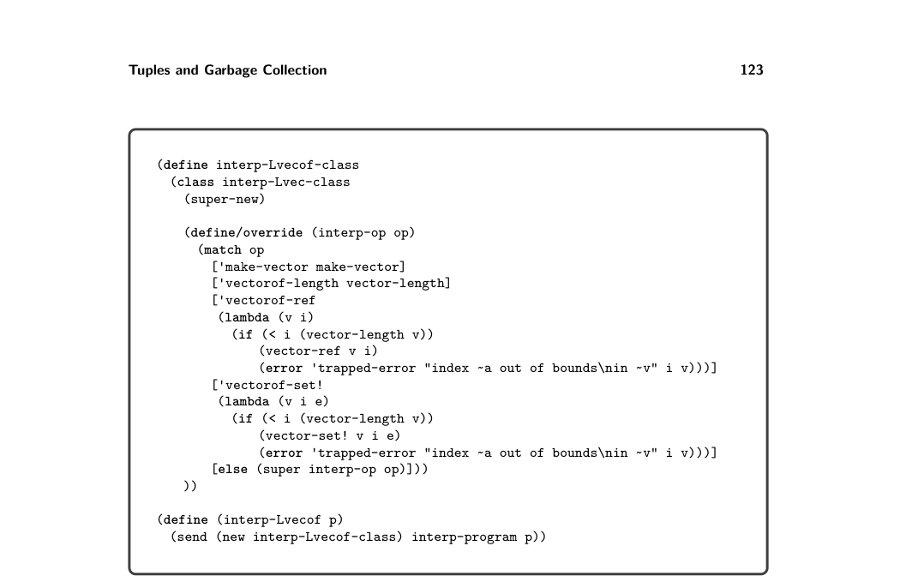
*Figure 6.25*

the beginning of each tuple (section 6.2.3). We intend arrays to allow millions of elements, so we need more bits to store the length. However, because arrays are homogeneous, we need only 1 bit for the pointer mask instead of 1 bit per array element. Finally, the garbage collector must be able to distinguish between tuples and arrays, so we need to reserve one bit for that purpose. We arrive at the following layout for the 64-bit tag at the beginning of an array:

* The right-most bit is the forwarding bit, just as in a tuple. A 0 indicates that it
  is a forwarding pointer, and a 1 indicates that it is not.

* The next bit to the left is the pointer mask. A 0 indicates that none of the
  elements are pointers, and a 1 indicates that all the elements are pointers.

* The next 60 bits store the length of the array.

* The bit at position 62 distinguishes between a tuple (0) and an array (1).

* The left-most bit is reserved as explained in chapter 10.

In the following subsections we provide hints regarding how to update the passes to handle arrays.

6.10.2 Overload Resolution As noted previously, with the addition of arrays, several operators have become overloaded; that is, they can be applied to values of more than one type. In this case, the element access and length operators can be applied to both tuples and

arrays. This kind of overloading is quite common in programming languages, so many compilers perform overload resolution to handle it. The idea is to translate each overloaded operator into different operators for the different types. Implement a new pass named resolve. Translate the reading of an array element to vectorof-ref and the writing of an array element to vectorof-set!. Translate calls to vector-length into vectorof-length. When these operators are applied to tuples, leave them as is.

6.10.3 Bounds Checking Recall that the interpreter for LArray signals a trapped-error when there is an array access that is out of bounds. Therefore your compiler is obliged to also catch these errors during execution and halt, signaling an error. We recommend inserting a new pass named check_bounds that inserts code around each vectorof-ref and vectorof-set! operation to ensure that the index is greater than or equal to zero and less than the array’s length. If not, the program should halt, for which we recommend using a new primitive operation named exit.

6.10.4 Expose Allocation This pass should translate array creation into lower-level operations. In particular, the new AST node (AllocateArray int type) is analogous to the Allocate AST node for tuples. The type argument must be (Vectorof T), where T is the element type for the array. The AllocateArray AST node allocates an array of the length specified by the exp (of type Integer), but does not initialize the elements of the array. Generate code in this pass to initialize the elements analogous to the case for tuples.

6.10.5 Uncover get! Add cases for AllocateArray to collect-set! and uncover-get!-exp.

6.10.6 Remove Complex Operands Add cases in the rco_atom and rco_exp for AllocateArray. In particular, an AllocateArray node is complex, and its subexpression must be atomic.

6.10.7 Explicate Control Add cases for AllocateArray to explicate_tail and explicate_assign.

6.10.8 Select Instructions Generate instructions for AllocateArray similar to those for Allocate given in section 6.6 except that the tag at the front of the array should instead use the representation discussed in section 6.10.1. Regarding vectorof-length, extract the length from the tag. The instructions generated for accessing an element of an array differ from those for a tuple (section 6.6) in that the index is not a constant so you need to generate instructions that compute the offset at runtime.

Compile the exit primitive into a call to the exit function of the C standard library, with an argument of 255.

Exercise 6.2 Implement a compiler for the LArray language by extending your compiler for LWhile. Test your compiler on a half dozen new programs, including the one shown in figure 6.23 and also a program that multiplies two matrices. Note that although matrices are two-dimensional arrays, they can be encoded into one-dimensional arrays by laying out each row in the array, one after the next.

## 6.11 Challenge: Generational Collection

The copying collector described in section 6.2 can incur significant runtime over- head because the call to collect takes time proportional to all the live data. One way to reduce this overhead is to reduce how much data is inspected in each call to collect. In particular, researchers have observed that recently allocated data is more likely to become garbage than data that has survived one or more previous calls to collect. This insight motivated the creation of generational garbage col- lectors that (1) segregate data according to its age into two or more generations; (2) allocate less space for younger generations, so collecting them is faster, and more space for the older generations; and (3) perform collection on the younger generations more frequently than on older generations (Wilson 1992). For this challenge assignment, the goal is to adapt the copying collector imple- mented in runtime.c to use two generations, one for young data and one for old data. Each generation consists of a FromSpace and a ToSpace. The following is a sketch of how to adapt the collect function to use the two generations:

* Copy the young generation’s FromSpace to its ToSpace and then switch the role
  of the ToSpace and FromSpace.
* If there is enough space for the requested number of bytes in the young
  FromSpace, then return from collect.
* If there is not enough space in the young FromSpace for the requested bytes,
  then move the data from the young generation to the old one with the following
  steps:
  a. If there is enough room in the old FromSpace, copy the young FromSpace to
  the old FromSpace and then return.
  b. If there is not enough room in the old FromSpace, then collect the old gen-
  eration by copying the old FromSpace to the old ToSpace and swap the roles
  of the old FromSpace and ToSpace.
  c. If there is enough room now, copy the young FromSpace to the old FromSpace
  and return. Otherwise, allocate a larger FromSpace and ToSpace for the old
  generation. Copy the young FromSpace and the old FromSpace into the larger
  FromSpace for the old generation and then return.

We recommend that you generalize the cheney function so that it can be used for all the copies mentioned: between the young FromSpace and ToSpace, between the old FromSpace and ToSpace, and between the young FromSpace and old

FromSpace. This can be accomplished by adding parameters to cheney that replace its use of the global variables fromspace_begin, fromspace_end, tospace_begin, and tospace_end. Note that the collection of the young generation does not traverse the old gen- eration. This introduces a potential problem: there may be young data that is reachable only through pointers in the old generation. If these pointers are not taken into account, the collector could throw away young data that is live! One solution, called pointer recording, is to maintain a set of all the pointers from the old generation into the new generation and consider this set as part of the root set. To maintain this set, the compiler must insert extra instructions around every vector-set!. If the vector being modified is in the old generation, and if the value being written is a pointer into the new generation, then that pointer must be added to the set. Also, if the value being overwritten was a pointer into the new generation, then that pointer should be removed from the set.

Exercise 6.3 Adapt the collect function in runtime.c to implement generational garbage collection, as outlined in this section. Update the code generation for vector-set! to implement pointer recording. Make sure that your new compiler and runtime execute without error on your test suite.

## 6.12 Further Reading

Appel (1990) describes many data representation approaches including the ones used in the compilation of Standard ML. There are many alternatives to copying collectors (and their bigger siblings, the generational collectors) with regard to garbage collection, such as mark-and- sweep (McCarthy 1960) and reference counting (Collins 1960). The strengths of copying collectors are that allocation is fast (just a comparison and pointer increment), there is no fragmentation, cyclic garbage is collected, and the time complexity of collection depends only on the amount of live data and not on the amount of garbage (Wilson 1992). The main disadvantages of a two-space copy- ing collector is that it uses a lot of extra space and takes a long time to perform the copy, though these problems are ameliorated in generational collectors. Racket programs tend to allocate many small objects and generate a lot of garbage, so copying and generational collectors are a good fit. Garbage collection is an active research topic, especially concurrent garbage collection (Tene, Iyengar, and Wolf 2011). Researchers are continuously developing new techniques and revisiting old trade-offs (Blackburn, Cheng, and McKinley 2004; Jones, Hosking, and Moss 2011; Shahriyar et al. 2013; Cutler and Morris 2015; Shidal et al. 2015; Österlund and Löwe 2016; Jacek and Moss 2019; Gamari and Dietz 2020). Researchers meet every year at the International Symposium on Memory Management to present these findings.

