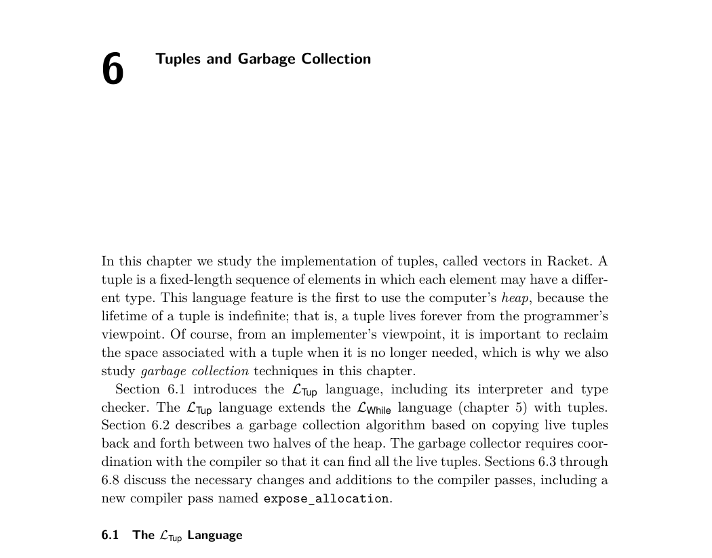
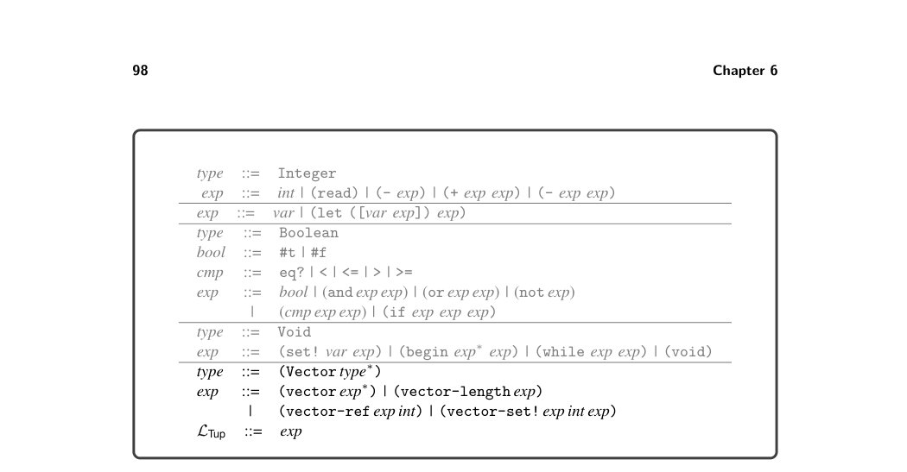
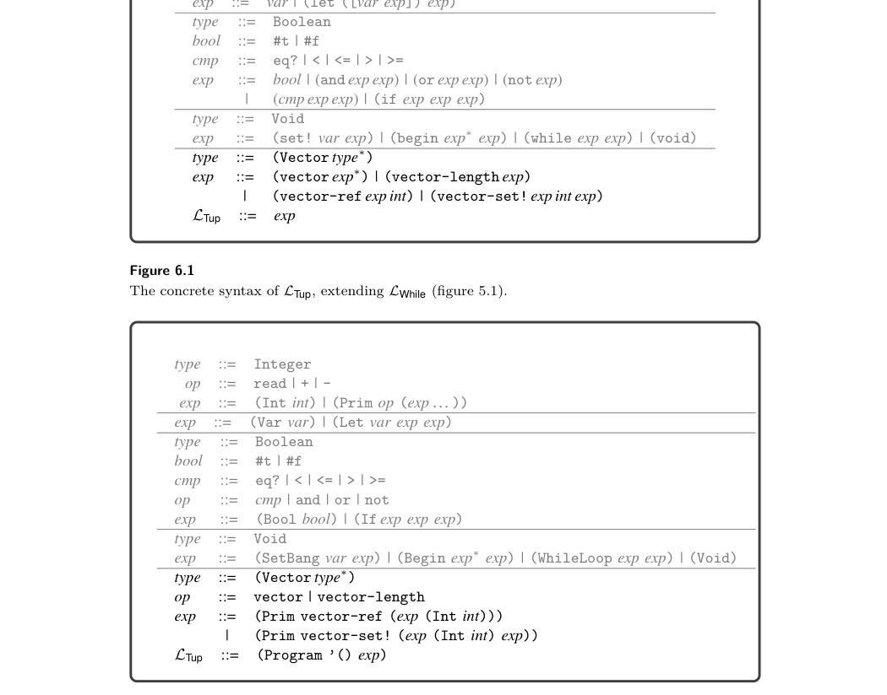

# 6.1 The LTup Language


*Figure 6.1 shows the definition of the concrete syntax for LTup, and figure 6.2 shows the definition of the abstract syntax. The LTup language includes the forms vector for creating a tuple, vector-ref for reading an element of a tuple, vector-set! for writing to an element of a tuple, and vector-length for obtaining the number of elements of a tuple. The following program shows an example of the use of tuples. It creates a tuple t containing the elements 40, #t, and another tuple that contains just 2. The element at index 1 of t is #t, so the then branch of the if is taken. The element at index 0 of t is 40, to which we add 2, the element at index 0 of the tuple. The result of the program is 42.*

```
(let ([t (vector 40 #t (vector 2))])
(if (vector-ref t 1)
(+ (vector-ref t 0)
(vector-ref (vector-ref t 2) 0))
44))
```

Tuples raise several interesting new issues. First, variable binding performs a shallow copy in dealing with tuples, which means that different variables can refer


*Figure 6.1 The concrete syntax of LTup, extending LWhile (figure 5.1).*


*Figure 6.2 The abstract syntax of LTup.*

to the same tuple; that is, two variables can be aliases for the same entity. Consider the following example, in which t1 and t2 refer to the same tuple value and t3 refers to a different tuple value with equal elements. The result of the program is 42.

```
(let ([t1 (vector 3 7)])
(let ([t2 t1])
(let ([t3 (vector 3 7)])
(if (and (eq? t1 t2) (not (eq? t1 t3)))
42
0))))
```

Whether two variables are aliased or not affects what happens when the under- lying tuple is mutated. Consider the following example in which t1 and t2 again refer to the same tuple value.

```
(let ([t1 (vector 3 7)])
(let ([t2 t1])
(let ([_ (vector-set! t2 0 42)])
(vector-ref t1 0))))
```

The mutation through t2 is visible in referencing the tuple from t1, so the result of this program is 42. The next issue concerns the lifetime of tuples. When does a tuple’s lifetime end? Notice that LTup does not include an operation for deleting tuples. Furthermore, the lifetime of a tuple is not tied to any notion of static scoping. For example, the following program returns 42 even though the variable w goes out of scope prior to the vector-ref that reads from the vector to which it was bound.

```
(let ([v (vector (vector 44))])
(let ([x (let ([w (vector 42)])
(let ([_ (vector-set! v 0 w)])
0))])
(+ x (vector-ref (vector-ref v 0) 0))))
```

From the perspective of programmer-observable behavior, tuples live forever. How- ever, if they really lived forever then many long-running programs would run out of memory. To solve this problem, the language’s runtime system performs automatic garbage collection. Figure 6.3 shows the definitional interpreter for the LTup language. We define the vector, vector-ref, vector-set!, and vector-length operations for LTup in terms of the corresponding operations in Racket. One subtle point is that the vector-set! operation returns the #<void> value. Figure 6.4 shows the type checker for LTup. The type of a tuple is a Vector type that contains a type for each of its elements. To create the s-expression for the Vector type, we use the unquote-splicing operator ,@ to insert the list t* without its usual start and end parentheses. The type of accessing the ith element of a tuple is the ith element type of the tuple’s type, if there is one. If not, an error is signaled. Note that the index i is required to be a constant integer (and not, for example, a call to read) so that the type checker can determine the element’s type given the tuple type. Regarding writing an element to a tuple, the element’s type must be equal to the ith element type of the tuple’s type. The result type is Void.

