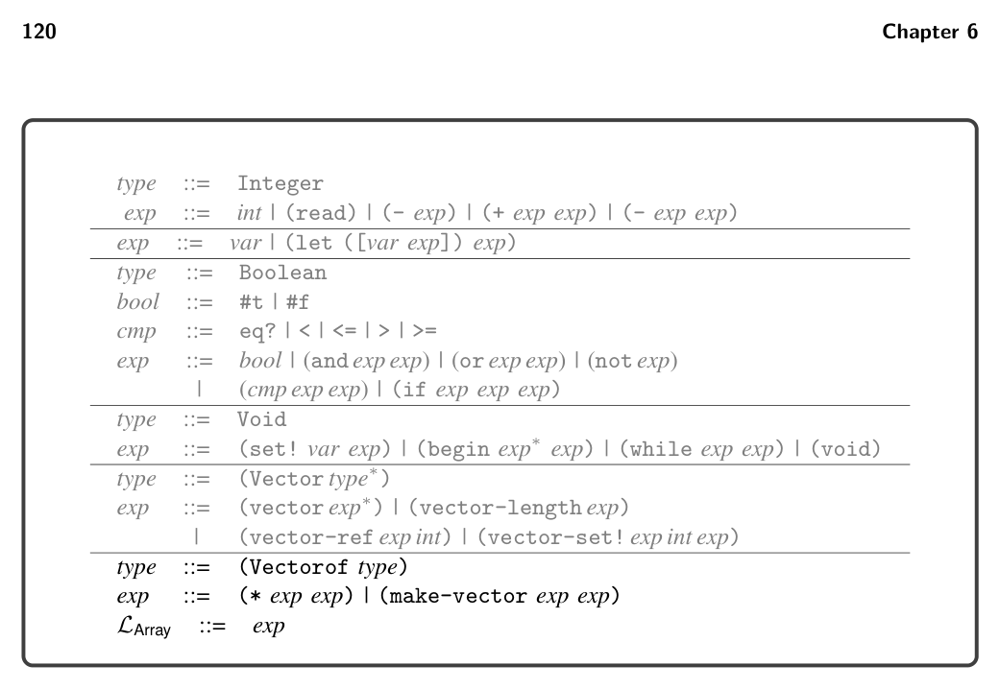
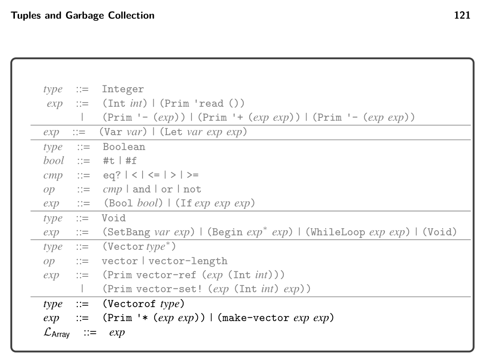
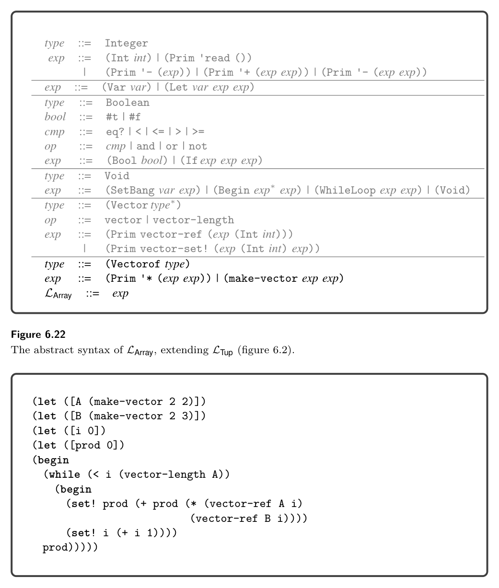
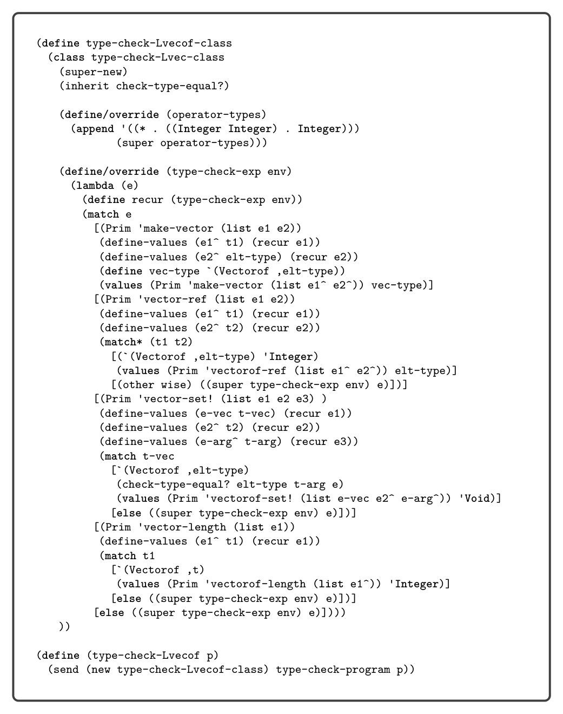
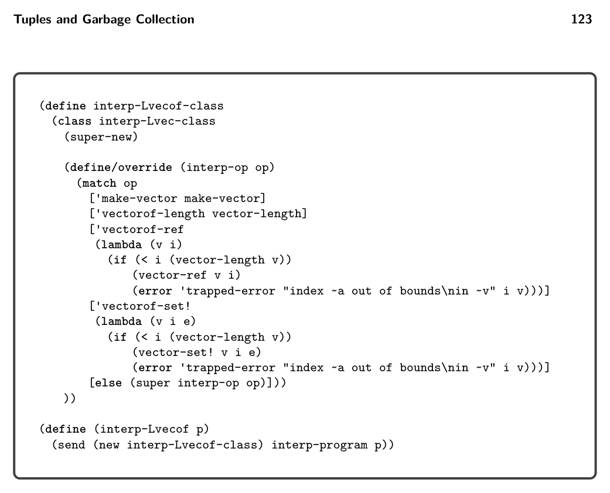
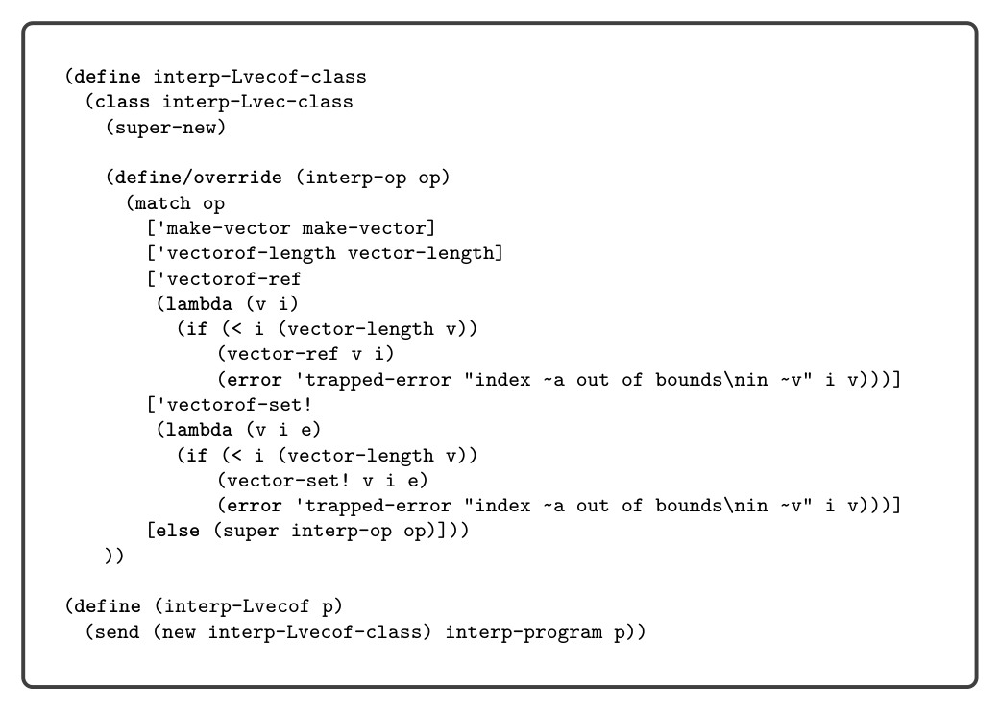

# 6.10 Challenge: Arrays

*Figure 6.21*

6.10 Challenge: Arrays

In this chapter we have studied tuples, that is, heterogeneous sequences of elements whose length is determined at compile time. This challenge is also about sequences, but this time the length is determined at runtime and all the elements have the same type (they are homogeneous). We use the traditional term array for this latter kind of sequence. The Racket language does not distinguish between tuples and arrays; they are both represented by vectors. However, Typed Racket distinguishes between tuples and arrays: the Vector type is for tuples, and the Vectorof type is for arrays. Figure 6.21 presents the definition of the concrete syntax for LArray, and figure 6.22 presents the definition of the abstract syntax, extending LTup with the Vectorof type and the make-vector primitive operator for creating an array, whose argu- ments are the length of the array and an initial value for all the elements in the array. The vector-length, vector-ref, and vector-ref! operators that we defined for tuples become overloaded for use with arrays. We include integer multiplication in LArray because it is useful in many examples involving arrays such as computing the inner product of two arrays (figure 6.23). Figure 6.24 shows the definition of the type checker for LArray. The result type of make-vector is (Vectorof T), where T is the type of the initializing expression. The length expression is required to have type Integer. The type checking of the operators vector-length, vector-ref, and vector-set! is updated to handle the situation in which the vector has type Vectorof. In these cases we translate the operators to their vectorof form so that later passes can easily distinguish between operations on tuples versus arrays. We override the operator-types method to

*Figure 6.22*

*Figure 6.23*

provide the type signature for multiplication: it takes two integers and returns an integer. The definition of the interpreter for LArray is shown in figure 6.25 . The make-vector operator is interpreted using Racket’s make-vector function, and multiplication is interpreted using fx*, which is multiplication for fixnum inte- gers. In the resolve pass (section 6.10.2) we translate array access operations into vectorof-ref and vectorof-set! operations, which we interpret using vector operations with additional bounds checks that signal a trapped-error.

*Figure 6.24*

6.10.1 Data Representation Just as with tuples, we store arrays on the heap, which means that the garbage collector will need to inspect arrays. An immediate thought is to use the same representation for arrays that we use for tuples. However, we limit tuples to a length of fifty so that their length and pointer mask can fit into the 64-bit tag at

*(super-new)*

*Figure 6.25*

the beginning of each tuple (section 6.2.3). We intend arrays to allow millions of elements, so we need more bits to store the length. However, because arrays are homogeneous, we need only 1 bit for the pointer mask instead of 1 bit per array element. Finally, the garbage collector must be able to distinguish between tuples and arrays, so we need to reserve one bit for that purpose. We arrive at the following layout for the 64-bit tag at the beginning of an array:

* The right-most bit is the forwarding bit, just as in a tuple. A 0 indicates that it
  is a forwarding pointer, and a 1 indicates that it is not.

* The next bit to the left is the pointer mask. A 0 indicates that none of the
  elements are pointers, and a 1 indicates that all the elements are pointers.

* The next 60 bits store the length of the array.

* The bit at position 62 distinguishes between a tuple (0) and an array (1).

* The left-most bit is reserved as explained in chapter 10.

In the following subsections we provide hints regarding how to update the passes to handle arrays.

6.10.2 Overload Resolution As noted previously, with the addition of arrays, several operators have become overloaded; that is, they can be applied to values of more than one type. In this case, the element access and length operators can be applied to both tuples and

arrays. This kind of overloading is quite common in programming languages, so many compilers perform overload resolution to handle it. The idea is to translate each overloaded operator into different operators for the different types. Implement a new pass named resolve. Translate the reading of an array element to vectorof-ref and the writing of an array element to vectorof-set!. Translate calls to vector-length into vectorof-length. When these operators are applied to tuples, leave them as is.

6.10.3 Bounds Checking Recall that the interpreter for LArray signals a trapped-error when there is an array access that is out of bounds. Therefore your compiler is obliged to also catch these errors during execution and halt, signaling an error. We recommend inserting a new pass named check_bounds that inserts code around each vectorof-ref and vectorof-set! operation to ensure that the index is greater than or equal to zero and less than the array’s length. If not, the program should halt, for which we recommend using a new primitive operation named exit.

6.10.4 Expose Allocation This pass should translate array creation into lower-level operations. In particular, the new AST node (AllocateArray int type) is analogous to the Allocate AST node for tuples. The type argument must be (Vectorof T), where T is the element type for the array. The AllocateArray AST node allocates an array of the length specified by the exp (of type Integer), but does not initialize the elements of the array. Generate code in this pass to initialize the elements analogous to the case for tuples.

6.10.5 Uncover get! Add cases for AllocateArray to collect-set! and uncover-get!-exp.

6.10.6 Remove Complex Operands Add cases in the rco_atom and rco_exp for AllocateArray. In particular, an AllocateArray node is complex, and its subexpression must be atomic.

6.10.7 Explicate Control Add cases for AllocateArray to explicate_tail and explicate_assign.

6.10.8 Select Instructions Generate instructions for AllocateArray similar to those for Allocate given in section 6.6 except that the tag at the front of the array should instead use the representation discussed in section 6.10.1. Regarding vectorof-length, extract the length from the tag. The instructions generated for accessing an element of an array differ from those for a tuple (section 6.6) in that the index is not a constant so you need to generate instructions that compute the offset at runtime.

