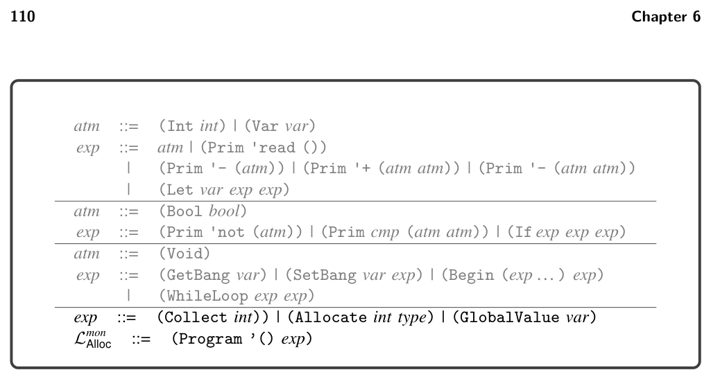
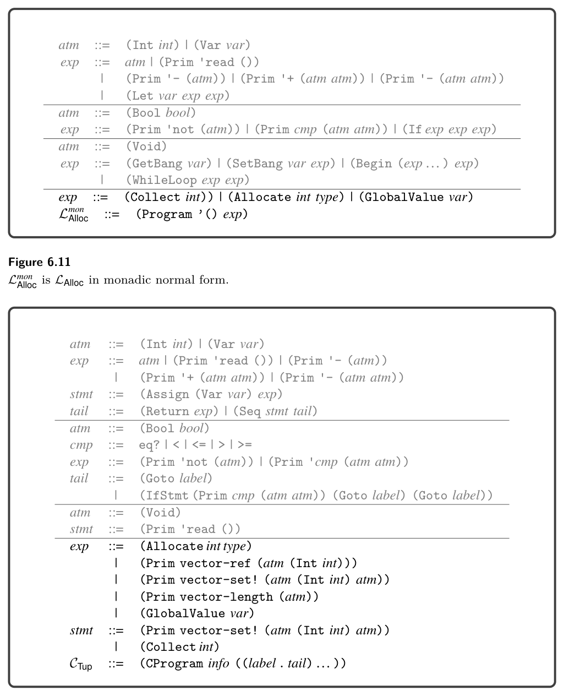
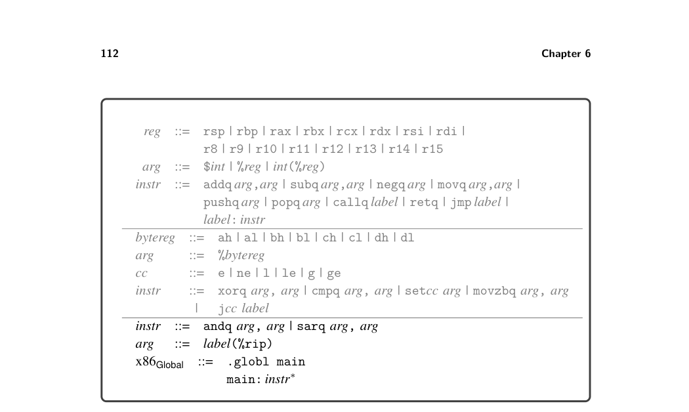
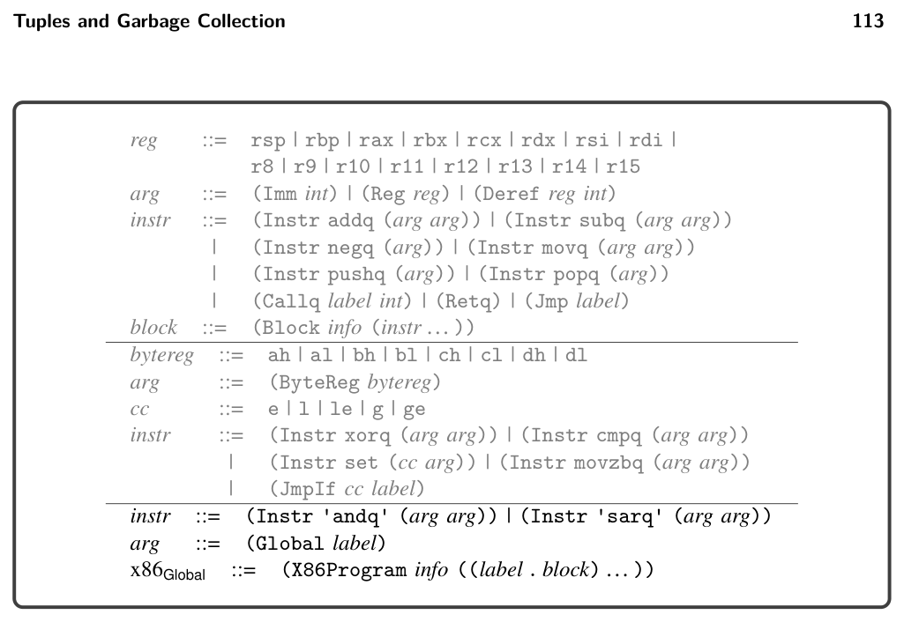
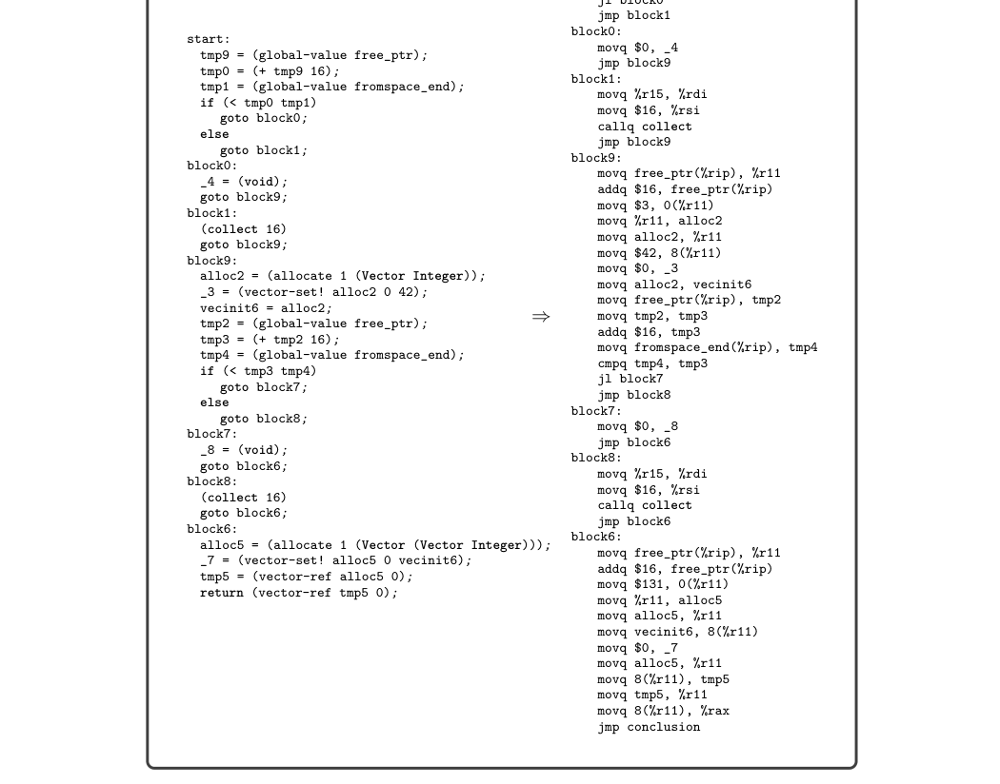

# 6.6 Select Instructions and the x86Global Language

*Figure 6.11 Lmon Alloc is LAlloc in monadic normal form.*

*Figure 6.12 The abstract syntax of CTup, extending C⟲(figure 5.7).*

6.6 Select Instructions and the x86Global Language

In this pass we generate x86 code for most of the new operations that are needed to compile tuples, including Allocate, Collect, accessing tuple elements, and the Is comparison. We compile GlobalValue to Global because the latter has a different concrete syntax (see figures 6.13 and 6.14).

The tuple read and write forms translate into movq instructions. (The +1 in the offset serves to move past the tag at the beginning of the tuple representation.)

lhs = (vector-ref tup n); =⇒ movq tup′, %r11 movq 8(n + 1)(%r11), lhs′

lhs = (vector-set! tup n rhs); =⇒ movq tup′, %r11 movq rhs′, 8(n + 1)(%r11) movq $0, lhs′

The lhs′, tup′, and rhs′ are obtained by translating from CTup to x86. The move of tup′ to register r11 ensures that the offset expression 8(n + 1)(%r11) contains a register operand. This requires removing r11 from consideration by the register allocator. Why not use rax instead of r11? Suppose that we instead used rax. Then the generated code for tuple assignment would be

movq tup′, %rax movq rhs′, 8(n + 1)(%rax)

Next, suppose that rhs′ ends up as a stack location, so patch_instructions would insert a move through rax as follows:

movq tup′, %rax movq rhs′, %rax movq %rax, 8(n + 1)(%rax)

However, this sequence of instructions does not work because we’re trying to use rax for two different values (tup′ and rhs′) at the same time! The vector-length operation should be translated into a sequence of instruc- tions that read the tag of the tuple and extract the 6 bits that represent the tuple length, which are the bits starting at index 1 and going up to and including bit 6. The x86 instructions andq (for bitwise-and) and sarq (shift right) can be used to accomplish this. We compile the allocate form to operations on the free_ptr, as shown next. This approach is called inline allocation because it implements allocation without a function call by simply incrementing the allocation pointer. It is much more efficient than calling a function for each allocation. The address in the free_ptr is the next free address in the FromSpace, so we copy it into r11 and then move it forward by enough space for the tuple being allocated, which is 8(len + 1) bytes because each element is 8 bytes (64 bits) and we use 8 bytes for the tag. We then initialize the tag and finally copy the address in r11 to the left-hand side. Refer to figure 6.8 to see how the tag is organized. We recommend using the Racket operations bitwise-ior and arithmetic-shift to compute the tag during compilation. The type anno- tation in the allocate form is used to determine the pointer mask region of the

*Figure 6.13 The concrete syntax of x86Global (extends x86If shown in figure 4.9).*

tag. The addressing mode free_ptr(%rip) essentially stands for the address of the free_ptr global variable using a special instruction-pointer-relative addressing mode of the x86-64 processor. In particular, the assembler computes the distance d between the address of free_ptr and where the rip would be at that moment and then changes the free_ptr(%rip) argument to d(%rip), which at runtime will compute the address of free_ptr.

lhs = (allocate len (Vector type … )); =⇒ movq free_ptr(%rip), %r11 addq 8(len + 1), free_ptr(%rip) movq $tag, 0(%r11) movq %r11, lhs′

The collect form is compiled to a call to the collect function in the runtime. The arguments to collect are (1) the top of the root stack, and (2) the number of bytes that need to be allocated. We use another dedicated register, r15, to store the pointer to the top of the root stack. Therefore r15 is not available for use by the register allocator.

(collect bytes) =⇒ movq %r15, %rdi movq $bytes, %rsi callq collect

*Figure 6.14 The abstract syntax of x86Global (extends x86If shown in figure 4.10).*

The definitions of the concrete and abstract syntax of the x86Global language are shown in figures 6.13 and 6.14. It differs from x86If with the addition of global variables and the instructions needed to compile tuple length: andq and sarq. Figure 6.15 shows the output of the select_instructions pass on the running example.

*Figure 6.15 Output of explicate_control (left) and select_instructions (right) on the running example.*

