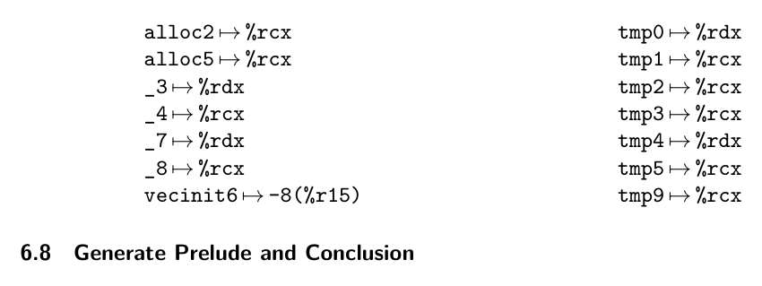
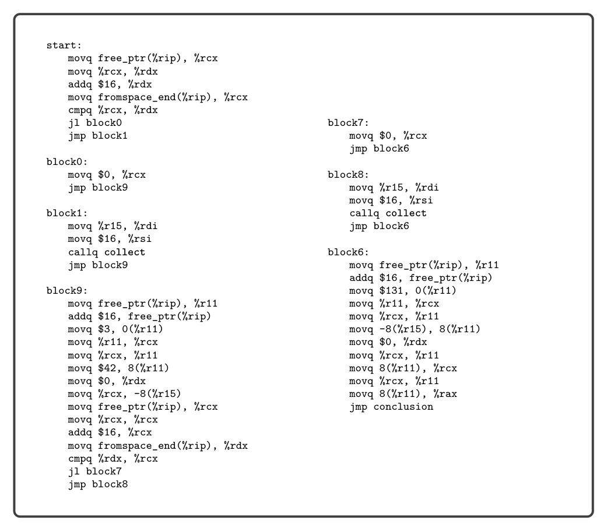
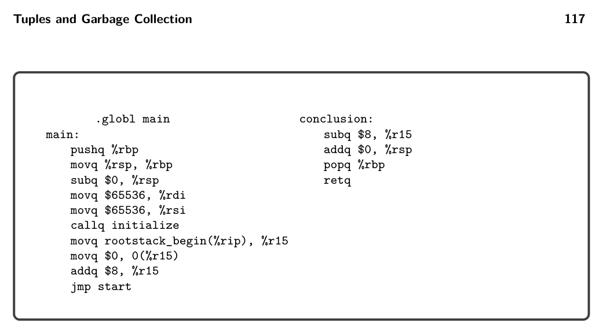
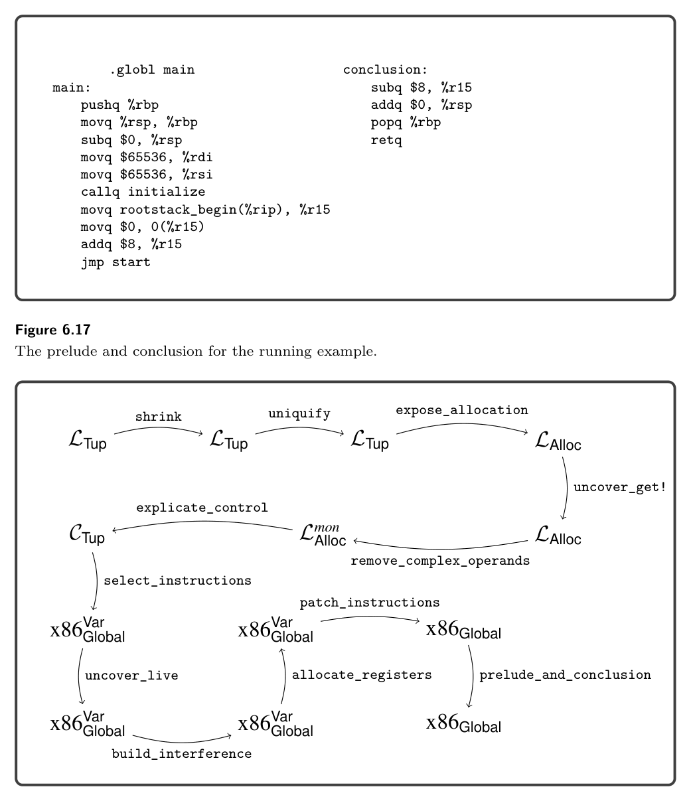

# 6.8 Generate Prelude and Conclusion

6.7 Register Allocation

As discussed previously in this chapter, the garbage collector needs to access all the pointers in the root set, that is, all variables that are tuples. It will be the responsibility of the register allocator to make sure that

* the root stack is used for spilling tuple-typed variables, and
* if a tuple-typed variable is live during a call to the collector, it must be spilled
  to ensure that it is visible to the collector.

The latter responsibility can be handled during construction of the interference graph, by adding interference edges between the call-live tuple-typed variables and all the callee-saved registers. (They already interfere with the caller-saved registers.) The type information for variables is in the Program form, so we recommend adding another parameter to the build_interference function to communicate this alist. The spilling of tuple-typed variables to the root stack can be handled after graph coloring, in choosing how to assign the colors (integers) to registers and stack loca- tions. The Program output of this pass changes to also record the number of spills to the root stack. Figure 6.16 shows the output of register allocation on the running example. The register allocator chose the below assignment of variables to locations. Many of the variables were assigned to register %rcx. Variables _3, _7, tmp0, and tmp4 were instead assigned to %rdx because they conflict with variables that were assigned to %rcx. Variable vecinit6 was spilled to the root stack because its type is (Vector Integer) and it is live during a call to collect.

*Figure 6.17*

*Figure 6.16*

to accomplish this task because there is only one spill. In general, we have to clear as many words as there are spills of tuple-typed variables. The garbage collector tests each root to see if it is null prior to dereferencing it. Figure 6.18 gives an overview of all the passes needed for the compilation of LTup.

*Figure 6.17*

*Figure 6.18*

