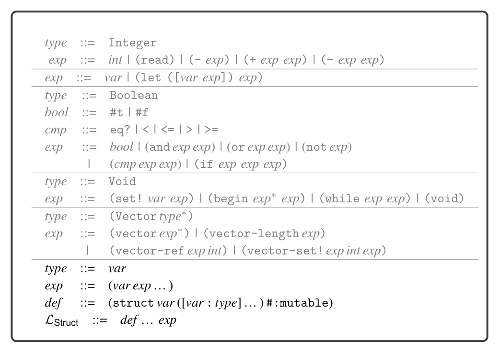

# 6.9 Challenge: Simple Structures


*Figure 6.19*

6.9 Challenge: Simple Structures

The language LStruct extends LTup with support for simple structures. The definition of its concrete syntax is shown in figure 6.19, and the abstract syntax is shown in figure 6.20. Recall that a struct in Typed Racket is a user-defined data type that contains named fields and that is heap allocated, similarly to a vector. The following is an example of a structure definition, in this case the definition of a point type:

(struct point ([x : Integer] [y : Integer]) #:mutable)

An instance of a structure is created using function-call syntax, with the name of the structure in the function position, as follows:

(point 7 12)

Function-call syntax is also used to read a field of a structure. The function name is formed by the structure name, a dash, and the field name. The following example uses point-x and point-y to access the x and y fields of two point instances:

```
(let ([pt1 (point 7 12)])
(let ([pt2 (point 4 3)])
(+ (- (point-x pt1) (point-x pt2))
(- (point-y pt1) (point-y pt2)))))
```


*Figure 6.20*

Similarly, to write to a field of a structure, use its set function, whose name starts with set-, followed by the structure name, then a dash, then the field name, and finally with an exclamation mark. The following example uses set-point-x! to change the x field from 7 to 42:

```
(let ([pt (point 7 12)])
(let ([_ (set-point-x! pt 42)])
(point-x pt)))
```

Exercise 6.1 Create a type checker for LStruct by extending the type checker for LTup. Extend your compiler with support for simple structures, compiling LStruct to x86 assembly code. Create five new test cases that use structures, and test your compiler.

