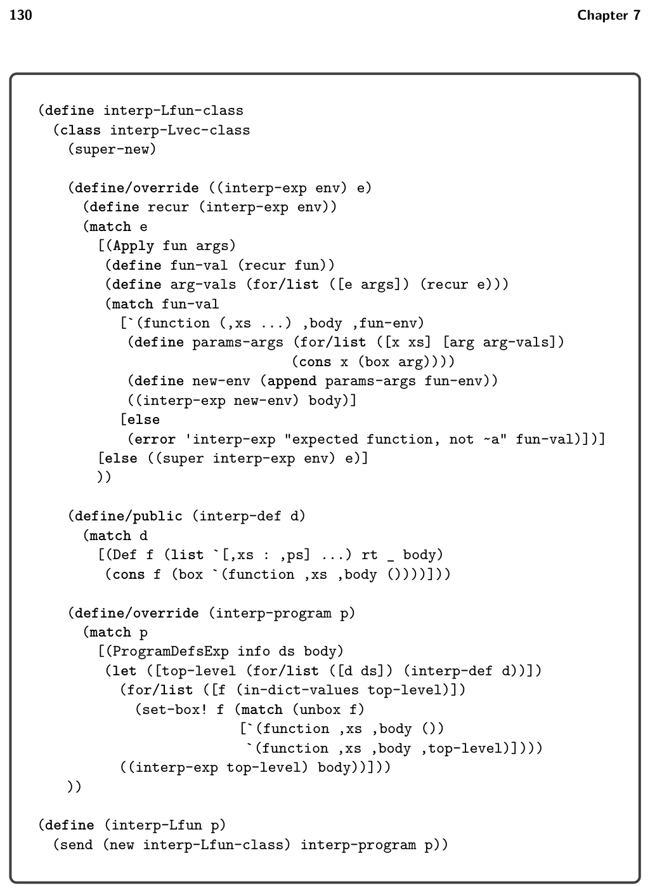
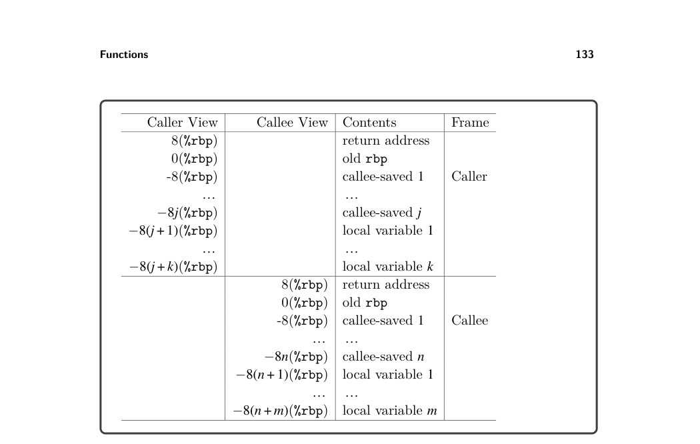
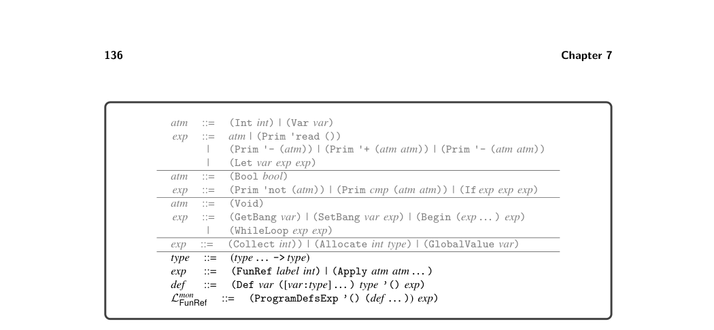
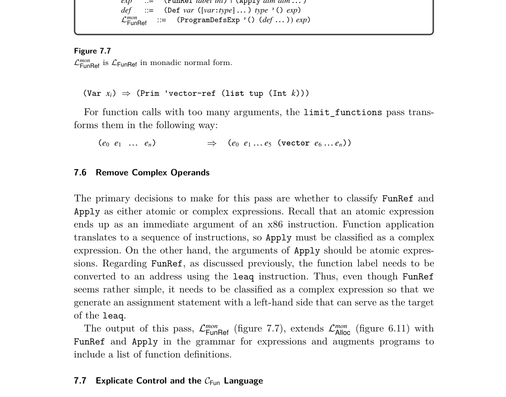
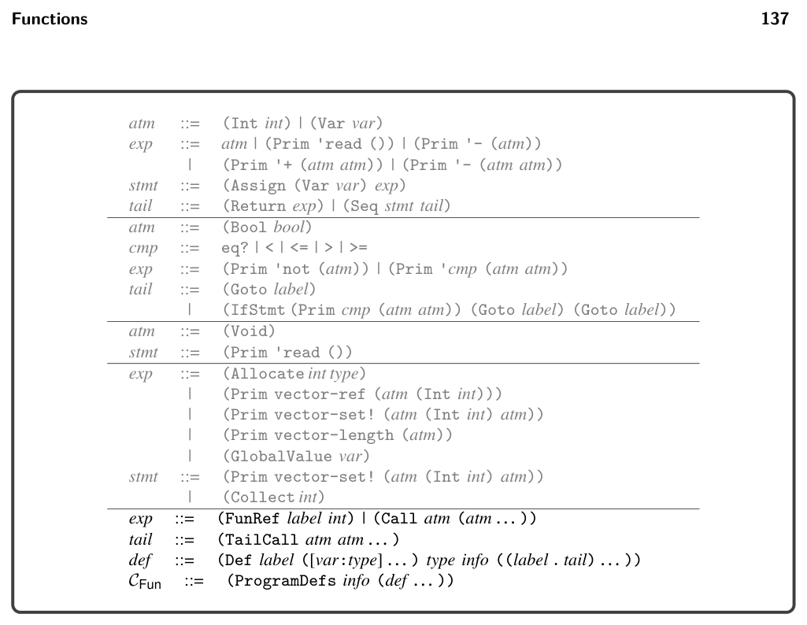
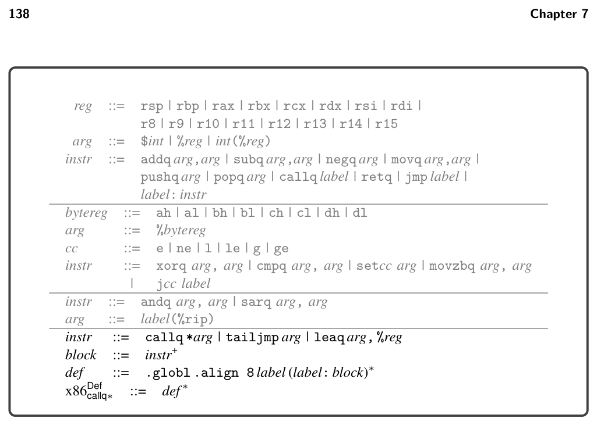
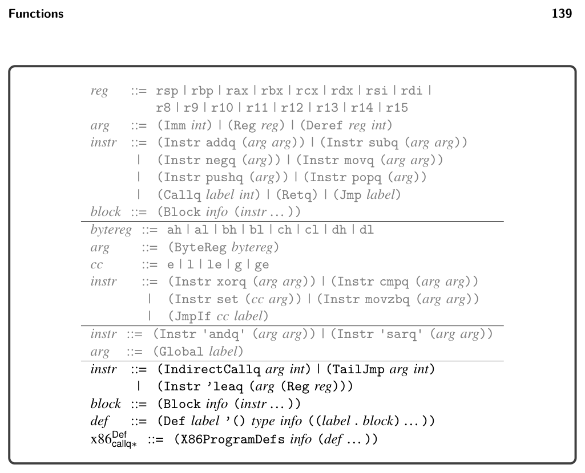

# 7 Functions

7

Functions

This chapter studies the compilation of a subset of Typed Racket in which only top-level function definitions are allowed. This kind of function appears in the C programming language, and it serves as an important stepping-stone to implement- ing lexically scoped functions in the form of lambda abstractions, which is the topic of chapter 8.

## 7.1 The LFun Language

The concrete syntax and abstract syntax for function definitions and function appli- cation are shown in figures 7.1 and 7.2, with which we define the LFun language. Programs in LFun begin with zero or more function definitions. The function names from these definitions are in scope for the entire program, including all the function definitions, and therefore the ordering of function definitions does not matter. The concrete syntax for function application is (exp exp … ), where the first expression must evaluate to a function and the remaining expressions are the arguments. The abstract syntax for function application is (Apply exp exp∗). Functions are first-class in the sense that a function pointer is data and can be stored in memory or passed as a parameter to another function. Thus, there is a function type, written

(type1 · · · typen -> typer)

for a function whose n parameters have the types type1 through typen and whose return type is typeR. The main limitation of these functions (with respect to Racket functions) is that they are not lexically scoped. That is, the only external entities that can be referenced from inside a function body are other globally defined func- tions. The syntax of LFun prevents function definitions from being nested inside each other. The program shown in figure 7.3 is a representative example of defining and using functions in LFun. We define a function map that applies some other function f to both elements of a tuple and returns a new tuple containing the results. We also define a function inc. The program applies map to inc and (vector 0 41). The result is (vector 1 42), from which we return 42. The definitional interpreter for LFun is shown in figure 7.4. The case for the ProgramDefsExp AST is responsible for setting up the mutual recursion between


*Figure 7.1*


*Figure 7.2*


*Figure 7.3*

the top-level function definitions. We use the classic back-patching approach that uses mutable variables and makes two passes over the function definitions (Kelsey, Clinger, and Rees 1998). In the first pass we set up the top-level environment using a mutable cons cell for each function definition. Note that the lambda value for each function is incomplete; it does not yet include the environment. Once the top-level environment has been constructed, we iterate over it and update the lambda values to use the top-level environment. To interpret a function application, we match the result of the function expression to obtain a function value. We then extend the function’s environment with the mapping of parameters to argument values. Finally, we interpret the body of the function in this extended environment. The type checker for LFun is shown in figure 7.5. Similarly to the interpreter, the case for the ProgramDefsExp AST is responsible for setting up the mutual recursion between the top-level function definitions. We begin by creating a mapping env from every function name to its type. We then type check the program using this mapping. To check a function application, we match the type of the function expression to a function type and check that the types of the argument expressions are equal to the function’s parameter types. The type of the application as a whole is the return type from the function type.


*(super-new)*


*Figure 7.4*


*Figure 7.5*

## 7.2 Functions in x86

The x86 architecture provides a few features to support the implementation of functions. We have already seen that there are labels in x86 so that one can refer to the location of an instruction, as is needed for jump instructions. Labels can also be used to mark the beginning of the instructions for a function. Going further, we can obtain the address of a label by using the leaq instruction. For example, the following puts the address of the inc label into the rbx register:

leaq inc(%rip), %rbx

Recall from section 6.6 that inc(%rip) is an example of instruction-pointer-relative addressing. In section 2.2 we used the callq instruction to jump to functions whose locations were given by a label, such as read_int. To support function calls in this chapter we instead jump to functions whose location are given by an address in a register; that is, we use indirect function calls. The x86 syntax for this is a callq instruction that requires an asterisk before the register name.

callq *%rbx

7.2.1 Calling Conventions The callq instruction provides partial support for implementing functions: it pushes the return address on the stack and it jumps to the target. However, callq does not handle

* parameter passing,
* pushing frames on the procedure call stack and popping them off, or
* determining how registers are shared by different functions.

Regarding parameter passing, recall that the x86-64 calling convention for Unix- based systems uses the following six registers to pass arguments to a function, in the given order:

rdi rsi rdx rcx r8 r9

If there are more than six arguments, then the calling convention mandates using space on the frame of the caller for the rest of the arguments. However, to ease the implementation of efficient tail calls (section 7.2.2), we arrange never to need more than six arguments. The return value of the function is stored in register rax. Regarding frames and the procedure call stack, recall from section 2.2 that the stack grows down and each function call uses a chunk of space on the stack called a frame. The caller sets the stack pointer, register rsp, to the last data item in its frame. The callee must not change anything in the caller’s frame, that is, anything that is at or above the stack pointer. The callee is free to use locations that are below the stack pointer. Recall that we store variables of tuple type on the root stack. So, the prelude of a function needs to move the root stack pointer r15 up according to the number


*Figure 7.6*

of variables of tuple type and the conclusion needs to move the root stack pointer back down. Also, the prelude must initialize to 0 this frame’s slots in the root stack to signal to the garbage collector that those slots do not yet contain a valid pointer. Otherwise the garbage collector will interpret the garbage bits in those slots as memory addresses and try to traverse them, causing serious mayhem! Regarding the sharing of registers between different functions, recall from section 3.1 that the registers are divided into two groups, the caller-saved registers and the callee-saved registers. The caller should assume that all the caller-saved registers are overwritten with arbitrary values by the callee. For that reason we recommend in section 3.1 that variables that are live during a function call should not be assigned to caller-saved registers. On the flip side, if the callee wants to use a callee-saved register, the callee must save the contents of those registers on their stack frame and then put them back prior to returning to the caller. For that reason we recommend in section 3.1 that if the register allocator assigns a variable to a callee-saved register, then the prelude of the main function must save that register to the stack and the conclusion of main must restore it. This recommendation now generalizes to all functions. Recall that the base pointer, register rbp, is used as a point of reference within a frame, so that each local variable can be accessed at a fixed offset from the base pointer (section 2.2). Figure 7.6 shows the layout of the caller and callee frames.

7.2.2 Efficient Tail Calls In general, the amount of stack space used by a program is determined by the longest chain of nested function calls. That is, if function f1 calls f2, f2 calls f3, and so on to fn, then the amount of stack space is linear in n. The depth n can grow quite large if functions are recursive. However, in some cases we can arrange to use only a constant amount of space for a long chain of nested function calls. A tail call is a function call that happens as the last action in a function body. For example, in the following program, the recursive call to tail_sum is a tail call:

```
(define (tail_sum [n : Integer] [r : Integer]) : Integer
(if (eq? n 0)
r
(tail_sum (- n 1) (+ n r))))
```

(+ (tail_sum 3 0) 36)

At a tail call, the frame of the caller is no longer needed, so we can pop the caller’s frame before making the tail call. With this approach, a recursive function that makes only tail calls ends up using a constant amount of stack space. Functional languages like Racket rely heavily on recursive functions, so the definition of Racket requires that all tail calls be optimized in this way. Some care is needed with regard to argument passing in tail calls. As mentioned, for arguments beyond the sixth, the convention is to use space in the caller’s frame for passing arguments. However, for a tail call we pop the caller’s frame and can no longer use it. An alternative is to use space in the callee’s frame for passing arguments. However, this option is also problematic because the caller and callee’s frames overlap in memory. As we begin to copy the arguments from their sources in the caller’s frame, the target locations in the callee’s frame might collide with the sources for later arguments! We solve this problem by using the heap instead of the stack for passing more than six arguments (section 7.5). As mentioned, for a tail call we pop the caller’s frame prior to making the tail call. The instructions for popping a frame are the instructions that we usually place in the conclusion of a function. Thus, we also need to place such code immediately before each tail call. These instructions include restoring the callee-saved registers, so it is fortunate that the argument passing registers are all caller-saved registers. One note remains regarding which instruction to use to make the tail call. When the callee is finished, it should not return to the current function but instead return to the function that called the current one. Thus, the return address that is already on the stack is the right one, and we should not use callq to make the tail call because that would overwrite the return address. Instead we simply use the jmp instruction. As with the indirect function call, we write an indirect jump with a register prefixed with an asterisk. We recommend using rax to hold the jump target because the conclusion can overwrite just about everything else.

jmp *%rax

## 7.3 Shrink LFun

The shrink pass performs a minor modification to ease the later passes. This pass introduces an explicit main function that gobbles up all the top-level statements of the module. It also changes the top ProgramDefsExp form to ProgramDefs.

(ProgramDefsExp info (def … ) exp) ⇒(ProgramDefs info (def … mainDef))

where mainDef is

(Def 'main '() 'Integer '() exp′)

## 7.4 Reveal Functions and the LFunRef Language

The syntax of LFun is inconvenient for purposes of compilation in that it conflates the use of function names and local variables. This is a problem because we need to compile the use of a function name differently from the use of a local variable. In particular, we use leaq to convert the function name (a label in x86) to an address in a register. Thus, we create a new pass that changes function references from (Var f) to (FunRef f n) where n is the arity of the function. This pass is named reveal_functions and the output language is LFunRef. Placing this pass after uniquify will make sure that there are no local variables and functions that share the same name. The reveal_functions pass should come before the remove_complex_operands pass because function references should be categorized as complex expressions.

## 7.5 Limit Functions

Recall that we wish to limit the number of function parameters to six so that we do not need to use the stack for argument passing, which makes it easier to implement efficient tail calls. However, because the input language LFun supports arbitrary numbers of function arguments, we have some work to do! The limit_functions pass transforms functions and function calls that involve more than six arguments to pass the first five arguments as usual, but it packs the rest of the arguments into a tuple and passes it as the sixth argument.1

Each function definition with seven or more parameters is transformed as follows:

(Def f ([x1:T1] … [xn:Tn]) Tr info body) ⇒ (Def f ([x1:T1] … [x5:T5] [tup : (Vector T6 … Tn)]) Tr info body′)

where the body is transformed into body′ by replacing the occurrences of each parameter xi where i > 5 with the kth element of the tuple, where k = i −6.

* The implementation this pass can be postponed to last because you can test the rest of the
  passes on functions with six or fewer parameters.


*Figure 7.7*


*Figure 7.8*


*Figure 7.8*

becomes TailCall. We recommend defining a new auxiliary function for processing function definitions. This code is similar to the case for Program in Lmon Tup. The top- level explicate_control function that handles the ProgramDefs form of Lmon FunRef can apply this new function to all function definitions.


*Figure 7.9*

7.8 Select Instructions and the x86Def callq∗Language

The output of select instructions is a program in the x86Def callq∗language; the definition of its concrete syntax is shown in figure 7.9, and the definition of its abstract syntax is shown in figure 7.10. We use the align directive on the labels of function definitions to make sure the bottom three bits are zero, which we put to use in chapter 9. We discuss the new instructions as needed in this section. An assignment of a function reference to a variable becomes a load-effective- address instruction as follows, where lhs′ is the translation of lhs from atm in CFun to arg in x86Var,Def callq∗. The FunRef becomes a Global AST node, whose concrete syntax is instruction-pointer-relative addressing.

lhs = (fun-ref f n); ⇒ leaq f(%rip), lhs′

Regarding function definitions, we need to remove the parameters and instead perform parameter passing using the conventions discussed in section 7.2. That is, the arguments are passed in registers. We recommend turning the parameters into local variables and generating instructions at the beginning of the function to move from the argument-passing registers (section 7.2.1) to these local variables.

(Def f '([x1 : T1] [x2 : T2] … ) Tr info B) ⇒ (Def f '() 'Integer info′ B′)


*Figure 7.10*

The basic blocks B′ are the same as B except that the start block is modified to add the instructions for moving from the argument registers to the parameter variables. So the start block of B shown on the left of the following is changed to the code on the right:

fstart: movq %rdi, x1 movq %rsi, x2 · · · instr1 · · · instrn

start: instr1 · · · instrn

⇒

Recall that we use the label start for the initial block of a program, and in section 2.7 we recommend labeling the conclusion of the program with conclusion, so that (Return Arg) can be compiled to an assignment to rax followed by a jump to conclusion. With the addition of function definitions, there is a start block and conclusion for each function, but their labels need to be unique. We recommend prepending the function’s name to start and conclusion, respectively, to obtain unique labels. The interpreter for x86Def callq∗needs to be given the number of parameters the func- tion expects, but the parameters are no longer in the syntax of function definitions.

Instead, add an entry to info that maps num-params to the number of parameters to construct info′. By changing the parameters to local variables, we are giving the register allocator control over which registers or stack locations to use for them. If you implement the move-biasing challenge (section 3.7), the register allocator will try to assign the parameter variables to the corresponding argument register, in which case the patch_instructions pass will remove the movq instruction. This happens in the example translation given in figure 7.12 in section 7.12, in the add function. Also, note that the register allocator will perform liveness analysis on this sequence of move instructions and build the interference graph. So, for example, x1 will be marked as interfering with rsi, and that will prevent the mapping of x1 to rsi, which is good because otherwise the first movq would overwrite the argument in rsi that is needed for x2. Next, consider the compilation of function calls. In the mirror image of the handling of parameters in function definitions, the arguments are moved to the argument-passing registers. Note that the function is not given as a label, but its address is produced by the argument arg0. So, we translate the call into an indirect function call. The return value from the function is stored in rax, so it needs to be moved into the lhs.

lhs = (Call arg0 arg1 arg2 … ) ⇒ movq arg1, %rdi movq arg2, %rsi ... callq *arg0 movq %rax, lhs

The IndirectCallq AST node includes an integer for the arity of the function, that is, the number of parameters. That information is useful in the uncover_live pass for determining which argument-passing registers are potentially read during the call. For tail calls, the parameter passing is the same as non-tail calls: generate instruc- tions to move the arguments into the argument-passing registers. After that we need to pop the frame from the procedure call stack. However, we do not yet know how big the frame is; that gets determined during register allocation. So, instead of generating those instructions here, we invent a new instruction that means “pop the frame and then do an indirect jump,” which we name TailJmp. The abstract syntax for this instruction includes an argument that specifies where to jump and an integer that represents the arity of the function being called.

## 7.9 Register Allocation

The addition of functions requires some changes to all three aspects of register allocation, which we discuss in the following subsections.

7.9.1 Liveness Analysis The IndirectCallq instruction should be treated like Callq regarding its written locations W, in that they should include all the caller-saved registers. Recall that the reason for that is to force variables that are live across a function call to be assigned to callee-saved registers or to be spilled to the stack. Regarding the set of read locations R, the arity fields of TailJmp and IndirectCallq determine how many of the argument-passing registers should be considered as read by those instructions. Also, the target field of TailJmp and IndirectCallq should be included in the set of read locations R.

7.9.2 Build Interference Graph With the addition of function definitions, we compute a separate interference graph for each function (not just one for the whole program). Recall that in section 6.7 we discussed the need to spill tuple-typed variables that are live during a call to collect, the garbage collector. With the addition of functions to our language, we need to revisit this issue. Functions that perform allocation contain calls to the collector. Thus, we should not only spill a tuple-typed variable when it is live during a call to collect, but we should spill the variable if it is live during a call to any user-defined function. Thus, in the build_interference pass, we recommend adding interference edges between call-live tuple-typed vari- ables and the callee-saved registers (in addition to creating edges between call-live variables and the caller-saved registers).

7.9.3 Allocate Registers The primary change to the allocate_registers pass is adding an auxiliary func- tion for handling definitions (the def nonterminal shown in figure 7.10) with one case for function definitions. The logic is the same as described in chapter 3 except that now register allocation is performed many times, once for each function definition, instead of just once for the whole program.

## 7.10 Patch Instructions

In patch_instructions, you should deal with the x86 idiosyncrasy that the desti- nation argument of leaq must be a register. Additionally, you should ensure that the argument of TailJmp is rax, our reserved register—because we trample many other registers before the tail call, as explained in the next section.

## 7.11 Generate Prelude and Conclusion

Now that register allocation is complete, we can translate the TailJmp into a sequence of instructions. A naive translation of TailJmp would simply be jmp *arg. However, before the jump we need to pop the current frame to achieve efficient tail calls. This sequence of instructions is the same as the code for the conclusion of a function, except that the retq is replaced with jmp *arg.

Regarding function definitions, we generate a prelude and conclusion for each one. This code is similar to the prelude and conclusion generated for the main function presented in chapter 6. To review, the prelude of every function should carry out the following steps:

* Push rbp to the stack and set rbp to current stack pointer.
* Push to the stack all the callee-saved registers that were used for register
  allocation.
* Move the stack pointer rsp down to make room for the regular spills (aligned
  to 16 bytes).
* Move the root stack pointer r15 up by the size of the root-stack frame for this
  function, which depends on the number of spilled tuple-typed variables.
* Initialize to zero all new entries in the root-stack frame.
* Jump to the start block.

The prelude of the main function has an additional task: call the initialize function to set up the garbage collector, and then move the value of the global rootstack_begin in r15. This initialization should happen before step 4, which depends on r15. The conclusion of every function should do the following:

* Move the stack pointer back up past the regular spills.
* Restore the callee-saved registers by popping them from the stack.
* Move the root stack pointer back down by the size of the root-stack frame for
  this function.
* Restore rbp by popping it from the stack.
* Return to the caller with the retq instruction.

The output of this pass is x86callq∗, which differs from x86Def callq∗in that there is no longer an AST node for function definitions. Instead, a program is just an association list of basic blocks, as in x86Global. So we have the following grammar rule: x86callq∗::= (X86Program info ((label . block) … ))

*Figure 7.11*

Exercise 7.1 Expand your compiler to handle LFun as outlined in this chapter. Cre- ate eight new programs that use functions including examples that pass functions and return functions from other functions, recursive functions, functions that cre- ate tuples, and functions that make tail calls. Test your compiler on these new programs and all your previously created test programs.


*Figure 7.11*


*Figure 7.12*


*Figure 7.12*

