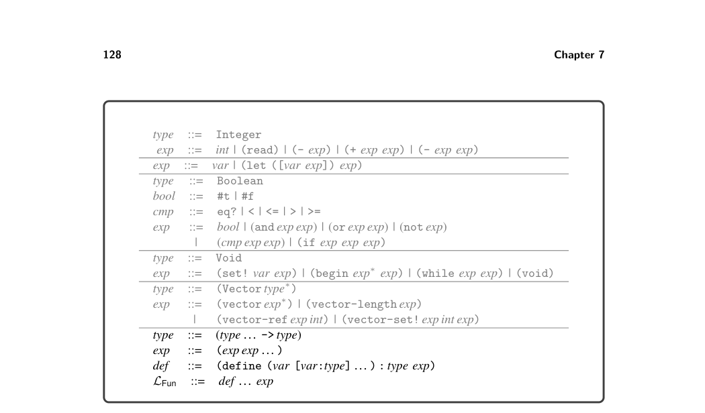
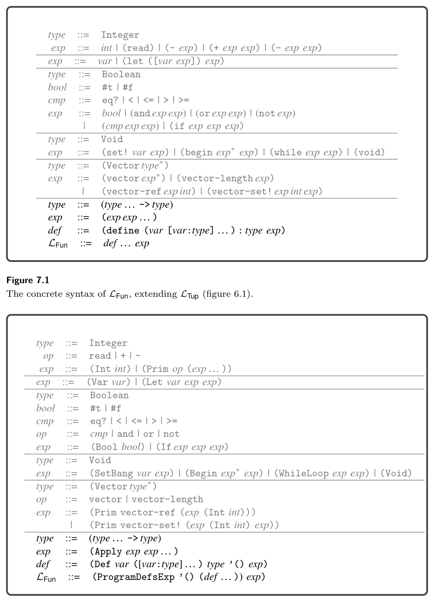
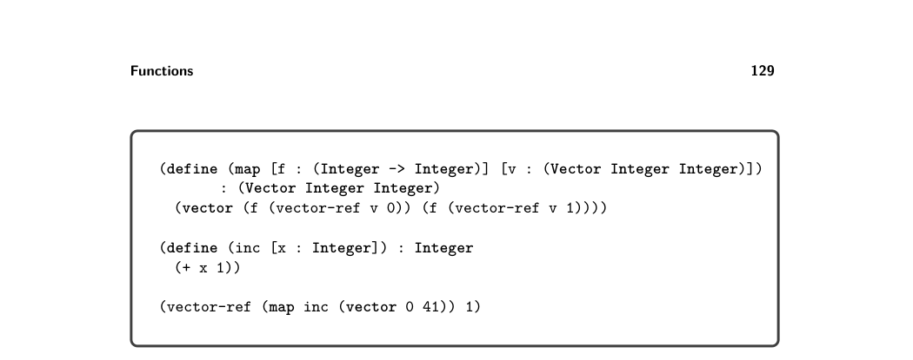
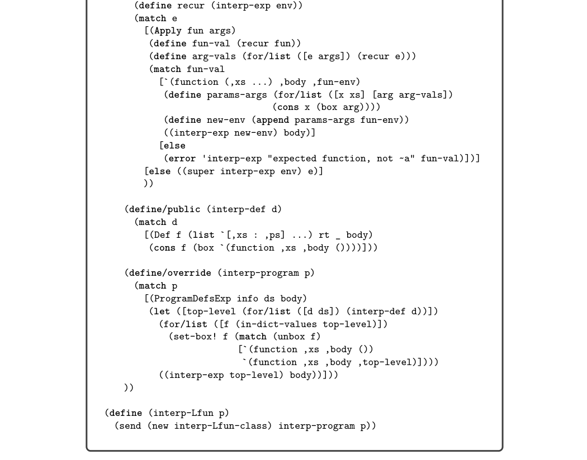
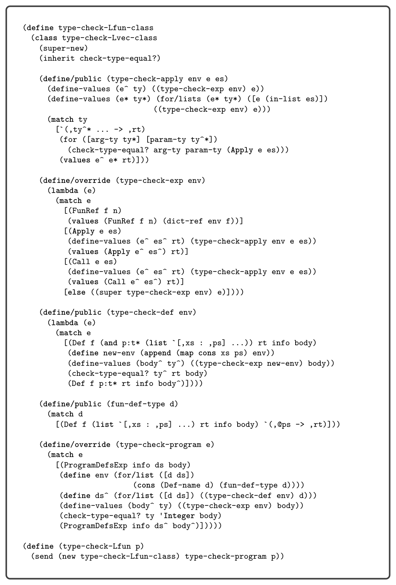

# 7.1 The LFun Language

7

Functions

This chapter studies the compilation of a subset of Typed Racket in which only top-level function definitions are allowed. This kind of function appears in the C programming language, and it serves as an important stepping-stone to implement- ing lexically scoped functions in the form of lambda abstractions, which is the topic of chapter 8.

7.1 The LFun Language

The concrete syntax and abstract syntax for function definitions and function appli- cation are shown in figures 7.1 and 7.2, with which we define the LFun language. Programs in LFun begin with zero or more function definitions. The function names from these definitions are in scope for the entire program, including all the function definitions, and therefore the ordering of function definitions does not matter. The concrete syntax for function application is (exp exp … ), where the first expression must evaluate to a function and the remaining expressions are the arguments. The abstract syntax for function application is (Apply exp exp∗). Functions are first-class in the sense that a function pointer is data and can be stored in memory or passed as a parameter to another function. Thus, there is a function type, written

(type1 · · · typen -> typer)

for a function whose n parameters have the types type1 through typen and whose return type is typeR. The main limitation of these functions (with respect to Racket functions) is that they are not lexically scoped. That is, the only external entities that can be referenced from inside a function body are other globally defined func- tions. The syntax of LFun prevents function definitions from being nested inside each other. The program shown in figure 7.3 is a representative example of defining and using functions in LFun. We define a function map that applies some other function f to both elements of a tuple and returns a new tuple containing the results. We also define a function inc. The program applies map to inc and (vector 0 41). The result is (vector 1 42), from which we return 42. The definitional interpreter for LFun is shown in figure 7.4. The case for the ProgramDefsExp AST is responsible for setting up the mutual recursion between


*Figure 7.1 The concrete syntax of LFun, extending LTup (figure 6.1).*


*Figure 7.2 The abstract syntax of LFun, extending LTup (figure 6.2).*


*Figure 7.3 Example of using functions in LFun.*

the top-level function definitions. We use the classic back-patching approach that uses mutable variables and makes two passes over the function definitions (Kelsey, Clinger, and Rees 1998). In the first pass we set up the top-level environment using a mutable cons cell for each function definition. Note that the lambda value for each function is incomplete; it does not yet include the environment. Once the top-level environment has been constructed, we iterate over it and update the lambda values to use the top-level environment. To interpret a function application, we match the result of the function expression to obtain a function value. We then extend the function’s environment with the mapping of parameters to argument values. Finally, we interpret the body of the function in this extended environment. The type checker for LFun is shown in figure 7.5. Similarly to the interpreter, the case for the ProgramDefsExp AST is responsible for setting up the mutual recursion between the top-level function definitions. We begin by creating a mapping env from every function name to its type. We then type check the program using this mapping. To check a function application, we match the type of the function expression to a function type and check that the types of the argument expressions are equal to the function’s parameter types. The type of the application as a whole is the return type from the function type.

```
(define interp-Lfun-class
(class interp-Lvec-class
(super-new)
```


*Figure 7.4 Interpreter for the LFun language.*

```
(define type-check-Lfun-class
(class type-check-Lvec-class
(super-new)
(inherit check-type-equal?)
```


*Figure 7.5 Type checker for the LFun language.*

