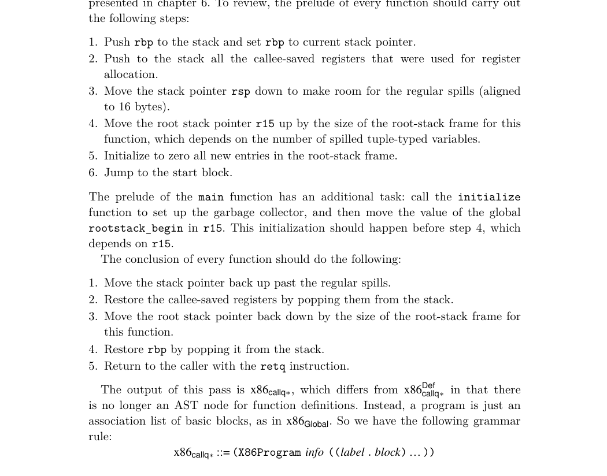

# 7.11 Generate Prelude and Conclusion

7.9.1 Liveness Analysis The IndirectCallq instruction should be treated like Callq regarding its written locations W, in that they should include all the caller-saved registers. Recall that the reason for that is to force variables that are live across a function call to be assigned to callee-saved registers or to be spilled to the stack. Regarding the set of read locations R, the arity fields of TailJmp and IndirectCallq determine how many of the argument-passing registers should be considered as read by those instructions. Also, the target field of TailJmp and IndirectCallq should be included in the set of read locations R.

7.9.2 Build Interference Graph With the addition of function definitions, we compute a separate interference graph for each function (not just one for the whole program). Recall that in section 6.7 we discussed the need to spill tuple-typed variables that are live during a call to collect, the garbage collector. With the addition of functions to our language, we need to revisit this issue. Functions that perform allocation contain calls to the collector. Thus, we should not only spill a tuple-typed variable when it is live during a call to collect, but we should spill the variable if it is live during a call to any user-defined function. Thus, in the build_interference pass, we recommend adding interference edges between call-live tuple-typed vari- ables and the callee-saved registers (in addition to creating edges between call-live variables and the caller-saved registers).

7.9.3 Allocate Registers The primary change to the allocate_registers pass is adding an auxiliary func- tion for handling definitions (the def nonterminal shown in figure 7.10) with one case for function definitions. The logic is the same as described in chapter 3 except that now register allocation is performed many times, once for each function definition, instead of just once for the whole program.

7.10 Patch Instructions

In patch_instructions, you should deal with the x86 idiosyncrasy that the desti- nation argument of leaq must be a register. Additionally, you should ensure that the argument of TailJmp is rax, our reserved register—because we trample many other registers before the tail call, as explained in the next section.

7.11 Generate Prelude and Conclusion

Now that register allocation is complete, we can translate the TailJmp into a sequence of instructions. A naive translation of TailJmp would simply be jmp *arg. However, before the jump we need to pop the current frame to achieve efficient tail calls. This sequence of instructions is the same as the code for the conclusion of a function, except that the retq is replaced with jmp *arg.

*Figure 7.11 gives an overview of the passes for compiling LFun to x86.*

Exercise 7.1 Expand your compiler to handle LFun as outlined in this chapter. Cre- ate eight new programs that use functions including examples that pass functions and return functions from other functions, recursive functions, functions that cre- ate tuples, and functions that make tail calls. Test your compiler on these new programs and all your previously created test programs.

