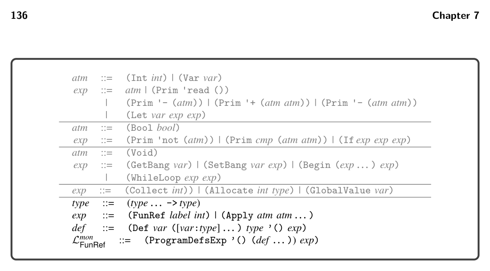
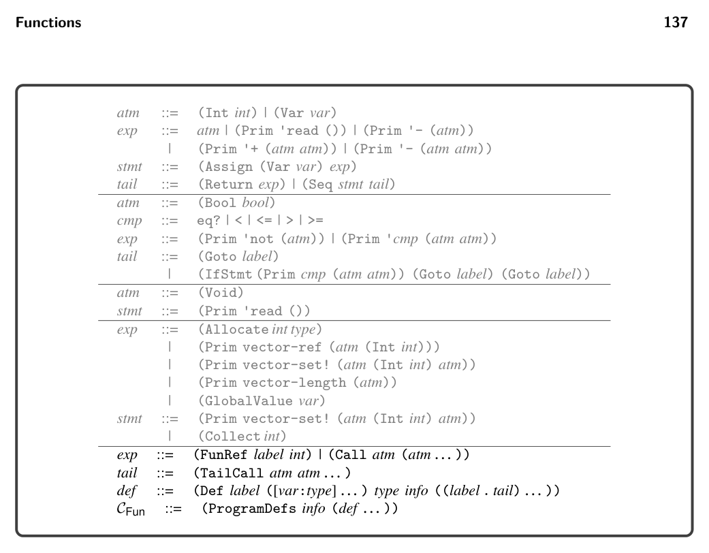

# 7.7 Explicate Control and the CFun Language

*Figure 7.7*

(Var xi) ⇒(Prim 'vector-ref (list tup (Int k)))

For function calls with too many arguments, the limit_functions pass trans- forms them in the following way:

(e0 e1 … en) ⇒ (e0 e1 … e5 (vector e6 … en))

7.6 Remove Complex Operands

The primary decisions to make for this pass are whether to classify FunRef and Apply as either atomic or complex expressions. Recall that an atomic expression ends up as an immediate argument of an x86 instruction. Function application translates to a sequence of instructions, so Apply must be classified as a complex expression. On the other hand, the arguments of Apply should be atomic expres- sions. Regarding FunRef, as discussed previously, the function label needs to be converted to an address using the leaq instruction. Thus, even though FunRef seems rather simple, it needs to be classified as a complex expression so that we generate an assignment statement with a left-hand side that can serve as the target of the leaq. The output of this pass, Lmon FunRef (figure 7.7), extends Lmon Alloc (figure 6.11) with FunRef and Apply in the grammar for expressions and augments programs to include a list of function definitions.

*Figure 7.8*

*Figure 7.8*

becomes TailCall. We recommend defining a new auxiliary function for processing function definitions. This code is similar to the case for Program in Lmon Tup. The top- level explicate_control function that handles the ProgramDefs form of Lmon FunRef can apply this new function to all function definitions.

