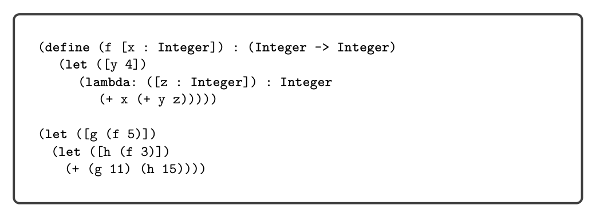
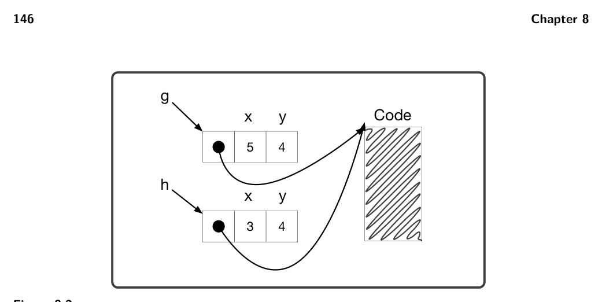
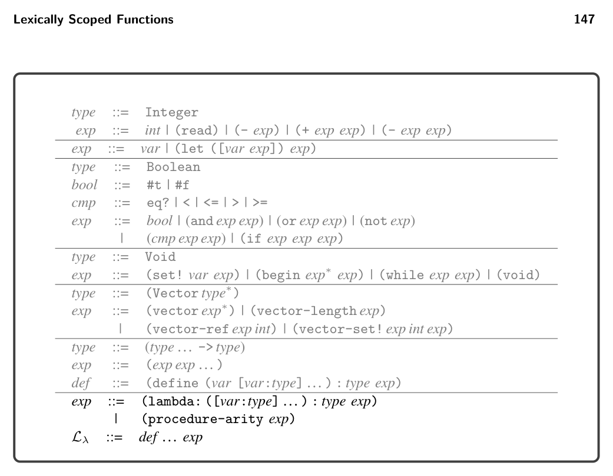
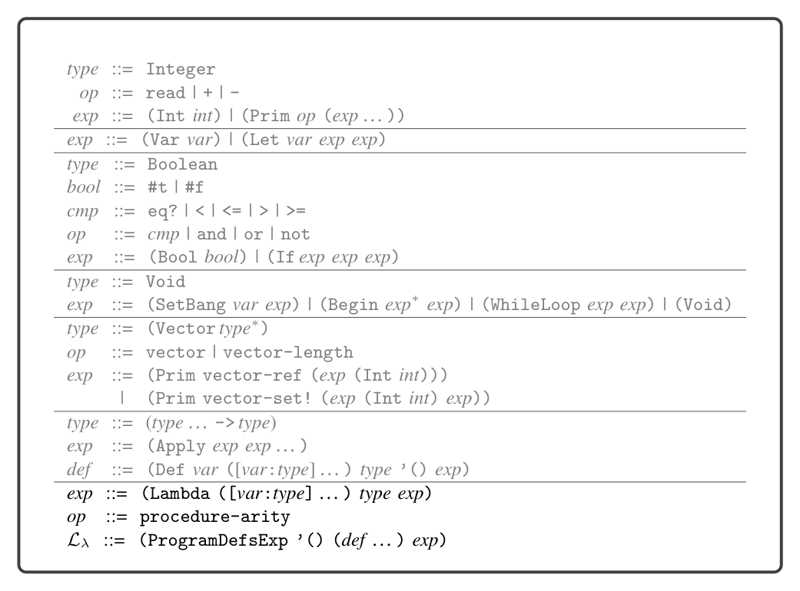
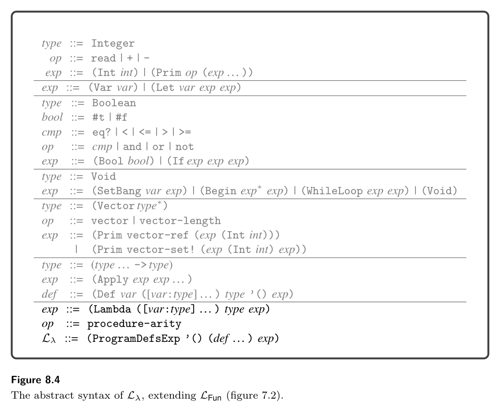
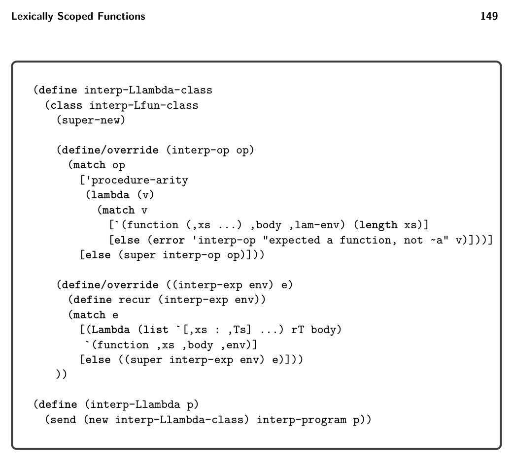
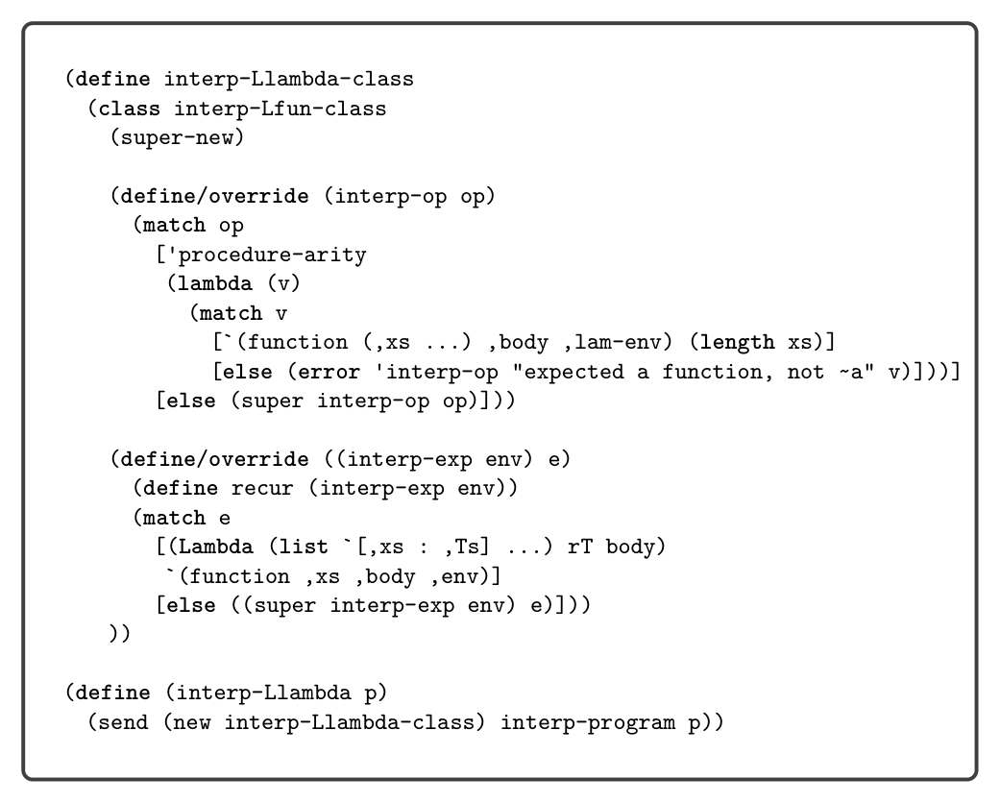
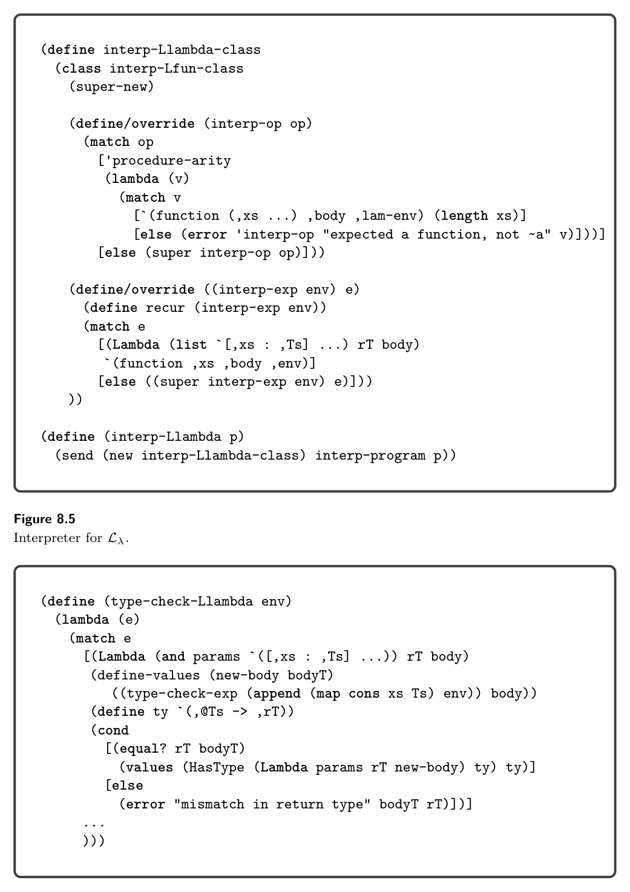
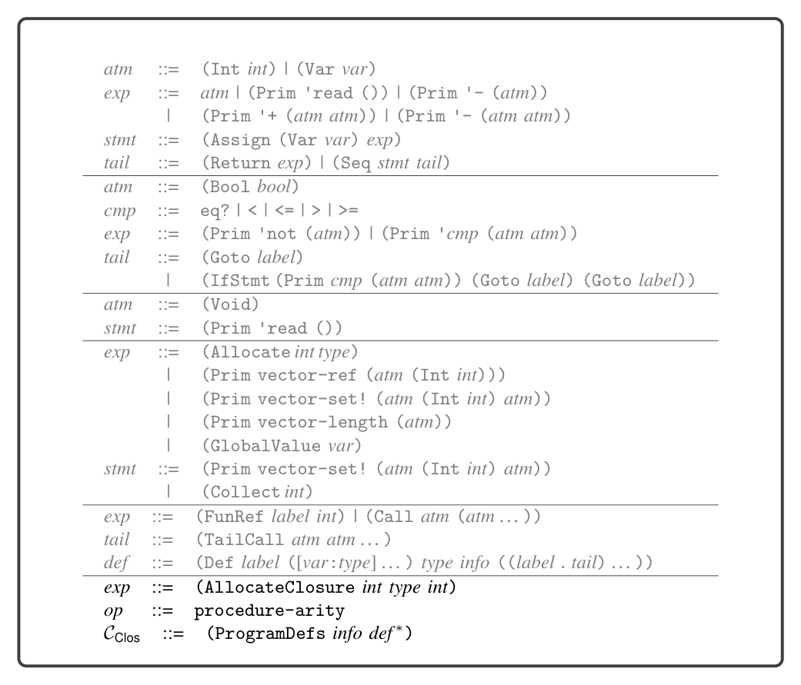
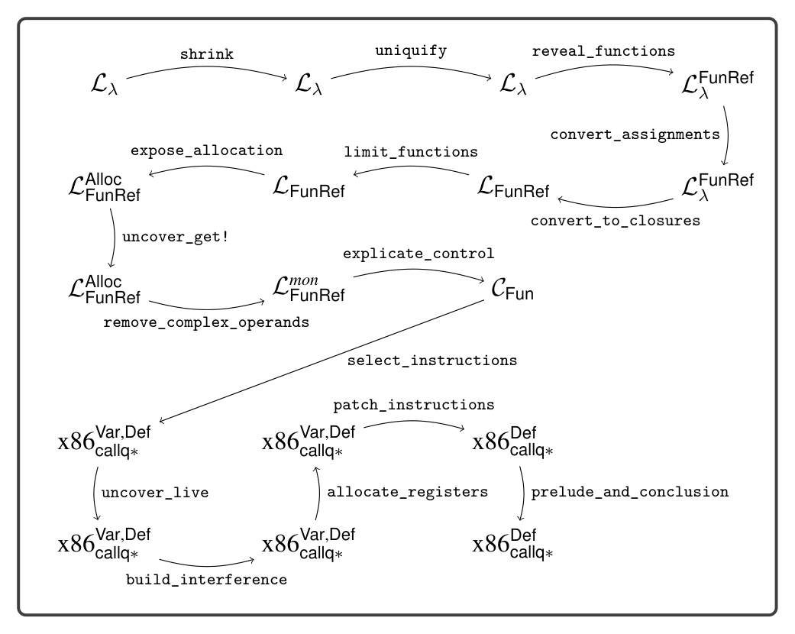

# 8 Lexically Scoped Functions

8

Lexically Scoped Functions

This chapter studies lexically scoped functions. Lexical scoping means that a func- tion’s body may refer to variables whose binding site is outside of the function, in an enclosing scope. Consider the example shown in figure 8.1 written in Lλ, which extends LFun with the lambda form for creating lexically scoped functions. The body of the lambda refers to three variables: x, y, and z. The binding sites for x and y are outside of the lambda. Variable y is bound by the enclosing let, and x is a parameter of function f. Note that function f returns the lambda as its result value. The main expression of the program includes two calls to f with different arguments for x: first 5 and then 3. The functions returned from f are bound to variables g and h. Even though these two functions were created by the same lambda, they are really different functions because they use different values for x. Applying g to 11 produces 20 whereas applying h to 15 produces 22, so the result of the program is 42. The approach that we take for implementing lexically scoped functions is to compile them into top-level function definitions, translating from Lλ into LFun. However, the compiler must give special treatment to variable occurrences such as x and y in the body of the lambda shown in figure 8.1. After all, an LFun function may not refer to variables defined outside of it. To identify such variable occurrences, we review the standard notion of free variable.


*Figure 8.1*


*Figure 8.2*

Definition 8.1 A variable is free in expression e if the variable occurs inside e but does not have an enclosing definition that is also in e.

For example, in the expression (+ x (+ y z)) the variables x, y, and z are all free. On the other hand, only x and y are free in the following expression, because z is defined by the lambda

```
(lambda: ([z : Integer]) : Integer
(+ x (+ y z)))
```

Thus the free variables of a lambda are the ones that need special treatment. We need to transport at runtime the values of those variables from the point where the lambda was created to the point where the lambda is applied. An efficient solution to the problem, due to Cardelli (1983), is to bundle the values of the free variables together with a function pointer into a tuple, an arrangement called a flat closure (which we shorten to just closure). By design, we have all the ingredients to make closures: chapter 6 gave us tuples, and chapter 7 gave us function pointers. The function pointer resides at index 0, and the values for the free variables fill in the rest of the tuple. Let us revisit the example shown in figure 8.1 to see how closures work. It is a three-step dance. The program calls function f, which creates a closure for the lambda. The closure is a tuple whose first element is a pointer to the top-level function that we will generate for the lambda; the second element is the value of x, which is 5; and the third element is 4, the value of y. The closure does not contain an element for z because z is not a free variable of the lambda. Creating the closure is step 1 of the dance. The closure is returned from f and bound to g, as shown in figure 8.2. The second call to f creates another closure, this time with 3 in the second slot (for x). This closure is also returned from f but bound to h, which is also shown in figure 8.2. Continuing with the example, consider the application of g to 11 shown in figure 8.1. To apply a closure, we obtain the function pointer from the first ele- ment of the closure and call it, passing in the closure itself and then the regular arguments, in this case 11. This technique for applying a closure is step 2 of the


*Figure 8.3*

dance. But doesn’t this lambda take only one argument, for parameter z? The third and final step of the dance is generating a top-level function for a lambda. We add an additional parameter for the closure and insert an initialization at the beginning of the function for each free variable, to bind those variables to the appropriate elements from the closure parameter. This three-step dance is known as closure conversion. We discuss the details of closure conversion in section 8.4 and show the code generated from the example in section 8.4.1. First, we define the syntax and semantics of Lλ in section 8.1.

8.1 The Lλ Language

The definitions of the concrete syntax and abstract syntax for Lλ, a language with anonymous functions and lexical scoping, are shown in figures 8.3 and 8.4. They add the lambda form to the grammar for LFun, which already has syntax for function application. The procedure-arity operation returns the number of parameters of a given function, an operation that we need for the translation of dynamic typing that is discussed in chapter 9. Figure 8.5 shows the definitional interpreter for Lλ. The case for Lambda saves the current environment inside the returned function value. Recall that during function application, the environment stored in the function value, extended with the mapping of parameters to argument values, is used to interpret the body of the function.


*Figure 8.4*


*Figure 8.6*


*(super-new)*


*Figure 8.5*


*Figure 8.6*

## 8.2 Assignment and Lexically Scoped Functions

The combination of lexically scoped functions and assignment to variables raises a challenge with the flat-closure approach to implementing lexically scoped functions. Consider the following example in which function f has a free variable x that is changed after f is created but before the call to f.

```
(let ([x 0])
(let ([y 0])
(let ([z 20])
(let ([f (lambda: ([a : Integer]) : Integer (+ a (+ x z)))])
(begin
(set! x 10)
(set! y 12)
(f y))))))
```

The correct output for this example is 42 because the call to f is required to use the current value of x (which is 10). Unfortunately, the closure conversion pass (section 8.4) generates code for the lambda that copies the old value of x into a closure. Thus, if we naively applied closure conversion, the output of this program would be 32. A first attempt at solving this problem would be to save a pointer to x in the clo- sure and change the occurrences of x inside the lambda to dereference the pointer. Of course, this would require assigning x to the stack and not to a register. How- ever, the problem goes a bit deeper. Consider the following example that returns a function that refers to a local variable of the enclosing function:

```
(define (f) : ( -> Integer)
(let ([x 0])
(let ([g (lambda: () : Integer x)])
(begin
(set! x 42)
g))))
((f))
```

In this example, the lifetime of x extends beyond the lifetime of the call to f. Thus, if we were to store x on the stack frame for the call to f, it would be gone by the time we called g, leaving us with dangling pointers for x. This example demonstrates that when a variable occurs free inside a function, its lifetime becomes indefinite. Thus, the value of the variable needs to live on the heap. The verb box is often used for allocating a single value on the heap, producing a pointer, and unbox for dereferencing the pointer. We introduce a new pass named convert_assignments to address this challenge.

## 8.3 Assignment Conversion

The purpose of the convert_assignments pass is to address the challenge regard- ing the interaction between variable assignments and closure conversion. First we

identify which variables need to be boxed, and then we transform the program to box those variables. In general, boxing introduces runtime overhead that we would like to avoid, so we should box as few variables as possible. We recommend boxing the variables in the intersection of the following two sets of variables:

* The variables that are free in a lambda.
* The variables that appear on the left-hand side of an assignment.

The first condition is a must but the second condition is conservative. It is possible to develop a more liberal condition using static program analysis. Consider again the first example from section 8.2:

```
(let ([x 0])
(let ([y 0])
(let ([z 20])
(let ([f (lambda: ([a : Integer]) : Integer (+ a (+ x z)))])
(begin
(set! x 10)
(set! y 12)
(f y))))))
```

The variables x and y appear on the left-hand side of assignments. The variables x and z occur free inside the lambda. Thus, variable x needs to be boxed but not y or z. The boxing of x consists of three transformations: initialize x with a tuple whose element is uninitialized, replace reads from x with tuple reads, and replace each assignment to x with a tuple write. The output of convert_assignments for this example is as follows:

```
(define (main) : Integer
(let ([x0 (vector 0)])
(let ([y1 0])
(let ([z2 20])
(let ([f4 (lambda: ([a3 : Integer]) : Integer
(+ a3 (+ (vector-ref x0 0) z2)))])
(begin
(vector-set! x0 0 10)
(set! y1 12)
(f4 y1)))))))
```

To compute the free variables of all the lambda expressions, we recommend defining the following two auxiliary functions:

* free_variables computes the free variables of an expression, and
* free_in_lambda collects all the variables that are free in any of the lambda
  expressions, using free_variables in the case for each lambda.

To compute the variables that are assigned to, we recommend updating the collect-set! function that we introduced in section 5.4 to include the new AST forms such as Lambda. Let AF be the intersection of the set of variables that are free in a lambda and that are assigned to in the enclosing function definition.

Next we discuss the convert_assignments pass. In the case for (Var x), if x is in AF, then unbox it by translating (Var x) to a tuple read.

(Var x) ⇒ (Prim 'vector-ref (list (Var x) (Int 0)))

In the case for assignment, recursively process the right-hand side rhs to obtain rhs′. If the left-hand side x is in AF, translate the assignment into a tuple write as follows:

(SetBang x rhs) ⇒ (Prim 'vector-set! (list (Var x) (Int 0) rhs′))

The case for Lambda is nontrivial, but it is similar to the case for function definitions, which we discuss next. To translate a function definition, we first compute AF, the intersection of the variables that are free in a lambda and that are assigned to. We then apply assignment conversion to the body of the function definition. Finally, we box the parameters of this function definition that are in AF. For example, the parameter x of the following function g needs to be boxed:

```
(define (g [x : Integer]) : Integer
(let ([f (lambda: ([a : Integer]) : Integer (+ a x))])
(begin
(set! x 10)
(f 32))))
```

We box parameter x by creating a local variable named x that is initialized to a tuple whose contents is the value of the parameter, which is renamed to x_0.

```
(define (g [x_0 : Integer]) : Integer
(let ([x (vector x_0)])
(let ([f (lambda: ([a : Integer]) : Integer
(+ a (vector-ref x 0)))])
(begin
(vector-set! x 0 10)
(f 32)))))
```

## 8.4 Closure Conversion

The compiling of lexically scoped functions into top-level function definitions and flat closures is accomplished in the pass convert_to_closures that comes after reveal_functions and before limit_functions. As usual, we implement the pass as a recursive function over the AST. The interesting cases are for lambda and function application. We transform a lambda expression into an expression that creates a closure, that is, a tuple for which the first element is a function pointer and the rest of the elements are the values of the free variables of the lambda. However, we use the Closure AST node instead of using a tuple so that we can record the arity. In the generated code that follows,

fvs is the list of free variables of the lambda and name is a unique symbol generated to identify the lambda. The arity is the number of parameters (the length of ps).

(Lambda ps rt body) ⇒ (Closure arity (cons (FunRef name arity) fvs))

In addition to transforming each Lambda AST node into a tuple, we create a top- level function definition for each Lambda, as shown next.

(Def name ([clos : (Vector _ fvts ...)] ps′ ...) rt′

(Let fvs1 (Prim 'vector-ref (list (Var clos) (Int 1))) ... (Let fvsn (Prim 'vector-ref (list (Var clos) (Int n))) body′)...))

The clos parameter refers to the closure. The type closTy is a tuple type for which the first element type is _ (the dummy type) and the rest of the element types are the types of the free variables in the lambda. We use _ because it is nontrivial to give a type to the function in the closure’s type.1 Translate the type annotations in ps and the return type rt, as discussed in the next paragraph, to obtain ps′ and rt′. The free variables become local variables that are initialized with their values in the closure. Closure conversion turns every function into a tuple, so the type annotations in the program must also be translated. We recommend defining an auxiliary recursive function for this purpose. Function types should be translated as follows:

(T1, … , Tn -> Tr) ⇒ (Vector ((Vector) T′ 1, … , T′ n -> T′ r))

This type indicates that the first thing in the tuple is a function. The first parameter of the function is a tuple (a closure) and the rest of the parameters are the ones from the original function, with types T′ 1, … , T′ n. The type for the closure omits the types of the free variables because (1) those types are not available in this context, and (2) we do not need them in the code that is generated for function application. So this type describes only the first component of the closure tuple. At runtime the tuple may have more components, but we ignore them at this point. We transform function application into code that retrieves the function from the closure and then calls the function, passing the closure as the first argument. We place e′ in a temporary variable to avoid code duplication.

(Apply e es) ⇒ (Let tmp e′

(Apply (Prim 'vector-ref (list (Var tmp) (Int 0))) (cons (Var tmp) es′)))

* To give an accurate type to a closure, we would need to add existential types to the type
  checker (Minamide, Morrisett, and Harper 1996).


*Figure 8.7*

There is also the question of what to do with references to top-level function defi- nitions. To maintain a uniform translation of function application, we turn function references into closures.

(FunRef f n) ⇒ (Closure n (list (FunRef f n)))

The top-level function definitions need to be updated to take an extra closure parameter, but that parameter is ignored in the body of those functions.

8.4.1 An Example Translation Figure 8.7 shows the result of reveal_functions and convert_to_closures for the example program demonstrating lexical scoping that we discussed at the beginning of this chapter.

Exercise 8.1 Expand your compiler to handle Lλ as outlined in this chapter. Create five new programs that use lambda functions and make use of lexical scoping. Test your compiler on these new programs and all your previously created test programs.

## 8.5 Expose Allocation

Compile the (Closure arity exp∗) form into code that allocates and initial- izes a tuple, similar to the translation of the tuple creation in section 6.3. The main difference is replacing the use of (Allocate len type) with (AllocateClosure len type arity). The result type of the translation of (Closure arity exp∗) should be a tuple type, but only a single element tuple type. The types of the tuple elements that correspond to the free variables of the closure should not appear in the tuple type. The new AST class UncheckedCast can be used to adjust the result type.

## 8.6 Explicate Control and CClos

The output language of explicate_control is CClos; the definition of its abstract syntax is shown in figure 8.8. The only differences with respect to CFun are the addition of the AllocateClosure form to the grammar for exp and the procedure-arity operator. The handling of AllocateClosure in the explicate_control pass is similar to the handling of other expressions such as primitive operators.

## 8.7 Select Instructions

Compile (AllocateClosure len type arity) in almost the same way as the (Allocate len type) form (section 6.6). The only difference is that you should place the arity in the tag that is stored at position 0 of the tuple. Recall that in section 6.6 a portion of the 64-bit tag was not used. We store the arity in the 5 bits starting at position 57. Compile the procedure-arity operator into a sequence of instructions that access the tag from position 0 of the vector and extract the 5 bits starting at position 57 from the tag. Figure 8.9 provides an overview of the passes needed for the compilation of Lλ.


*Figure 8.8*


*Figure 8.9*

## 8.8 Challenge: Optimize Closures

In this chapter we compile lexically scoped functions into a relatively efficient representation: flat closures. However, even this representation comes with some overhead. For example, consider the following program with a function tail_sum that does not have any free variables and where all the uses of tail_sum are in applications in which we know that only tail_sum is being applied (and not any other functions):

```
(define (tail_sum [n : Integer] [s : Integer]) : Integer
(if (eq? n 0)
s
(tail_sum (- n 1) (+ n s))))
```

(+ (tail_sum 3 0) 36)

As described in this chapter, we uniformly apply closure conversion to all functions, obtaining the following output for this program:

```
(define (tail_sum1 [fvs5 : _] [n2 : Integer] [s3 : Integer]) : Integer
(if (eq? n2 0)
s3
(let ([clos4 (closure (list (fun-ref tail_sum1 2)))])
((vector-ref clos4 0) clos4 (+ n2 -1) (+ n2 s3)))))
```

```
(define (main) : Integer
(+ (let ([clos6 (closure (list (fun-ref tail_sum1 2)))])
((vector-ref clos6 0) clos6 3 0)) 27))
```

If this program were compiled according to the previous chapter, there would be no allocation and the calls to tail_sum would be direct calls. In contrast, the program presented here allocates memory for each closure and the calls to tail_sum are indirect. These two differences incur considerable overhead in a program such as this, in which the allocations and indirect calls occur inside a tight loop. One might think that this problem is trivial to solve: can’t we just recognize calls of the form (Apply (FunRef f n) args) and compile them to direct calls instead of treating it like a call to a closure? We would also drop the new fvs parameter of tail_sum. However, this problem is not so trivial, because a global function may escape and become involved in applications that also involve closures. Consider the following example in which the application (f 41) needs to be compiled into a closure application because the lambda may flow into f, but the inc function might also flow into f:

```
(define (inc [x : Integer]) : Integer
(+ x 1))
```

```
(let ([y (read)])
(let ([f (if (eq? (read) 0)
inc
(lambda: ([x : Integer]) : Integer (- x y)))])
(f 41)))
```

If a global function name is used in any way other than as the operator in a direct call, then we say that the function escapes. If a global function does not escape, then we do not need to perform closure conversion on the function.

Exercise 8.2 Implement an auxiliary function for detecting which global functions escape. Using that function, implement an improved version of closure conversion that does not apply closure conversion to global functions that do not escape but instead compiles them as regular functions. Create several new test cases that check whether your compiler properly detects whether global functions escape or not.

So far we have reduced the overhead of calling global functions, but it would also be nice to reduce the overhead of calling a lambda when we can determine at compile time which lambda will be called. We refer to such calls as known calls. Consider the following example in which a lambda is bound to f and then applied.

```
(let ([y (read)])
(let ([f (lambda: ([x : Integer]) : Integer
(+ x y))])
(f 21)))
```

Closure conversion compiles the application (f 21) into an indirect call, as follows:

```
(define (lambda5 [fvs6 : (Vector _ Integer)] [x3 : Integer]) : Integer
(let ([y2 (vector-ref fvs6 1)])
(+ x3 y2)))
```

```
(define (main) : Integer
(let ([y2 (read)])
(let ([f4 (Closure 1 (list (fun-ref lambda5 1) y2))])
((vector-ref f4 0) f4 21))))
```

However, we can instead compile the application (f 21) into a direct call, as follows:

```
(define (main) : Integer
(let ([y2 (read)])
(let ([f4 (Closure 1 (list (fun-ref lambda5 1) y2))])
((fun-ref lambda5 1) f4 21))))
```

The problem of determining which lambda will be called from a particular appli- cation is quite challenging in general and the topic of considerable research (Shivers 1988; Gilray et al. 2016). For the following exercise we recommend that you com- pile an application to a direct call when the operator is a variable and the variable

is let-bound to a closure. This can be accomplished by maintaining an environ- ment that maps variables to function names. Extend the environment whenever you encounter a closure on the right-hand side of a let, mapping the variable to the name of the global function for the closure. This pass should come after closure conversion.

Exercise 8.3 Implement a compiler pass, named optimize_known_calls, that com- piles known calls into direct calls. Verify that your compiler is successful in this regard on several example programs.

These exercises only scratch the surface of closure optimization. A good next step for the interested reader is to look at the work of Keep, Hearn, and Dybvig (2012).

## 8.9 Further Reading

The notion of lexically scoped functions predates modern computers by about a decade. They were invented by Church (1932), who proposed the lambda calculus as a foundation for logic. Anonymous functions were included in the LISP (McCarthy 1960) programming language but were initially dynamically scoped. The Scheme dialect of LISP adopted lexical scoping, and Steele (1978) demonstrated how to efficiently compile Scheme programs. However, environments were represented as linked lists, so variable look-up was linear in the size of the environment. Appel (1991) gives a detailed description of several closure representations. In this chapter we represent environments using flat closures, which were invented by Cardelli (1983, 1984) for the purpose of compiling the ML language (Gordon et al. 1978; Milner, Tofte, and Harper 1990). With flat closures, variable look-up is constant time but the time to create a closure is proportional to the number of its free variables. Flat closures were reinvented by Dybvig (1987b) in his PhD thesis and used in Chez Scheme version 1 (Dybvig 2006).

