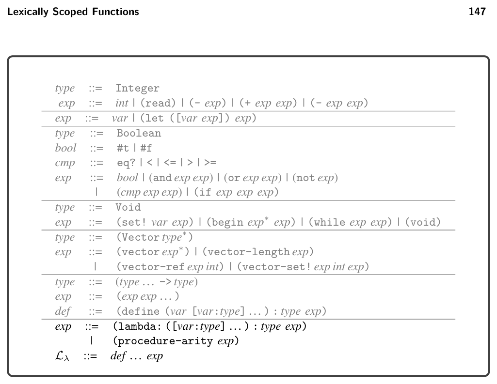
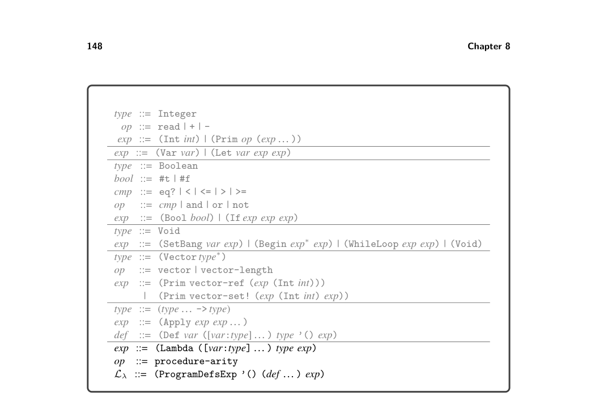
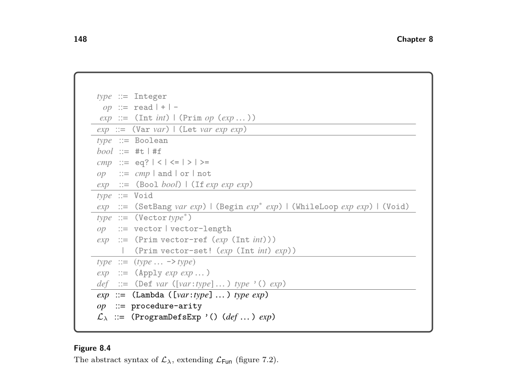
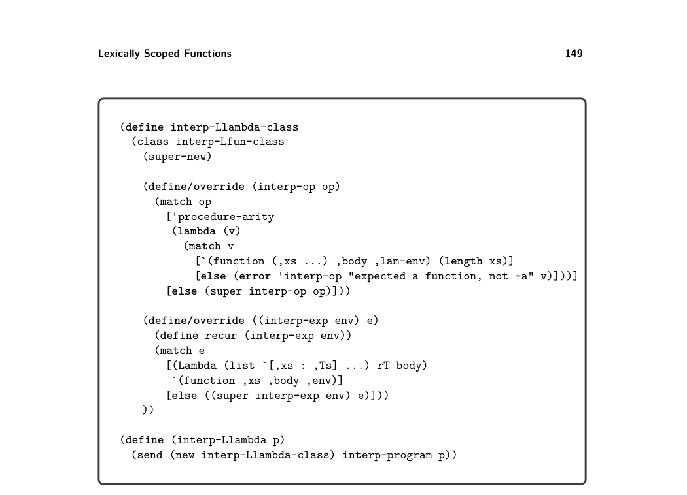
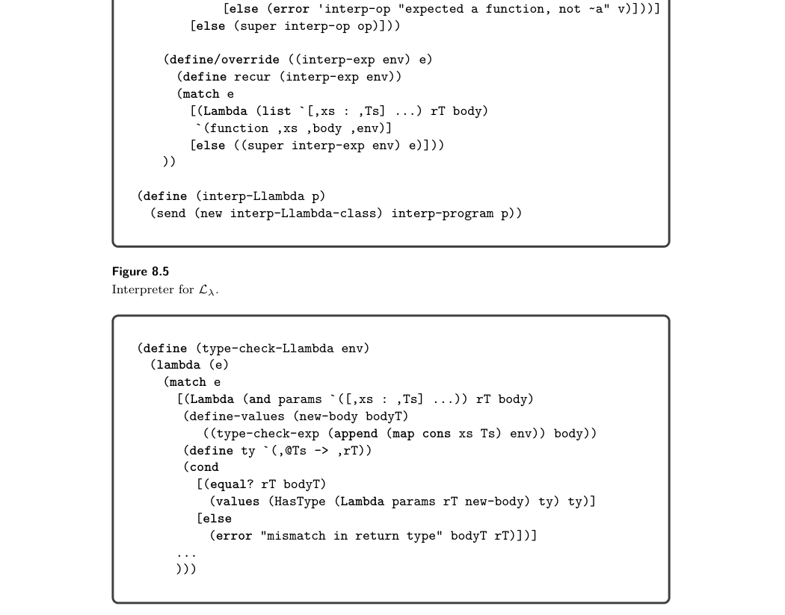

# 8.1 The L Language

*Figure 8.3 The concrete syntax of Lλ, extending LFun (figure 7.1) with lambda.*

dance. But doesn’t this lambda take only one argument, for parameter z? The third and final step of the dance is generating a top-level function for a lambda. We add an additional parameter for the closure and insert an initialization at the beginning of the function for each free variable, to bind those variables to the appropriate elements from the closure parameter. This three-step dance is known as closure conversion. We discuss the details of closure conversion in section 8.4 and show the code generated from the example in section 8.4.1. First, we define the syntax and semantics of Lλ in section 8.1.

8.1 The Lλ Language

The definitions of the concrete syntax and abstract syntax for Lλ, a language with anonymous functions and lexical scoping, are shown in figures 8.3 and 8.4. They add the lambda form to the grammar for LFun, which already has syntax for function application. The procedure-arity operation returns the number of parameters of a given function, an operation that we need for the translation of dynamic typing that is discussed in chapter 9. Figure 8.5 shows the definitional interpreter for Lλ. The case for Lambda saves the current environment inside the returned function value. Recall that during function application, the environment stored in the function value, extended with the mapping of parameters to argument values, is used to interpret the body of the function.

*Figure 8.4 The abstract syntax of Lλ, extending LFun (figure 7.2).*

*Figure 8.6 shows how to type check the new lambda form. The body of the lambda is checked in an environment that includes the current environment (because it is lexically scoped) and also includes the lambda’s parameters. We require the body’s type to match the declared return type.*

*Figure 8.5 Interpreter for Lλ.*

*Figure 8.6 Type checking Lλ.*

