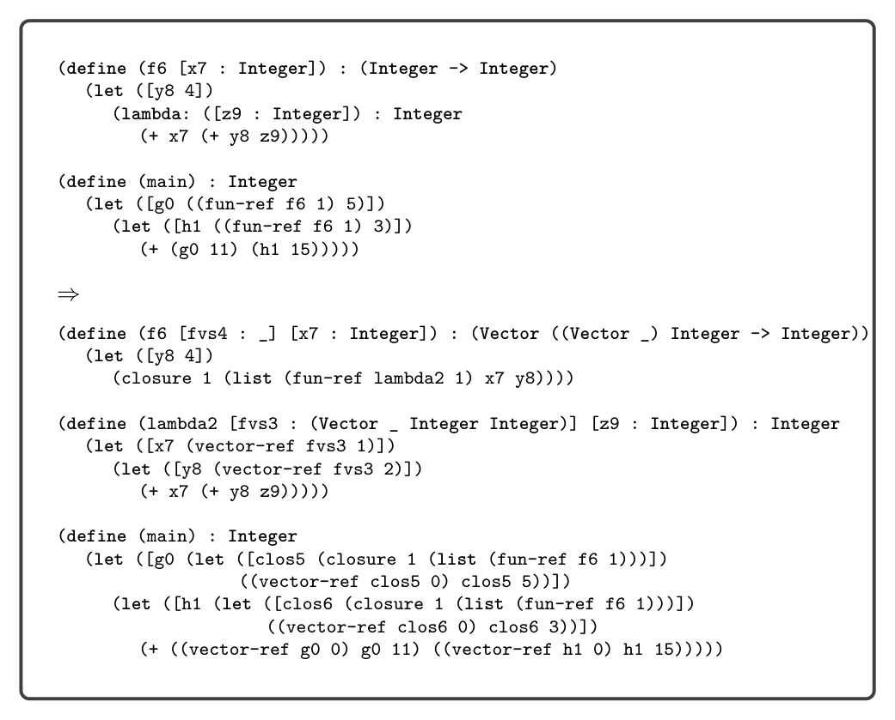

# 8.4 Closure Conversion

Next we discuss the convert_assignments pass. In the case for (Var x), if x is in AF, then unbox it by translating (Var x) to a tuple read.

(Var x) ⇒ (Prim 'vector-ref (list (Var x) (Int 0)))

In the case for assignment, recursively process the right-hand side rhs to obtain rhs′. If the left-hand side x is in AF, translate the assignment into a tuple write as follows:

(SetBang x rhs) ⇒ (Prim 'vector-set! (list (Var x) (Int 0) rhs′))

The case for Lambda is nontrivial, but it is similar to the case for function definitions, which we discuss next. To translate a function definition, we first compute AF, the intersection of the variables that are free in a lambda and that are assigned to. We then apply assignment conversion to the body of the function definition. Finally, we box the parameters of this function definition that are in AF. For example, the parameter x of the following function g needs to be boxed:

```
(define (g [x : Integer]) : Integer
(let ([f (lambda: ([a : Integer]) : Integer (+ a x))])
(begin
(set! x 10)
(f 32))))
```

We box parameter x by creating a local variable named x that is initialized to a tuple whose contents is the value of the parameter, which is renamed to x_0.

```
(define (g [x_0 : Integer]) : Integer
(let ([x (vector x_0)])
(let ([f (lambda: ([a : Integer]) : Integer
(+ a (vector-ref x 0)))])
(begin
(vector-set! x 0 10)
(f 32)))))
```

8.4 Closure Conversion

The compiling of lexically scoped functions into top-level function definitions and flat closures is accomplished in the pass convert_to_closures that comes after reveal_functions and before limit_functions. As usual, we implement the pass as a recursive function over the AST. The interesting cases are for lambda and function application. We transform a lambda expression into an expression that creates a closure, that is, a tuple for which the first element is a function pointer and the rest of the elements are the values of the free variables of the lambda. However, we use the Closure AST node instead of using a tuple so that we can record the arity. In the generated code that follows,

fvs is the list of free variables of the lambda and name is a unique symbol generated to identify the lambda. The arity is the number of parameters (the length of ps).

(Lambda ps rt body) ⇒ (Closure arity (cons (FunRef name arity) fvs))

In addition to transforming each Lambda AST node into a tuple, we create a top- level function definition for each Lambda, as shown next.

(Def name ([clos : (Vector _ fvts ...)] ps′ ...) rt′

(Let fvs1 (Prim 'vector-ref (list (Var clos) (Int 1))) ... (Let fvsn (Prim 'vector-ref (list (Var clos) (Int n))) body′)...))

The clos parameter refers to the closure. The type closTy is a tuple type for which the first element type is _ (the dummy type) and the rest of the element types are the types of the free variables in the lambda. We use _ because it is nontrivial to give a type to the function in the closure’s type.1 Translate the type annotations in ps and the return type rt, as discussed in the next paragraph, to obtain ps′ and rt′. The free variables become local variables that are initialized with their values in the closure. Closure conversion turns every function into a tuple, so the type annotations in the program must also be translated. We recommend defining an auxiliary recursive function for this purpose. Function types should be translated as follows:

(T1, … , Tn -> Tr) ⇒ (Vector ((Vector) T′ 1, … , T′ n -> T′ r))

This type indicates that the first thing in the tuple is a function. The first parameter of the function is a tuple (a closure) and the rest of the parameters are the ones from the original function, with types T′ 1, … , T′ n. The type for the closure omits the types of the free variables because (1) those types are not available in this context, and (2) we do not need them in the code that is generated for function application. So this type describes only the first component of the closure tuple. At runtime the tuple may have more components, but we ignore them at this point. We transform function application into code that retrieves the function from the closure and then calls the function, passing the closure as the first argument. We place e′ in a temporary variable to avoid code duplication.

(Apply e es) ⇒ (Let tmp e′

(Apply (Prim 'vector-ref (list (Var tmp) (Int 0))) (cons (Var tmp) es′)))

* To give an accurate type to a closure, we would need to add existential types to the type
  checker (Minamide, Morrisett, and Harper 1996).


*Figure 8.7*

There is also the question of what to do with references to top-level function defi- nitions. To maintain a uniform translation of function application, we turn function references into closures.

(FunRef f n) ⇒ (Closure n (list (FunRef f n)))

The top-level function definitions need to be updated to take an extra closure parameter, but that parameter is ignored in the body of those functions.

8.4.1 An Example Translation Figure 8.7 shows the result of reveal_functions and convert_to_closures for the example program demonstrating lexical scoping that we discussed at the beginning of this chapter.

Exercise 8.1 Expand your compiler to handle Lλ as outlined in this chapter. Create five new programs that use lambda functions and make use of lexical scoping. Test your compiler on these new programs and all your previously created test programs.

