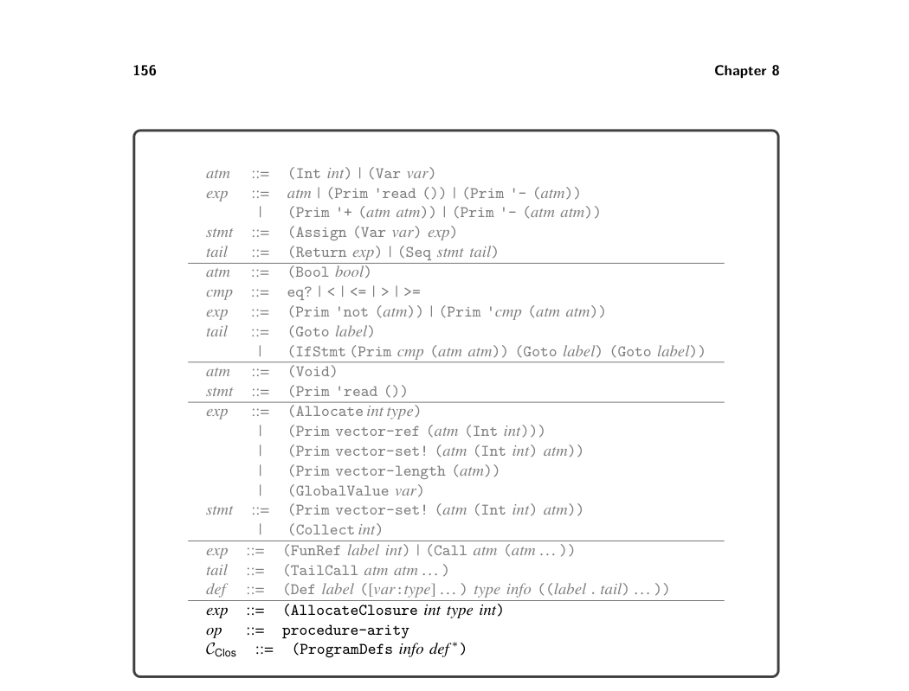
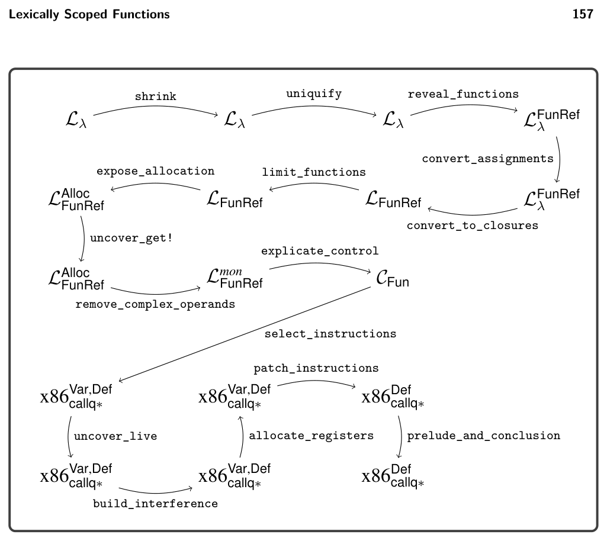

# 8.7 Select Instructions

8.5 Expose Allocation

Compile the (Closure arity exp∗) form into code that allocates and initial- izes a tuple, similar to the translation of the tuple creation in section 6.3. The main difference is replacing the use of (Allocate len type) with (AllocateClosure len type arity). The result type of the translation of (Closure arity exp∗) should be a tuple type, but only a single element tuple type. The types of the tuple elements that correspond to the free variables of the closure should not appear in the tuple type. The new AST class UncheckedCast can be used to adjust the result type.

8.6 Explicate Control and CClos

The output language of explicate_control is CClos; the definition of its abstract syntax is shown in figure 8.8. The only differences with respect to CFun are the addition of the AllocateClosure form to the grammar for exp and the procedure-arity operator. The handling of AllocateClosure in the explicate_control pass is similar to the handling of other expressions such as primitive operators.

8.7 Select Instructions

Compile (AllocateClosure len type arity) in almost the same way as the (Allocate len type) form (section 6.6). The only difference is that you should place the arity in the tag that is stored at position 0 of the tuple. Recall that in section 6.6 a portion of the 64-bit tag was not used. We store the arity in the 5 bits starting at position 57. Compile the procedure-arity operator into a sequence of instructions that access the tag from position 0 of the vector and extract the 5 bits starting at position 57 from the tag. Figure 8.9 provides an overview of the passes needed for the compilation of Lλ.

*Figure 8.8 The abstract syntax of CClos, extending CFun (figure 7.8).*

*Figure 8.9 Diagram of the passes for Lλ, a language with lexically scoped functions.*

