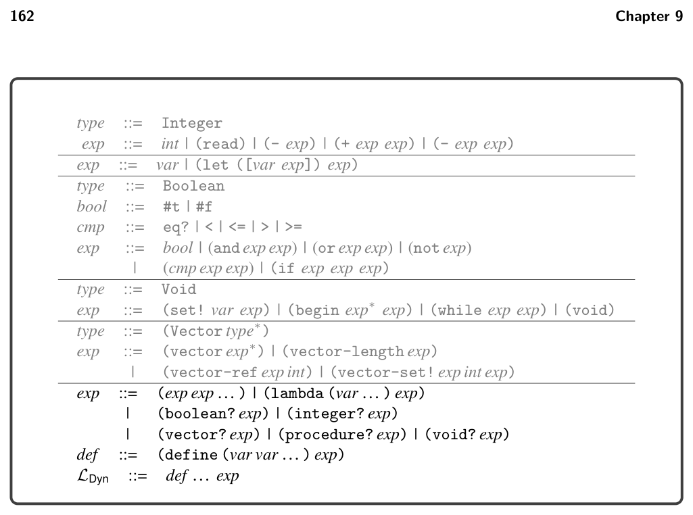
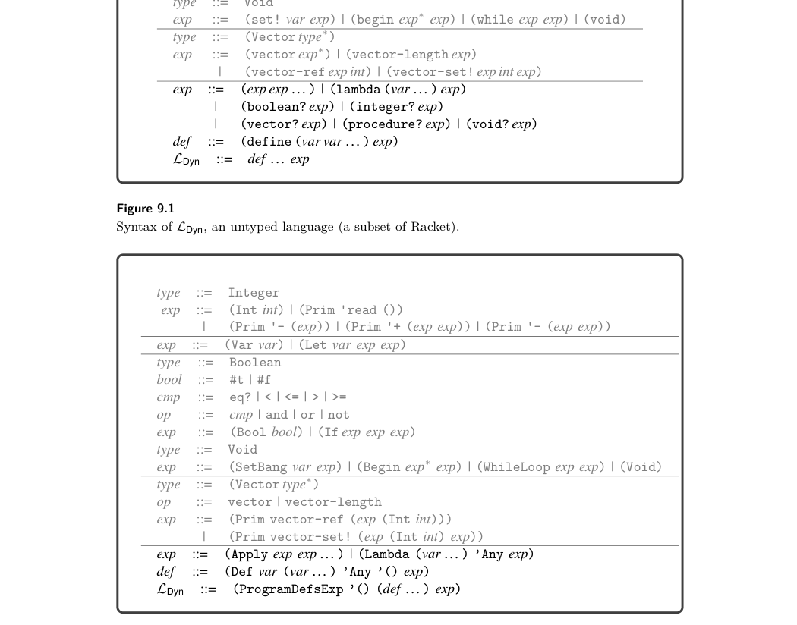
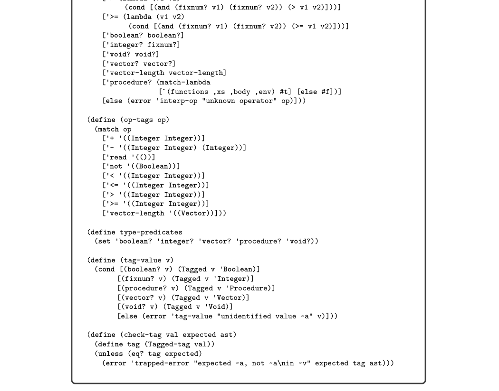
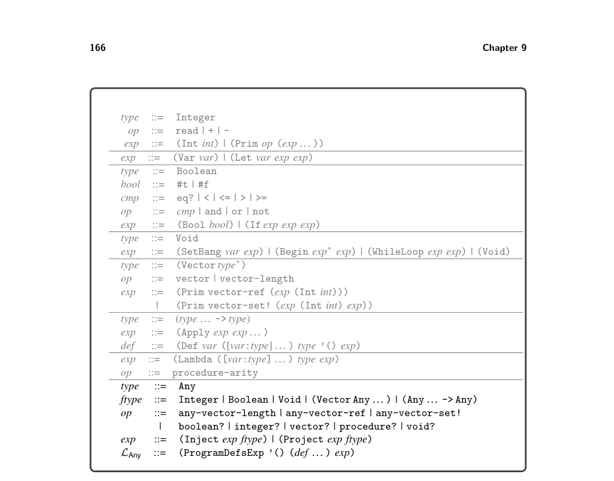
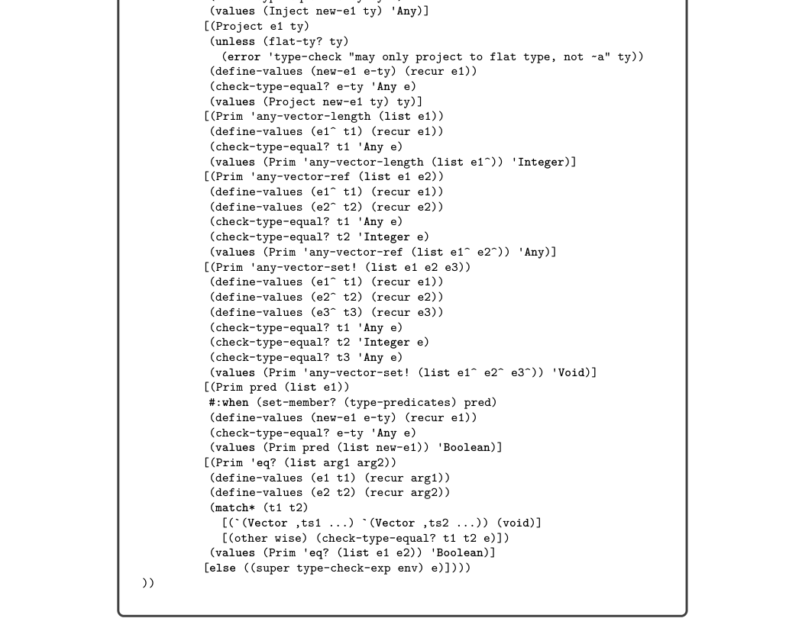
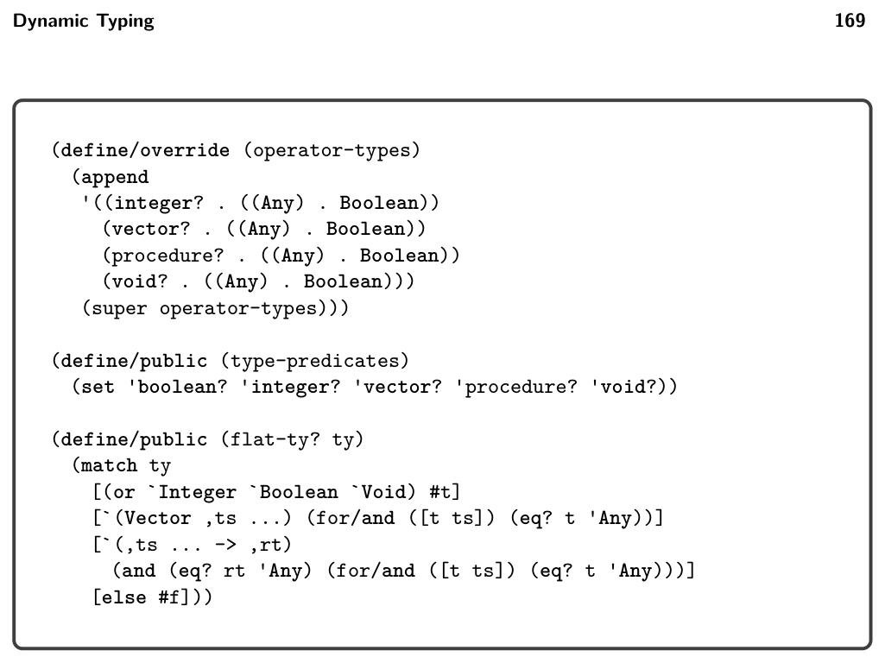
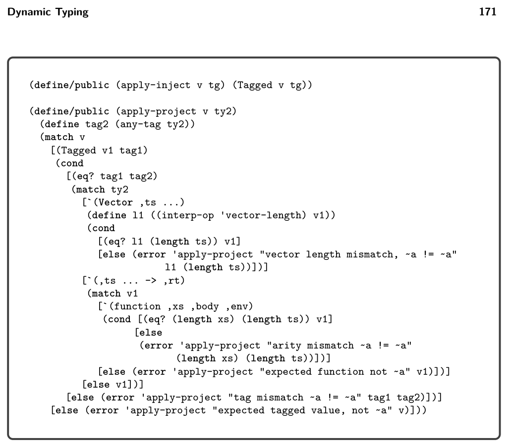
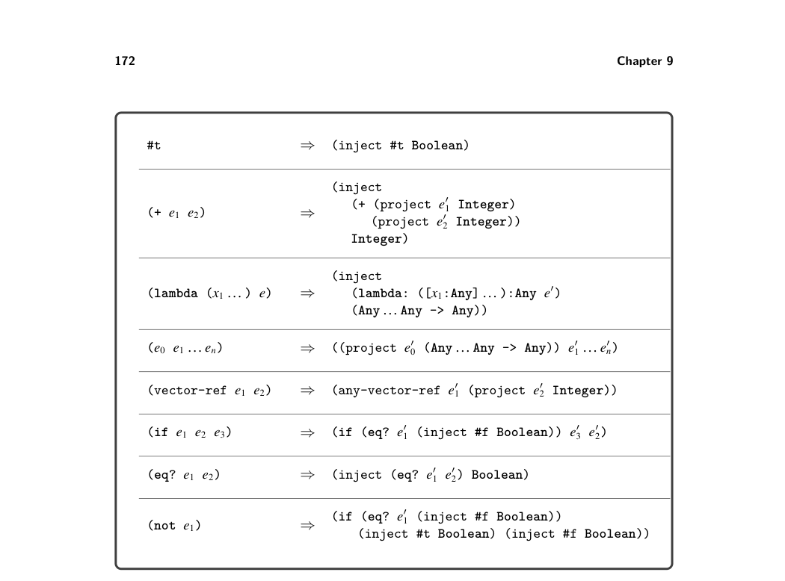
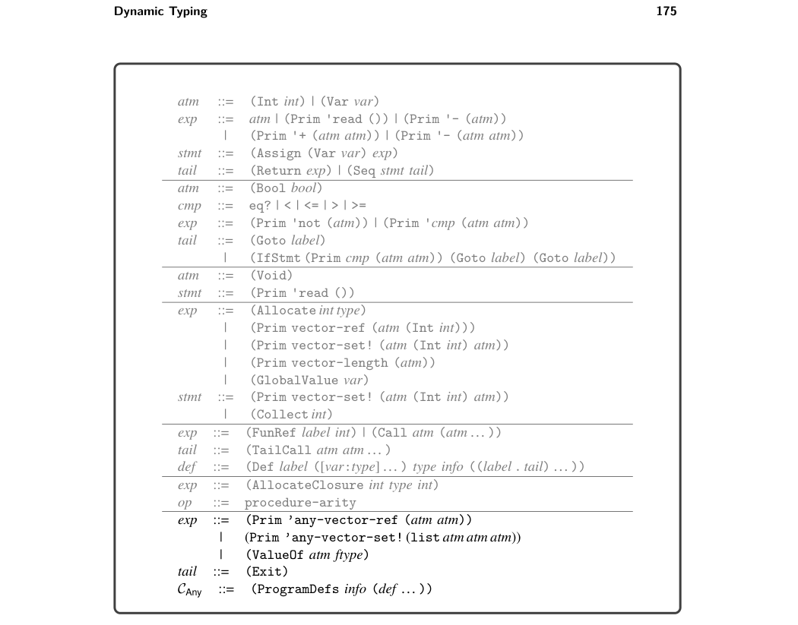

# 9 Dynamic Typing

9

Dynamic Typing

In this chapter we learn how to compile LDyn, a dynamically typed language that is a subset of Racket. The focus on dynamic typing is in contrast to the previ- ous chapters, which have studied the compilation of statically typed languages. In dynamically typed languages such as LDyn, a particular expression may produce a value of a different type each time it is executed. Consider the following example with a conditional if expression that may return a Boolean or an integer depending on the input to the program:

(not (if (eq? (read) 1) #f 0))

Languages that allow expressions to produce different kinds of values are called polymorphic, a word composed of the Greek roots poly, meaning many, and morph, meaning form. There are several kinds of polymorphism in programming languages, such as subtype polymorphism and parametric polymorphism (aka generics) (Cardelli and Wegner 1985). The kind of polymorphism that we study in this chapter does not have a special name; it is the kind that arises in dynamically typed languages. Another characteristic of dynamically typed languages is that their primitive operations, such as not, are often defined to operate on many different types of values. In fact, in Racket, the not operator produces a result for any kind of value: given #f it returns #t, and given anything else it returns #f. Furthermore, even when primitive operations restrict their inputs to values of a certain type, this restriction is enforced at runtime instead of during compilation. For example, the tuple read operation (vector-ref #t 0) results in a runtime error because the first argument must be a tuple, not a Boolean.

## 9.1 The LDyn Language

The definitions of the concrete and abstract syntax of LDyn are shown in figures 9.1 and 9.2. There is no type checker for LDyn because it checks types only at runtime. The definitional interpreter for LDyn is presented in figure 9.3, and definitions of its auxiliary functions are shown in figure 9.4. Consider the match case for (Int n). Instead of simply returning the integer n (as in the interpreter for LVar in figure 2.4), the interpreter for LDyn creates a tagged value that combines an underlying value


*Figure 9.1 Syntax of LDyn, an untyped language (a subset of Racket).*


*Figure 9.2 The abstract syntax of LDyn.*

with a tag that identifies what kind of value it is. We define the following struct to represent tagged values:

(struct Tagged (value tag) #:transparent)

The tags are Integer, Boolean, Void, Vector, and Procedure. Tags are closely related to types but do not always capture all the information that a type does. For example, a vector of type (Vector Any Any) is tagged with Vector, and a procedure of type (Any Any -> Any) is tagged with Procedure. Next consider the match case for accessing the element of a tuple. The check-tag auxiliary function (figure 9.4) is used to ensure that the first argument is a tuple and the second is an integer. If they are not, a trapped-error is raised. Recall from section 1.5 that when a definition interpreter raises a trapped-error error, the compiled code must also signal an error by exiting with return code 255. A trapped-error is also raised if the index is not less than the length of the vector.

## 9.2 Representation of Tagged Values

The interpreter for LDyn introduced a new kind of value: the tagged value. To compile LDyn to x86 we must decide how to represent tagged values at the bit level. Because almost every operation in LDyn involves manipulating tagged values, the representation must be efficient. Recall that all our values are 64 bits. We shall steal the right-most 3 bits to encode the tag. We use 001 to identify integers, 100 for Booleans, 010 for tuples, 011 for procedures, and 101 for the void value. We define the following auxiliary function for mapping types to tag codes:

tagof(Integer) = 001

tagof(Boolean) = 100

tagof((Vector … )) = 010

tagof(( … -> … )) = 011

tagof(Void) = 101

This stealing of 3 bits comes at some price: integers are now restricted to the range −260 to 260 −1. The stealing does not adversely affect tuples and procedures because those values are addresses, and our addresses are 8-byte aligned so the rightmost 3 bits are unused; they are always 000. Thus, we do not lose information by overwriting the rightmost 3 bits with the tag, and we can simply zero out the tag to recover the original address. To make tagged values into first-class entities, we can give them a type called Any and define operations such as Inject and Project for creating and using them, yielding the statically typed LAny intermediate language. We describe how to compile LDyn to LAny in section 9.4; in the next section we describe the LAny language in greater detail.


*Figure 9.3 Interpreter for the LDyn language.*


*Figure 9.4 Auxiliary functions for the LDyn interpreter.*


*Figure 9.5 The abstract syntax of LAny, extending Lλ (figure 8.4).*

## 9.3 The LAny Language

The definition of the abstract syntax of LAny is given in figure 9.5. The (Inject e T) form converts the value produced by expression e of type T into a tagged value. The (Project e T) form either converts the tagged value produced by expression e into a value of type T or halts the program if the type tag does not match T. Note that in both Inject and Project, the type T is restricted to be a flat type (the nonterminal ftype) which simplifies the implementation and complies with the needs for compiling LDyn. The any-vector operators adapt the tuple operations so that they can be applied to a value of type Any. They also generalize the tuple operations in that the index is not restricted to a literal integer in the grammar but is allowed to be any expression. The type predicates such as boolean? expect their argument to produce a tagged value; they return #t if the tag corresponds to the predicate and return #f otherwise.

The type checker for LAny is shown in figure 9.6 and it uses the auxiliary functions presented in figure 9.7. The interpreter for LAny is shown in figure 9.8 and its auxiliary functions are shown in figure 9.9.

```
(define type-check-Lany-class
(class type-check-Llambda-class
(super-new)
(inherit check-type-equal?)
```


*Figure 9.6 Type checker for the LAny language.*


*Figure 9.7 Auxiliary methods for type checking LAny.*


*Figure 9.8 Interpreter for LAny.*


*Figure 9.9 Auxiliary functions for interpreting LAny.*


*Figure 9.10 Cast insertion.*

## 9.4 Cast Insertion: Compiling LDyn to LAny

The cast_insert pass compiles from LDyn to LAny. Figure 9.10 shows the compi- lation of many of the LDyn forms into LAny. An important invariant of this pass is that given any subexpression e in the LDyn program, the pass will produce an expression e′ in LAny that has type Any. For example, the first row in figure 9.10 shows the compilation of the Boolean #t, which must be injected to produce an expression of type Any. The compilation of addition is shown in the second row of figure 9.10. The compilation of addition is representative of many primitive opera- tions: the arguments have type Any and must be projected to Integer before the addition can be performed. The compilation of lambda (third row of figure 9.10) shows what happens when we need to produce type annotations: we simply use Any. The compilation of if and eq? demonstrate how this pass has to account for some differences in behavior between LDyn and LAny. The LDyn language is more permissive than LAny regarding what kind of values can be used in various places. For example, the condition of an if does not have to be a Boolean. For eq?, the arguments need not be of the same type (in that case the result is #f).

## 9.5 Reveal Casts

In the reveal_casts pass, we recommend compiling Project into a conditional expression that checks whether the value’s tag matches the target type; if it does, the value is converted to a value of the target type by removing the tag; if it does not, the program exits. To perform these actions we need a new primitive operation, tag-of-any, and a new form, ValueOf. The tag-of-any operation retrieves the type tag from a tagged value of type Any. The ValueOf form retrieves the underlying value from a tagged value. The ValueOf form includes the type for the underlying value that is used by the type checker. If the target type of the projection is Boolean or Integer, then Project can be translated as follows:

(Project e ftype) ⇒ (Let tmp e′

(If (Prim 'eq? (list (Prim 'tag-of-any (list (Var tmp))) (Int tagof(ftype)))) (ValueOf tmp ftype) (Exit)))

If the target type of the projection is a tuple or function type, then there is a bit more work to do. For tuples, check that the length of the tuple type matches the length of the tuple. For functions, check that the number of parameters in the function type matches the function’s arity. Regarding Inject, we recommend compiling it to a slightly lower-level primitive operation named make-any. This operation takes a tag instead of a type.

(Inject e ftype) ⇒ (Prim 'make-any (list e′ (Int tagof(ftype))))

The type predicates (boolean?, etc.) can be translated into uses of tag-of-any and eq? in a similar way as in the translation of Project. The any-vector-ref and any-vector-set! operations combine the projection action with the vector operation. Also, the read and write operations allow arbitrary expressions for the index, so the type checker for LAny (figure 9.6) cannot guarantee that the index is within bounds. Thus, we insert code to perform bounds checking at runtime. The translation for any-vector-ref is as follows, and the other two operations are translated in a similar way:

(Prim 'any-vector-ref (list e1 e2)) ⇒ (Let v e′ 1 (Let i e′ 2 (If (Prim 'eq? (list (Prim 'tag-of-any (list (Var v))) (Int 2))) (If (Prim '< (list (Var i) (Prim 'any-vector-length (list (Var v))))) (Prim 'any-vector-ref (list (Var v) (Var i))) (Exit)) (Exit))))

## 9.6 Remove Complex Operands

The ValueOf and Exit forms are both complex expressions. The subexpression of ValueOf must be atomic.

## 9.7 Explicate Control and CAny

The output of explicate_control is the CAny language, whose syntax definition is shown in figure 9.11. The ValueOf form that we added to LAny remains an expression and the Exit expression becomes a tail. Also, note that the index argument of vector-ref and vector-set! is an atm, instead of an integer as it was in CTup (figure 6.12).

## 9.8 Select Instructions

In the select_instructions pass, we translate the primitive operations on the Any type to x86 instructions that manipulate the three tag bits of the tagged value. In the following descriptions, given an atom e we use a primed variable e′ to refer to the result of translating e into an x86 argument:

make-any We recommend compiling the make-any operation as follows if the tag is for Integer or Boolean. The salq instruction shifts the destination to the left by the number of bits specified by its source argument (in this case three, the length of the tag), and it preserves the sign of the integer. We use the orq instruction to combine the tag and the value to form the tagged value.

(Assign lhs (Prim 'make-any (list e (Int tag)))) ⇒ movq e′, lhs′

salq $3, lhs′

orq $tag, lhs′

The instruction selection for tuples and procedures is different because there is no need to shift them to the left. The rightmost 3 bits are already zeros, so we simply combine the value and the tag using orq.


*Figure 9.11 The abstract syntax of CAny, extending CClos (figure 8.8).*

(Assign lhs (Prim 'make-any (list e (Int tag)))) ⇒ movq e′, lhs′

orq $tag, lhs′

tag-of-any Recall that the tag-of-any operation extracts the type tag from a value of type Any. The type tag is the bottom 3 bits, so we obtain the tag by taking the bitwise-and of the value with 111 (7 decimal).

(Assign lhs (Prim 'tag-of-any (list e))) ⇒ movq e′, lhs′

andq $7, lhs′

ValueOf The instructions for ValueOf also differ, depending on whether the type T is a pointer (tuple or function) or not (integer or Boolean). The following shows the instruction selection for integers and Booleans, in which we produce an untagged value by shifting it to the right by 3 bits:

(Assign lhs (ValueOf e T)) ⇒ movq e′, lhs′

sarq $3, lhs′

In the case for tuples and procedures, we zero out the rightmost 3 bits. We accom- plish this by creating the bit pattern … 0111 (7 decimal) and apply bitwise-not to obtain … 11111000 (-8 decimal), which we movq into the destination lhs′. Finally, we apply andq with the tagged value to get the desired result.

(Assign lhs (ValueOf e T)) ⇒ movq $−8, lhs′

andq e′, lhs′

any-vector-length The any-vector-length operation combines the effect of ValueOf with accessing the length of a tuple from the tag stored at the zero index of the tuple.

(Assign lhs (Prim 'any-vector-length (list e1))) =⇒ movq $−8, %r11 andq e′ 1, %r11 movq 0(%r11), %r11 andq $126, %r11 sarq $1, %r11 movq %r11, lhs′

any-vector-ref This operation combines the effect of ValueOf with reading an element of the tuple (see section 6.6). However, the index may be an arbitrary atom, so instead of computing the offset at compile time, we must generate instructions to compute the offset at runtime as follows. Note the use of the new instruction imulq.

(Assign lhs (Prim 'any-vector-ref (list e1 e2))) =⇒ movq ¬111, %r11 andq e′ 1, %r11 movq e′ 2, %rax addq $1, %rax imulq $8, %rax addq %rax, %r11 movq 0(%r11) lhs′


*Figure 9.12 gives an overview of the passes needed for the compilation of LDyn.*


*Figure 9.12 Diagram of the passes for LDyn, a dynamically typed language.*

