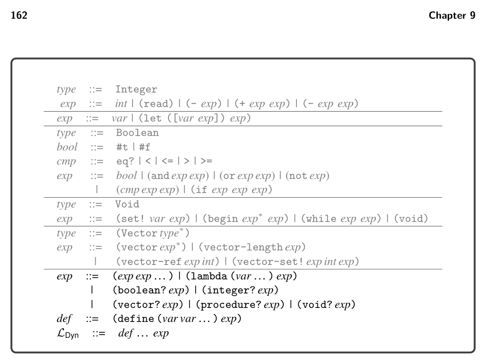
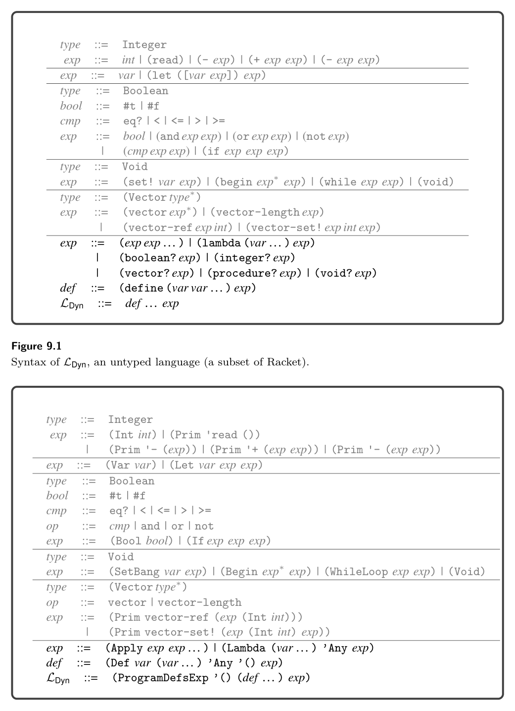

# 9.1 The LDyn Language

9

Dynamic Typing

In this chapter we learn how to compile LDyn, a dynamically typed language that is a subset of Racket. The focus on dynamic typing is in contrast to the previ- ous chapters, which have studied the compilation of statically typed languages. In dynamically typed languages such as LDyn, a particular expression may produce a value of a different type each time it is executed. Consider the following example with a conditional if expression that may return a Boolean or an integer depending on the input to the program:

(not (if (eq? (read) 1) #f 0))

Languages that allow expressions to produce different kinds of values are called polymorphic, a word composed of the Greek roots poly, meaning many, and morph, meaning form. There are several kinds of polymorphism in programming languages, such as subtype polymorphism and parametric polymorphism (aka generics) (Cardelli and Wegner 1985). The kind of polymorphism that we study in this chapter does not have a special name; it is the kind that arises in dynamically typed languages. Another characteristic of dynamically typed languages is that their primitive operations, such as not, are often defined to operate on many different types of values. In fact, in Racket, the not operator produces a result for any kind of value: given #f it returns #t, and given anything else it returns #f. Furthermore, even when primitive operations restrict their inputs to values of a certain type, this restriction is enforced at runtime instead of during compilation. For example, the tuple read operation (vector-ref #t 0) results in a runtime error because the first argument must be a tuple, not a Boolean.

9.1 The LDyn Language

The definitions of the concrete and abstract syntax of LDyn are shown in figures 9.1 and 9.2. There is no type checker for LDyn because it checks types only at runtime. The definitional interpreter for LDyn is presented in figure 9.3, and definitions of its auxiliary functions are shown in figure 9.4. Consider the match case for (Int n). Instead of simply returning the integer n (as in the interpreter for LVar in figure 2.4), the interpreter for LDyn creates a tagged value that combines an underlying value

*Figure 9.1*

*Figure 9.2*

